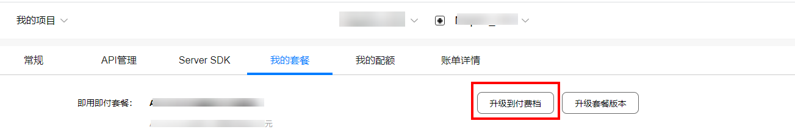

# 服务定价

-   [服务订阅说明](#section785395184220)
-   [开发者详细服务定价说明](#section1414211664213)
-   [开通付费](#section7921102111484)

## 服务订阅说明

1.  地图服务采用即用即付的方式进行结算。自2021年1月1日起，华为每月为每位开发者提供**CNY¥2398代金券免费使用**，用于定位、地图、位置服务，每月代金券**仅限当月使用。**
2.  当您成功注册成为华为开发者用户，在AppGallery Connect创建项目后，华为会自动帮您开通服务对应的免费档套餐。如需使用地图服务收费接口，企业开发者请通过AppGallery Connect开通付费套餐，具体操作请参见[服务定价与订购](https://developer.huawei.com/consumer/cn/doc/development/AppGallery-connect-Guides/agc-service-billing)。如果您是个人开发者，系统会自动为您提供部分免费配额，若调用量超过配额请联系[mapteam@huawei.com](mailto:mapteam@huawei.com)申请配额。
3.  针对所有的AppGallery Connect付费服务，华为将按您使用服务实际产生的使用量向您收费。为防止服务被中断，请保障您的账户余额充足。具体操作可参见[服务定价与订购](https://developer.huawei.com/consumer/cn/doc/development/AppGallery-connect-Guides/agc-service-billing)。

## 开发者详细服务定价说明

<table><thead align="left"><tr id="row7241259114419"><th class="cellrowborder" align="left" valign="top" width="29.98%" id="mcps1.1.4.1.1">
<strong id="b14241459134419">服务名称</strong>

</th>
<th class="cellrowborder" align="left" valign="top" width="37.76%" id="mcps1.1.4.1.2">
<strong id="b1624295910443">即用即付</strong>

</th>
<th class="cellrowborder" align="left" valign="top" width="32.26%" id="mcps1.1.4.1.3">
说明

</th>
</tr>
</thead>
<tbody><tr id="row152421859164418"><td class="cellrowborder" align="left" valign="top" width="29.98%" headers="mcps1.1.4.1.1 ">
地图加载（Android SDK）

</td>
<td class="cellrowborder" align="left" valign="top" width="37.76%" headers="mcps1.1.4.1.2 ">
免费

</td>
<td class="cellrowborder" rowspan="11" align="left" valign="top" width="32.26%" headers="mcps1.1.4.1.3 ">
自2021年1月1日起，华为每月为每位开发者提供CNY&yen;2398代金券免费使用，用于定位、地图、位置服务，每月代金券仅限当月使用。

 说明： 

地图服务、位置服务、定位服务共享CNY&yen;2398代金券。

</td>
</tr>
<tr id="row724211593444"><td class="cellrowborder" align="left" valign="top" headers="mcps1.1.4.1.1 ">
静态图（Android SDK）

</td>
<td class="cellrowborder" align="left" valign="top" headers="mcps1.1.4.1.2 ">
免费

</td>
</tr>
<tr id="row5243145984419"><td class="cellrowborder" align="left" valign="top" headers="mcps1.1.4.1.1 ">
地图加载（JavaScript API）

</td>
<td class="cellrowborder" align="left" valign="top" headers="mcps1.1.4.1.2 ">
0~100,000次/月：CNY&yen;40.0/千次

100,001及以上 次/月：CNY&yen;32.0/千次

</td>
</tr>
<tr id="row11381649192913"><td class="cellrowborder" align="left" valign="top" headers="mcps1.1.4.1.1 ">
静态地图（Web API）

</td>
<td class="cellrowborder" align="left" valign="top" headers="mcps1.1.4.1.2 ">
0~100,000次/月：CNY&yen;12.0/千次

100,001及以上 次/月：CNY&yen;9.6/千次

</td>
</tr>
<tr id="row218714214381"><td class="cellrowborder" align="left" valign="top" headers="mcps1.1.4.1.1 ">
栅格瓦片（Web API）

</td>
<td class="cellrowborder" align="left" valign="top" headers="mcps1.1.4.1.2 ">
0~100,000次/月：CNY&yen;2.0/千次

100,001及以上 次/月：CNY&yen;1.6/千次

</td>
</tr>
<tr id="row9245175914418"><td class="cellrowborder" align="left" valign="top" headers="mcps1.1.4.1.1 ">
路径规划-步行（Directions API）

</td>
<td class="cellrowborder" align="left" valign="top" headers="mcps1.1.4.1.2 ">
0~100,000次/月：CNY&yen;28.0/千次

100,001及以上 次/月：CNY&yen;22.4/千次

</td>
</tr>
<tr id="row14247165911444"><td class="cellrowborder" align="left" valign="top" headers="mcps1.1.4.1.1 ">
路径规划-骑行（Directions API）

</td>
<td class="cellrowborder" align="left" valign="top" headers="mcps1.1.4.1.2 ">
0~100,000次/月：CNY&yen;28.0/千次

100,001及以上 次/月：CNY&yen;22.4/千次

</td>
</tr>
<tr id="row1724810598448"><td class="cellrowborder" align="left" valign="top" headers="mcps1.1.4.1.1 ">
路径规划-驾车（Directions API）

</td>
<td class="cellrowborder" align="left" valign="top" headers="mcps1.1.4.1.2 ">
0~100,000次/月：CNY&yen;28.0/千次

100,001及以上 次/月：CNY&yen;22.4/千次

</td>
</tr>
<tr id="row1493582652619"><td class="cellrowborder" align="left" valign="top" headers="mcps1.1.4.1.1 ">
路径规划-步行（Matrix API）

</td>
<td class="cellrowborder" align="left" valign="top" headers="mcps1.1.4.1.2 ">
0~100,000次/月：CNY&yen;28.0/千次

100,001及以上 次/月：CNY&yen;22.4/千次

</td>
</tr>
<tr id="row16475515269"><td class="cellrowborder" align="left" valign="top" headers="mcps1.1.4.1.1 ">
路径规划-骑行（Matrix API）

</td>
<td class="cellrowborder" align="left" valign="top" headers="mcps1.1.4.1.2 ">
0~100,000次/月：CNY&yen;28.0/千次

100,001及以上 次/月：CNY&yen;22.4/千次

</td>
</tr>
<tr id="row1520655415261"><td class="cellrowborder" align="left" valign="top" headers="mcps1.1.4.1.1 ">
路径规划-驾车（Matrix API）

</td>
<td class="cellrowborder" align="left" valign="top" headers="mcps1.1.4.1.2 ">
0~100,000次/月：CNY&yen;28.0/千次

100,001及以上 次/月：CNY&yen;22.4/千次

</td>
</tr>
</tbody>
</table>

## 开通付费

自2021年1月1日起，华为地图服务对部分接口制定了收费方案。请到[AppGallery Connect](https://developer.huawei.com/consumer/cn/service/josp/agc/index.html#/)网站上“我的项目  \>  我的套餐“，进行套餐升级。

