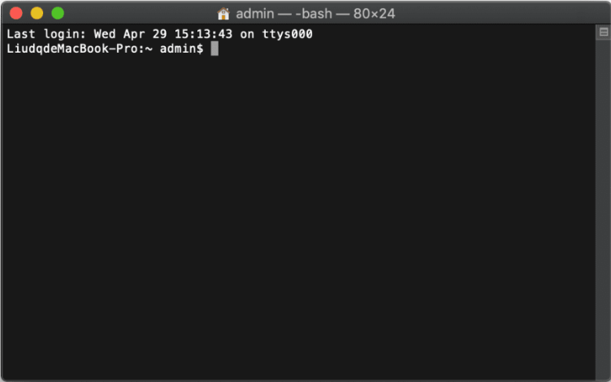
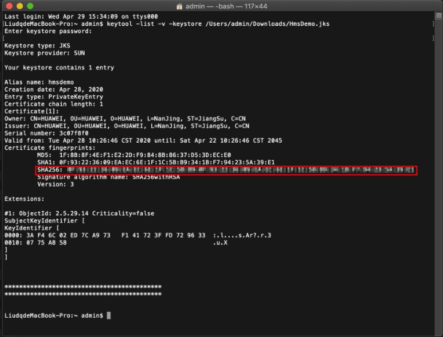

# 配置AppGallery Connect<a name="ZH-CN_TOPIC_0000001145541091"></a>

-   [注册成为开发者](#section47264296)
-   [创建项目](#section83893131911)
-   [创建应用](#section0592162815915)
-   [生成签名证书指纹](#section147011294331)
-   [配置签名证书指纹](#section4972271336)
-   [打开相关服务](#section58097464)

在开发应用前，需要在AppGallery Connect中配置相关信息。

## 注册成为开发者<a name="section47264296"></a>

在开发应用前需要在[华为开发者联盟](https://developer.huawei.com/consumer/cn)网站上注册成为开发者并完成实名认证，具体方法请参见[帐号注册认证](https://developer.huawei.com/consumer/cn/doc/start/registration-and-verification-0000001053628148)。

## 创建项目<a name="section83893131911"></a>

参见[创建项目](https://developer.huawei.com/consumer/cn/doc/development/AppGallery-connect-Guides/agc-get-started#h1-1587476272328)。

## 创建应用<a name="section0592162815915"></a>

[在项目下创建应用](https://developer.huawei.com/consumer/cn/doc/development/AppGallery-connect-Guides/agc-get-started#createapp)完成应用的创建，特殊配置如下：

-   选择平台：选择“Android“。
-   支持设备：选择“手机“。
-   应用分类：选择“应用“或“游戏“。

## 生成签名证书指纹<a name="section147011294331"></a>

签名证书指纹用于校验应用的真实性，您需要根据签名证书在本地生成签名证书指纹，并在应用上架前将签名证书指纹配置到AppGallery Connect。

在生成签名证书指纹前需要满足以下两个条件：

-   已创建应用程序的签名证书，签名证书创建请参见[生成签名证书](https://developer.huawei.com/consumer/cn/codelab/HMSPreparation/index.html#2)。
-   当前PC已经安装[JDK](https://www.oracle.com/java/technologies/javase-downloads.html)。

操作步骤如下：

-   Windows
    1.  执行CMD命令打开命令行工具，执行**cd**命令进入keytool.exe所在的目录（以下样例为JDK安装在C盘的Program Files目录）。

        ```
        cd C:\Program Files\Java\jdk\bin
        ```

    2.  执行命令**keytool -list -v -keystore **_<keystore-file\>_，按命令行提示进行操作。<keystore-file\>为应用签名证书的完整路径。

        例如：

        ```
        keytool -list -v -keystore C:\TestApp.jks
        ```

    3.  根据结果获取对应的SHA256指纹。

        .png)


-   macOS
    1.  打开Terminal终端。

        

    2.  执行命令**keytool -list -v -keystore **_<keystore-file\>_，按命令行提示进行操作。<keystore-file\>为应用签名证书的完整路径。

        例如：

        ```
        keytool -list -v -keystore /Users/admin/Downloads/HmsDemo.jks
        ```

    3.  根据结果获取对应的SHA256指纹。

        


## 配置签名证书指纹<a name="section4972271336"></a>

1.  登录[AppGallery Connect](https://developer.huawei.com/consumer/cn/service/josp/agc/index.html)网站，点击“我的项目“。
2.  在项目列表中找到您的项目，在项目中点击需要配置签名证书指纹的应用。
3.  在“项目设置  \>  常规“页面的“应用“区域，点击“SHA256证书指纹“后的图标，输入生成的SHA256指纹。

    .png)

    > **说明：** 
    >1.  在“项目设置“页面的“应用“区域，点击“API key“后面的即可获取API Key。
    >2.  使用API Key需要进行encodeURI编码。例如：原始API Key为ABC/DFG+ ，转换后结果为ABC%2FDFG%2B。

4.  配置完成后点击。

## 打开相关服务<a name="section58097464"></a>

使用地图服务需要您在[AppGallery Connect](https://developer.huawei.com/consumer/cn/service/josp/agc/index.html)上打开Map Kit，具体操作步骤请参见[开通服务](https://developer.huawei.com/consumer/cn/doc/distribution/app/agc-enable_service)。

