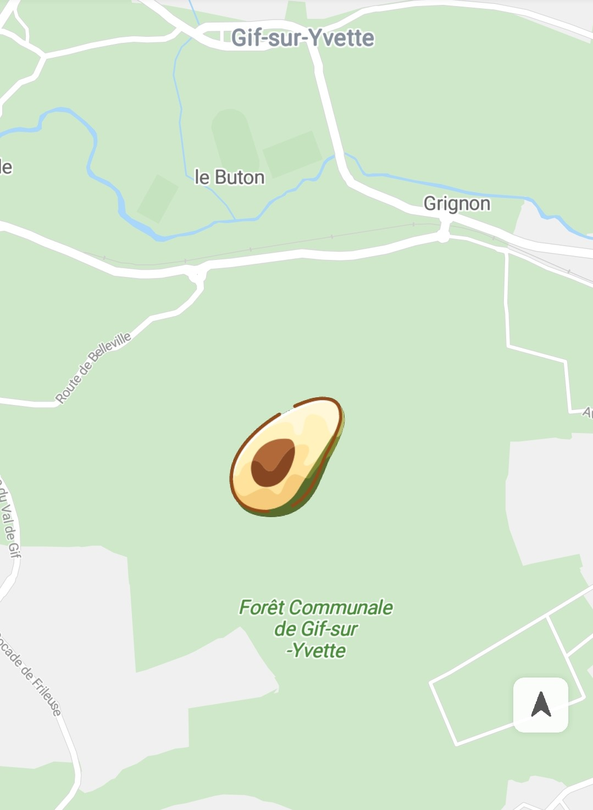

# 覆盖物<a name="ZH-CN_TOPIC_0000001099661082"></a>

-   [添加覆盖物](#section182724503583)
-   [覆盖物事件](#section191618511427)

地图覆盖物是固定在地图上的图片。

## 添加覆盖物<a name="section182724503583"></a>

1.  通过[BitmapDescriptorFactory](zh-cn_topic_0000001145860975.md)来创建[BitmapDescriptor](zh-cn_topic_0000001099501086.md)对象，创建方式包括：

    示例代码如下：

    ```
    Java
    BitmapDescriptor descriptorFromAsset = BitmapDescriptorFactory.fromAsset("images/avocado.jpg");
    BitmapDescriptor descriptorFromBitmap = BitmapDescriptorFactory.fromBitmap(bitmap);
    BitmapDescriptor descriptorFromFile = BitmapDescriptorFactory.fromFile(fileName);
    BitmapDescriptor descriptorFromPath = BitmapDescriptorFactory.fromPath(path);
    BitmapDescriptor descriptorFromResource = BitmapDescriptorFactory.fromResource(R.drawable.makalong);
    ```

    ```
    Kotlin
    val descriptorFromAsset = BitmapDescriptorFactory.fromAsset("images/avocado.jpg")
    val descriptorFromBitmap = BitmapDescriptorFactory.fromBitmap(bitmap)
    val descriptorFromFile = BitmapDescriptorFactory.fromFile(fileName)
    val descriptorFromPath = BitmapDescriptorFactory.fromPath(path)
    val descriptorFromResource = BitmapDescriptorFactory.fromResource(R.drawable.makalong)
    ```

2.  创建一个[GroundOverlayOptions](zh-cn_topic_0000001145860919.md)对象来确定图像和位置：

    示例代码如下：

    ```
    Java
    GroundOverlayOptions options =
        new GroundOverlayOptions().position(new LatLng(48.893478, 2.334595), 60, 30).image(descriptor);
    ```

    ```
    Kotlin
    val options = GroundOverlayOptions().position(LatLng(48.893478, 2.334595), 60f, 30f).image(descriptor)
    ```

3.  通过[HuaweiMap](zh-cn_topic_0000001145941019.md)对象的[addGroundOverlay](zh-cn_topic_0000001145941019.md#section374112486409)\([GroundOverlayOptions](zh-cn_topic_0000001145860919.md)\)方法添加地图覆盖物，如[图1](#fig1214423215566)所示，该方法将返回该[GroundOverlay](zh-cn_topic_0000001145780995.md)对象。

    示例代码如下：

    ```
    Java
    private GroundOverlay mGroundOverlay;
    
    // 在地图上增加覆盖物
    mGroundOverlay = hMap.addGroundOverlay(options);
    ```

    ```
    Kotlin
    private var mGroundOverlay: GroundOverlay? = null
    
    // 在地图上增加覆盖物
    mGroundOverlay = hMap.addGroundOverlay(options)
    ```

    **图 1**  覆盖物<a name="fig1214423215566"></a>  
    

4.  修改和移除。

    示例代码如下：

    ```
    Java
    if (null != mGroundOverlay) {
        // 设置覆盖物
        mGroundOverlay.setImage(BitmapDescriptorFactory.fromResource(R.drawable.makalong));
    }
    
    if (null != mGroundOverlay) {
        // 移除覆盖物
        mGroundOverlay.remove();
    }
    ```

    ```
    Kotlin
    if (null != mGroundOverlay) {
        // 设置覆盖物
        mGroundOverlay?.setImage(BitmapDescriptorFactory.fromResource(R.drawable.makalong))
    }
    
    if (null != mGroundOverlay) {
        // 移除覆盖物
        mGroundOverlay?.remove()
    }
    ```

5.  设置覆盖物位置。

    > **说明：** 
    >[position](zh-cn_topic_0000001145860919.md#section18441164103913)\([LatLng](zh-cn_topic_0000001099661098.md)  location, float width\)和[position](zh-cn_topic_0000001145860919.md#section1263995883915)\([LatLng](zh-cn_topic_0000001099661098.md)  location, float width, float height\)不可与[positionFromBounds](zh-cn_topic_0000001145860919.md#section1971542716405)\([LatLngBounds](zh-cn_topic_0000001145941079.md)  bounds\)同时使用，否则会抛出IllegalStateException异常。

    -   public  [GroundOverlayOptions](zh-cn_topic_0000001145860919.md)  position\([LatLng](zh-cn_topic_0000001099661098.md)  location, float width\)

        此方法会根据经纬度位置和图片宽度width参数（单位：米）设置覆盖物。在显示时，图片的高度根据图片的宽高比例和width参数自动计算匹配。


    -   public  [GroundOverlayOptions](zh-cn_topic_0000001145860919.md)  position\([LatLng](zh-cn_topic_0000001099661098.md)  location, float width, float height\)

        此方法会根据经纬度位置、图片宽度width参数和图片高度height参数（单位：米）设置覆盖物。在显示时，图片会被缩放来适应指定的尺寸，图片可能会变形。


    -   public  [GroundOverlayOptions](zh-cn_topic_0000001145860919.md)  positionFromBounds\([LatLngBounds](zh-cn_topic_0000001145941079.md)  bounds\)

        此方法会指定一个[LatLngBounds](zh-cn_topic_0000001145941079.md)对象，该对象由两个[LatLng](zh-cn_topic_0000001099661098.md)对象形成一个矩形区域，分别为西南角southwest和东北角northeast，此方法会根据该矩形区域设置覆盖物的位置。


## 覆盖物事件<a name="section191618511427"></a>

**覆盖物点击事件**

可以使用[HuaweiMap.OnGroundOverlayClickListener](zh-cn_topic_0000001145541105.md)来侦听覆盖物上的点击事件。要在地图上设置此侦听器，请调用[HuaweiMap](zh-cn_topic_0000001145941019.md)对象的[setOnGroundOverlayClickListener](zh-cn_topic_0000001145941019.md#section48222916516)\([HuaweiMap.OnGroundOverlayClickListener](zh-cn_topic_0000001145541105.md)\)方法。当用户点击覆盖物时，[onGroundOverlayClick](zh-cn_topic_0000001145541105.md#section1448704115373)\([GroundOverlay](zh-cn_topic_0000001145780995.md)\)将回调该覆盖物。

示例代码如下：

```
Java
hMap.setOnGroundOverlayClickListener(new HuaweiMap.OnGroundOverlayClickListener() {
    @Override
    public void onGroundOverlayClick(GroundOverlay groundOverlay) {
        Toast.makeText(getApplicationContext(), "GroundOverlay is clicked.", Toast.LENGTH_LONG).show();
    }
});
```

```
Kotlin
hMap.setOnGroundOverlayClickListener { Toast.makeText(applicationContext, "GroundOverlay is clicked.", Toast.LENGTH_LONG).show() }
```

