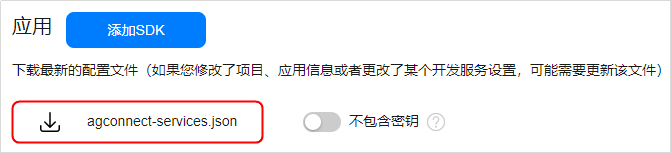
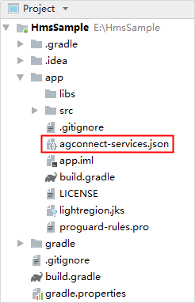
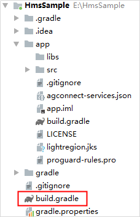
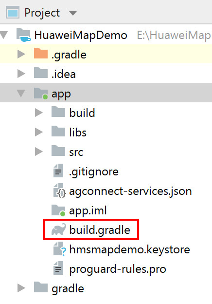
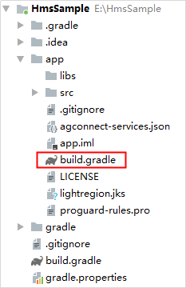

# 集成HMS Core SDK<a name="ZH-CN_TOPIC_0000001145941059"></a>

-   [添加当前应用的AppGallery Connect配置文件](#section4256162815361)
-   [配置HMS Core SDK的Maven仓地址](#section2258112812366)
-   [添加编译依赖](#section926020288361)
-   [多语言设置](#section52581942164415)
-   [同步工程](#section056712581457)
-   [配置元数据](#section14837619928)
-   [配置AndroidManifest.xml文件](#section149683326513)

针对Android Studio开发环境，华为提供了Maven仓集成方式的HMS Core SDK包。在开始开发前，您需要将HMS Core SDK集成到您的Android Studio开发环境中。

## 添加当前应用的AppGallery Connect配置文件<a name="section4256162815361"></a>

如果在AppGallery Connect中开通了相关服务则需要将“agconnect-services.json“文件添加到您的App中。

1.  登录[AppGallery Connect](https://developer.huawei.com/consumer/cn/service/josp/agc/index.html)网站，点击“我的项目“。
2.  在项目列表中找到您的项目，在项目中点击需要集成HMS Core SDK的应用。
3.  在“项目设置  \>  常规“页面的“应用“区域，点击“agconnect-services.json“下载配置文件。

    

4.  将“agconnect-services.json“文件拷贝到应用级根目录下。

    


## 配置HMS Core SDK的Maven仓地址<a name="section2258112812366"></a>

1.  打开Android Studio项目级“build.gradle“文件。

    

2.  添加HUAWEI agcp插件以及Maven代码库。

    -   在“buildscript  \>  repositories“中配置HMS Core SDK的Maven仓地址。
    -   在“allprojects  \>  repositories“中配置HMS Core SDK的Maven仓地址。
    -   如果App中添加了“agconnect-services.json“文件则需要在“buildscript  \>  dependencies“中增加agcp配置。

    ```
    buildscript {
        repositories {
            google()
            jcenter()
            // 配置HMS Core SDK的Maven仓地址。
            maven {url 'https://developer.huawei.com/repo/'}
        }
        dependencies {
            ...
            // 增加agcp配置。
            classpath 'com.huawei.agconnect:agcp:1.4.2.300'
        }
    }
    
    allprojects {
        repositories {
            google()
            jcenter()
            // 配置HMS Core SDK的Maven仓地址。
            maven {url 'https://developer.huawei.com/repo/'}
        }
    } 
    ```

    > **说明：** 
    >Maven仓地址无法直接在浏览器中打开访问，只能在IDE中配置。如需添加多个Maven代码库，请将华为公司的Maven仓地址配置在最后。


## 添加编译依赖<a name="section926020288361"></a>

1.  打开应用级的“build.gradle“文件。

    

2.  添加编译依赖。

    1.  在“dependencies ”中添加如下编译依赖。

        ```
        dependencies {
               implementation 'com.huawei.hms:maps:{version}'
        }
        ```

    2.  在“dependencies ”中添加fallback依赖。

        如果您想在不依赖HMS Core（APK）的场景下使用地图服务，则需在“dependencies ”中添加如下编译依赖，集成两个fallback。但集成fallback后将不提供默认的位置源，如果需要使用定位当前位置的功能，需要自己配置位置源。需注意升级集成到fallback时，调用Map Kit必须传递或配置API Key，若agconnect-services.json文件中API Key已存在，则不需要再配置，若不存在，可以调用[MapsInitializer](zh-cn_topic_0000001145860981.md)类的[setApiKey](zh-cn_topic_0000001145860981.md#section1389444514617)方法设置API Key，获取API Key参见[API Key说明](android-sdk-config-agc.md#note127421480115)。

        Map Kit SDK和fallback需要配套使用，fallback的版本号需要与Map Kit SDK保持一致，否则可能出现高低版本api\_level不满足而影响功能的情况。集成fallback后不需要再依赖HMS Core（APK），但是fallback的SDK包较大，且不支持在线更新，要更新必须重新集成新版本Map Kit SDK和fallback。

        ```
        dependencies {
               implementation 'com.huawei.hms:maproute-fallback:{version}'
               implementation 'com.huawei.hms:hwmaps-fallback:{version}'
        }
        ```


    > **说明：** 
    >1.  _\{version\}_需替换为实际的SDK版本号，版本号索引请参见[版本更新说明](android-sdk-version-change-history.md)，例如：implementation 'com.huawei.hms:maps:**5.2.0.302**'，implementation 'com.huawei.hms:maproute-fallback:**5.2.0.302**'，implementation 'com.huawei.hms:hwmaps-fallback:**5.2.0.302**'。
    >2.  如果您使用的华为地图SDK是3.0.2.301或者更新的版本，您需要用**'androidx.appcompat:appcompat:\{version\}'**替换**'com.android.support:appcompat-\{version\}'**  ，例如：implementation 'androidx.appcompat:appcompat:1.0.2'，此时需要在“gradle.properties“里配置**android.useAndroidX=true**。

3.  在文件头**apply plugin: 'com.android.application'**下一行添加如下配置。

    ```
    apply plugin: 'com.huawei.agconnect'
    ```

    > **说明：** 
    >-   **apply plugin: 'com.huawei.agconnect'**  配置要在**apply plugin: 'com.android.application'**之后。
    >-   华为地图SDK支持的最低Android版本（minSdkVersion）为19。

4.  在android中配置签名。将[生成签名证书](https://developer.huawei.com/consumer/cn/codelab/HMSPreparation/index.html#2)生成的签名文件复制到您工程的“app“目录下，并在“build.gradle“文件中配置签名。

    ```
    android {
        signingConfigs {
            release {
                // 签名证书
                storeFile file("**.**")
                // 密钥库口令
                storePassword "******"
                // 别名
                keyAlias "******"
                // 密钥口令
                keyPassword "******"
                v2SigningEnabled true
            }
        }
        buildTypes {
            release {
                minifyEnabled false
                proguardFiles getDefaultProguardFile('proguard-android-optimize.txt'), 'proguard-rules.pro'
                signingConfig signingConfigs.release
            }
            debug {
                signingConfig signingConfigs.release
            }
        }
    }
    ```


## 多语言设置<a name="section52581942164415"></a>

-   如果您的应用不需要设置只支持某些特定语言，则请忽略本步骤。应用将默认支持所有HMS Core SDK支持的语言。
-   如果您的应用需要设置只支持某些特定语言，则可通过本步骤配置。

    1.  打开应用级的“build.gradle“文件。

        


    1.  在“android  \>  defaultConfig“中新增“resConfigs“，配置需要支持的语种，配置格式如下：

        ```
        android {
                defaultConfig {
                        ...
                        resConfigs "en", "zh-rCN", "需要支持的其他语言"
                }
        }        
        ```


    HMS Core SDK支持的语言列表请参见[HMS Core SDK支持的语言](zh-cn_topic_0000001050040564.md)。


## 同步工程<a name="section056712581457"></a>

在完成以上的配置后，点击工具栏中的gradle同步图标，完成“build.gradle“文件的同步，将相关依赖下载到本地。


> **说明：** 
>如果出现错误，请检查网络连接是否正常，以及检查“build.gradle“文件是否正确。

## 配置元数据<a name="section14837619928"></a>

> **说明：** 
>-   如下情况需要配置元数据，以实现引导应用下载HMS Core（APK）：
>    应用市场（例如华为应用市场）允许您的应用后台下载其他应用，并且您是通过Activity调用API。
>-   如下情况请跳过该配置，暂没有方案实现引导应用下载HMS Core（APK）：
>    应用市场（例如Google Play）禁止您的应用后台下载其他应用，或者您是通过Context调用API。

在“AndroidManifest.xml“的Application中增加以下元数据，引导应用下载HMS Core（APK）。

```
<application ...>
    <meta-data     
       android:name="com.huawei.hms.client.channel.androidMarket"  
       android:value="false" />
    ...
</application>
```

下载HMS Core（APK）后，HMS Core SDK会自动安装或升级HMS Core（APK）。

## 配置AndroidManifest.xml文件<a name="section149683326513"></a>

Android 11更改了应用查询用户在设备上已安装的其他应用以及与之交互的方式。使用<queries\>元素，可以为应用定义一组自身可访问的其他应用。

如果targetSdkVersion是30或者更高版本，您需要在“AndroidManifest.xml“中manifest便签下添加<queries\>元素，使应用可以访问HMS Core（APK）。

```
<manifest ...>
    ...
    <queries>
        <intent>
            <action android:name="com.huawei.hms.core.aidlservice" />
        </intent>
    </queries>
    ...
</manifest>
```

> **说明：** 
><queries\>元素对工具的要求如下：
>-   Android Studio 3.3或更高版本。
>-   Android Studio版本支持的[Android Gradle插件](https://developer.android.com/studio/releases/gradle-plugin)最新“点”版本。点击[了解详情](https://android-developers.googleblog.com/2020/07/preparing-your-build-for-package-visibility-in-android-11.html)。

