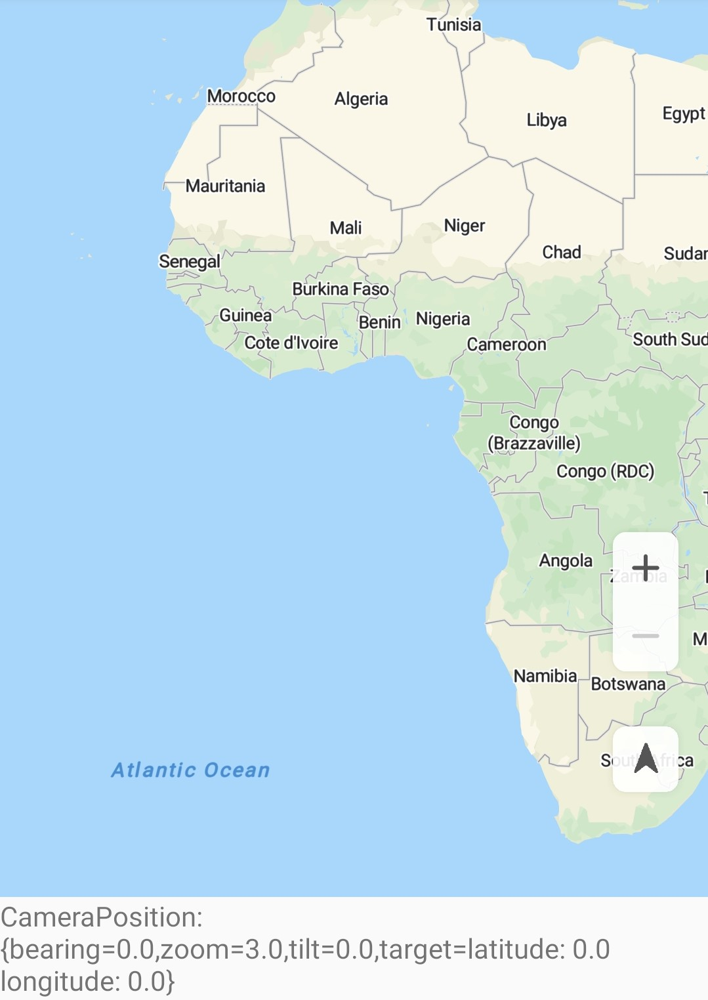
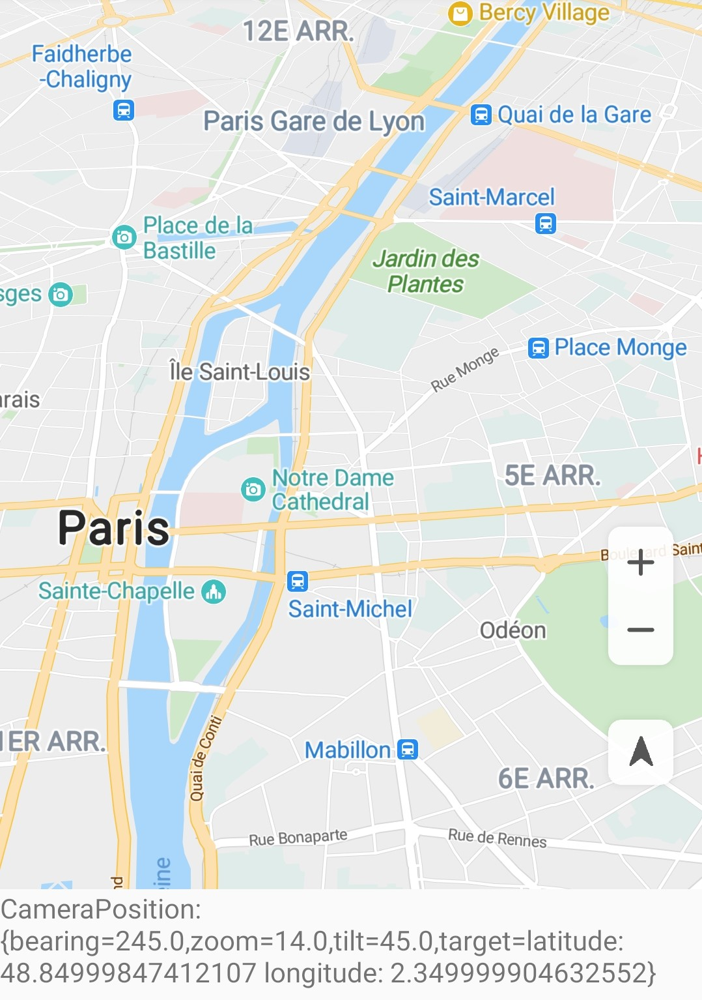

# 地图相机<a name="ZH-CN_TOPIC_0000001099661086"></a>

-   [相机属性](#section74325714424)
-   [移动相机](#section149815252431)
    -   [创建CameraUpdate对象的方式](#section205245430168)
    -   [移动相机的方式](#section75216307182)
    -   [设置相机最大/最小偏好缩放级别](#section18861830141919)

-   [区域限制](#section1830482964420)

## 相机属性<a name="section74325714424"></a>

相机包含以下4个属性：

<a name="table27510975"></a>
<table><thead align="left"><tr id="row35991756"><th class="cellrowborder" valign="top" width="30.29%" id="mcps1.1.3.1.1"><p id="p52928499"><a name="p52928499"></a><a name="p52928499"></a>属性</p>
</th>
<th class="cellrowborder" valign="top" width="69.71000000000001%" id="mcps1.1.3.1.2"><p id="p42622588"><a name="p42622588"></a><a name="p42622588"></a>属性描述</p>
</th>
</tr>
</thead>
<tbody><tr id="row48058978"><td class="cellrowborder" valign="top" width="30.29%" headers="mcps1.1.3.1.1 "><p id="p37517544"><a name="p37517544"></a><a name="p37517544"></a>target</p>
</td>
<td class="cellrowborder" valign="top" width="69.71000000000001%" headers="mcps1.1.3.1.2 "><p id="p64406624"><a name="p64406624"></a><a name="p64406624"></a>地图中心位置的经纬度坐标。</p>
</td>
</tr>
<tr id="row42788708"><td class="cellrowborder" valign="top" width="30.29%" headers="mcps1.1.3.1.1 "><p id="p20340317"><a name="p20340317"></a><a name="p20340317"></a>bearing</p>
</td>
<td class="cellrowborder" valign="top" width="69.71000000000001%" headers="mcps1.1.3.1.2 "><p id="p40398935"><a name="p40398935"></a><a name="p40398935"></a>地图以正北方向为0度顺时针旋转的角度。</p>
</td>
</tr>
<tr id="row28046098"><td class="cellrowborder" valign="top" width="30.29%" headers="mcps1.1.3.1.1 "><p id="p65058097"><a name="p65058097"></a><a name="p65058097"></a>tilt</p>
</td>
<td class="cellrowborder" valign="top" width="69.71000000000001%" headers="mcps1.1.3.1.2 "><p id="p33803490"><a name="p33803490"></a><a name="p33803490"></a>相机的倾斜角度，即相机角度与垂直于地球表面直线的夹角。</p>
</td>
</tr>
<tr id="row35795957"><td class="cellrowborder" valign="top" width="30.29%" headers="mcps1.1.3.1.1 "><p id="p43365007"><a name="p43365007"></a><a name="p43365007"></a>zoom</p>
</td>
<td class="cellrowborder" valign="top" width="69.71000000000001%" headers="mcps1.1.3.1.2 "><p id="p43338186"><a name="p43338186"></a><a name="p43338186"></a>屏幕中心附近的缩放级别。</p>
</td>
</tr>
</tbody>
</table>

## 移动相机<a name="section149815252431"></a>

华为地图的移动是通过模拟相机移动的方式实现的，您可以通过改变相机位置，来控制地图的可见区域。您要更改相机位置时，可以通过[CameraUpdateFactory](zh-cn_topic_0000001145941073.md)创建不同类型的[CameraUpdate](zh-cn_topic_0000001145781029.md)，然后再去移动相机。

### 创建CameraUpdate对象的方式<a name="section205245430168"></a>

示例代码如下：

```
Java
// 方式1：相机放大级数加1，保持其他属性不变
CameraUpdate cameraUpdate = CameraUpdateFactory.zoomIn();

// 方式2：相机放大级数减1，保持其他属性不变
CameraUpdate cameraUpdate1 = CameraUpdateFactory.zoomOut();

// 方式3：指定相机缩放级数zoom值，其他属性不变
float zoom = 8.0f;
CameraUpdate cameraUpdate2 = CameraUpdateFactory.zoomTo(zoom);

// 方式4：指定相机缩放级别增量amount，您调用此方法可以在原来相机的缩放级别之上，进行适当的缩放
float amount = 2.0f;
CameraUpdate cameraUpdate3 = CameraUpdateFactory.zoomBy(amount);

// 方式5：指定缩放级别增量和一个中心点，您调用此API可以移动相机至中心点位置，并进行缩放
// 屏幕坐标点
Point point = new Point(31, 118);
float amount = 2.0f;
CameraUpdate cameraUpdate4 = CameraUpdateFactory.zoomBy(amount, point);

// 方式6：设置相机的经纬度，其他参数不变
LatLng latLng1 = new LatLng(31.5, 118.9);
CameraUpdate cameraUpdate5 = CameraUpdateFactory.newLatLng(latLng1);

// 方式7：设置相机的可见区域，和到边界的距离
int padding = 100;
LatLng latLng1 = new LatLng(31.5, 118.9);
LatLng latLng2 = new LatLng(32.5, 119.9);
LatLngBounds latLngBounds = new LatLngBounds(latLng1, latLng2);
CameraUpdate cameraUpdate6 = CameraUpdateFactory.newLatLngBounds(latLngBounds, padding);

// 方式8：设置相机的中心点位置和缩放级数
float zoom = 0.0f;
LatLng latLng2 = new LatLng(32.5, 119.9);
CameraUpdate cameraUpdate7 = CameraUpdateFactory.newLatLngZoom(latLng2, zoom);

// 方式9：滚动相机，将相机按照指定的像素点移动
float x = 100.0f;
float y = 100.0f;
CameraUpdate cameraUpdate8 = CameraUpdateFactory.scrollBy(x, y);

// 方式10：指定相机位置
// 倾斜度
float tilt = 2.2f;
// 方向
float bearing = 31.5f;
CameraPosition cameraPosition = new CameraPosition(latLng1,zoom,tilt,bearing);
CameraUpdate cameraUpdate9 = CameraUpdateFactory.newCameraPosition(cameraPosition);
```

```
Kotlin
// 方式1：相机放大级数加1，保持其他属性不变
val cameraUpdate = CameraUpdateFactory.zoomIn()

// 方式2：相机放大级数减1，保持其他属性不变
val cameraUpdate1 = CameraUpdateFactory.zoomOut()

// 方式3：指定相机缩放级数zoom值，其他属性不变
val zoom = 8.0f
val cameraUpdate2 = CameraUpdateFactory.zoomTo(zoom)

// 方式4：指定相机缩放级别增量amount，您调用此方法可以在原来相机的缩放级别之上，进行适当的缩放
val amount = 2.0f
val cameraUpdate3 = CameraUpdateFactory.zoomBy(amount)

// 方式5：指定缩放级别增量和一个中心点，您调用此API可以移动相机至中心点位置，并进行缩放
// 屏幕坐标点
val point = Point(31, 118)
val amount = 2.0f
val cameraUpdate4 = CameraUpdateFactory.zoomBy(amount, point)

// 方式6：设置相机的经纬度，其他参数不变
val latLng1 = LatLng(31.5, 118.9)
val cameraUpdate5 = CameraUpdateFactory.newLatLng(latLng1)

// 方式7：设置相机的可见区域，和到边界的距离
val padding = 100
val latLng1 = LatLng(31.5, 118.9)
val latLng2 = LatLng(32.5, 119.9)
val latLngBounds = LatLngBounds(latLng1, latLng2)
val cameraUpdate6 = CameraUpdateFactory.newLatLngBounds(latLngBounds, padding)

// 方式8：设置相机的中心点位置和缩放级数
val zoom = 0.0f
val latLng2 = LatLng(32.5, 119.9)
val cameraUpdate7 = CameraUpdateFactory.newLatLngZoom(latLng2, zoom)

// 方式9：滚动相机，将相机按照指定的像素点移动
val x = 100.0f
val y = 100.0f
val cameraUpdate8 = CameraUpdateFactory.scrollBy(x, y)

// 方式10：指定相机位置
// 倾斜度
val tilt = 2.2f
// 方向
val bearing = 31.5f
val cameraPosition = CameraPosition(latLng1, zoom, tilt, bearing)
val cameraUpdate9 = CameraUpdateFactory.newCameraPosition(cameraPosition)
```

### 移动相机的方式<a name="section75216307182"></a>

您可以选择以动画方式或非动画方式移动相机。

以动画方式移动相机时，您还可以设置动画停止时的回调接口和动画持续的时间。默认动画持续时间为250毫秒。

以非动画方式移动相机是瞬时完成的。

示例代码如下：

```
Java
// 以动画方式移动地图相机
hMap.animateCamera(cameraUpdate);
// 以动画方式移动地图相机，并设置动画停止时的回调接口
hMap.animateCamera(cameraUpdate, cancelableCallback);
// 以动画方式移动地图相机，并设置动画停止时的回调接口和动画持续的时间
hMap.animateCamera(cameraUpdate, durationMs, cancelableCallback);

// 以非动画方式移动地图相机
hMap.moveCamera(cameraUpdate);
```

```
Kotlin
// 以动画方式移动地图相机
hMap.animateCamera(cameraUpdate)
// 以动画方式移动地图相机，并设置动画停止时的回调接口
hMap.animateCamera(cameraUpdate, cancelableCallback)
// 以动画方式移动地图相机，并设置动画停止时的回调接口和动画持续的时间
hMap.animateCamera(cameraUpdate, durationMs, cancelableCallback)

// 以非动画方式移动地图相机
hMap.moveCamera(cameraUpdate)
```

### 设置相机最大/最小偏好缩放级别<a name="section18861830141919"></a>

示例代码如下：

```
Java
// 设置最小偏好缩放级别，范围为[3,20]
hMap.setMinZoomPreference(3);
// 设置最大偏好缩放级别，范围为[3,20]
hMap.setMaxZoomPreference(14);
// 重置最大最小缩放级别
hMap.resetMinMaxZoomPreference();
```

```
Kotlin
// 设置最小偏好缩放级别 
hMap.setMinZoomPreference(3)
// 设置最大偏好缩放级别 
hMap.setMaxZoomPreference(14)
// 重置最大最小缩放级别 
hMap.resetMinMaxZoomPreference()
```

[图1](#fig13952630101917)和[图2](#fig1295310301193)分别展示了指定相机位置前后的效果：

<a name="table1795323014196"></a>
<table><tbody><tr id="row129531630181911"><td class="row-nocellborder" style="border:none" valign="top" width="50%"><div class="fignone" id="fig13952630101917"><a name="fig13952630101917"></a><a name="fig13952630101917"></a><span class="figcap"><b>图1 </b>指定相机位置前</span><br><a name="image895283014197"></a><a name="image895283014197"></a><span></span></div>
</td>
<td class="cellrowborder" style="border:none" valign="top" width="50%"><div class="fignone" id="fig1295310301193"><a name="fig1295310301193"></a><a name="fig1295310301193"></a><span class="figcap"><b>图2 </b>指定相机位置后</span><br><a name="image9953530161912"></a><a name="image9953530161912"></a><span></span></div>
</td>
</tr>
</tbody>
</table>

## 区域限制<a name="section1830482964420"></a>

华为地图SDK支持设置地图相机的边界。通过[setLatLngBoundsForCameraTarget](zh-cn_topic_0000001145941019.md#section11439194715114)\([LatLngBounds](zh-cn_topic_0000001145941079.md)\)接口指定一个[LatLngBounds](zh-cn_topic_0000001145941079.md)来约束相机目标，使用户漫游地图时，相机目标不会移出此边界。当设置参数为空时，地图相机的边界清除。

