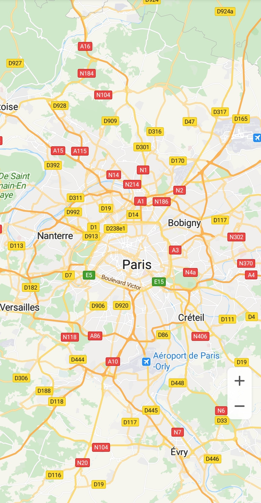
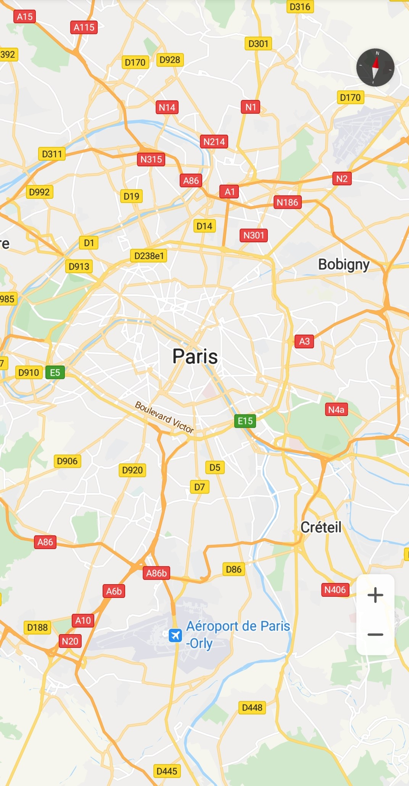

# 创建地图实例<a name="ZH-CN_TOPIC_0000001099181252"></a>

-   [地图容器](#section1148432115353)
-   [设置API Key](#section147441922143612)

## 地图容器<a name="section1148432115353"></a>

目前华为地图SDK支持的地图容器有两种，[SupportMapFragment](zh-cn_topic_0000001145541123.md)、[MapView](zh-cn_topic_0000001099181264.md)：

-   [SupportMapFragment](zh-cn_topic_0000001145541123.md)是Android Fragment的子类，允许您将地图放置在Fragment中。[SupportMapFragment](zh-cn_topic_0000001145541123.md)可以充当地图的容器，并提供对[HuaweiMap](zh-cn_topic_0000001145941019.md)对象的访问入口。
-   [MapView](zh-cn_topic_0000001099181264.md)是Android View类的子类，允许您将地图放置在Android视图中。与[SupportMapFragment](zh-cn_topic_0000001145541123.md)非常相似，[MapView](zh-cn_topic_0000001099181264.md)充当地图的容器，通过[HuaweiMap](zh-cn_topic_0000001145941019.md)对象展示核心地图功能。在常规地图交互模式下调用API时，[MapView](zh-cn_topic_0000001099181264.md)类的使用者必须在对应的Activity/Fragment的方法中调用以下方法：[onCreate](zh-cn_topic_0000001099181264.md#section5701320154117)\(\)，[onStart](zh-cn_topic_0000001099181264.md#section1929311316455)\(\)，[onResume](zh-cn_topic_0000001099181264.md#section127594720434)\(\)，[onPause](zh-cn_topic_0000001099181264.md#section119871413124319)\(\)，[onStop](zh-cn_topic_0000001099181264.md#section1185125812451)\(\)，[onDestroy](zh-cn_topic_0000001099181264.md#section1991150164217)\(\)，[onSaveInstanceState](zh-cn_topic_0000001099181264.md#section17492429104415)\(Bundle outState\)和[onLowMemory](zh-cn_topic_0000001099181264.md#section1298412345428)\(\)，具体参见[MapViewCodeDemoActivity.java](https://github.com/HMS-Core/hms-mapkit-demo-java/blob/master/java/app/src/main/java/com/huawei/hms/maps/sample/MapViewCodeDemoActivity.java)。

下面以[SupportMapFragment](zh-cn_topic_0000001145541123.md)为例简单介绍创建Map实例的步骤。

1.  在Activity的布局文件（例如：activity\_main.xml）中添加一个Fragment，并通过布局文件设置地图的属性。

    ```
    <fragment xmlns:android="http://schemas.android.com/apk/res/android"
        xmlns:map="http://schemas.android.com/apk/res-auto"
        android:id="@+id/mapfragment_mapfragmentdemo"
        class="com.huawei.hms.maps.SupportMapFragment"
        android:layout_width="match_parent"
        android:layout_height="match_parent"
        map:cameraTargetLat="48.893478"
        map:cameraTargetLng="2.334595"
        map:cameraZoom="10" />
    ```

2.  要在应用程序中使用地图，您需要实现[OnMapReadyCallback](zh-cn_topic_0000001099181298.md)接口。

    示例代码如下：

    ```
    Java
    public class SupportMapDemoActivity extends AppCompatActivity implements OnMapReadyCallback {
       ...
    }
    ```

    ```
    Kotlin
    class SupportMapDemoActivity : AppCompatActivity(),OnMapReadyCallback { 
       ... 
    }
    ```

3.  在Activity的onCreate\(\)方法中加载[SupportMapFragment](zh-cn_topic_0000001145541123.md)，并调用[getMapAsync](zh-cn_topic_0000001145781021.md#section11704105017376)\(\)来注册回调。

    示例代码如下：

    ```
    Java
    private SupportMapFragment mSupportMapFragment; 
    mSupportMapFragment = (SupportMapFragment) getSupportFragmentManager().findFragmentById(R.id.mapfragment_mapfragmentdemo);
    mSupportMapFragment.getMapAsync(this);
    ```

    ```
    Kotlin
    private var mSupportMapFragment: SupportMapFragment? = null
    mSupportMapFragment = supportFragmentManager.findFragmentById(R.id.supportMap) as SupportMapFragment?
    mSupportMapFragment?.getMapAsync(this)
    ```

4.  在[onMapReady](zh-cn_topic_0000001099181298.md#section74342919481)回调中获取[HuaweiMap](zh-cn_topic_0000001145941019.md)对象。

    示例代码如下：

    ```
    Java
    public void onMapReady(HuaweiMap huaweiMap) {
        Log.d(TAG, "onMapReady: ");     
        hMap = huaweiMap;
    }
    ```

    ```
    Kotlin
    override fun onMapReady(huaweiMap: HuaweiMap) {
        Log.d(TAG, "onMapReady: ")
        hMap = huaweiMap
    }
    ```

5.  运行您刚完成的工程就可以在您的App中看到地图了。运行后的效果如下图所示：

    


下面以[MapView](zh-cn_topic_0000001099181264.md)为例简单介绍创建Map实例的步骤。

1.  在Activity的布局文件中添加一个[MapView](zh-cn_topic_0000001099181264.md)，并通过XML文件设置地图的属性。

    ```
    <com.huawei.hms.maps.MapView xmlns:android="http://schemas.android.com/apk/res/android"
            xmlns:map="http://schemas.android.com/apk/res-auto"
            android:id="@+id/mapview_mapviewdemo"
            android:layout_width="match_parent"
            android:layout_height="match_parent"
            map:cameraTargetLat="48.893478"
            map:cameraTargetLng="2.334595"
            map:cameraZoom="10"/>
    ```

2.  要在应用程序中使用地图，您需要实现[OnMapReadyCallback](zh-cn_topic_0000001099181298.md)接口：

    示例代码如下：

    ```
    Java
    public class MapViewDemoActivity extends AppCompatActivity implements OnMapReadyCallback {
       ...
    }
    ```

    ```
    Kotlin
    class MapViewDemoActivity : AppCompatActivity(), OnMapReadyCallback { 
       ... 
    }
    ```

3.  在Activity的onCreate\(\)方法中加载[MapView](zh-cn_topic_0000001099181264.md)，并调用[getMapAsync](zh-cn_topic_0000001099181264.md#section18155143712405)\(\)来注册回调。

    示例代码如下：

    ```
    Java
    private MapView mMapView;
    mMapView = findViewById(R.id.mapview_mapviewdemo);
    Bundle mapViewBundle = null;
    if (savedInstanceState != null) {
          mapViewBundle = savedInstanceState.getBundle("MapViewBundleKey");
    }
    mMapView.onCreate(mapViewBundle);
    mMapView.getMapAsync(this);
    ```

    ```
    Kotlin
    private lateinit var mMapView: MapView
    mMapView = findViewById(R.id.mapview_mapviewdemo)
    var mapViewBundle: Bundle? = null
    if (savedInstanceState != null) {
        mapViewBundle = savedInstanceState.getBundle("MapViewBundleKey")
    }
    mMapView.onCreate(mapViewBundle)
    mMapView.getMapAsync(this)
    ```

4.  在[onMapReady](zh-cn_topic_0000001099181298.md#section74342919481)回调中获取[HuaweiMap](zh-cn_topic_0000001145941019.md)对象。

    示例代码如下：

    ```
    Java
    public void onMapReady(HuaweiMap huaweiMap) {
        Log.d(TAG, "onMapReady: ");     
        hMap = huaweiMap; 
    }
    ```

    ```
    Kotlin
    override fun onMapReady(huaweiMap: HuaweiMap) {
        Log.d(TAG, "onMapReady: ")
        hMap = huaweiMap
    }
    ```

5.  在Activity/Fragment的onStart\(\)，onResume\(\)，onPause\(\)，onStop\(\)，onDestroy\(\)，onSaveInstanceState\(Bundle outState\)和onLowMemory\(\)方法中调用[MapView](zh-cn_topic_0000001099181264.md)对应的方法。

    示例代码如下：

    ```
    Java
    private static final String MAPVIEW_BUNDLE_KEY = "MapViewBundleKey";
    
    @Override
    public void onSaveInstanceState(Bundle outState) {
        super.onSaveInstanceState(outState);
    
        Bundle mapViewBundle = outState.getBundle(MAPVIEW_BUNDLE_KEY);
        if (mapViewBundle == null) {
            mapViewBundle = new Bundle();
            outState.putBundle(MAPVIEW_BUNDLE_KEY, mapViewBundle);
        }
    
        mMapView.onSaveInstanceState(mapViewBundle);
    }
    
    @Override
    protected void onStart() {
        super.onStart();
        mMapView.onStart();
    }
    
    @Override
    protected void onResume() {
        super.onResume();
        mMapView.onResume();
    }
    
    @Override
    protected void onPause() {
        super.onPause();
        mMapView.onPause();
    }
    
    @Override
    protected void onStop() {
        super.onStop();
        mMapView.onStop();
    }
    
    @Override
    protected void onDestroy() {
        super.onDestroy();
        mMapView.onDestroy();
    }
    
    @Override
    public void onLowMemory() {
        super.onLowMemory();
        mMapView.onLowMemory();
    }
    ```

    ```
    Kotlin
    companion object {
        private const val MAPVIEW_BUNDLE_KEY = "MapViewBundleKey"
    }
    
    override fun onSaveInstanceState(outState: Bundle?) {
        super.onSaveInstanceState(outState)
    	
        var mapViewBundle: Bundle? = outState?.getBundle(MAPVIEW_BUNDLE_KEY)
        if (mapViewBundle == null) {
            mapViewBundle = Bundle()
            outState?.putBundle(MAPVIEW_BUNDLE_KEY, mapViewBundle)
        }
    	
        mMapView.onSaveInstanceState(mapViewBundle)
    }
    
    override fun onStart() {
        super.onStart()
        mMapView.onStart()
    }
    
    override fun onResume() {
        super.onResume()
        mMapView.onResume()
    }
    
    override fun onPause() {
        super.onPause()
        mMapView.onPause()
    }
    
    override fun onStop() {
        super.onStop()
        mMapView.onStop()
    }
    
    override fun onDestroy() {
        super.onDestroy()
        mMapView.onDestroy()
    }
    
    override fun onLowMemory() {
        super.onLowMemory()
        mMapView.onLowMemory()
    }
    ```

    > **说明：** 
    >[MapView](zh-cn_topic_0000001099181264.md)创建的时候，需要至少保证重写Activity/Fragment的onDestroy\(\)方法，使其能回调到[MapView](zh-cn_topic_0000001099181264.md)生命周期的onDestroy\(\)方法，才可以保证地图不会内存泄漏。另外，在ListView/RecyclerView这种多实体中创建地图的情况下，需要自行在销毁的时候调用各个实体的onDestroy\(\)方法，不然也可能会导致内存泄漏。

6.  运行您刚完成的工程就可以在您的App中看到地图了。运行后的效果如下图所示：

    


## 设置API Key<a name="section147441922143612"></a>

自Android Map SDK 5.0.0.300起，初始化地图前，必须要设置API Key。您可以直接使用“agconnect-services.json“文件中api\_key字段的API Key，也可以调用提供的接口[MapsInitializer.setApiKey](zh-cn_topic_0000001145860981.md#section1389444514617)\(String apiKey\)设置。

1.  在您的工程入口类设置API Key：

    示例代码如下：

    ```
    Java
    // 在App主应用的程序入口类（即继承了android.app.Application的类），在覆写的onCreate()方法中调用该方法
    public class MyApp extends Application {
        @Override
        public void onCreate() {
            super.onCreate();
            // 设置API Key
            MapsInitializer.setApiKey("Your API Key");
        }
    }
    ```

    ```
    Kotlin
    // 在App主应用的程序入口类（即继承了android.app.Application的类），在覆写的onCreate()方法中调用该方法
    class MyApp : Application() {
        override fun onCreate() {
            super.onCreate()
            // 设置API Key
            MapsInitializer.setApiKey("Your API Key")
        }
    }
    ```

2.  在Fragment或者MapView设置API Key：

    示例代码如下：

    ```
    Java
    @Override
    protected void onCreate(Bundle savedInstanceState) {
        Log.i(TAG, "onCreate: ");
        super.onCreate(savedInstanceState);
        // 在setContentView之前设置API Key     
        MapsInitializer.setApiKey("Your API Key");
        setContentView(R.layout.basic_demo);
    }
    ```

    ```
    Kotlin
    override fun onCreate(savedInstanceState: Bundle?) {
        Log.i(TAG, "onCreate: ")
        super.onCreate(savedInstanceState)
        // 在setContentView之前设置API Key
        MapsInitializer.setApiKey("Your API Key")
        setContentView(R.layout.basic_demo)
    }
    ```

    > **说明：** 
    >使用[MapsInitializer.setApiKey](zh-cn_topic_0000001145860981.md#section1389444514617)\(String apiKey\)设置API Key的时候，apiKey的取值和“agconnect-services.json“文件中的api\_key字段保持一致即可。


