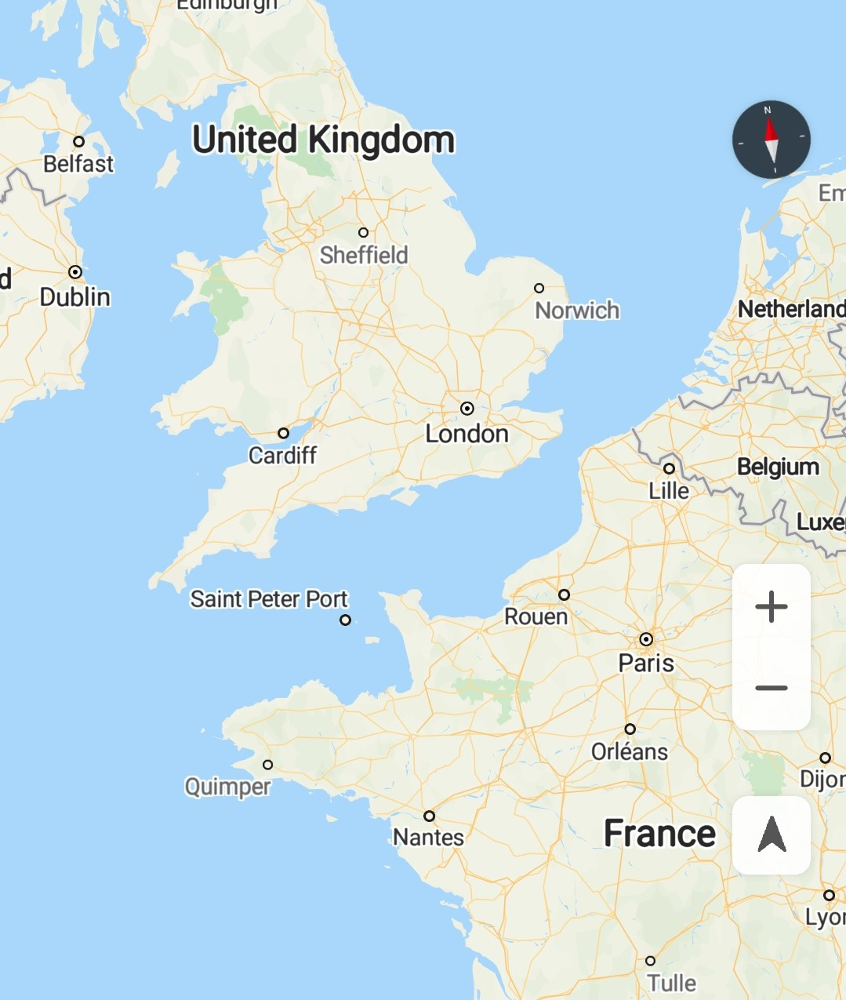
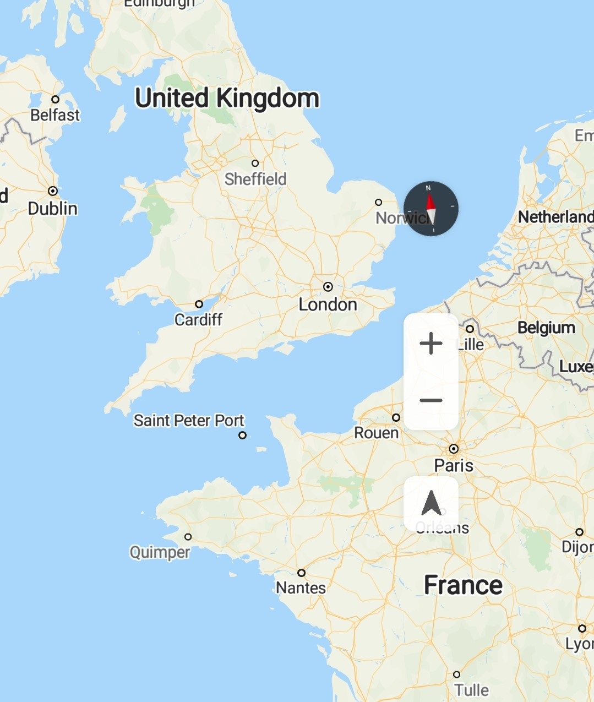

# 地图填充

华为地图是通过模拟相机的方式实现的，地图以目标位置为中心填充整个相机区域，地图控件（如指南针、缩放按钮和“我的位置”按钮）放置在相机区域的边缘。默认情况下，指南针放置在相机右上角，缩放按钮和“我的位置”按钮放置在相机右下角。

您可以通过[HuaweiMap.setPadding](zh-cn_topic_0000001145941019.md#section10782142412914)\(int left, int top, int right, int bottom\)方法来设置地图控件距离相机边缘的填充距离，具体效果如下：

-   left：在地图左侧增加的填充距离，单位：像素。
-   top：在地图顶部增加的填充距离，单位：像素。
-   right：在地图右侧增加的填充距离，单位：像素。
-   bottom：在地图底部增加的填充距离，单位：像素。

[图1](#fig18561531114719)和[图2](#fig8557135134813)分别展示了地图默认填充和自定义填充的效果：

<table><tbody><tr id="row164911781018"><td class="row-nocellborder" style="border:none" valign="top" width="50%">
<b>图1 </b>默认填充 

</td>
<td class="cellrowborder" style="border:none" valign="top" width="50%">
<b>图2 </b>自定义填充 

</td>
</tr>
</tbody>
</table>

