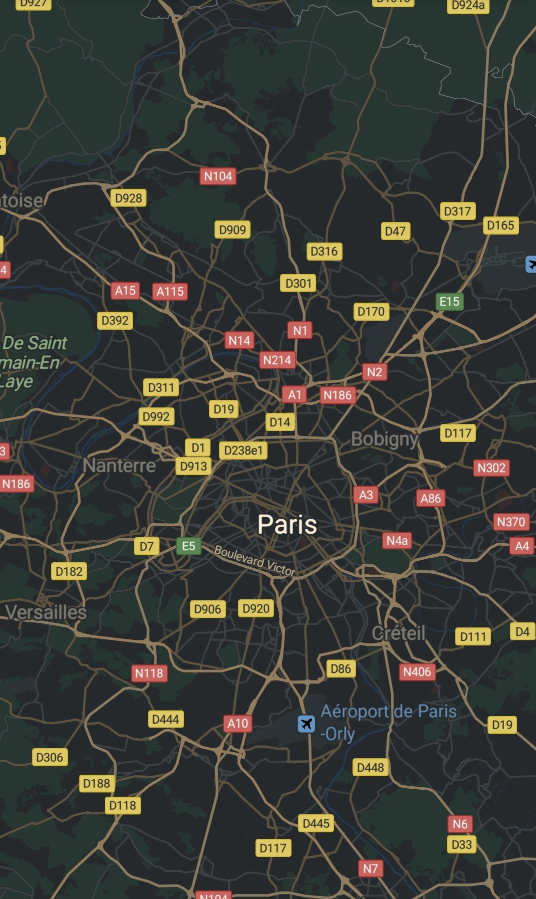
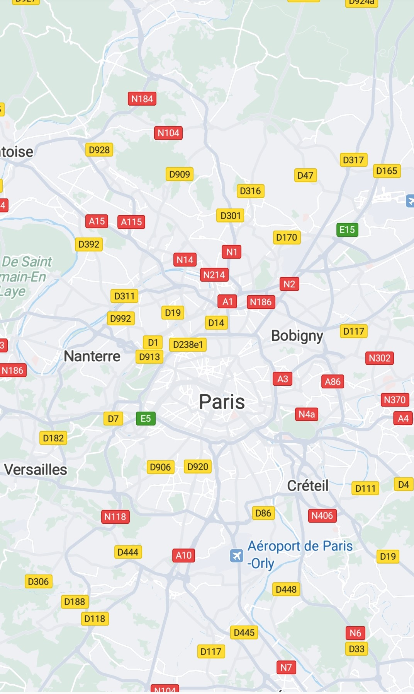

# 实现步骤<a name="ZH-CN_TOPIC_0000001099341110"></a>

-   [设置样式文件](#section15187191611143)

## 设置样式文件<a name="section15187191611143"></a>

1.  在res/raw目录下定义一个JSON文件，例如：mapstyle\_example.json，JSON文件的内容如下，JSON文件的定义参见[样式参考](android-sdk-map-style-customization-reference.md)。

    ```
    [
      {
        "mapFeature": "landcover.natural",
        "options": "geometry.fill",
        "paint": {
          "color": "#8FBC8F"
        }
      },
      {
        "mapFeature": "water",
        "options": "geometry.fill",
        "paint": {
          "color": "#4682B4"
        }
      }
    ]
    ```

2.  使用[loadRawResourceStyle](zh-cn_topic_0000001145781011.md#section10777151911461)\(\)方法，将上一步中的文件加载为[MapStyleOptions](zh-cn_topic_0000001145781011.md)对象，再将该对象传递给[HuaweiMap](zh-cn_topic_0000001145941019.md).[setMapStyle](zh-cn_topic_0000001145941019.md#section172547271522)\(\)方法。

    示例代码如下：

    ```
    Java
    HuaweiMap hMap;
    MapStyleOptions style;
    style = MapStyleOptions.loadRawResourceStyle(this, R.raw.mapstyle_simple); 
    hMap.setMapStyle(style);
    ```

    ```
    Kotlin
    private lateinit var hMap: HuaweiMap
     
    val style: MapStyleOptions = MapStyleOptions.loadRawResourceStyle(this, R.raw.mapstyle_simple)
    hMap.setMapStyle(style)
    ```


[图1](#fig1488418301469)和[图2](#fig870123720716)分别展示了黑夜样式和简单样式的地图效果：

<a name="table14590155441719"></a>
<table><tbody><tr id="row759018543175"><td class="row-nocellborder" style="border:none" align="center" valign="top" width="50%"><div class="fignone" id="fig1488418301469"><a name="fig1488418301469"></a><a name="fig1488418301469"></a><span class="figcap"><b>图1 </b>黑夜样式地图</span><br><a name="image138852030563"></a><a name="image138852030563"></a><span></span></div>
<p id="p310118306514"><a name="p310118306514"></a><a name="p310118306514"></a>黑夜样式JSON文件地址：</p>
<p id="p1157123317187"><a name="p1157123317187"></a><a name="p1157123317187"></a><a href="https://github.com/HMS-Core/hms-mapkit-demo-java/blob/master/java/app/src/main/res/raw/mapstyle_night_hms.json" target="_blank" rel="noopener noreferrer">mapstyle_night_hms.json</a></p>
</td>
<td class="cellrowborder" style="border:none" align="center" valign="top" width="50%"><div class="fignone" id="fig870123720716"><a name="fig870123720716"></a><a name="fig870123720716"></a><span class="figcap"><b>图2 </b>简单样式地图</span><br><a name="image167043717716"></a><a name="image167043717716"></a><span></span></div>
<p id="p11021712105111"><a name="p11021712105111"></a><a name="p11021712105111"></a>简单样式JSON文件地址：</p>
<p id="p16499338161811"><a name="p16499338161811"></a><a name="p16499338161811"></a><a href="https://github.com/HMS-Core/hms-mapkit-demo-java/blob/master/java/app/src/main/res/raw/mapstyle_grayscale_hms.json" target="_blank" rel="noopener noreferrer">mapstyle_grayscale_hms.json</a></p>
</td>
</tr>
</tbody>
</table>

