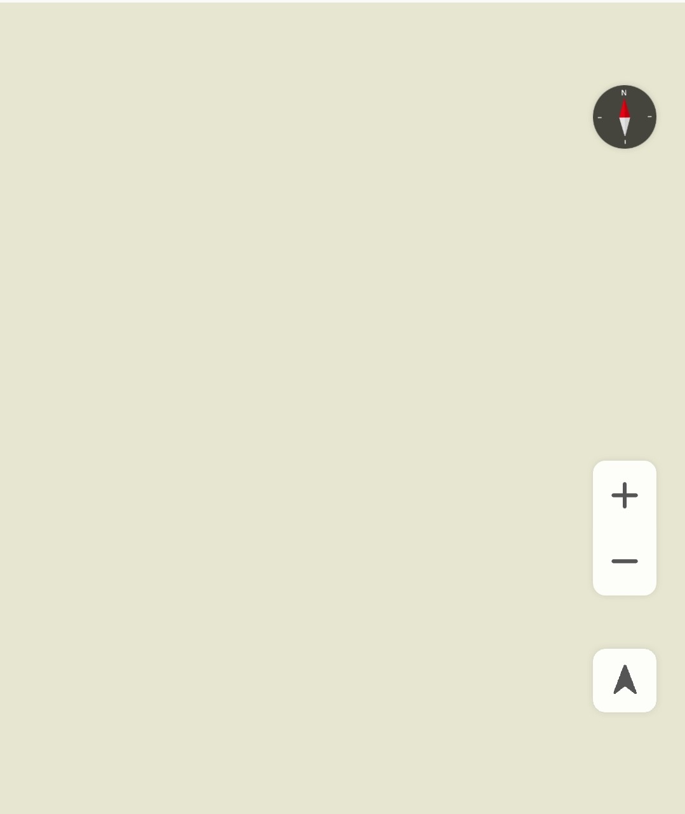
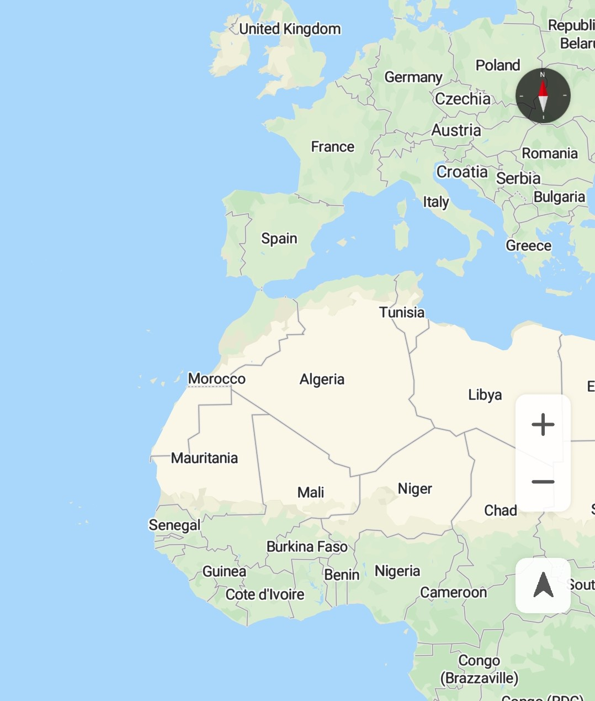

# 地图类型

[HuaweiMap](zh-cn_topic_0000001145941019.md)目前支持两种地图类型：

-   MAP\_TYPE\_NORMAL：标准地图。展示道路，建筑物以及河流等重要的自然特征。
-   MAP\_TYPE\_NONE：没有加载任何数据的空地图。

要设置地图的类型，请调用[HuaweiMap](zh-cn_topic_0000001145941019.md)对象的[setMapType](zh-cn_topic_0000001145941019.md#section3746134811217)方法，并传递[HuaweiMap](zh-cn_topic_0000001145941019.md)中定义的静态常量。设置地图方法及地图显示效果如下：

-   设置空地图类型：调用[HuaweiMap](zh-cn_topic_0000001145941019.md)对象的[setMapType](zh-cn_topic_0000001145941019.md#section3746134811217)\(HuaweiMap.MAP\_TYPE\_NONE\)，显示效果如[图1](#fig13171704408)。
-   设置标准地图类型：调用[HuaweiMap](zh-cn_topic_0000001145941019.md)对象的[setMapType](zh-cn_topic_0000001145941019.md#section3746134811217)\(HuaweiMap.MAP\_TYPE\_NORMAL\)，显示效果如[图2](#fig15549151810415)。

<table><tbody><tr id="row9495184319574"><td class="row-nocellborder" style="border:none" valign="top" width="50%">
<b>图1 </b>空地图类型 

</td>
<td class="cellrowborder" style="border:none" valign="top" width="50%">
<b>图2 </b>标准地图类型 

</td>
</tr>
</tbody>
</table>

