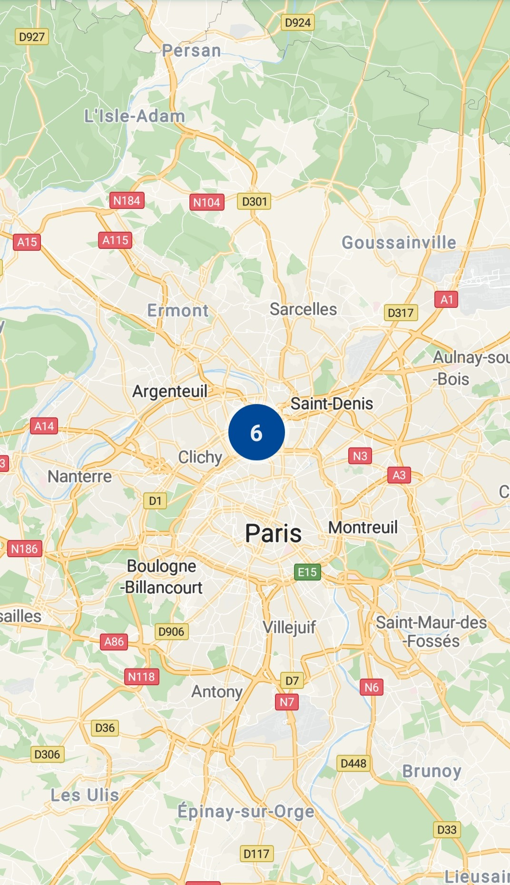

# 标记<a name="ZH-CN_TOPIC_0000001145860973"></a>

-   [添加标记](#section317665615538)
-   [自定义标记图像](#section6200183275411)
-   [修改标记](#section121145212558)
-   [聚合标记](#section13163101411562)
-   [标记事件](#section1361193795619)
    -   [标记点击事件](#section5726108505)
    -   [标记拖动事件](#section23851346175012)

-   [标记动画](#section0214032193415)
-   [信息窗](#section330612176525)
    -   [添加信息窗](#section286084785210)
    -   [显示/隐藏信息窗](#section18473152425315)
    -   [自定义信息窗](#section113719566535)


用户可以在地图的指定位置添加标记以标识位置、商家、建筑等，并可以通过信息窗口展示详细信息。

## 添加标记<a name="section317665615538"></a>

下面的代码段使用默认图标在地图上添加一个简单的标记。

示例代码如下：

```
Java
private Marker mMarker;

public void addMarker(View view) {
    if (null != mMarker) {
        mMarker.remove();
    }
    MarkerOptions options = new MarkerOptions()
            .position(new LatLng(48.893478, 2.334595))
            .title("Hello Huawei Map")
            .snippet("This is a snippet!");
    mMarker = hMap.addMarker(options);
}
```

```
Kotlin
private var mMarker: Marker? = null

fun addMarker(view: View?) {
    if (null != mMarker) {
        mMarker?.remove()
    }
    val options = MarkerOptions()
            .position(LatLng(48.893478, 2.334595))
            .title("Hello Huawei Map")
            .snippet("This is a snippet!")
    mMarker = hMap.addMarker(options)
}
```

您可以自定义图像代替默认图标，还可以设置标记属性来改变图标。标记的以下属性支持自定义：

<a name="table450211347407"></a>
<table><thead align="left"><tr id="row14502123417406"><th class="cellrowborder" valign="top" width="40%" id="mcps1.1.3.1.1"><p id="p5505155104011"><a name="p5505155104011"></a><a name="p5505155104011"></a>方法</p>
</th>
<th class="cellrowborder" valign="top" width="60%" id="mcps1.1.3.1.2"><p id="p1505135513402"><a name="p1505135513402"></a><a name="p1505135513402"></a>功能</p>
</th>
</tr>
</thead>
<tbody><tr id="row1950223434020"><td class="cellrowborder" valign="top" width="40%" headers="mcps1.1.3.1.1 "><p id="p145053552404"><a name="p145053552404"></a><a name="p145053552404"></a><a href="zh-cn_topic_0000001145941087.md#section339524313354">position</a>(<a href="zh-cn_topic_0000001099661098.md">LatLng </a> latlng)</p>
</td>
<td class="cellrowborder" valign="top" width="60%" headers="mcps1.1.3.1.2 "><p id="p19505855194013"><a name="p19505855194013"></a><a name="p19505855194013"></a>标记在地图上的经纬度，这是Marker对象唯一必需的属性。</p>
</td>
</tr>
<tr id="row1125413468520"><td class="cellrowborder" valign="top" width="40%" headers="mcps1.1.3.1.1 "><p id="p122546461453"><a name="p122546461453"></a><a name="p122546461453"></a><a href="zh-cn_topic_0000001145941087.md#section1986735018353">rotation</a>(float rotation)</p>
</td>
<td class="cellrowborder" valign="top" width="60%" headers="mcps1.1.3.1.2 "><p id="p1225416465515"><a name="p1225416465515"></a><a name="p1225416465515"></a>标记在地图上的旋转角度。</p>
</td>
</tr>
<tr id="row4581314163"><td class="cellrowborder" valign="top" width="40%" headers="mcps1.1.3.1.1 "><p id="p49119002"><a name="p49119002"></a><a name="p49119002"></a><a href="zh-cn_topic_0000001145941087.md#section144310304569">title</a>(String title)</p>
</td>
<td class="cellrowborder" valign="top" width="60%" headers="mcps1.1.3.1.2 "><p id="p7580825862"><a name="p7580825862"></a><a name="p7580825862"></a><span>用户点按标记时在信息窗口中显示的字符串</span>。</p>
</td>
</tr>
<tr id="row145806251563"><td class="cellrowborder" valign="top" width="40%" headers="mcps1.1.3.1.1 "><p id="p25811114462"><a name="p25811114462"></a><a name="p25811114462"></a><a href="zh-cn_topic_0000001145941087.md#section1266276203610">snippet</a>(String snippet)</p>
</td>
<td class="cellrowborder" valign="top" width="60%" headers="mcps1.1.3.1.2 "><p id="p8581814969"><a name="p8581814969"></a><a name="p8581814969"></a><span>标题文本框显示的其他文字</span>。</p>
</td>
</tr>
<tr id="row37971928969"><td class="cellrowborder" valign="top" width="40%" headers="mcps1.1.3.1.1 "><p id="p1579742818615"><a name="p1579742818615"></a><a name="p1579742818615"></a><a href="zh-cn_topic_0000001145941087.md#section4119596355">icon</a>(<a href="zh-cn_topic_0000001099501086.md">BitmapDescriptor</a> iconDescriptor)</p>
</td>
<td class="cellrowborder" valign="top" width="60%" headers="mcps1.1.3.1.2 "><p id="p0797628565"><a name="p0797628565"></a><a name="p0797628565"></a><span>代替默认标记图像</span>。</p>
</td>
</tr>
<tr id="row8187127261"><td class="cellrowborder" valign="top" width="40%" headers="mcps1.1.3.1.1 "><p id="p21398621"><a name="p21398621"></a><a name="p21398621"></a><a href="zh-cn_topic_0000001145941087.md#section47301652195614">visible</a>(boolean visible)</p>
</td>
<td class="cellrowborder" valign="top" width="60%" headers="mcps1.1.3.1.2 "><p id="p1918712271263"><a name="p1918712271263"></a><a name="p1918712271263"></a>标记的可见性，默认为true。</p>
</td>
</tr>
<tr id="row91195241766"><td class="cellrowborder" valign="top" width="40%" headers="mcps1.1.3.1.1 "><p id="p7064824"><a name="p7064824"></a><a name="p7064824"></a><a href="zh-cn_topic_0000001145941087.md#section551291175715">zIndex</a>(float zIndex)</p>
</td>
<td class="cellrowborder" valign="top" width="60%" headers="mcps1.1.3.1.2 "><p id="p141191924566"><a name="p141191924566"></a><a name="p141191924566"></a>标记的z指数。</p>
</td>
</tr>
<tr id="row14652361978"><td class="cellrowborder" valign="top" width="40%" headers="mcps1.1.3.1.1 "><p id="p16518361771"><a name="p16518361771"></a><a name="p16518361771"></a><a href="zh-cn_topic_0000001145941087.md#section95121330125810">anchorMarker</a>(float u, float v)</p>
</td>
<td class="cellrowborder" valign="top" width="60%" headers="mcps1.1.3.1.2 "><p id="p665143612714"><a name="p665143612714"></a><a name="p665143612714"></a>标记的锚点位置。</p>
</td>
</tr>
<tr id="row036417421071"><td class="cellrowborder" valign="top" width="40%" headers="mcps1.1.3.1.1 "><p id="p10818310"><a name="p10818310"></a><a name="p10818310"></a><a href="zh-cn_topic_0000001145941087.md#section0702145819302">draggable</a>(boolean draggable)</p>
</td>
<td class="cellrowborder" valign="top" width="60%" headers="mcps1.1.3.1.2 "><a name="ul79511721161317"></a><a name="ul79511721161317"></a><ul id="ul79511721161317"><li><span>true</span>：允许用户移动标记。</li><li><span>false</span>：禁止用户移动标记。</li></ul>
<p id="p2034113211289"><a name="p2034113211289"></a><a name="p2034113211289"></a>默认为false。</p>
</td>
</tr>
<tr id="row48741715982"><td class="cellrowborder" valign="top" width="40%" headers="mcps1.1.3.1.1 "><p id="p5874815585"><a name="p5874815585"></a><a name="p5874815585"></a><a href="zh-cn_topic_0000001145941087.md#section34311726293">alpha</a>(float alpha)</p>
</td>
<td class="cellrowborder" valign="top" width="60%" headers="mcps1.1.3.1.2 "><p id="p3181142610138"><a name="p3181142610138"></a><a name="p3181142610138"></a>标记的透明度，取值范围：[0, 1]。</p>
<a name="ul5889346131317"></a><a name="ul5889346131317"></a><ul id="ul5889346131317"><li>0：完全透明。</li><li>1：完全不透明。</li></ul>
</td>
</tr>
<tr id="row85020344408"><td class="cellrowborder" valign="top" width="40%" headers="mcps1.1.3.1.1 "><p id="p618314260817"><a name="p618314260817"></a><a name="p618314260817"></a><a href="zh-cn_topic_0000001145941087.md#section2727192393111">flat</a>(boolean flat)</p>
</td>
<td class="cellrowborder" valign="top" width="60%" headers="mcps1.1.3.1.2 "><p id="p818312261683"><a name="p818312261683"></a><a name="p818312261683"></a>标记是否平贴地图，默认不平贴地图。默认值为false。</p>
</td>
</tr>
<tr id="row135021834184016"><td class="cellrowborder" valign="top" width="40%" headers="mcps1.1.3.1.1 "><p id="p45454987"><a name="p45454987"></a><a name="p45454987"></a><a href="zh-cn_topic_0000001145941087.md#section114908172352">infoWindowAnchor</a>(float u, float v)</p>
</td>
<td class="cellrowborder" valign="top" width="60%" headers="mcps1.1.3.1.2 "><p id="p21821026589"><a name="p21821026589"></a><a name="p21821026589"></a>标记信息窗口的锚点坐标。</p>
</td>
</tr>
</tbody>
</table>

## 自定义标记图像<a name="section6200183275411"></a>

您可以使用自定义图像（通常称为图标）修改默认标记图标，通过调用[BitmapDescriptorFactory](zh-cn_topic_0000001145860975.md)类中的静态方法生成[BitmapDescriptor](zh-cn_topic_0000001099501086.md)对象（图片描述文件）。

<a name="table72271917194914"></a>
<table><thead align="left"><tr id="row202272017174917"><th class="cellrowborder" valign="top" width="40%" id="mcps1.1.3.1.1"><p id="p172821725204916"><a name="p172821725204916"></a><a name="p172821725204916"></a>方法</p>
</th>
<th class="cellrowborder" valign="top" width="60%" id="mcps1.1.3.1.2"><p id="p1928272517495"><a name="p1928272517495"></a><a name="p1928272517495"></a>功能</p>
</th>
</tr>
</thead>
<tbody><tr id="row9228181711491"><td class="cellrowborder" valign="top" width="40%" headers="mcps1.1.3.1.1 "><p id="p192822025114918"><a name="p192822025114918"></a><a name="p192822025114918"></a><a href="zh-cn_topic_0000001145860975.md#section177751156105216">fromAsset</a>(String assetName)</p>
</td>
<td class="cellrowborder" valign="top" width="60%" headers="mcps1.1.3.1.2 "><p id="p162822250492"><a name="p162822250492"></a><a name="p162822250492"></a>使用assets目录中的Bitmap图像创建自定义标记图标。</p>
</td>
</tr>
<tr id="row112281217114918"><td class="cellrowborder" valign="top" width="40%" headers="mcps1.1.3.1.1 "><p id="p6282172584913"><a name="p6282172584913"></a><a name="p6282172584913"></a><a href="zh-cn_topic_0000001145860975.md#section375416351533">fromBitmap</a>(Bitmap image)</p>
</td>
<td class="cellrowborder" valign="top" width="60%" headers="mcps1.1.3.1.2 "><p id="p2282152524911"><a name="p2282152524911"></a><a name="p2282152524911"></a>通过位图图像创建自定义标记图标。</p>
</td>
</tr>
<tr id="row10228101794918"><td class="cellrowborder" valign="top" width="40%" headers="mcps1.1.3.1.1 "><p id="p1128252564916"><a name="p1128252564916"></a><a name="p1128252564916"></a><a href="zh-cn_topic_0000001145860975.md#section338617415546">fromFile</a>(String fileName)</p>
</td>
<td class="cellrowborder" valign="top" width="60%" headers="mcps1.1.3.1.2 "><p id="p1528211256492"><a name="p1528211256492"></a><a name="p1528211256492"></a>使用位于内部存储中的位图文件创建自定义标记图标。</p>
</td>
</tr>
<tr id="row522841718494"><td class="cellrowborder" valign="top" width="40%" headers="mcps1.1.3.1.1 "><p id="p10282025154911"><a name="p10282025154911"></a><a name="p10282025154911"></a><a href="zh-cn_topic_0000001145860975.md#section1762285545410">fromPath</a>(String absolutePath)</p>
</td>
<td class="cellrowborder" valign="top" width="60%" headers="mcps1.1.3.1.2 "><p id="p728212250493"><a name="p728212250493"></a><a name="p728212250493"></a>通过位图的绝对文件路径创建自定义标记图标。</p>
</td>
</tr>
<tr id="row72284175497"><td class="cellrowborder" valign="top" width="40%" headers="mcps1.1.3.1.1 "><p id="p6282102524913"><a name="p6282102524913"></a><a name="p6282102524913"></a><a href="zh-cn_topic_0000001145860975.md#section11216192714558">fromResource</a>(int resourceId)</p>
</td>
<td class="cellrowborder" valign="top" width="60%" headers="mcps1.1.3.1.2 "><p id="p2282152514914"><a name="p2282152514914"></a><a name="p2282152514914"></a>使用位图图像的资源创建自定义标记图标。</p>
</td>
</tr>
</tbody>
</table>

下面的代码段会创建一个带有自定义图标的标记。

示例代码如下：

```
Java
private Marker mMarker;

mMarker = hMap.addMarker(new MarkerOptions()
        .position(new LatLng(48.893478, 2.334595))
        .icon(BitmapDescriptorFactory.fromResource(R.drawable.badge_ph)));
```

```
Kotlin
private var mMarker: Marker? = null

mMarker = hMap.addMarker(MarkerOptions()
        .position(LatLng(48.893478, 2.334595))
        .icon(BitmapDescriptorFactory.fromResource(R.drawable.badge_ph)))
```

## 修改标记<a name="section121145212558"></a>

华为地图SDK支持在添加标记之后，修改已经设置的标记属性。

示例代码如下：

```
Java
// 修改标记的图标
if (mMarker != null) {
    Bitmap bitmap = BitmapFactory.decodeResource(getResources(), R.drawable.badge_tr);
    BitmapDescriptor bitmapDescriptor = BitmapDescriptorFactory.fromBitmap(bitmap);
    mMarker.setIcon(bitmapDescriptor);
}

// 设置标记的标题
if (mMarker != null) {
    mMarker.setTitle("Marker title");
}

...

// 设置标记可拖拽
if (mMarker != null) {
    mMarker.setDraggable(true);
}

// 设置标记锚点
if (mMarker != null) {
    mMarker.setMarkerAnchor(0.9F, 0.9F);
}
```

```
Kotlin
// 修改标记的图标
if (mMarker != null) {
    val bitmap = BitmapFactory.decodeResource(resources, R.drawable.badge_tr)
    val bitmapDescriptor = BitmapDescriptorFactory.fromBitmap(bitmap)
    mMarker?.setIcon(bitmapDescriptor)
}

// 设置标记的标题
if (mMarker != null) {
    mMarker?.title = "Marker title"
}

...

// 设置标记可拖拽
if (mMarker != null) {
    mMarker?.isDraggable = true
}

// 设置标记锚点
if (mMarker != null) {
    mMarker?.setMarkerAnchor(0.9f, 0.9f)
}
```

## 聚合标记<a name="section13163101411562"></a>

华为地图SDK支持聚合标记功能，该功能可以有效地管理在地图不同缩放级别情况下的多个标记，使用该功能需要标记数量大于等于5个，在小于5个时不支持聚合标记。当以高缩放级别查看地图时，各个标记会显示在地图上（[图1](#fig1170012335716)）；以较低级别查看地图时，标记会聚集成集群，从而使标记的呈现更有序（[图2](#fig827215186819)）。

可以参见以下示例代码实现标记聚合功能：

示例代码如下：

```
Java
@Override
public void onMapReady(HuaweiMap map) {
    hMap = map;
    hMap.moveCamera(CameraUpdateFactory.newLatLngZoom(
    new LatLng(48.893478, 2.334595),10));
    // 将该Marker加入集群
    hMap.addMarker(new MarkerOptions().position(new LatLng(48.891478, 2.334595)).title("Marker1").clusterable(true));
    hMap.addMarker(new MarkerOptions().position(new LatLng(48.892478, 2.334595)).title("Marker2").clusterable(true));
    hMap.addMarker(new MarkerOptions().position(new LatLng(48.893478, 2.334595)).title("Marker3").clusterable(true));
    hMap.addMarker(new MarkerOptions().position(new LatLng(48.894478, 2.334595)).title("Marker4").clusterable(true));
    hMap.addMarker(new MarkerOptions().position(new LatLng(48.895478, 2.334595)).title("Marker5").clusterable(true));
    hMap.addMarker(new MarkerOptions().position(new LatLng(48.896478, 2.334595)).title("Marker6").clusterable(true));
    // 设置Marker可聚合
    hMap.setMarkersClustering(true);
}
```

```
Kotlin
override fun onMapReady(map: HuaweiMap) {
    hMap = map
    hMap.moveCamera(CameraUpdateFactory.newLatLngZoom(
            LatLng(48.893478, 2.334595), 10f))
    // 将该Marker加入集群
    hMap.addMarker(MarkerOptions().position(LatLng(48.891478, 2.334595)).title("Marker1").clusterable(true))
    hMap.addMarker(MarkerOptions().position(LatLng(48.892478, 2.334595)).title("Marker2").clusterable(true))
    hMap.addMarker(MarkerOptions().position(LatLng(48.893478, 2.334595)).title("Marker3").clusterable(true))
    hMap.addMarker(MarkerOptions().position(LatLng(48.894478, 2.334595)).title("Marker4").clusterable(true))
    hMap.addMarker(MarkerOptions().position(LatLng(48.895478, 2.334595)).title("Marker5").clusterable(true))
    hMap.addMarker(MarkerOptions().position(LatLng(48.896478, 2.334595)).title("Marker6").clusterable(true))
    // 设置Marker可聚合
    hMap.setMarkersClustering(true)
}
```

<a name="table01991540757"></a>
<table><tbody><tr id="row172006401250"><td class="row-nocellborder" style="border:none" valign="top" width="50%"><div class="fignone" id="fig1170012335716"><a name="fig1170012335716"></a><a name="fig1170012335716"></a><span class="figcap"><b>图1 </b>高缩放级别下多标记展示</span><br><a name="image187011833579"></a><a name="image187011833579"></a><span></span></div>
</td>
<td class="cellrowborder" style="border:none" valign="top" width="50%"><div class="fignone" id="fig827215186819"><a name="fig827215186819"></a><a name="fig827215186819"></a><span class="figcap"><b>图2 </b>低缩放级别下多标记展示</span><br><a name="image627217180810"></a><a name="image627217180810"></a><span></span></div>
</td>
</tr>
</tbody>
</table>

## 标记事件<a name="section1361193795619"></a>

### 标记点击事件<a name="section5726108505"></a>

可以使用[HuaweiMap.OnMarkerClickListener](zh-cn_topic_0000001145941023.md)来侦听标记上的点击事件。要在地图上设置此侦听器，请调用[HuaweiMap](zh-cn_topic_0000001145941019.md)对象的[setOnMarkerClickListener](zh-cn_topic_0000001145941019.md#section6157172618712)\([HuaweiMap.OnMarkerClickListener](zh-cn_topic_0000001145941023.md)\)方法。当用户点击标记时，[onMarkerClick](zh-cn_topic_0000001145941023.md#section165540817477)\([Marker](zh-cn_topic_0000001145860955.md)\)将调用该标记并将标记作为参数传递。标记点击事件的默认行为是显示其信息窗口（如果可用），使标记在地图上居中。

示例代码如下：

```
Java
hMap.setOnMarkerClickListener(new HuaweiMap.OnMarkerClickListener() {
    @Override
    public boolean onMarkerClick(Marker marker) {
        Toast.makeText(getApplicationContext(), "onMarkerClick：" + marker.getTitle(), Toast.LENGTH_SHORT).show();
        return false;
    }
});
```

```
Kotlin
hMap.setOnMarkerClickListener { marker ->
    Toast.makeText(applicationContext, "onMarkerClick：${marker.title}", Toast.LENGTH_SHORT).show()
    false
}
```

### 标记拖动事件<a name="section23851346175012"></a>

可以使用[HuaweiMap.OnMarkerDragListener](zh-cn_topic_0000001145860963.md)来侦听标记上的拖动事件，前提是该[Marker](zh-cn_topic_0000001145860955.md)标记已设置拖拽属性为true。要在地图上设置此侦听器，请调用[HuaweiMap](zh-cn_topic_0000001145941019.md)对象的[setOnMarkerDragListener](zh-cn_topic_0000001145941019.md#section183907434711)\([HuaweiMap.OnMarkerDragListener](zh-cn_topic_0000001145860963.md)\)方法。要拖动标记，用户必须长按标记。当用户将手指从屏幕上移开时，标记将保持在该位置。拖动标记时，先调用[onMarkerDragStart](zh-cn_topic_0000001145860963.md#section15750115717498)\([Marker](zh-cn_topic_0000001145860955.md)\)，标记拖动过程中，不断调用[onMarkerDrag](zh-cn_topic_0000001145860963.md#section41919381488)\([Marker](zh-cn_topic_0000001145860955.md)\)。拖动结束时，调用[onMarkerDragEnd](zh-cn_topic_0000001145860963.md#section17191517124913)\([Marker](zh-cn_topic_0000001145860955.md)\)。您可以随时通过调用[Marker](zh-cn_topic_0000001145860955.md)的[getPosition](zh-cn_topic_0000001145860955.md#section49343761418)\(\)接口获取标记的位置。

示例代码如下：

```
Java
// 设置标记可拖拽
mMarker.setDraggable(true);

hMap.setOnMarkerDragListener(new HuaweiMap.OnMarkerDragListener() {
    @Override
    public void onMarkerDragStart(Marker marker) {
        Log.i(TAG, "onMarkerDragStart: ");
    }
	
    @Override
    public void onMarkerDrag(Marker marker) {
        Log.i(TAG, "onMarkerDrag: ");
    }
	
    @Override
    public void onMarkerDragEnd(Marker marker) {
        Log.i(TAG, "onMarkerDragEnd: ");
    }
});
```

```
Kotlin
// 设置标记可拖拽
mMarker?.isDraggable = true

hMap.setOnMarkerDragListener(object : OnMarkerDragListener {
    override fun onMarkerDragStart(marker: Marker) {
        Log.i(TAG, "onMarkerDragStart: ")
    }
    override fun onMarkerDrag(marker: Marker) {
        Log.i(TAG, "onMarkerDrag: ")
    }
    override fun onMarkerDragEnd(marker: Marker) {
        Log.i(TAG, "onMarkerDragEnd: ")
    }
})
```

## 标记动画<a name="section0214032193415"></a>

华为地图SDK提供给标记设置动画效果的方法，涉及到的类有：

<a name="table176515019522"></a>
<table><thead align="left"><tr id="row1666155075213"><th class="cellrowborder" valign="top" width="40%" id="mcps1.1.3.1.1"><p id="p0661150105220"><a name="p0661150105220"></a><a name="p0661150105220"></a>类</p>
</th>
<th class="cellrowborder" valign="top" width="60%" id="mcps1.1.3.1.2"><p id="p11662504523"><a name="p11662504523"></a><a name="p11662504523"></a>描述</p>
</th>
</tr>
</thead>
<tbody><tr id="row196616500523"><td class="cellrowborder" valign="top" width="40%" headers="mcps1.1.3.1.1 "><p id="p766950145213"><a name="p766950145213"></a><a name="p766950145213"></a><a href="zh-cn_topic_0000001099501068.md">AlphaAnimation</a></p>
</td>
<td class="cellrowborder" valign="top" width="60%" headers="mcps1.1.3.1.2 "><p id="p86685045216"><a name="p86685045216"></a><a name="p86685045216"></a>控制透明度的动画类。</p>
</td>
</tr>
<tr id="row1866150135214"><td class="cellrowborder" valign="top" width="40%" headers="mcps1.1.3.1.1 "><p id="p136645075213"><a name="p136645075213"></a><a name="p136645075213"></a><a href="zh-cn_topic_0000001099341108.md">RotateAnimation</a></p>
</td>
<td class="cellrowborder" valign="top" width="60%" headers="mcps1.1.3.1.2 "><p id="p1187817126612"><a name="p1187817126612"></a><a name="p1187817126612"></a>控制旋转的动画类。</p>
</td>
</tr>
<tr id="row666145011529"><td class="cellrowborder" valign="top" width="40%" headers="mcps1.1.3.1.1 "><p id="p966150155212"><a name="p966150155212"></a><a name="p966150155212"></a><a href="zh-cn_topic_0000001145541081.md">ScaleAnimation</a></p>
</td>
<td class="cellrowborder" valign="top" width="60%" headers="mcps1.1.3.1.2 "><p id="p187851215618"><a name="p187851215618"></a><a name="p187851215618"></a>控制缩放的动画类。</p>
</td>
</tr>
<tr id="row86611503524"><td class="cellrowborder" valign="top" width="40%" headers="mcps1.1.3.1.1 "><p id="p466115065217"><a name="p466115065217"></a><a name="p466115065217"></a><a href="zh-cn_topic_0000001099181274.md">TranslateAnimation</a></p>
</td>
<td class="cellrowborder" valign="top" width="60%" headers="mcps1.1.3.1.2 "><p id="p1687831214616"><a name="p1687831214616"></a><a name="p1687831214616"></a>控制移动的动画类。</p>
</td>
</tr>
<tr id="row6801163485316"><td class="cellrowborder" valign="top" width="40%" headers="mcps1.1.3.1.1 "><p id="p168038342534"><a name="p168038342534"></a><a name="p168038342534"></a><a href="zh-cn_topic_0000001099341084.md">AnimationSet</a></p>
</td>
<td class="cellrowborder" valign="top" width="60%" headers="mcps1.1.3.1.2 "><p id="p387821212617"><a name="p387821212617"></a><a name="p387821212617"></a>动画集合。</p>
</td>
</tr>
<tr id="row1032014115458"><td class="cellrowborder" valign="top" width="40%" headers="mcps1.1.3.1.1 "><p id="p7321841194515"><a name="p7321841194515"></a><a name="p7321841194515"></a><a href="zh-cn_topic_0000001099341100.md">Animation</a></p>
</td>
<td class="cellrowborder" valign="top" width="60%" headers="mcps1.1.3.1.2 "><p id="p7321194118457"><a name="p7321194118457"></a><a name="p7321194118457"></a>所有动画类的父类。</p>
</td>
</tr>
</tbody>
</table>

示例代码如下：

```
Java
// 在地图上添加标记
Marker mParis;
mParis = hMap.addMarker(new MarkerOptions().position(new LatLng(48.893478, 2.334595)).title("paris").snippet("hello"));

// 定义动画的透明度效果
Animation alphaAnimation = new AlphaAnimation(0.2f, 1.0f);
alphaAnimation.setRepeatCount(5);
alphaAnimation.setDuration(1000L);
alphaAnimation.setAnimationListener(new Animation.AnimationListener() {
	@Override
	public void onAnimationStart() {
		Log.d(TAG, "Alpha Animation Start");
	}

	@Override
	public void onAnimationEnd() {
		Log.d(TAG, "Alpha Animation End");
	}
});

// 定义动画的缩放效果
Animation scaleAnimation = new ScaleAnimation(0, 2, 0, 2);
scaleAnimation.setRepeatCount(10);
scaleAnimation.setDuration(1000L);
scaleAnimation.setAnimationListener(new Animation.AnimationListener() {
	@Override
	public void onAnimationStart() {
		Log.d(TAG, "Scale Animation Start");
	}

	@Override
	public void onAnimationEnd() {
		Log.d(TAG, "Scale Animation End");
	}
});

AnimationSet animationSet = new AnimationSet(true);
animationSet.setInterpolator(new LinearInterpolator());
animationSet.addAnimation(alphaAnimation);
animationSet.addAnimation(scaleAnimation);

// 给标记设置动画效果
mParis.setAnimation(animationSet);
// 开始动画
mParis.startAnimation();
```

```
Kotlin
// 在地图上添加标记 
val mParis: Marker = hMap.addMarker(MarkerOptions().position(LatLng(48.893478, 2.334595)).title("paris").snippet("hello"))

// 定义动画的透明度效果
val alphaAnimation: Animation = AlphaAnimation(0.2f, 1.0f)
alphaAnimation.repeatCount = 5
alphaAnimation.duration = 1000L
alphaAnimation.setAnimationListener(object : Animation.AnimationListener {
    override fun onAnimationStart() {
        Log.d(TAG, "Alpha Animation Start")
    }
    override fun onAnimationEnd() {
        Log.d(TAG, "Alpha Animation End")
    }
})

// 定义动画的缩放效果 
val scaleAnimation: Animation = ScaleAnimation(0f, 2f, 0f, 2f)
scaleAnimation.repeatCount = 10
scaleAnimation.duration = 1000L
scaleAnimation.setAnimationListener(object : Animation.AnimationListener {
    override fun onAnimationStart() {
        Log.d(TAG, "Scale Animation Start")
    }
    override fun onAnimationEnd() {
        Log.d(TAG, "Scale Animation End")
    }
})

val animationSet = AnimationSet(true)
animationSet.interpolator = LinearInterpolator()
animationSet.addAnimation(alphaAnimation)
animationSet.addAnimation(scaleAnimation)

// 给标记设置动画效果
mParis.setAnimation(animationSet)
// 开始动画
mParis.startAnimation()
```

## 信息窗<a name="section330612176525"></a>

信息窗在标记上方的弹出窗口中显示文本或图像，为标记提供详细信息。

### 添加信息窗<a name="section286084785210"></a>

添加信息窗的最简单方法是设置相应[MarkerOptions](zh-cn_topic_0000001145941087.md)对象的[title](zh-cn_topic_0000001145941087.md#section144310304569)\(\)和[snippet](zh-cn_topic_0000001145941087.md#section1266276203610)\(\)方法。设置这些属性将导致在点击该标记时显示信息窗。

示例代码如下：

```
Java
public void addMarker(View view) {
    if (null != mMarker) {
        mMarker.remove();
    }
    MarkerOptions options = new MarkerOptions().position(new LatLng(48.893478, 2.334595));
    options.title("Hello Huawei Map");
    options.snippet("This is a snippet!");
    mMarker = hMap.addMarker(options);
}
```

```
Kotlin
fun addMarker(view: View?) {
    if (null != mMarker) {
        mMarker?.remove()
    }
    val options = MarkerOptions().position(LatLng(48.893478, 2.334595))
    options.title("Hello Huawei Map")
    options.snippet("This is a snippet!")
    mMarker = hMap.addMarker(options)
}
```

### 显示/隐藏信息窗<a name="section18473152425315"></a>

信息窗旨在响应用户触摸事件。可以通过调用[Marker](zh-cn_topic_0000001145860955.md)对象的[showInfoWindow](zh-cn_topic_0000001145860955.md#section13223817123711)\(\)显示信息窗，可以通过调用[Marker](zh-cn_topic_0000001145860955.md)对象的[hideInfoWindow](zh-cn_topic_0000001145860955.md#section352393481515)\(\)隐藏信息窗。

示例代码如下：

```
Java
// 获取信息窗显示状态
boolean isInfoWindowShown = mMarker.isInfoWindowShown();
if (isInfoWindowShown) {
    mMarker.hideInfoWindow();
} else {
    mMarker.showInfoWindow();
}
```

```
Kotlin
// 获取信息窗显示状态
val isInfoWindowShown: Boolean? = mMarker?.isInfoWindowShown
if (isInfoWindowShown != null && isInfoWindowShown) {
    mMarker?.hideInfoWindow()
} else {
    mMarker?.showInfoWindow()
}
```

### 自定义信息窗<a name="section113719566535"></a>

可以自定义信息窗的内容。为此，您必须创建[HuaweiMap.InfoWindowAdapter](zh-cn_topic_0000001145860931.md)接口的具体实现，然后[HuaweiMap](zh-cn_topic_0000001145941019.md)对象的[setInfoWindowAdapter](zh-cn_topic_0000001145941019.md#section696710332112)\(\)使用您的实现进行调用 。该接口包含两种实现方法：[getInfoWindow](zh-cn_topic_0000001145860931.md#section1927115112273)\(\)和[getInfoContents](zh-cn_topic_0000001145860931.md#section1665805611258)\(\)，这两种方法会按照书写顺序调用。

如果仅仅自定义信息窗格式，则需要实现[getInfoWindow](zh-cn_topic_0000001145860931.md#section1927115112273)\(\)，[getInfoContents](zh-cn_topic_0000001145860931.md#section1665805611258)\(\)返回null；如果仅仅自定义信息窗内容，则需要实现[getInfoContents](zh-cn_topic_0000001145860931.md#section1665805611258)\(\)，[getInfoWindow](zh-cn_topic_0000001145860931.md#section1927115112273)\(\)返回null；如果信息窗口和信息窗口内容都自定义，则[getInfoWindow](zh-cn_topic_0000001145860931.md#section1927115112273)\([Marker](zh-cn_topic_0000001145860955.md)\)和[getInfoContents](zh-cn_topic_0000001145860931.md#section1665805611258)\(\)都需要实现。设计自定义信息窗的步骤如下：

1.  设置窗口或者内容的布局文件custom\_info\_window.xml或custom\_info\_contents.xml，实例代码仅演示[getInfoWindow](zh-cn_topic_0000001145860931.md#section1927115112273)\(\)方法的实现。

    ```
    <?xml version="1.0" encoding="utf-8"?>
    <LinearLayout xmlns:android="http://schemas.android.com/apk/res/android"
        android:layout_width="wrap_content"
        android:layout_height="wrap_content"
        android:background="@drawable/bg"
        android:orientation="horizontal">
    
        <ImageView
            android:layout_width="wrap_content"
            android:layout_height="wrap_content"
            android:layout_marginRight="5dp"
            android:adjustViewBounds="true"
            android:src="@drawable/orange" />
    
        <LinearLayout
            android:layout_width="wrap_content"
            android:layout_height="wrap_content"
            android:orientation="vertical">
    
            <TextView
                android:id="@+id/txtv_titlee"
                android:layout_width="wrap_content"
                android:layout_height="wrap_content"
                android:layout_gravity="center_horizontal"
                android:ellipsize="end"
                android:singleLine="true"
                android:textColor="#ff000000"
                android:textSize="14sp"
                android:textStyle="bold" />
    
            <TextView
                android:id="@+id/txtv_snippett"
                android:layout_width="wrap_content"
                android:layout_height="wrap_content"
                android:ellipsize="end"
                android:singleLine="true"
                android:textColor="#ff7f7f7f"
                android:textSize="14sp" />
    
        </LinearLayout>
    </LinearLayout>
    ```

2.  实现[HuaweiMap.InfoWindowAdapter](zh-cn_topic_0000001145860931.md)，样例如下：

    示例代码如下：

    ```
    Java
    class CustomInfoWindowAdapter implements HuaweiMap.InfoWindowAdapter {
        private final View mWindow;
    	
        CustomInfoWindowAdapter() {
            mWindow = getLayoutInflater().inflate(R.layout.custom_info_window, null);
        }
    	
        @Override
        public View getInfoWindow(Marker marker) {
            TextView txtvTitle = mWindow.findViewById(R.id.txtv_titlee);
            TextView txtvSnippett = mWindow.findViewById(R.id.txtv_snippett);
            txtvTitle.setText("Paris");
            txtvSnippett.setText("hello");
    		
            return mWindow;
        }
    	
        @Override
        public View getInfoContents(Marker marker) {
            return null;
        }
    }
    
    
    // 设置信息窗的放置习惯
    hMap.setInfoWindowAdapter(new CustomInfoWindowAdapter());
    ```

    ```
    Kotlin
    internal inner class CustomInfoWindowAdapter : HuaweiMap.InfoWindowAdapter {
        private val mWindow: View
    	
        init {
            mWindow = layoutInflater.inflate(R.layout.custom_info_window, null)
        }
    	
        override fun getInfoWindow(marker: Marker): View {
            val txtvTitle = mWindow.findViewById<TextView>(R.id.txtv_titlee)
            val txtvSnippett = mWindow.findViewById<TextView>(R.id.txtv_snippett)
            txtvTitle.text = "Paris"
            txtvSnippett.text = "hello"
            return mWindow
        }
    	
        override fun getInfoContents(marker: Marker): View? {
            return null
        }
    }
    
    // 设置信息窗的放置习惯
    hMap.setInfoWindowAdapter(CustomInfoWindowAdapter())
    ```


华为地图SDK支持两种信息窗口：默认信息窗口，自定义信息窗口，如[图3](#fig8432156175311)和[图4](#fig1343219566534)所示。

<a name="table94321456105312"></a>
<table><tbody><tr id="row14325565531"><td class="row-nocellborder" style="border:none" valign="top" width="50%"><div class="fignone" id="fig8432156175311"><a name="fig8432156175311"></a><a name="fig8432156175311"></a><span class="figcap"><b>图1 </b>默认信息窗</span><br><a name="image12432105635314"></a><a name="image12432105635314"></a><span></span></div>
</td>
<td class="cellrowborder" style="border:none" valign="top" width="50%"><div class="fignone" id="fig1343219566534"><a name="fig1343219566534"></a><a name="fig1343219566534"></a><span class="figcap"><b>图2 </b><span>自定义信息窗口</span></span><br><a name="image343210565534"></a><a name="image343210565534"></a><span></span></div>
</td>
</tr>
</tbody>
</table>

