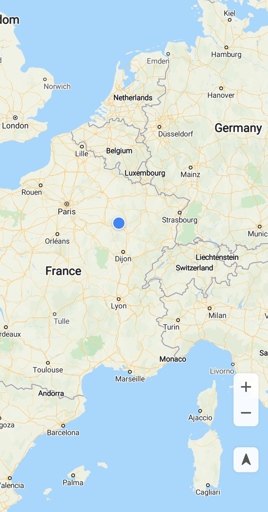
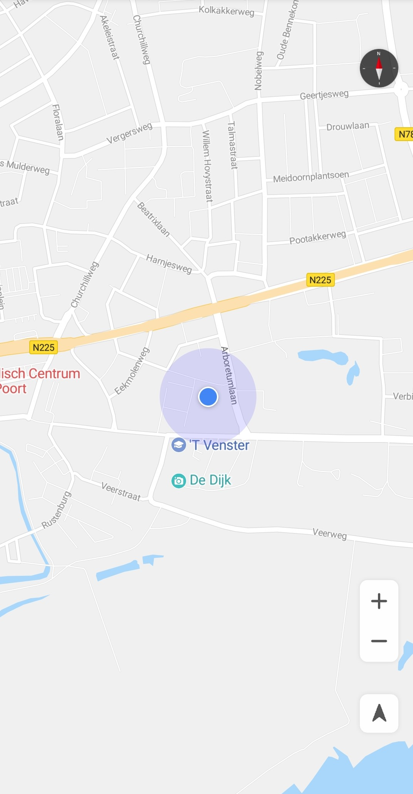

# 我的位置<a name="ZH-CN_TOPIC_0000001145541061"></a>

您可以开启“我的位置”功能向用户展示他们在地图上的当前位置，在使用该功能之前，请先确保您已申请定位权限。Android提供了两种位置权限：ACCESS\_COARSE\_LOCATION（粗略的位置权限）和ACCESS\_FINE\_LOCATION（精确的位置权限）。

1.  需要在Manifest文件中申请权限：

    ```
    <!--允许程序通过Wi-Fi或移动基站的方式获取用户粗略的经纬度信息-->
    <uses-permission android:name="android.permission.ACCESS_COARSE_LOCATION"/>
    <!--允许程序通过GPS芯片接收卫星的定位信息-->
    <uses-permission android:name="android.permission.ACCESS_FINE_LOCATION"/>
    ```

2.  在Manifest中添加后，还要在代码中动态申请一下权限（Android 6.0危险权限要求）：

    示例代码如下：

    ```
    Java
    // 如果API Level大于等于23，即Android版本在6.0及以上，则需要进行动态权限申请
    if (Build.VERSION.SDK_INT >= Build.VERSION_CODES.M) {
        Log.i(TAG, "sdk >= 23 M");
        // 检查您的应用是否具有给定的权限，以及该权限对应的App Ops是否被允许
        if (ActivityCompat.checkSelfPermission(this,
            Manifest.permission.ACCESS_FINE_LOCATION) != PackageManager.PERMISSION_GRANTED
            || ActivityCompat.checkSelfPermission(this,
                Manifest.permission.ACCESS_COARSE_LOCATION) != PackageManager.PERMISSION_GRANTED) {
            // 请求授予此应用程序的权限
            String[] strings =
                {Manifest.permission.ACCESS_FINE_LOCATION, Manifest.permission.ACCESS_COARSE_LOCATION};
            // 请求授予权限
            ActivityCompat.requestPermissions(this, strings, 1);
        }
    }
    ```

    ```
    Kotlin
    // 如果API Level大于等于23，即Android版本在6.0及以上，则需要进行动态权限申请
    if (Build.VERSION.SDK_INT >= Build.VERSION_CODES.M) {
        Log.i(TAG, "sdk >= 23 M")
        // 检查您的应用是否具有给定的权限，以及该权限对应的App Ops是否被允许
        if (ActivityCompat.checkSelfPermission(this,
                        Manifest.permission.ACCESS_FINE_LOCATION) != PackageManager.PERMISSION_GRANTED
                || ActivityCompat.checkSelfPermission(this,
                        Manifest.permission.ACCESS_COARSE_LOCATION) != PackageManager.PERMISSION_GRANTED) {
            // 请求授予此应用程序的权限
            val strings = arrayOf(Manifest.permission.ACCESS_FINE_LOCATION, Manifest.permission.ACCESS_COARSE_LOCATION)
            // 请求授予权限
            ActivityCompat.requestPermissions(this, strings, 1)
        }
    }
    ```

3.  调用[HuaweiMap](zh-cn_topic_0000001145941019.md)对象的[setMyLocationEnabled](zh-cn_topic_0000001145941019.md#section672514559310)\(true\)方法以启用“我的位置“功能。

    示例代码如下：

    ```
    Java
    @RequiresPermission(allOf = {ACCESS_FINE_LOCATION, ACCESS_WIFI_STATE})
    @Override
    public void onMapReady(HuaweiMap map){
        hMap = map;
        // 启用我的位置图层
        hMap.setMyLocationEnabled(true);       
        // 启用我的位置按钮
        hMap.getUiSettings().setMyLocationButtonEnabled(true);        
     }   
    ```

    ```
    Kotlin
    @RequiresPermission(allOf = [ACCESS_FINE_LOCATION, ACCESS_WIFI_STATE])
    override fun onMapReady(map: HuaweiMap) {
        hMap = map
        // 启用我的位置图层
        hMap.isMyLocationEnabled = true
        // 启用我的位置按钮
        hMap.uiSettings.isMyLocationButtonEnabled = true
    }
    ```


在开启该功能后，“我的位置“按钮默认显示在地图的右下角，用户的定位会以蓝色圆点的形式呈现（[图1](#fig1016514588443)）。 当用户点击该按钮时，如果获取到用户的位置，将会在屏幕中心显示当前定位（[图2](#fig1769214112511)）。如果您设置了“我的位置”按钮侦听器，用户点击“我的位置”按钮时，会通过调用[HuaweiMap.OnMyLocationButtonClickListener](zh-cn_topic_0000001099181254.md)的[onMyLocationButtonClick](zh-cn_topic_0000001099181254.md#section2082520410519)\(\)接口回调。

您也可以通过调用[HuaweiMap.getUiSettings](zh-cn_topic_0000001145941019.md#section86721421145920)\(\)方法返回[UiSettings](zh-cn_topic_0000001099181290.md)类的对象，并通过该对象的[setMyLocationButtonEnabled](zh-cn_topic_0000001099181290.md#section1530742525919)\(false\)方法来隐藏“我的位置”按钮。

<a name="table14596175075614"></a>
<table><tbody><tr id="row10596125019560"><td class="row-nocellborder" style="border:none" valign="top" width="50%"><div class="fignone" id="fig1016514588443"><a name="fig1016514588443"></a><a name="fig1016514588443"></a><span class="figcap"><b>图1 </b>点击“我的位置”前</span><br><a name="image1916610580444"></a><a name="image1916610580444"></a><span></span></div>
</td>
<td class="cellrowborder" style="border:none" valign="top" width="50%"><div class="fignone" id="fig1769214112511"><a name="fig1769214112511"></a><a name="fig1769214112511"></a><span class="figcap"><b>图2 </b>点击“我的位置”后</span></div>
<p id="p57941322313"><a name="p57941322313"></a><a name="p57941322313"></a><a name="image18337165374510"></a><a name="image18337165374510"></a><span></span></p>
</td>
</tr>
</tbody>
</table>

