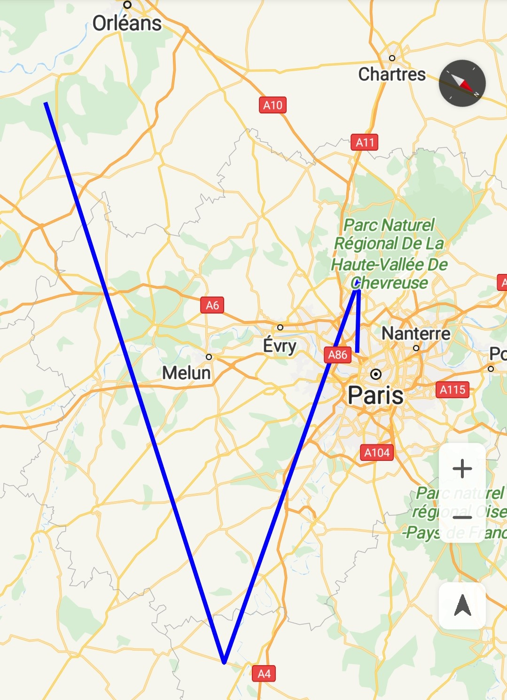
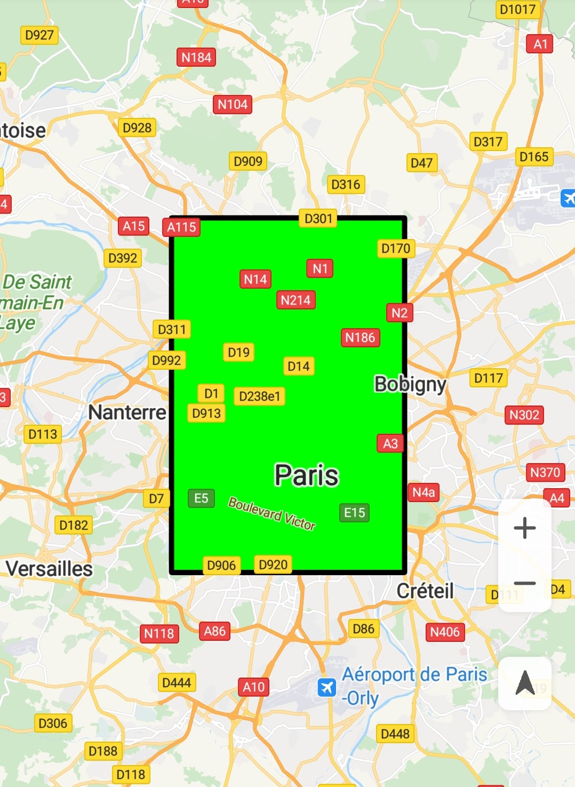
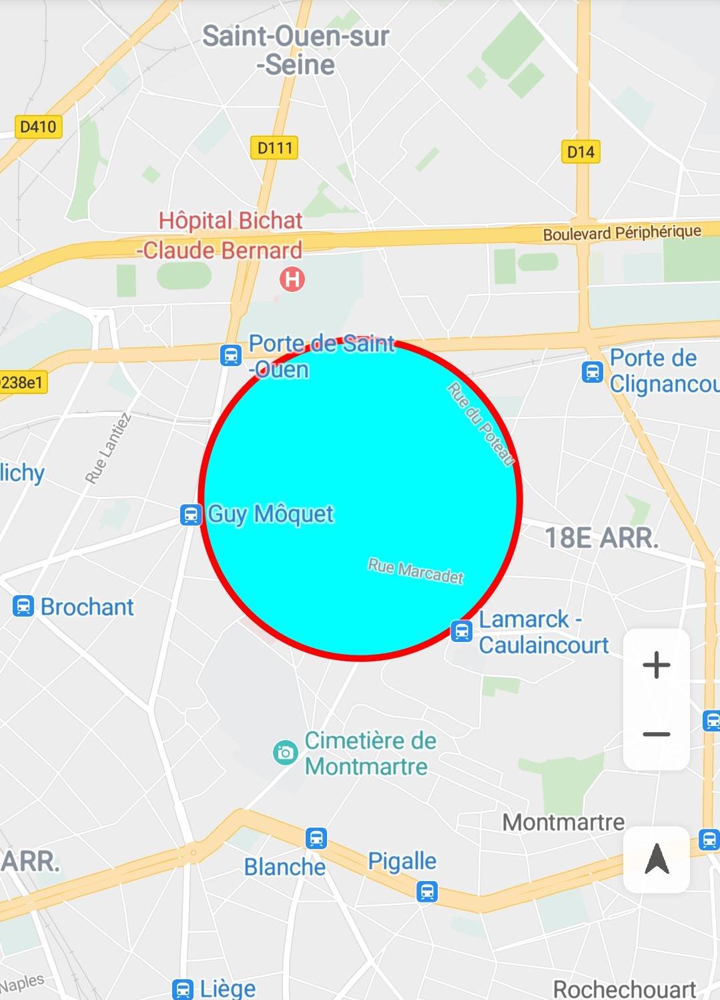

# 形状<a name="ZH-CN_TOPIC_0000001145941025"></a>

-   [折线](#section560466432)
-   [多边形](#section155271581344)
-   [圆](#section2377174811517)
-   [修改外观](#section146121926101416)
    -   [线条颜色](#section1613184651510)
    -   [填充颜色](#section877044371718)
    -   [线条样式](#section2262121514198)
    -   [顶点类型](#section1089813572209)


华为地图SDK支持为地图添加形状，主要包括三种形状：[Polyline](zh-cn_topic_0000001099501082.md)、[Polygon ](zh-cn_topic_0000001145941057.md)、[Circle](zh-cn_topic_0000001099661042.md)。

## 折线<a name="section560466432"></a>

[Polyline](zh-cn_topic_0000001099501082.md)由若干个[LatLng](zh-cn_topic_0000001099661098.md)对象连接形成的折线。

1.  创建折线对象，如[图1](#fig166135213579)所示。如果您要在添加折线后更改折线的形状，可以调用[Polyline](zh-cn_topic_0000001099501082.md)对象的[setPoints](zh-cn_topic_0000001099501082.md#section1721284615510)\(\)方法并为折线提供新的点列表。

    示例代码如下：

    ```
    Java
    // 如果hMap为null，程序停止执行
    if (null == hMap) {
        return;
    }
    // 如果mPolyline不为null，则先从地图上移除，再置为null
    if (null != mPolyline) {
        mPolyline.remove();
        mPolyline = null;
    }
    // 在地图上添加一条折线
    mPolyline = hMap.addPolyline(new PolylineOptions()
        // 折线坐标
        .add(new LatLng(47.893478, 2.334595), new LatLng(48.993478, 3.434595),
                    new LatLng(48.693478, 2.134595), new LatLng(48.793478, 2.334595))
        // 折线颜色
        .color(Color.BLUE)
        // 折线宽度
        .width(3));
    ```

    ```
    Kotlin
    // 如果hMap为null，程序停止执行
    if (null == hMap) {
        return
    }
    // 如果mPolyline不为null，则先从地图上移除，再置为null
    if (null != mPolyline) {
        mPolyline?.remove()
        mPolyline = null
    }
    // 在地图上添加一条折线
    mPolyline = hMap.addPolyline(PolylineOptions()
            // 折线坐标
            .add(LatLng(47.893478, 2.334595), LatLng(48.993478, 3.434595),
                    LatLng(48.693478, 2.134595), LatLng(48.793478, 2.334595))
            // 折线颜色
            .color(Color.BLUE)
            // 折线宽度
            .width(3f))
    ```

2.  折线点击事件。

    可以通过调用[Polyline](zh-cn_topic_0000001099501082.md)对象的[setClickable](zh-cn_topic_0000001099501082.md#section114084419112)\(boolean\)方法来启用和禁用可点击性。要在地图上设置此侦听器，请调用[HuaweiMap](zh-cn_topic_0000001145941019.md)对象的[setOnPolylineClickListener](zh-cn_topic_0000001145941019.md#section15655107591)\([HuaweiMap.OnPolylineClickListener](zh-cn_topic_0000001145781007.md)\)方法。

    示例代码如下：

    ```
    Java
    // 设置折线可点击
    mPolyline.setClickable(true);  
    
    hMap.setOnPolylineClickListener(new HuaweiMap.OnPolylineClickListener() {
        @Override
        public void onPolylineClick(Polyline polyline) {
            Toast.makeText(getApplicationContext(), "Polyline is clicked.", Toast.LENGTH_LONG).show();
        }
    });
    ```

    ```
    Kotlin
    // 设置折线可点击
    mPolyline?.isClickable = true
    
    hMap.setOnPolylineClickListener { Toast.makeText(applicationContext, "Polyline is clicked.", Toast.LENGTH_LONG).show() }
    ```

    **图 1**  折线<a name="fig166135213579"></a>  
    


## 多边形<a name="section155271581344"></a>

[Polygon ](zh-cn_topic_0000001145941057.md)对象与[Polyline](zh-cn_topic_0000001099501082.md)对象类似，因为它们都是由一系列有序坐标组成，但是不同的是，多边形是内部填充的封闭形状。

1.  创建多边形对象，如[图2](#fig10338167596)所示。要在添加多边形后更改多边形的形状，可以调用[Polygon ](zh-cn_topic_0000001145941057.md)对象的[setPoints](zh-cn_topic_0000001145941057.md#section1826199122616)\(\)方法并为多边形的轮廓提供新的点列表。

    示例代码如下：

    ```
    Java
    if (null == hMap) {
        return;
    }
    if (null != mPolygon) {
        mPolygon.remove();
        mPolygon = null;
    }
    
    mPolygon = hMap
        .addPolygon(new PolygonOptions().addAll(createRectangle(new LatLng(48.893478, 2.334595), 0.1, 0.1))
            .fillColor(Color.GREEN)
            .strokeColor(Color.BLACK));
    ```

    ```
    Kotlin
    if (null == hMap) {
        return
    }
    if (null != mPolygon) {
        mPolygon?.remove()
        mPolygon = null
    }
    
    mPolygon = hMap
            .addPolygon(PolygonOptions().addAll(createRectangle(LatLng(48.893478, 2.334595), 0.1, 0.1))
                    .fillColor(Color.GREEN)
                    .strokeColor(Color.BLACK))
    ```

    其中createRectangle\(\)方法的实现如下：

    示例代码如下：

    ```
    Java
    private List<LatLng> createRectangle(LatLng center, double halfWidth, double halfHeight) {
        return Arrays.asList(new LatLng(center.latitude - halfHeight, center.longitude - halfWidth),
            new LatLng(center.latitude - halfHeight, center.longitude + halfWidth),
            new LatLng(center.latitude + halfHeight, center.longitude + halfWidth),
            new LatLng(center.latitude + halfHeight, center.longitude - halfWidth));
    }
    ```

    ```
    Kotlin
    private fun createRectangle(center: LatLng, halfWidth: Double, halfHeight: Double): List<LatLng> {
        return listOf(LatLng(center.latitude - halfHeight, center.longitude - halfWidth),
                LatLng(center.latitude - halfHeight, center.longitude + halfWidth),
                LatLng(center.latitude + halfHeight, center.longitude + halfWidth),
                LatLng(center.latitude + halfHeight, center.longitude - halfWidth))
    }
    ```

2.  多边形点击事件。默认情况下，多边形不可点击。可以通过调用[Polygon](zh-cn_topic_0000001145941057.md)对象的[setClickable](zh-cn_topic_0000001145941057.md#section151966234239)\(boolean\)方法来启用和禁用可点击性。要在地图上设置此侦听器，需调用[HuaweiMap](zh-cn_topic_0000001145941019.md)对象的[setOnPolygonClickListener](zh-cn_topic_0000001145941019.md#section1893435314811)\([HuaweiMap.OnPolygonClickListener](zh-cn_topic_0000001145860947.md)\)方法。

    示例代码如下：

    ```
    Java
    // 设置多边形可点击
    mPolygon.setClickable(true);   
    
    hMap.setOnPolygonClickListener(new HuaweiMap.OnPolygonClickListener() {
        @Override
        public void onPolygonClick(Polygon polygon) {
            Toast.makeText(getApplicationContext(), "Polygon is clicked.", Toast.LENGTH_LONG).show();
        }
    });
    ```

    ```
    Kotlin
    // 设置多边形可点击
    mPolygon?.isClickable = true
    
    hMap.setOnPolygonClickListener { Toast.makeText(applicationContext, "Polygon is clicked.", Toast.LENGTH_LONG).show() }
    ```

    **图 2**  多边形<a name="fig10338167596"></a>  
    


## 圆<a name="section2377174811517"></a>

圆包括两种情况，一种是实心圆，一种是空心圆。默认是空心圆，可以用[Circle](zh-cn_topic_0000001099661042.md)属性进行控制。

1.  创建圆对象，如[图3](#fig2041315152014)所示。如果您需要在添加圆后更改[Circle](zh-cn_topic_0000001099661042.md)的属性，可以调用[Circle](zh-cn_topic_0000001099661042.md)对象的[setCenter](zh-cn_topic_0000001099661042.md#section1187515316454)\(\)、[setRadius](zh-cn_topic_0000001099661042.md#section1594183211467)\(\)等方法进行重新设置。

    示例代码如下：

    ```
    Java
    if (null == hMap) {
        return;
    }
    if (null != mCircle) {
        mCircle.remove();
        mCircle = null;
    }
    
    mCircle = hMap.addCircle(new CircleOptions()
            .center(new LatLng(48.893478, 2.334595))
            .radius(500)
            .fillColor(Color.GREEN));
    ```

    ```
    Kotlin
    if (null == hMap) {
        return
    }
    if (null != mCircle) {
        mCircle?.remove()
        mCircle = null
    }
    mCircle = hMap.addCircle(CircleOptions()
            .center(LatLng(48.893478, 2.334595))
            .radius(500.0)
            .fillColor(Color.GREEN))
    ```

2.  圆点击事件。

    默认情况下[Circle](zh-cn_topic_0000001099661042.md)不可点击。 您可以通过使用[CircleOptions.clickable](zh-cn_topic_0000001145781041.md#section4279958496)\(boolean\)然后调用[HuaweiMap](zh-cn_topic_0000001145941019.md)对象的[addCircle](zh-cn_topic_0000001145941019.md#section7603022114010)\([CircleOptions](zh-cn_topic_0000001145781041.md)\)方法，或通过调用[Circle.setClickable](zh-cn_topic_0000001099661042.md#section066010611466)\(boolean\)来启用和禁用圆的可点击性。

    可以使用[HuaweiMap.OnCircleClickListener](zh-cn_topic_0000001099661084.md)侦听可点击圆上的点击事件。 要在地图上设置此侦听器，请调用[HuaweiMap](zh-cn_topic_0000001145941019.md)对象的[setOnCircleClickListener](zh-cn_topic_0000001145941019.md#section185329145511)\([HuaweiMap.OnCircleClickListener](zh-cn_topic_0000001099661084.md)\)方法。

    用户点击圆时，您将收到[onCircleClick](zh-cn_topic_0000001099661084.md#section07842151362)\([Circle](zh-cn_topic_0000001099661042.md)\)方法的回调。

    示例代码如下：

    ```
    Java
    if (null != mCircle) {
        // 设置圆可点击
        mCircle.setClickable(true);  
    
        hMap.setOnCircleClickListener(new HuaweiMap.OnCircleClickListener() {
            @Override
            public void onCircleClick(Circle circle) {
                if (circle.equals(mCircle)) {
                    Toast.makeText(getApplicationContext(), "Circle is clicked.", Toast.LENGTH_LONG).show();
                }
            }
        });
    }
    ```

    ```
    Kotlin
    if (null != mCircle) {
        // 设置圆可点击
        mCircle?.isClickable = true
    
        hMap.setOnCircleClickListener { circle ->
            if (circle == mCircle) {
                Toast.makeText(applicationContext, "Circle is clicked.", Toast.LENGTH_LONG).show()
            }
        }
    }
    ```

3.  设置空心圆。

    示例代码如下：

    ```
    Java
    // 设置圆的填充色为透明色
    mCircle.setFillColor(Color.TRANSPARENT);  
    // 设置圆的边缘颜色
    mCircle.setStrokeColor(strokeColor);  
    // 设置圆的边缘宽度
    mCircle.setStrokeWidth(strokeWidth);
    ```

    ```
    Kotlin
    // 设置圆的填充色为透明色
    mCircle?.fillColor = Color.TRANSPARENT  
    // 设置圆的边缘颜色
    mCircle?.setStrokeColor(strokeColor) 
    // 设置圆的边缘宽度 
    mCircle?.setStrokeWidth(strokeWidth) 
    ```

    **图 3**  圆<a name="fig2041315152014"></a>  
    


## 修改外观<a name="section146121926101416"></a>

### 线条颜色<a name="section1613184651510"></a>

华为地图SDK中支持设置[Polyline](zh-cn_topic_0000001099501082.md)、[Polygon ](zh-cn_topic_0000001145941057.md)、[Circle](zh-cn_topic_0000001099661042.md)的颜色。

示例代码：

-   多边形：

    示例代码如下：

    ```
    Java
    // 在地图上添加一个多边形mPolygon
    Polygon mPolygon = hMap.addPolygon(new PolygonOptions().add(new LatLng(48.793478, 2.234595), new LatLng(48.793478, 2.434595), new LatLng(48.993478, 2.434595), new LatLng(48.993478, 2.234595)));
    // 设置多边形mPolygon的边框颜色为红色
    mPolygon.setStrokeColor(Color.RED);
    ```

    ```
    Kotlin
    // 在地图上添加一个多边形mPolygon
    val mPolygon: Polygon = hMap.addPolygon(PolygonOptions()
            .add(LatLng(48.793478, 2.234595), LatLng(48.793478, 2.434595)
                    , LatLng(48.993478, 2.434595), LatLng(48.993478, 2.234595)))
    // 设置多边形mPolygon的边框颜色为红色
    mPolygon.strokeColor = Color.RED
    ```

-   圆：

    示例代码如下：

    ```
    Java
    // 在地图上添加一个圆mCircle
    Circle mCircle = hMap.addCircle(new CircleOptions()
        // 设置圆心坐标
        .center(new LatLng(48.893478, 2.334595))
        // 设置圆的半径
        .radius(500));
    // 设置圆mCircle的边框颜色为红色
    mCircle.setStrokeColor(Color.RED);
    ```

    ```
    Kotlin
    // 在地图上添加一个圆mCircle
    val mCircle = hMap.addCircle(CircleOptions()
        // 设置圆心坐标
        .center(LatLng(48.893478, 2.334595))
        // 设置圆的半径
        .radius(500.0))
    // 设置圆mCircle的边框颜色为红色
    mCircle.strokeColor = Color.RED
    ```

-   折线：

    示例代码如下：

    ```
    Java
    // 在地图上添加一个折线mPolyline
    Polyline mPolyline = hMap.addPolyline(new PolylineOptions().add(new LatLng(47.893478, 2.334595),
            new LatLng(48.993478, 3.434595), new LatLng(48.693478, 2.134595), new LatLng(48.793478, 2.334595)));
    // 设置折线mPolyline的颜色为红色
    mPolyline.setColor(Color.RED);
    // 设置折线mPolyline的宽度为10像素
    mPolyline.setWidth(10);
    ```

    ```
    Kotlin
    // 在地图上添加一个折线mPolyline
    val mPolyline = hMap.addPolyline(PolylineOptions().add(LatLng(47.893478, 2.334595),
            LatLng(48.993478, 3.434595), LatLng(48.693478, 2.134595), LatLng(48.793478, 2.334595)))
    // 设置折线mPolyline的颜色为红色
    mPolyline.color = Color.RED
    // 设置折线mPolyline的宽度为10像素
    mPolyline.width = 10f
    ```


### 填充颜色<a name="section877044371718"></a>

可设置[Polygon](zh-cn_topic_0000001145941057.md)和[Circle](zh-cn_topic_0000001099661042.md)的填充颜色。

-   多边形：

    示例代码如下：

    ```
    Java
    Polygon mPolygon = hMap.addPolygon(new PolygonOptions().add(new LatLng(48.793478, 2.234595), new LatLng(48.793478, 2.434595), new LatLng(48.993478, 2.434595), new LatLng(48.993478, 2.234595)));
    mPolygon.setFillColor(Color.GREEN);
    ```

    ```
    Kotlin
    val mPolygon: Polygon = hMap.addPolygon(PolygonOptions().add(LatLng(48.793478, 2.234595),
            LatLng(48.793478, 2.434595), LatLng(48.993478, 2.434595), LatLng(48.993478, 2.234595)))
    mPolygon.fillColor = Color.GREEN
    ```

-   圆形：

    示例代码如下：

    ```
    Java
    Circle mCircle = hMap.addCircle(new CircleOptions().center(new LatLng(48.893478, 2.334595)).radius(500));
    mCircle.setFillColor(Color.GREEN);
    ```

    ```
    Kotlin
    val mCircle = hMap.addCircle(CircleOptions().center(LatLng(48.893478, 2.334595)).radius(500.0))
    mCircle.fillColor = Color.GREEN
    ```


### 线条样式<a name="section2262121514198"></a>

华为地图SDK支持设置边框样式：[Dash](zh-cn_topic_0000001099661038.md)、[Dot](zh-cn_topic_0000001099341062.md)、[Gap](zh-cn_topic_0000001145781017.md)，下面代码以设置折线样式为例：

示例代码如下：

```
Java
List<PatternItem> linePattern = new ArrayList<>();
PatternItem dash = new Dash(100);
linePattern.add(dash);
PatternItem dot = new Dot();
linePattern.add(dot);
PatternItem gap = new Gap(40);
linePattern.add(gap);

mPolyline = hMap.addPolyline(new PolylineOptions().add(new LatLng(47.893478, 2.334595), new LatLng(48.993478, 3.434595), new LatLng(48.693478, 2.134595), new LatLng(48.793478, 2.334595)));
mPolyline.setPattern(linePattern);
```

```
Kotlin
val linePattern: MutableList<PatternItem> = ArrayList()
val dash: PatternItem = Dash(100f)
linePattern.add(dash)
val dot: PatternItem = Dot()
linePattern.add(dot)
val gap: PatternItem = Gap(40f)
linePattern.add(gap)
 
mPolyline = hMap.addPolyline(PolylineOptions().add(LatLng(47.893478, 2.334595), LatLng(48.993478, 3.434595),
        LatLng(48.693478, 2.134595), LatLng(48.793478, 2.334595)))
mPolyline?.pattern = linePattern
```

### 顶点类型<a name="section1089813572209"></a>

华为地图SDK支持设置折线的顶点类型：[ButtCap](zh-cn_topic_0000001099661106.md)、[CustomCap](zh-cn_topic_0000001145541115.md)、[RoundCap](zh-cn_topic_0000001145941061.md)、[SquareCap](zh-cn_topic_0000001145781049.md)。

示例代码如下：

```
Java
mPolyline = hMap.addPolyline(new PolylineOptions().add(new LatLng(47.893478, 2.334595), new LatLng(48.993478, 3.434595), new LatLng(48.693478, 2.134595), new LatLng(48.793478, 2.334595)));

// 设置折线的起始顶点为方形
mPolyline.setStartCap(new ButtCap());
// 设置折线的末端顶点为半圆形
mPolyline.setEndCap(new RoundCap());
```

```
Kotlin
mPolyline = hMap.addPolyline(PolylineOptions().add(LatLng(47.893478, 2.334595), LatLng(48.993478, 3.434595),
        LatLng(48.693478, 2.134595), LatLng(48.793478, 2.334595)))
        
// 设置折线的起始顶点为方形
mPolyline?.startCap = ButtCap()
// 设置折线的末端顶点为半圆形
mPolyline?.endCap = RoundCap()
```

