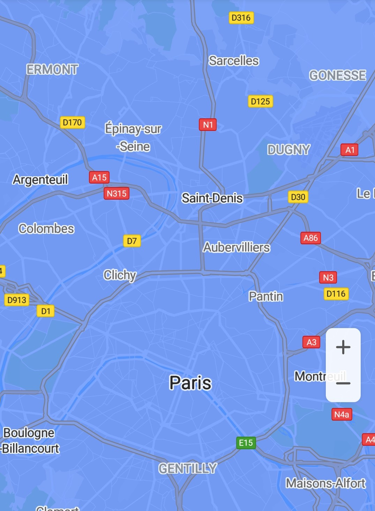

# 瓦片图层<a name="ZH-CN_TOPIC_0000001099661040"></a>

-   [添加瓦片图层](#section640719722315)
-   [修改瓦片图层](#section187306651717)
-   [移除瓦片图层](#section883032813179)

瓦片图层是显示在基础地图瓦片上方的图像集合。

## 添加瓦片图层<a name="section640719722315"></a>

1.  创建[TileProvider](zh-cn_topic_0000001099661066.md)对象并重写[getTile](zh-cn_topic_0000001099661066.md#section44133551418)\(\)方法以构造瓦片图层。

    示例代码如下：

    ```
    Java
    // 设置瓦片的大小为256*256
    int mTileSize = 256; 
    final int mScale = 1; 
    final int mDimension = mScale * mTileSize; 
     
    // 创建TileProvider对象，以本地生成瓦片为例
    TileProvider mTileProvider = new TileProvider() { 
        @Override 
        public Tile getTile(int x, int y, int zoom) {
              Matrix matrix = new Matrix();
              float scale = (float) Math.pow(2, zoom) * mScale;
              matrix.postScale(scale, scale);
              matrix.postTranslate(-x * mDimension, -y * mDimension);
              
              // 生成Bitmap图片
              final Bitmap bitmap = Bitmap.createBitmap(mDimension, mDimension, Bitmap.Config.RGB_565);
              bitmap.eraseColor(Color.parseColor("#024CFF"));
              ByteArrayOutputStream stream = new ByteArrayOutputStream();
              bitmap.compress(Bitmap.CompressFormat.PNG, 100, stream);
              return new Tile(mDimension, mDimension, stream.toByteArray());
    } };
    ```

    ```
    Kotlin
    // 设置瓦片的大小为256*256
    val mTileSize = 256
    val mScale = 1
    val mDimension = mScale * mTileSize
     
    // 创建TileProvider对象，以本地生成瓦片为例
    val mTileProvider = TileProvider { x, y, zoom ->
        val matrix = Matrix()
        val scale = 2.0.pow(zoom.toDouble()).toFloat() * mScale
        matrix.postScale(scale, scale)
        matrix.postTranslate((-x * mDimension).toFloat(), (-y * mDimension).toFloat())
        
        // 生成Bitmap图片
        val bitmap = Bitmap.createBitmap(mDimension, mDimension, Bitmap.Config.RGB_565)
        bitmap.eraseColor(Color.parseColor("#024CFF"))
        val stream = ByteArrayOutputStream()
        bitmap.compress(Bitmap.CompressFormat.PNG, 100, stream)
        Tile(mDimension, mDimension, stream.toByteArray())
    }
    ```

2.  创建[TileOverlayOptions](zh-cn_topic_0000001145541101.md)对象来确定瓦片图层、透明度、透明度更改时淡入淡出动画等属性。

    示例代码如下：

    ```
    Java
    TileOverlayOptions options =
        new TileOverlayOptions().tileProvider(mTileProvider).transparency(0.5f).fadeIn(true);
    ```

    ```
    Kotlin
    val options = TileOverlayOptions().tileProvider(mTileProvider).transparency(0.5f).fadeIn(true)
    ```

3.  通过[HuaweiMap](zh-cn_topic_0000001145941019.md)对象的[addTileOverlay](zh-cn_topic_0000001145941019.md#section12241957204519)\([TileOverlayOptions](zh-cn_topic_0000001145541101.md)\)方法添加瓦片图层，如[图1](#fig12306183623114)所示，该方法将返回该[TileOverlay](zh-cn_topic_0000001099341092.md)对象。

    示例代码如下：

    ```
    Java
    mTileOverlay = hMap.addTileOverlay(options);
    ```

    ```
    Kotlin
    mTileOverlay = hMap.addTileOverlay(options)
    ```

    **图 1**  瓦片图层<a name="fig12306183623114"></a>  
    


## 修改瓦片图层<a name="section187306651717"></a>

华为地图SDK支持在添加瓦片图层之后，修改已经设置的瓦片图层属性。

示例代码如下：

```
Java
// 设置瓦片图层透明度
if (null != mTileOverlay) {
    mTileOverlay.setTransparency(0.3f);
}

// 关闭瓦片图层淡入动画
if (null != mTileOverlay) {
    mTileOverlay.setFadeIn(false);
}

// 设置瓦片图层不可见
if (null != mTileOverlay) {
    mTileOverlay.setVisible(false);
}
```

```
Kotlin
// 设置瓦片图层透明度
if (null != mTileOverlay) {
    mTileOverlay?.transparency = 0.3f
}
 
// 关闭瓦片图层淡入动画
if (null != mTileOverlay) {
    mTileOverlay?.fadeIn = false
}
 
// 设置瓦片图层不可见 
if (null != mTileOverlay) {
    mTileOverlay?.isVisible = false
}
```

## 移除瓦片图层<a name="section883032813179"></a>

当不需要瓦片图层时，你可以调用以下方法移除图层：

示例代码如下：

```
Java
if (null != mTileOverlay) {
    mTileOverlay.remove();
}
```

```
Kotlin
if (null != mTileOverlay) {
    mTileOverlay?.remove()
}
```

如果瓦片图层指示的图块变得“陈旧”，例如图块改变，您可以调用[clearTileCache](zh-cn_topic_0000001099341092.md#section1976495145817)\(\)强制刷新，重新加载此瓦片图层上的所有图块。

示例代码如下：

```
Java
if (null != mTileOverlay) {
    mTileOverlay.clearTileCache();
}
```

```
Kotlin
if (null != mTileOverlay) {
    mTileOverlay?.clearTileCache()
}
```

