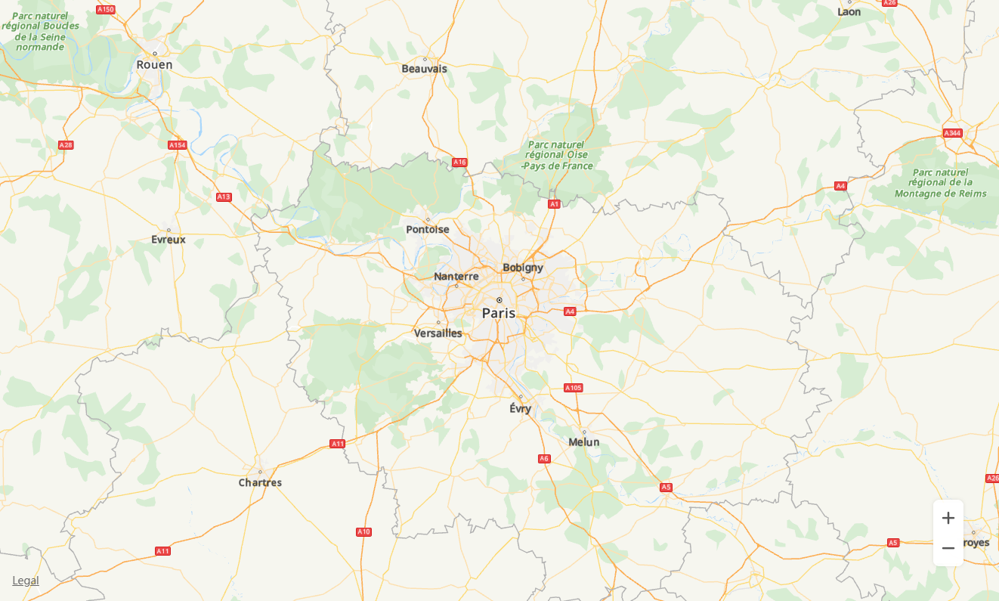

# 创建地图<a name="ZH-CN_TOPIC_0000001145941075"></a>

本章节将向您介绍通过华为地图API for JavaScript创建一个简单的网页地图。

1.  创建一个HTML文件，并在文件头声明以下内容，以支持大多数浏览器。

    ```
    <!DOCTYPE html>
    ```

2.  在head标签对里添加style标签对，来设置容器样式大小。

    ```
    <head>
        <meta charset="UTF-8">
        <style>
            #map {
                height: 800px;
                width: 80%;
                margin: 0 auto;
            }
        </style>
    </head>
    ```

3.  引入华为地图API文件，其中key要经过URL转码。API Key的获取请参见[获取API Key](javascript-api-preparations.md#section175508543353)。

    ```
    <script src="https://mapapi.cloud.huawei.com/mapjs/v1/api/js?callback=initMap&key=API KEY"></script>
    ```

4.  在body内部创建地图容器元素。

    ```
    <body>
    <div id="map"></div>
    </body>
    ```

    创建初始化地图的脚本，如下创建了以巴黎为中心，缩放系数为8的地图。可通过[MapOptions](zh-cn_topic_0000001145860979.md#s08ea7a96339f4dcf82f72b0e4bad2db5)的sourceType设置地图加载时使用的瓦片类型，支持vector（矢量）或raster（栅格）。

    ```
    <script>
        function initMap() {
            var mapOptions = {};
            mapOptions.center = {lat: 48.856613, lng: 2.352222};
            mapOptions.zoom = 8;
            mapOptions.language='ENG';
            // 设置地图加载时使用栅格瓦片类型
            mapOptions.sourceType = 'raster';
            var map = new HWMapJsSDK.HWMap(document.getElementById('map'), mapOptions);
        }
    </script>
    ```

    效果如[图1](#fig13741235114514)所示：

    **图 1**  创建地图<a name="fig13741235114514"></a>  
    

    


