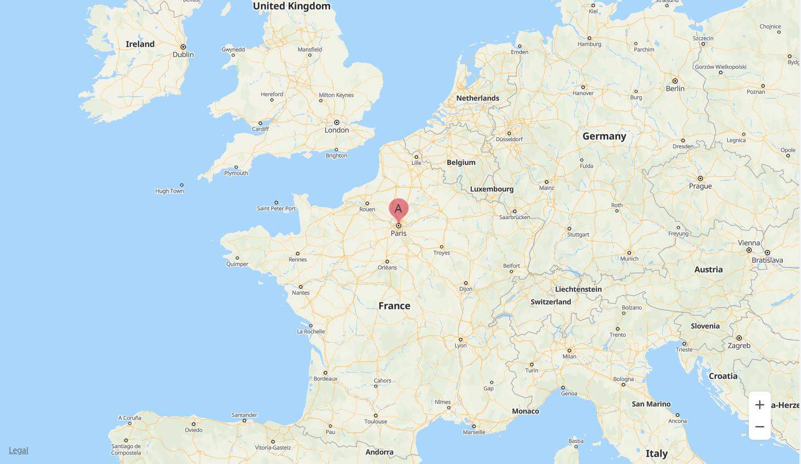
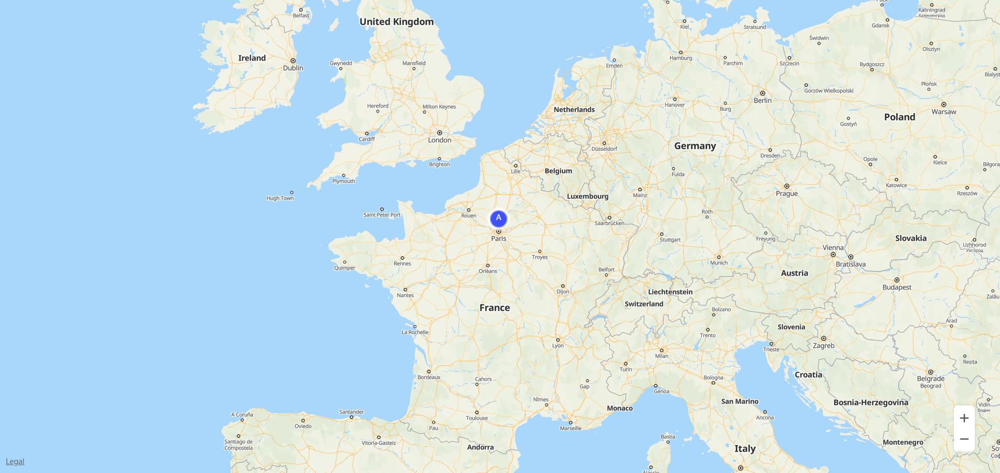

# 标记<a name="ZH-CN_TOPIC_0000001099181276"></a>

-   [添加标记](#section12463812181214)
-   [自定义标记](#section885013431413)
-   [删除标记](#section14900115661616)
-   [修改标记](#section632714275188)
-   [标记事件](#section105643583181)

用户可以在地图的指定位置添加标记以标识位置、商家、建筑等，并可以通过信息窗口展示详细信息。

## 添加标记<a name="section12463812181214"></a>

用户可以使用HWMapJsSDK.[HWMarker](zh-cn_topic_0000001099501040.md)\([MarkerOptions](zh-cn_topic_0000001099501040.md#s67824205da3b446bab1a730521ffa1d1)\)构造方法创建一个标记添加到地图上，示例代码如下：

```
var map;
var mMarker;

// 启动脚本的回调函数
function initMap() {
    var mapOptions = {};
    mapOptions.center = {lat: 48.856613, lng: 2.352222};
    mapOptions.zoom = 5;
    
    // 初始化地图
    map = new HWMapJsSDK.HWMap(document.getElementById('map'), mapOptions);

    // 初始化marker标记
    mMarker = new HWMapJsSDK.HWMarker({
        map: map,
        position: {lat: 48.85, lng: 2.35},
        zIndex: 10,
        label: {
            text: 'A',
            offsetY: -30,
            fontSize: '20px'
        },
        icon: {
            opacity: 0.5,
            scale: 1.2,
        }
    });
}
```

以上代码在48.85°N，2.35°E的位置上添加了一个label为“A”图标透明度为0.5的标记，如[图1](#fig15876161442011)所示：

**图 1**  标记<a name="fig15876161442011"></a>  




关于MarkOptions支持的自定义属性见[MarkerOptions](zh-cn_topic_0000001099501040.md#s67824205da3b446bab1a730521ffa1d1)。

## 自定义标记<a name="section885013431413"></a>

用户可以通过icon设置自定义图标，代码如下：

```
mMarker = new HWMapJsSDK.HWMarker({
    map: map,
    position: {lat: 48.85, lng: 2.35},
    label: {
        text: 'A',
        color: '#ffffff',
    },
    icon: {
        scale: 2,
        url: 'location-marker.png'
    }
});
```

自定义标记如[图2](#fig45411343182118)所示：

**图 2**  自定义标记<a name="fig45411343182118"></a>  




## 删除标记<a name="section14900115661616"></a>

要从地图中移除标记，请调用setMap\(\)方法并将null作为传递参数。

```
mMarker.setMap(null);
```

请注意，上述方法不会删除标记，它只是把标记从地图上移除。如果您希望删除标记，则应将其从地图上移除，然后将标记本身置为null即可。

```
mMarker.setMap(null);
mMarker = null;
```

## 修改标记<a name="section632714275188"></a>

用户可以通过[HWMarker](zh-cn_topic_0000001099501040.md)对象的方法对属性进行修改，以下代码示例修改Marker的position：

```
<tr>
    <td>Marker Lat:</td>
    <td><input id="markerLatInput" type="text" value="48"/></td>
</tr>
<tr>
    <td>Marker Lng:</td>
    <td><input id="markerLngInput" type="text" value="1.5"/></td>
</tr>

var lat = Number(document.getElementById("markerLatInput").value);
var lng = Number(document.getElementById("markerLngInput").value);
mMarker.setPosition({lat: lat, lng: lng});
```

标记的以下属性支持自定义，具体请参见[HWMarker](zh-cn_topic_0000001099501040.md)。

<a name="table27370548"></a>
<table><thead align="left"><tr id="row20758774"><th class="cellrowborder" valign="top" width="40%" id="mcps1.1.3.1.1"><p id="p3739106"><a name="p3739106"></a><a name="p3739106"></a><strong id="b14281539191018"><a name="b14281539191018"></a><a name="b14281539191018"></a>属性</strong></p>
</th>
<th class="cellrowborder" valign="top" width="60%" id="mcps1.1.3.1.2"><p id="p34432195"><a name="p34432195"></a><a name="p34432195"></a><strong id="b18301239101011"><a name="b18301239101011"></a><a name="b18301239101011"></a>含义</strong></p>
</th>
</tr>
</thead>
<tbody><tr id="row39603122"><td class="cellrowborder" valign="top" width="40%" headers="mcps1.1.3.1.1 "><p id="p53736309"><a name="p53736309"></a><a name="p53736309"></a>setIcon(icon)</p>
</td>
<td class="cellrowborder" valign="top" width="60%" headers="mcps1.1.3.1.2 "><p id="p57673781"><a name="p57673781"></a><a name="p57673781"></a>设置标记的图标。</p>
</td>
</tr>
<tr id="row49301983"><td class="cellrowborder" valign="top" width="40%" headers="mcps1.1.3.1.1 "><p id="p34037668"><a name="p34037668"></a><a name="p34037668"></a>setLabel(label)</p>
</td>
<td class="cellrowborder" valign="top" width="60%" headers="mcps1.1.3.1.2 "><p id="p5587738"><a name="p5587738"></a><a name="p5587738"></a>设置标记的标签。</p>
</td>
</tr>
<tr id="row50289647"><td class="cellrowborder" valign="top" width="40%" headers="mcps1.1.3.1.1 "><p id="p46929584"><a name="p46929584"></a><a name="p46929584"></a>setPosition(position)</p>
</td>
<td class="cellrowborder" valign="top" width="60%" headers="mcps1.1.3.1.2 "><p id="p43199991"><a name="p43199991"></a><a name="p43199991"></a>设置在标记位置。</p>
</td>
</tr>
<tr id="row6109849143010"><td class="cellrowborder" valign="top" width="40%" headers="mcps1.1.3.1.1 "><p id="p191101949123020"><a name="p191101949123020"></a><a name="p191101949123020"></a>setZIndex(zIndex)</p>
</td>
<td class="cellrowborder" valign="top" width="60%" headers="mcps1.1.3.1.2 "><p id="p411034953016"><a name="p411034953016"></a><a name="p411034953016"></a>设置Z指数。</p>
</td>
</tr>
</tbody>
</table>

## 标记事件<a name="section105643583181"></a>

HWMarker支持多种事件回调，如下表所示，具体请参见[HWMarker](zh-cn_topic_0000001099501040.md)。

<a name="table45438767"></a>
<table><thead align="left"><tr id="row52187928"><th class="cellrowborder" valign="top" width="40%" id="mcps1.1.3.1.1"><p id="p66472641"><a name="p66472641"></a><a name="p66472641"></a><strong id="b1384074791018"><a name="b1384074791018"></a><a name="b1384074791018"></a>事件</strong></p>
</th>
<th class="cellrowborder" valign="top" width="60%" id="mcps1.1.3.1.2"><p id="p15574875"><a name="p15574875"></a><a name="p15574875"></a><strong id="b14862447171017"><a name="b14862447171017"></a><a name="b14862447171017"></a>含义</strong></p>
</th>
</tr>
</thead>
<tbody><tr id="row5956154"><td class="cellrowborder" valign="top" width="40%" headers="mcps1.1.3.1.1 "><p id="p12686464"><a name="p12686464"></a><a name="p12686464"></a>click</p>
</td>
<td class="cellrowborder" valign="top" width="60%" headers="mcps1.1.3.1.2 "><p id="p20970634"><a name="p20970634"></a><a name="p20970634"></a>鼠标点击。</p>
</td>
</tr>
<tr id="row54517980"><td class="cellrowborder" valign="top" width="40%" headers="mcps1.1.3.1.1 "><p id="p53880264"><a name="p53880264"></a><a name="p53880264"></a>dbclick</p>
</td>
<td class="cellrowborder" valign="top" width="60%" headers="mcps1.1.3.1.2 "><p id="p2225260"><a name="p2225260"></a><a name="p2225260"></a>鼠标双击。</p>
</td>
</tr>
<tr id="row20027347"><td class="cellrowborder" valign="top" width="40%" headers="mcps1.1.3.1.1 "><p id="p11602431"><a name="p11602431"></a><a name="p11602431"></a>icon_changed</p>
</td>
<td class="cellrowborder" valign="top" width="60%" headers="mcps1.1.3.1.2 "><p id="p272888"><a name="p272888"></a><a name="p272888"></a>icon改变。</p>
</td>
</tr>
<tr id="row2455997"><td class="cellrowborder" valign="top" width="40%" headers="mcps1.1.3.1.1 "><p id="p64718035"><a name="p64718035"></a><a name="p64718035"></a>mousedown</p>
</td>
<td class="cellrowborder" valign="top" width="60%" headers="mcps1.1.3.1.2 "><p id="p7669482"><a name="p7669482"></a><a name="p7669482"></a>鼠标按下。</p>
</td>
</tr>
<tr id="row1916477"><td class="cellrowborder" valign="top" width="40%" headers="mcps1.1.3.1.1 "><p id="p21016952"><a name="p21016952"></a><a name="p21016952"></a>mouseup</p>
</td>
<td class="cellrowborder" valign="top" width="60%" headers="mcps1.1.3.1.2 "><p id="p24651527"><a name="p24651527"></a><a name="p24651527"></a>鼠标放开。</p>
</td>
</tr>
<tr id="row20537154"><td class="cellrowborder" valign="top" width="40%" headers="mcps1.1.3.1.1 "><p id="p52896747"><a name="p52896747"></a><a name="p52896747"></a>position_changed</p>
</td>
<td class="cellrowborder" valign="top" width="60%" headers="mcps1.1.3.1.2 "><p id="p56778076"><a name="p56778076"></a><a name="p56778076"></a>位置改变。</p>
</td>
</tr>
</tbody>
</table>

以下代码示例为鼠标点击事件侦听，要在地图上设置此侦听器，请调用[HWMarker](zh-cn_topic_0000001099501040.md)对象的addListener\('click', callback\)方法：

```
mMarker.addListener('click', () => {
    alert("On Marker Click!");
});
```

