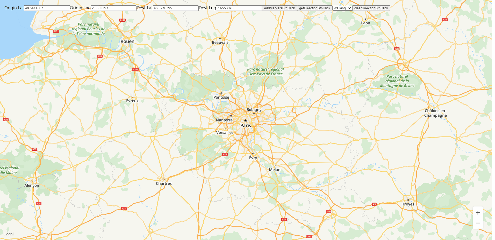
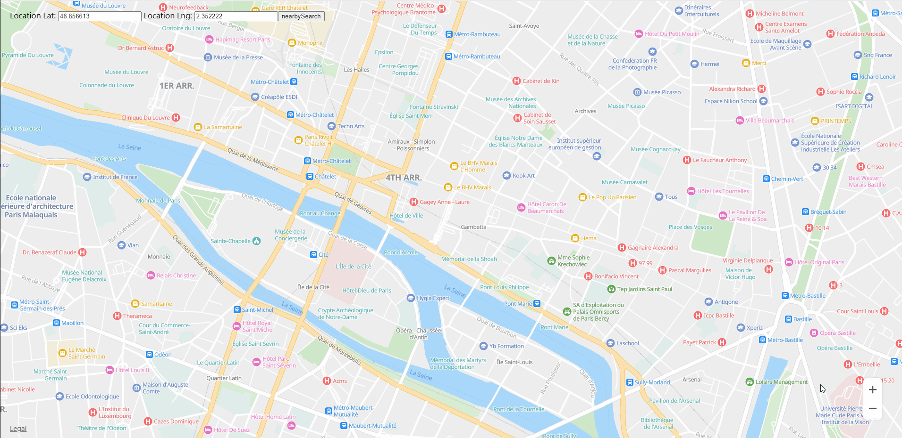

# 功能体验<a name="ZH-CN_TOPIC_0000001099501076"></a>

-   [展示地图](#section18864112713553)
-   [地图交互](#section263094616568)
-   [路径规划](#section16261105114564)
-   [关键字搜索](#section090215513567)
-   [周边搜索](#section11521106574)

## 展示地图<a name="section18864112713553"></a>


```
<html>
<title>Huawei Maps Basic Demo</title>

<head>
  <meta charset="utf-8">
  <meta content="width=device-width,initial-scale=1.0,minimum-scale=1.0,shrink-to-fit=no" name="viewport">
  <style>
    html,body{
      margin: 0;
      padding: 0;
      height: 100%;
      width: 100%;
    }
    #map {
      height: 100%;
      width: 100%;
      margin: 0 auto;
    }
  </style>
  <script src="https://mapapi.cloud.huawei.com/mapjs/v1/api/js?callback=initMap&key=api_key"></script>

</head>

<body>
<div id="map"></div>
<script>
  function initMap() {
    var mapOptions = {};
    mapOptions.center = {lat: 48.856613, lng: 2.352222};
    mapOptions.zoom = 2;
    var map = new HWMapJsSDK.HWMap(document.getElementById('map'), mapOptions);
  }
</script>
</body>

</html>
```

## 地图交互<a name="section263094616568"></a>


```
<html>
<title>Huawei Maps Basic Interaction</title>
<head>
  <meta charset="utf-8">
  <meta content="width=device-width,initial-scale=1.0,minimum-scale=1.0,shrink-to-fit=no" name="viewport">
  <style>
    html,body{
      margin: 0;
      padding: 0;
      height: 100%;
      width: 100%;
    }
    #map {
      height: 100%;
      width: 100%;
      margin: 0 auto;
    }
  </style>
  <script src="https://mapapi.cloud.huawei.com/mapjs/v1/api/js?callback=initMap&key=api_key"></script>
</head>

<body>
<div id="map"></div>
<script>
  function initMap() {
    var mapOptions = {};
    mapOptions.center = {lat: 48.856613, lng: 2.352222};
    mapOptions.zoom = 10;
    // 设置显示比例尺
    mapOptions.scaleControl = true;
    mapOptions.scaleControlOptions = {
      // 设置比例尺单位为英制英寸
      units: "nautical"
    };
    mapOptions.zoomSlider = true;
    mapOptions.rotateControl = true;
    mapOptions.navigationControl = true;
    mapOptions.copyrightControl = false;
    // 设置版权内容
    mapOptions.copyrightControlOptions = {value: "<font style='position: absolute;left:50px;bottom:20px;z-index: 101' size='5' color='red'>HUAWEI</font>", }
    mapOptions.locationControl = true;

    var map = new HWMapJsSDK.HWMap(document.getElementById('map'), mapOptions);
  }
</script>
</body>

</html>
```

## 路径规划<a name="section16261105114564"></a>



```
<html>
<title>Huawei Maps Basic Demo</title>
<head>
  <meta charset="utf-8">
  <meta content="width=device-width,initial-scale=1.0,minimum-scale=1.0,shrink-to-fit=no" name="viewport">
  <style>
    html,
    body {
      margin: 0;
      padding: 0;
      height: 100%;
      width: 100%;
    }
    #map {
      height: 100vh;
      width: 100vw;
      margin: 0 auto;
    }
  </style>
  <script src="https://mapapi.cloud.huawei.com/mapjs/v1/api/js?callback=initMap&key=api_key"></script>
</head>

<body>
<div id="map"></div>
<div style="position: absolute;left: 20px;top: 20px;">
  <span>Origin Lat</span>
  <input type="text" id="originLatInput" value="48.5414567">
  <span>Origin Lng</span>
  <input type="text" id="originLngInput" value="2.0660293">
  <span>Dest Lat</span>
  <input type="text" id="destLatInput" value="48.5276295">
  <span>Dest Lng</span>
  <input type="text" id="destLngInput" value="2.6553976">
  <button onclick="addMarkersBtnClick()">addMarkersBtnClick</button>
  <button onclick="getDirectionBtnClick()">getDirectionBtnClick</button>
  <select id="routeTypeSelect">
    <option value="1">Walking</option>
    <option value="2">Bicycling</option>
    <option value="3">Driving</option>
  </select>
  <button onclick="clearDirectionBtnClick()">clearDirectionBtnClick</button>
</div>
<script>
  var map;
  var directionsService;
  var directionsRenderer;
  var makerOrigin, makerDestination;
  var originLat = Number(document.getElementById("originLatInput").value);
  var originLng = Number(document.getElementById("originLngInput").value);
  var destLat = Number(document.getElementById("destLatInput").value);
  var destLng = Number(document.getElementById("destLngInput").value);

  function initMap() {
    directionsService = new HWMapJsSDK.HWDirectionsService();
    directionsRenderer = new HWMapJsSDK.HWDirectionsRenderer();
    directionsRenderer.setOptions({
      strokeColor: '#0000EE',
      strokeWeight: 5,
    })
    var mapOptions = {};
    mapOptions.center = {lat: 48.856613, lng: 2.352222};
    mapOptions.zoom = 8;
    mapOptions.language = 'ENG';

    map = new HWMapJsSDK.HWMap(document.getElementById('map'), mapOptions);
    directionsRenderer.setMap(map);
  }

  function addMarkersBtnClick() {

    firstMarker = new HWMapJsSDK.HWMarker({
      map: map,
      position: {lat: originLat, lng: originLng},
      label: 'Origin'
    });

    secondMarker = new HWMapJsSDK.HWMarker({
      map: map,
      position: {lat: destLat, lng: destLng},
      label: 'Destination'
    });
  }
  function getDirectionBtnClick() {
    // 创建路径规划请求体 
    var DirectionsRequest = {};
    DirectionsRequest.origin = {
      lat: originLat,
      lng: originLng
    };
    DirectionsRequest.destination = {
      lat: destLat,
      lng: destLng
    };
    var routeType = document.getElementById("routeTypeSelect").value;
    if (routeType == 1) {
      directionsService.routeWalking(DirectionsRequest, renderMap);
    } else if (routeType == 2) {
      directionsService.routeBicycling(DirectionsRequest, renderMap);
    } else if (routeType == 3) {
      DirectionsRequest.alternatives = 'true';
      directionsService.routeDriving(DirectionsRequest, renderMap);
    }
  }
  function renderMap(DirectionsResult, DirectionsStatus) {
    if (DirectionsStatus == '0') {
      const sw = DirectionsResult.routes[0].bounds.southwest;
      const ne = DirectionsResult.routes[0].bounds.northeast;
      const bounds = {
        sw,
        ne
      };
      map.fitBounds(bounds);
      map.zoomOut();
      renderedDirections = directionsRenderer.setDirections(DirectionsResult);
    }
  }

  function clearDirectionBtnClick() {
    if (renderedDirections != null && renderedDirections.length != 0) {
      for (var i = 0; i < renderedDirections.length; i++) {
        renderedDirections[i].setMap(null);
      }
    }
  }
</script>
</body>
</html>
```

## 关键字搜索<a name="section090215513567"></a>


```
<html>
<title>Huawei Maps Basic Demo</title>
<head>
  <meta charset="utf-8">
  <meta content="width=device-width,initial-scale=1.0,minimum-scale=1.0,shrink-to-fit=no" name="viewport">
  <style>
    html,
    body {
      margin: 0;
      padding: 0;
      height: 100%;
      width: 100%;
    }
    #map {
      height: 100%;
      width: 100%;
      margin: 0 auto;
    }
  </style>
  <script src="https://mapapi.cloud.huawei.com/mapjs/v1/api/js?callback=initMap&key=api_key"></script>
</head>

<body>
<div id="map"></div>
<div style="position: absolute;left: 20px;top: 20px;">
  <input id="queryInput" type="text">
  <button onclick="searchByTextBtnClick()">searchByText</button>
</div>
<script>
  var map;
  var directionsService;
  var directionsRenderer;
  var makerOrigin, makerDestination;
  // 创建路径规划请求体
  var DirectionsRequest = {};
  DirectionsRequest.origin = {
    lat: 48.86,
    lng: 2.36
  };
  DirectionsRequest.destination = {
    lat: 49.18,
    lng: 0.39
  };

  function initMap() {
    directionsService = new HWMapJsSDK.HWDirectionsService();
    directionsRenderer = new HWMapJsSDK.HWDirectionsRenderer();

    var mapOptions = {};
    mapOptions.center = {lat: 48.856613, lng: 2.352222};
    mapOptions.zoom = 8;
    mapOptions.language = 'ENG';
    map = new HWMapJsSDK.HWMap(document.getElementById('map'), mapOptions);
  }

  function searchByTextBtnClick() {
    var text = document.getElementById('queryInput').value;
    var siteService;
    // 初始化HWSiteService对象
    siteService = new HWMapJsSDK.HWSiteService();
    // 初始化请求参数对象

    var request = {
      query: text
    };

    // 调用搜索接口，result为返回结果，status为返回状态
    siteService.searchByText(request, function (result, status) {
      if (status == '0') {
        for (var i = 0; i < result.sites.length; i++) {
          // 在地图上添加标记
          var marker = new HWMapJsSDK.HWMarker({
            map: map,
            position: {lat: result.sites[i].location.lat, lng: result.sites[i].location.lng},
            label: result.sites[i].name
          });
        }
        // 设置地图的中心点
        map.setCenter({lat: result.sites[0].location.lat, lng: result.sites[0].location.lng});
      }
    });
  }

</script>
</body>

</html>
```

## 周边搜索<a name="section11521106574"></a>



```
<html>
<title>Huawei Maps Basic Demo</title>
<head>
  <meta charset="utf-8">
  <meta content="width=device-width,initial-scale=1.0,minimum-scale=1.0,shrink-to-fit=no" name="viewport">
  <style>
    html,
    body {
      margin: 0;
      padding: 0;
      height: 100%;
      width: 100%;
    }
    #map {
      height: 100%;
      width: 100%;
      margin: 0 auto;
    }
  </style>
  <script src="https://mapapi.cloud.huawei.com/mapjs/v1/api/js?callback=initMap&key=api_key"></script>
</head>

<body>
<div id="map"></div>
<div style="position: absolute;left: 20px;top: 20px;">
  <label for="locationLatInput">Location Lat: </label><input id="locationLatInput" type="text" value="48.893478">
  <label for="locationLngInput">Location Lng: </label><input id="locationLngInput" type="text" value="2.334595">
  <button onclick="nearbySearchBtnClick()">nearbySearch</button>
</div>
<script>
  var map;
  function initMap() {
    var mapOptions = {};
    mapOptions.center = {lat: 48.856613, lng: 2.352222};
    mapOptions.zoom = 15;
    map = new HWMapJsSDK.HWMap(document.getElementById('map'), mapOptions);
  }

  function nearbySearchBtnClick() {
    var lat = Number(document.getElementById('locationLatInput').value);
    var lng = Number(document.getElementById('locationLngInput').value);
    var siteService
    // 初始化HWSiteService对象
    siteService = new HWMapJsSDK.HWSiteService();
    // 初始化请求参数对象
    var request = {
      location: {
        lat: lat,
        lng: lng
      }
    };
    // 调用搜索接口，result为返回结果，status为返回状态
    siteService.nearbySearch(request, function (result, status) {
      if (status == '0') {
        for (var i = 0; i < result.sites.length; i++) {
          // 在地图上添加标记
          var marker = new HWMapJsSDK.HWMarker({
            map: map,
            position: {lat: result.sites[i].location.lat, lng: result.sites[i].location.lng},
            label: result.sites[i].name
          });
        }
        // 设置地图的中心点
        map.setCenter({lat: result.sites[0].location.lat, lng: result.sites[0].location.lng})
      }
    });
  }
</script>
</body>
</html>
```

