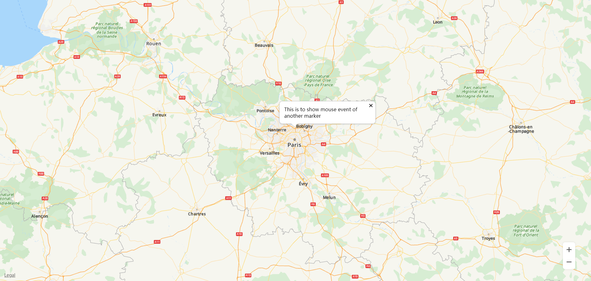
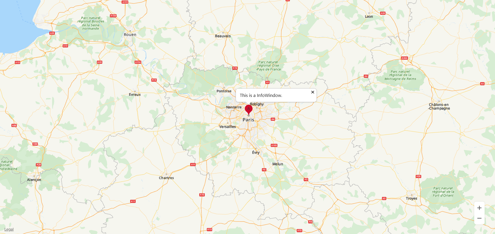

# 信息窗<a name="ZH-CN_TOPIC_0000001145860929"></a>

-   [创建信息窗](#section524717617265)
-   [显示/关闭信息窗](#section966142082619)
-   [信息窗基于Marker显示](#section1710105522616)
-   [修改信息窗](#section17316133011278)
-   [信息窗事件](#section114051839122814)

华为地图SDK支持在地图上显示信息窗。信息窗分为两种，一种是单独显示文本或图像；另一种是基于Marker在标记上方的弹出窗口中显示文本或图像，为标记提供详细信息。

## 创建信息窗<a name="section524717617265"></a>

```
var infoWindow;

function initMap() {
    var mapOptions = {};
    mapOptions.center = {lat: 48.856613, lng: 2.352222};
    mapOptions.zoom = 8;
    var map = new HWMapJsSDK.HWMap(document.getElementById('map'), mapOptions);
    infoWindow = new HWMapJsSDK.HWInfoWindow({
        map,
        position: {lat: 48.856613, lng: 2.352222},
        content: 'This is to show mouse event of another marker',
        offset: [0, -40],
    });
}
```

## 显示/关闭信息窗<a name="section966142082619"></a>

```
// 显示信息窗
function openInfoWindowBtnClick() {
    infoWindow.open();
}
// 关闭信息窗
function closeInfoWindowBtnClick() {
    infoWindow.close();
}
```

以上部分在地图上显示信息窗的效果如[图1](#fig65608528252)所示：

**图 1**  信息窗<a name="fig65608528252"></a>  




## 信息窗基于Marker显示<a name="section1710105522616"></a>

```
var mMarker;
var infoWindow;

function initMap() {
    var mapOptions = {};
    mapOptions.center = {lat: 48.856613, lng: 2.352222};
    mapOptions.zoom = 8;

    var map = new HWMapJsSDK.HWMap(document.getElementById('map'), mapOptions);

    // 初始化marker标记
    mMarker = new HWMapJsSDK.HWMarker({
        map,
        position: {lat: 48.856613, lng: 2.352222},
        label: 'A',
    });

    // 初始化信息窗
    infoWindow = new HWMapJsSDK.HWInfoWindow({
        map,
        position: 10,
        content: 'This is a InfoWindow.',
        offset: [0, -40],
    });
    // 在标记为A的marker处打开一个信息窗
    infoWindow.open(mMarker);

    // 监听点击marker打开一个信息窗
    mMarker.addListener('click', () => {
        infoWindow.open(mMarker);
    });
}
```

以上代码在地图上显示标记及信息窗的效果如[图2](#fig13454163992613)所示：

**图 2**  标记信息窗<a name="fig13454163992613"></a>  




## 修改信息窗<a name="section17316133011278"></a>

用户可以通过[HWInfoWindow](zh-cn_topic_0000001099341112.md)对象的方法对属性进行修改，以下代码示例修改InfoWindow的显示文本：

```
<tr>
    <td>Content:</td>
    <td><input id="contentInput" type="text" value="This is a new content test..."/></td>
</tr>
<script>
    let content = document.getElementById("contentInput").value;
    infoWindow.setContent(content);

    // 信息窗的点击关闭事件
    infoWindow.addListener('close', () => {
        alert("Info window close...");
    });
</script>
```

信息窗的以下属性支持自定义，具体请参见[HWInfoWindow](zh-cn_topic_0000001099341112.md)。

<a name="table39627941"></a>
<table><thead align="left"><tr id="row38468094"><th class="cellrowborder" valign="top" width="40%" id="mcps1.1.3.1.1"><p id="p28907944"><a name="p28907944"></a><a name="p28907944"></a><strong id="b181143814126"><a name="b181143814126"></a><a name="b181143814126"></a>属性</strong></p>
</th>
<th class="cellrowborder" valign="top" width="60%" id="mcps1.1.3.1.2"><p id="p59842155"><a name="p59842155"></a><a name="p59842155"></a><strong id="b0211438111219"><a name="b0211438111219"></a><a name="b0211438111219"></a>含义</strong></p>
</th>
</tr>
</thead>
<tbody><tr id="row1708485"><td class="cellrowborder" valign="top" width="40%" headers="mcps1.1.3.1.1 "><p id="p4169567"><a name="p4169567"></a><a name="p4169567"></a>setContent(content)</p>
</td>
<td class="cellrowborder" valign="top" width="60%" headers="mcps1.1.3.1.2 "><p id="p2190629"><a name="p2190629"></a><a name="p2190629"></a>设置信息窗的文本内容。</p>
</td>
</tr>
<tr id="row19715669"><td class="cellrowborder" valign="top" width="40%" headers="mcps1.1.3.1.1 "><p id="p53465353"><a name="p53465353"></a><a name="p53465353"></a>setPosition(position)</p>
</td>
<td class="cellrowborder" valign="top" width="60%" headers="mcps1.1.3.1.2 "><p id="p35726366"><a name="p35726366"></a><a name="p35726366"></a>设置信息窗的显示坐标。</p>
</td>
</tr>
</tbody>
</table>

## 信息窗事件<a name="section114051839122814"></a>

用户可以设置信息窗关闭事件的侦听，要在地图上设置此侦听器，请调用[HWInfoWindow](zh-cn_topic_0000001099341112.md)对象的addListener\('close', callback\)方法：

```
infoWindow.addListener('close', () => {
    alert("Info window close...");
});
```

