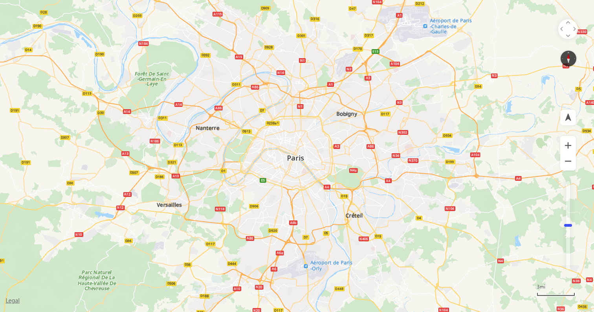

# 地图控件<a name="ZH-CN_TOPIC_0000001099341106"></a>

-   [比例尺](#section988124265618)
-   [缩放条](#section6315812115816)
-   [缩放按钮](#section162650185595)
-   [指北针](#section16392171500)
-   [平移按钮](#section1013965220018)
-   [版权](#section3292622119)
-   [我的位置](#section540885012112)

地图控件指华为地图上负责与地图交互的UI控件。华为地图提供了丰富的UI控件，包括比例尺、缩放条、缩放按钮、指北针、平移按钮和版权，如[图1](#fig2114301467)所示：

**图 1**  地图控件<a name="fig2114301467"></a>  




## 比例尺<a name="section988124265618"></a>

比例尺，可以使用scaleControl来控制是否显示比例尺，并通过scaleControlOptions设置比例尺的单位。默认为false，表示不显示。如果值为true，则显示在地图的右下角。

```
var mapOptions = {};
mapOptions.center = {lat: 48.856613, lng: 2.352222};
mapOptions.zoom = 10;
// 设置显示比例尺
mapOptions.scaleControl = true; 
mapOptions.scaleControlOptions = {
	// 设置比例尺单位为英制英寸
	units: "imperial" 
};
```

## 缩放条<a name="section6315812115816"></a>

缩放条，可以使用zoomSlider来控制是否显示缩放拉条。默认为false，表示不显示。如果值为true，则显示在地图的右下方。

```
var mapOptions = {};
mapOptions.center = {lat: 48.856613, lng: 2.352222};
mapOptions.zoom = 10;
// 设置显示缩放条
mapOptions.zoomSlider = true;      
```

## 缩放按钮<a name="section162650185595"></a>

缩放按钮，可以使用zoomControl设置是否显示缩放按钮，默认为true，显示在地图的右下方。

```
var mapOptions = {};
mapOptions.center = {lat: 48.856613, lng: 2.352222};
mapOptions.zoom = 10;
// 设置不显示缩放按钮
mapOptions.zoomControl = false;      
```

## 指北针<a name="section16392171500"></a>

指北针，可以使用rotateControl设置是否显示指北针。默认为false，表示不显示。如果值为true，当地图朝向不是正北方，自动显示在右上角。

```
var mapOptions = {};
mapOptions.center = {lat: 48.856613, lng: 2.352222};
mapOptions.zoom = 10;
// 设置显示指北针
mapOptions.rotateControl= true;      
```

## 平移按钮<a name="section1013965220018"></a>

平移按钮，可以使用navigationControl设置是否显示平移按钮。默认为false，表示不显示。如果值为true，则显示在地图的右上方。

```
var mapOptions = {};
mapOptions.center = {lat: 48.856613, lng: 2.352222};
mapOptions.zoom = 10;
// 设置显示平移按钮
mapOptions.navigationControl= true;       
```

## 版权<a name="section3292622119"></a>

版权，可以使用copyrightControl设置是否显示版权，并且通过copyrightControlOptions自定义版权内容以及样式等。默认为false，表示不显示。

```
var mapOptions = {};
mapOptions.center = {lat: 48.856613, lng: 2.352222};
mapOptions.zoom = 10;
// 设置显示版权
mapOptions.copyrightControl = true;    
// 设置版权内容
mapOptions.copyrightControlOptions = {value: "<font style='position: absolute;left:20px;bottom:20px;z-index: 101' size='5' color='red'>HUAWEI</font>",}
```

## 我的位置<a name="section540885012112"></a>

我的位置，可以使用locationControl设置是否显示我的位置按钮。默认为false，表示不显示。如果值为true，则显示在地图的右下方。（仅支持HTML5的浏览器）

```
var mapOptions = {}; 
mapOptions.center = {lat: 48.856613, lng: 2.352222}; 
mapOptions.zoom = 10; 
// 设置显示我的位置按钮
mapOptions.locationControl= true;       
```

位置控件在各平台浏览器支持情况如下：

<a name="table624mcpsimp"></a>
<table><thead align="left"><tr id="row629mcpsimp"><th class="cellrowborder" valign="top" width="35.38%" id="mcps1.1.4.1.1"><p id="p631mcpsimp"><a name="p631mcpsimp"></a><a name="p631mcpsimp"></a><strong id="b632mcpsimp"><a name="b632mcpsimp"></a><a name="b632mcpsimp"></a>浏览器</strong></p>
</th>
<th class="cellrowborder" valign="top" width="26.14%" id="mcps1.1.4.1.2"><p id="p634mcpsimp"><a name="p634mcpsimp"></a><a name="p634mcpsimp"></a><strong id="b635mcpsimp"><a name="b635mcpsimp"></a><a name="b635mcpsimp"></a>平台</strong></p>
</th>
<th class="cellrowborder" valign="top" width="38.48%" id="mcps1.1.4.1.3"><p id="p91494416136"><a name="p91494416136"></a><a name="p91494416136"></a>实测</p>
</th>
</tr>
</thead>
<tbody><tr id="row637mcpsimp"><td class="cellrowborder" valign="top" width="35.38%" headers="mcps1.1.4.1.1 "><p id="p639mcpsimp"><a name="p639mcpsimp"></a><a name="p639mcpsimp"></a>Chrome 80</p>
</td>
<td class="cellrowborder" valign="top" width="26.14%" headers="mcps1.1.4.1.2 "><p id="p641mcpsimp"><a name="p641mcpsimp"></a><a name="p641mcpsimp"></a>Windows</p>
</td>
<td class="cellrowborder" valign="top" width="38.48%" headers="mcps1.1.4.1.3 "><p id="p1149194131312"><a name="p1149194131312"></a><a name="p1149194131312"></a>支持</p>
</td>
</tr>
<tr id="row642mcpsimp"><td class="cellrowborder" valign="top" width="35.38%" headers="mcps1.1.4.1.1 "><p id="p644mcpsimp"><a name="p644mcpsimp"></a><a name="p644mcpsimp"></a>Chrome 6x</p>
</td>
<td class="cellrowborder" valign="top" width="26.14%" headers="mcps1.1.4.1.2 "><p id="p646mcpsimp"><a name="p646mcpsimp"></a><a name="p646mcpsimp"></a>Windows</p>
</td>
<td class="cellrowborder" valign="top" width="38.48%" headers="mcps1.1.4.1.3 "><p id="p106451434181316"><a name="p106451434181316"></a><a name="p106451434181316"></a>支持</p>
</td>
</tr>
<tr id="row647mcpsimp"><td class="cellrowborder" valign="top" width="35.38%" headers="mcps1.1.4.1.1 "><p id="p649mcpsimp"><a name="p649mcpsimp"></a><a name="p649mcpsimp"></a>Chrome 7x</p>
</td>
<td class="cellrowborder" valign="top" width="26.14%" headers="mcps1.1.4.1.2 "><p id="p651mcpsimp"><a name="p651mcpsimp"></a><a name="p651mcpsimp"></a>Windows</p>
</td>
<td class="cellrowborder" valign="top" width="38.48%" headers="mcps1.1.4.1.3 "><p id="p1518716358136"><a name="p1518716358136"></a><a name="p1518716358136"></a>支持</p>
</td>
</tr>
<tr id="row652mcpsimp"><td class="cellrowborder" valign="top" width="35.38%" headers="mcps1.1.4.1.1 "><p id="p654mcpsimp"><a name="p654mcpsimp"></a><a name="p654mcpsimp"></a>Internet Explorer 10</p>
</td>
<td class="cellrowborder" valign="top" width="26.14%" headers="mcps1.1.4.1.2 "><p id="p656mcpsimp"><a name="p656mcpsimp"></a><a name="p656mcpsimp"></a>Windows</p>
</td>
<td class="cellrowborder" valign="top" width="38.48%" headers="mcps1.1.4.1.3 "><p id="p8149244134"><a name="p8149244134"></a><a name="p8149244134"></a>不支持</p>
</td>
</tr>
<tr id="row657mcpsimp"><td class="cellrowborder" valign="top" width="35.38%" headers="mcps1.1.4.1.1 "><p id="p659mcpsimp"><a name="p659mcpsimp"></a><a name="p659mcpsimp"></a>Internet Explorer 11</p>
</td>
<td class="cellrowborder" valign="top" width="26.14%" headers="mcps1.1.4.1.2 "><p id="p661mcpsimp"><a name="p661mcpsimp"></a><a name="p661mcpsimp"></a>Windows</p>
</td>
<td class="cellrowborder" valign="top" width="38.48%" headers="mcps1.1.4.1.3 "><p id="p191491446136"><a name="p191491446136"></a><a name="p191491446136"></a>不支持</p>
</td>
</tr>
<tr id="row11634122564"><td class="cellrowborder" valign="top" width="35.38%" headers="mcps1.1.4.1.1 "><p id="p108087315620"><a name="p108087315620"></a><a name="p108087315620"></a>Chrome 6x</p>
</td>
<td class="cellrowborder" valign="top" width="26.14%" headers="mcps1.1.4.1.2 "><p id="p133443401414"><a name="p133443401414"></a><a name="p133443401414"></a>macOS</p>
</td>
<td class="cellrowborder" valign="top" width="38.48%" headers="mcps1.1.4.1.3 "><p id="p28096315613"><a name="p28096315613"></a><a name="p28096315613"></a>支持</p>
</td>
</tr>
<tr id="row672mcpsimp"><td class="cellrowborder" valign="top" width="35.38%" headers="mcps1.1.4.1.1 "><p id="p674mcpsimp"><a name="p674mcpsimp"></a><a name="p674mcpsimp"></a>Chrome 7x</p>
</td>
<td class="cellrowborder" valign="top" width="26.14%" headers="mcps1.1.4.1.2 "><p id="p103651246141"><a name="p103651246141"></a><a name="p103651246141"></a>macOS</p>
</td>
<td class="cellrowborder" valign="top" width="38.48%" headers="mcps1.1.4.1.3 "><p id="p141491144138"><a name="p141491144138"></a><a name="p141491144138"></a>支持</p>
</td>
</tr>
<tr id="row682mcpsimp"><td class="cellrowborder" valign="top" width="35.38%" headers="mcps1.1.4.1.1 "><p id="p684mcpsimp"><a name="p684mcpsimp"></a><a name="p684mcpsimp"></a>Chrome 6x</p>
</td>
<td class="cellrowborder" valign="top" width="26.14%" headers="mcps1.1.4.1.2 "><p id="p686mcpsimp"><a name="p686mcpsimp"></a><a name="p686mcpsimp"></a>Android</p>
</td>
<td class="cellrowborder" valign="top" width="38.48%" headers="mcps1.1.4.1.3 "><p id="p2345122155518"><a name="p2345122155518"></a><a name="p2345122155518"></a>支持</p>
</td>
</tr>
<tr id="row687mcpsimp"><td class="cellrowborder" valign="top" width="35.38%" headers="mcps1.1.4.1.1 "><p id="p689mcpsimp"><a name="p689mcpsimp"></a><a name="p689mcpsimp"></a>Chrome 7x</p>
</td>
<td class="cellrowborder" valign="top" width="26.14%" headers="mcps1.1.4.1.2 "><p id="p691mcpsimp"><a name="p691mcpsimp"></a><a name="p691mcpsimp"></a>Android</p>
</td>
<td class="cellrowborder" valign="top" width="38.48%" headers="mcps1.1.4.1.3 "><p id="p1619402313552"><a name="p1619402313552"></a><a name="p1619402313552"></a>支持</p>
</td>
</tr>
<tr id="row692mcpsimp"><td class="cellrowborder" valign="top" width="35.38%" headers="mcps1.1.4.1.1 "><p id="p694mcpsimp"><a name="p694mcpsimp"></a><a name="p694mcpsimp"></a>微信 V7.X.X最新版</p>
</td>
<td class="cellrowborder" valign="top" width="26.14%" headers="mcps1.1.4.1.2 "><p id="p696mcpsimp"><a name="p696mcpsimp"></a><a name="p696mcpsimp"></a>Android</p>
</td>
<td class="cellrowborder" valign="top" width="38.48%" headers="mcps1.1.4.1.3 "><p id="p1150144130"><a name="p1150144130"></a><a name="p1150144130"></a>支持</p>
</td>
</tr>
<tr id="row697mcpsimp"><td class="cellrowborder" valign="top" width="35.38%" headers="mcps1.1.4.1.1 "><p id="p699mcpsimp"><a name="p699mcpsimp"></a><a name="p699mcpsimp"></a>华为浏览器EMUI 9.X</p>
</td>
<td class="cellrowborder" valign="top" width="26.14%" headers="mcps1.1.4.1.2 "><p id="p701mcpsimp"><a name="p701mcpsimp"></a><a name="p701mcpsimp"></a>Android</p>
</td>
<td class="cellrowborder" valign="top" width="38.48%" headers="mcps1.1.4.1.3 "><p id="p31501949133"><a name="p31501949133"></a><a name="p31501949133"></a>支持</p>
</td>
</tr>
<tr id="row702mcpsimp"><td class="cellrowborder" valign="top" width="35.38%" headers="mcps1.1.4.1.1 "><p id="p704mcpsimp"><a name="p704mcpsimp"></a><a name="p704mcpsimp"></a>华为浏览器EMUI 10.X</p>
</td>
<td class="cellrowborder" valign="top" width="26.14%" headers="mcps1.1.4.1.2 "><p id="p706mcpsimp"><a name="p706mcpsimp"></a><a name="p706mcpsimp"></a>Android</p>
</td>
<td class="cellrowborder" valign="top" width="38.48%" headers="mcps1.1.4.1.3 "><p id="p11501043132"><a name="p11501043132"></a><a name="p11501043132"></a>部分支持</p>
</td>
</tr>
<tr id="row707mcpsimp"><td class="cellrowborder" valign="top" width="35.38%" headers="mcps1.1.4.1.1 "><p id="p709mcpsimp"><a name="p709mcpsimp"></a><a name="p709mcpsimp"></a>Safari 12.x</p>
</td>
<td class="cellrowborder" valign="top" width="26.14%" headers="mcps1.1.4.1.2 "><p id="p711mcpsimp"><a name="p711mcpsimp"></a><a name="p711mcpsimp"></a>iOS</p>
</td>
<td class="cellrowborder" valign="top" width="38.48%" headers="mcps1.1.4.1.3 "><p id="p1815014420137"><a name="p1815014420137"></a><a name="p1815014420137"></a>部分支持</p>
</td>
</tr>
<tr id="row712mcpsimp"><td class="cellrowborder" valign="top" width="35.38%" headers="mcps1.1.4.1.1 "><p id="p714mcpsimp"><a name="p714mcpsimp"></a><a name="p714mcpsimp"></a>Safari 13.x</p>
</td>
<td class="cellrowborder" valign="top" width="26.14%" headers="mcps1.1.4.1.2 "><p id="p716mcpsimp"><a name="p716mcpsimp"></a><a name="p716mcpsimp"></a>iOS</p>
</td>
<td class="cellrowborder" valign="top" width="38.48%" headers="mcps1.1.4.1.3 "><p id="p0150124181314"><a name="p0150124181314"></a><a name="p0150124181314"></a>支持</p>
</td>
</tr>
<tr id="row717mcpsimp"><td class="cellrowborder" valign="top" width="35.38%" headers="mcps1.1.4.1.1 "><p id="p719mcpsimp"><a name="p719mcpsimp"></a><a name="p719mcpsimp"></a>Safari 13.x</p>
</td>
<td class="cellrowborder" valign="top" width="26.14%" headers="mcps1.1.4.1.2 "><p id="p721mcpsimp"><a name="p721mcpsimp"></a><a name="p721mcpsimp"></a>macOS</p>
</td>
<td class="cellrowborder" valign="top" width="38.48%" headers="mcps1.1.4.1.3 "><p id="p1728516861412"><a name="p1728516861412"></a><a name="p1728516861412"></a>支持</p>
</td>
</tr>
</tbody>
</table>

> **说明：** 
>地图控件除了可以在创建地图之前设置，也可以在创建地图之后通过set方法设置。

