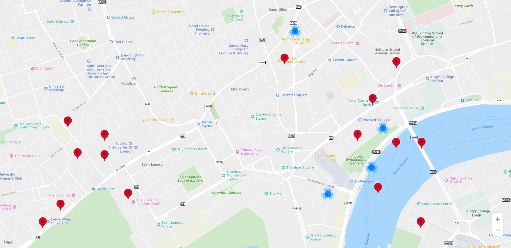
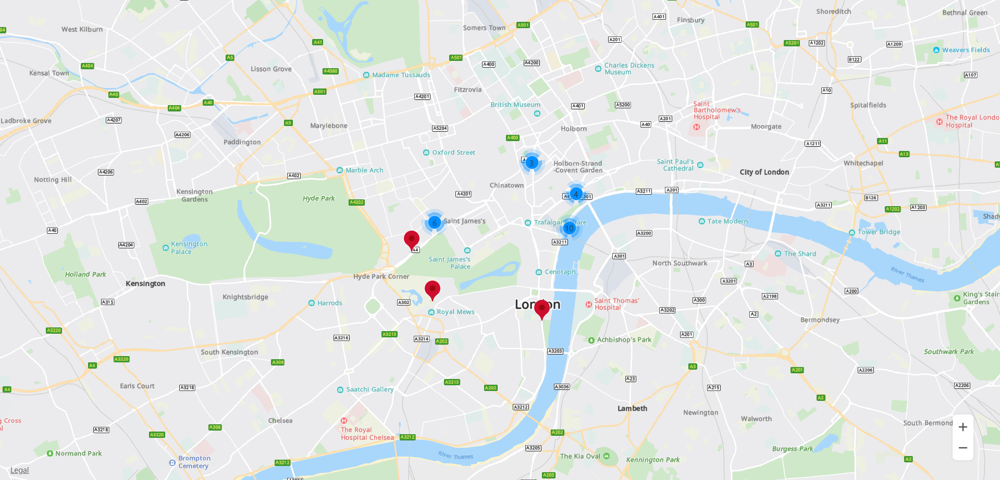
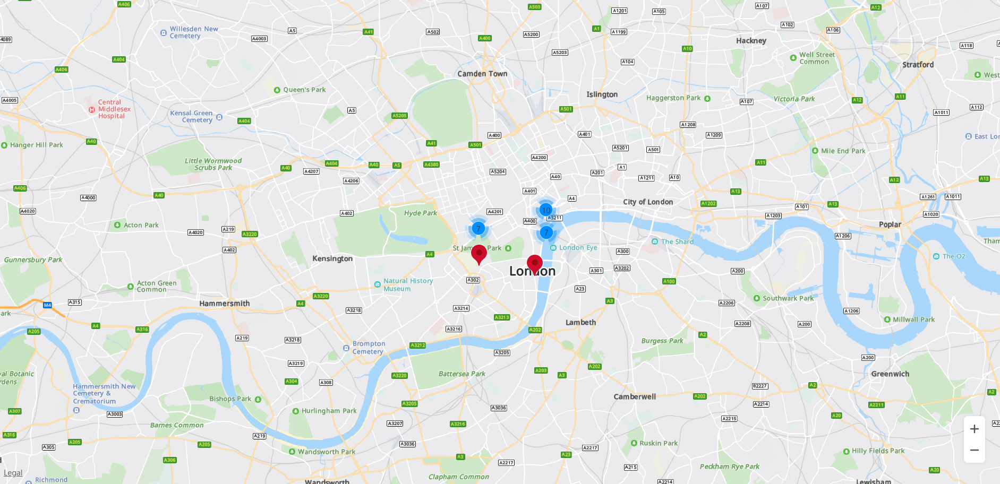

# 标记聚合<a name="ZH-CN_TOPIC_0000001099181238"></a>

-   [添加聚合标记](#section1132145162315)

华为地图SDK支持聚合标记功能，该功能可以有效地管理在地图不同缩放级别情况下的多个标记。当用户以高缩放级别查看地图时，各个标记会显示在地图上；当用户缩小时，标记会聚集成集群，从而使标记的呈现更有序。

## 添加聚合标记<a name="section1132145162315"></a>

```
var map;
var markers = [];
var markerCluster;

var locations =  [
    {lat: 51.5145160, lng: -0.1270060},
    { lat : 51.5064490, lng : -0.1244260 },
    { lat : 51.5097080, lng : -0.1200450 },
    { lat : 51.5090680, lng : -0.1421420 },
    { lat : 51.4976080, lng : -0.1456320 },
    ···
    { lat : 51.5061590, lng : -0.140280 },
    { lat : 51.5047420, lng : -0.1470490 },
    { lat : 51.5126760, lng : -0.1189760 },
    { lat : 51.5108480, lng : -0.1208480 }
];

function initMap() {
    var mapOptions = {};
    mapOptions.center = {lat: 48.856613, lng: 2.352222};
    mapOptions.zoom = 3;

    map = new HWMapJsSDK.HWMap(document.getElementById('map'), mapOptions);
    generateMarkers(locations);

    // 初始化聚合点
    markerCluster = new HWMapJsSDK.HWMarkerCluster(map, markers);
}

// 批量初始化marker
function generateMarkers(locations) {
    for (let i = 0; i < locations.length; i++) {
        var opts = {
            position: locations[i]
        };

        markers.push(new HWMapJsSDK.HWMarker(opts));
    }
}
```

以上代码添加标记聚合的效果在不同缩放级别情况下，分别如[图1](#fig677775415239)、[图2](#fig323221462419)和[图3](#fig835813719241)所示：

<a name="table82432035182312"></a>
<table><tbody><tr id="row1224423522317"><td class="row-nocellborder" style="border:none" valign="top" width="33.33333333333333%"><div class="fignone" id="fig677775415239"><a name="fig677775415239"></a><a name="fig677775415239"></a><span class="figcap"><b>图1 </b>高缩放级别下多标记展示</span></div>
<p id="p13520216123116"><a name="p13520216123116"></a><a name="p13520216123116"></a><a name="image15520191615311"></a><a name="image15520191615311"></a><span></span></p>
</td>
<td class="row-nocellborder" style="border:none" valign="top" width="33.33333333333333%"><div class="fignone" id="fig323221462419"><a name="fig323221462419"></a><a name="fig323221462419"></a><span class="figcap"><b>图2 </b>中缩放级别下多标记展示</span></div>
<p id="p9248151320322"><a name="p9248151320322"></a><a name="p9248151320322"></a><a name="image1424891315325"></a><a name="image1424891315325"></a><span></span></p>
</td>
<td class="cellrowborder" style="border:none" valign="top" width="33.33333333333333%"><div class="fignone" id="fig835813719241"><a name="fig835813719241"></a><a name="fig835813719241"></a><span class="figcap"><b>图3 </b>低缩放级别下多标记展示</span></div>
<p id="p98515393312"><a name="p98515393312"></a><a name="p98515393312"></a><a name="image19851203123310"></a><a name="image19851203123310"></a><span></span></p>
</td>
</tr>
</tbody>
</table>

