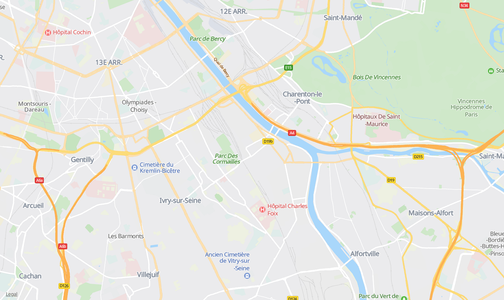
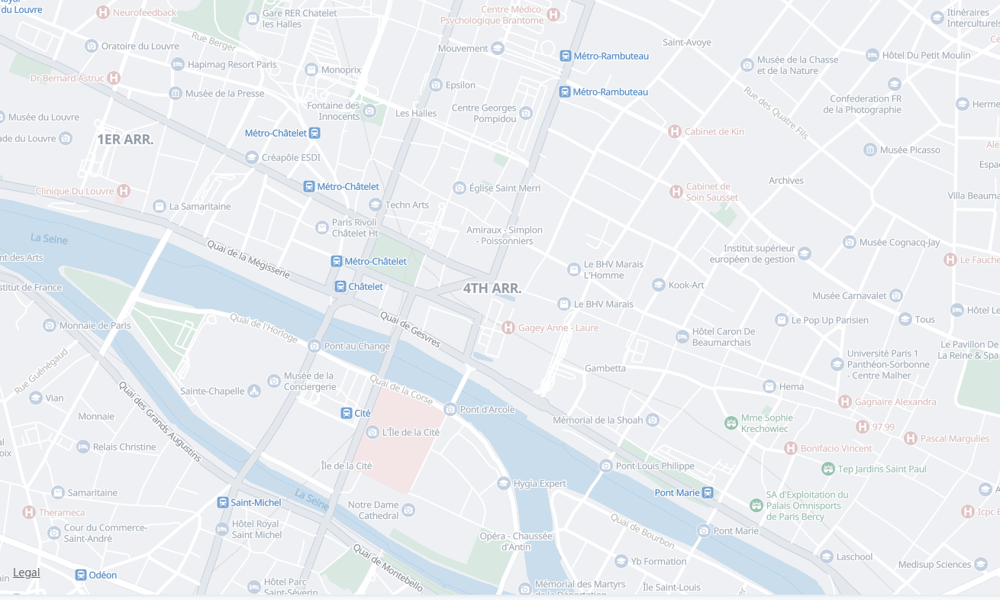
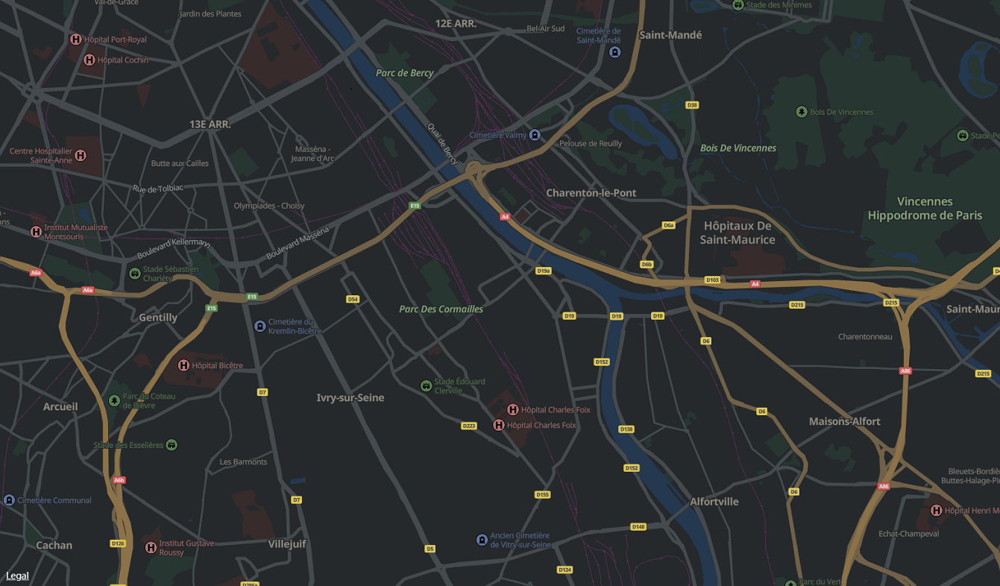
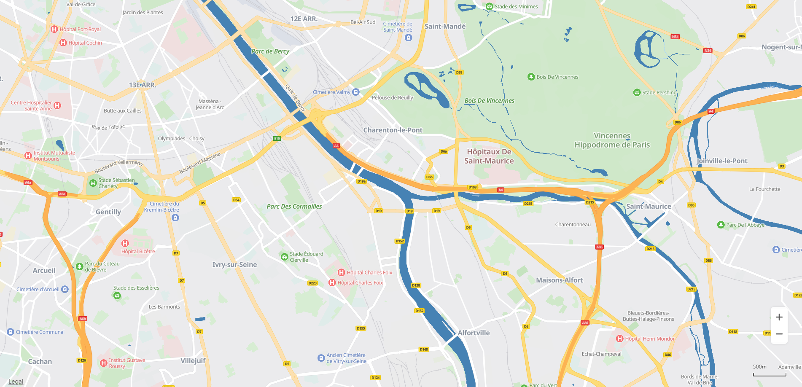

# 实现步骤<a name="ZH-CN_TOPIC_0000001145860961"></a>

-   [使用预置样式](#section165192093619)
-   [自定义地图样式](#section39537541272)
    -   [设置样式文件](#section375285583717)


## 使用预置样式<a name="section165192093619"></a>

调用map.setPresetStyleId\(String\)，目前仅支持standard（[图1](#fig1014714236435)），simple（[图2](#fig874210434435)），night（[图3](#fig177924591437)）三种样式。

```
map.setPresetStyleId("night");
```

<a name="table1271721783219"></a>
<table><tbody><tr id="row1671816174327"><td class="row-nocellborder" style="border:none" valign="top" width="33.33333333333333%"><div class="fignone" id="fig1014714236435"><a name="fig1014714236435"></a><a name="fig1014714236435"></a><span class="figcap"><b>图1 </b>标准样式</span></div>
<p id="p13112194412354"><a name="p13112194412354"></a><a name="p13112194412354"></a><a name="image17112174463517"></a><a name="image17112174463517"></a><span></span></p>
</td>
<td class="row-nocellborder" style="border:none" valign="top" width="33.33333333333333%"><div class="fignone" id="fig874210434435"><a name="fig874210434435"></a><a name="fig874210434435"></a><span class="figcap"><b>图2 </b>简单样式</span></div>
<p id="p19961322143620"><a name="p19961322143620"></a><a name="p19961322143620"></a><a name="image69961022133611"></a><a name="image69961022133611"></a><span></span></p>
</td>
<td class="cellrowborder" style="border:none" valign="top" width="33.33333333333333%"><div class="fignone" id="fig177924591437"><a name="fig177924591437"></a><a name="fig177924591437"></a><span class="figcap"><b>图3 </b>黑夜样式</span></div>
<p id="p06566102378"><a name="p06566102378"></a><a name="p06566102378"></a><a name="image26561410193717"></a><a name="image26561410193717"></a><span></span></p>
</td>
</tr>
</tbody>
</table>

## 自定义地图样式<a name="section39537541272"></a>

华为地图提供以下方法设置自定义地图样式：

设置样式文件：通过嵌入JSON样式声明文件手动定义地图样式的更改。


### 设置样式文件<a name="section375285583717"></a>

调用map.setStyle\(json\)设置自定义地图样式，JSON为自定义的地图样式文件，JSON样式声明文件的定义参见[样式参考](javascript-api-style-reference.md)。[图4](#fig109500164446)展示了通过嵌入JSON文件自定义地图样式的效果：

```
map.setStyle([
		{
			"mapFeature": "landcover.natural",
			"options": "geometry.fill",
			"paint": {
				"color": "#8FBC8F"
			}
		},
		{
			"mapFeature": "water",
			"options": "geometry.fill",
			"paint": {
				"color": "#4682B4"
			}
		}
	]
);
```

**图 4**  自定义地图样式<a name="fig109500164446"></a>  




