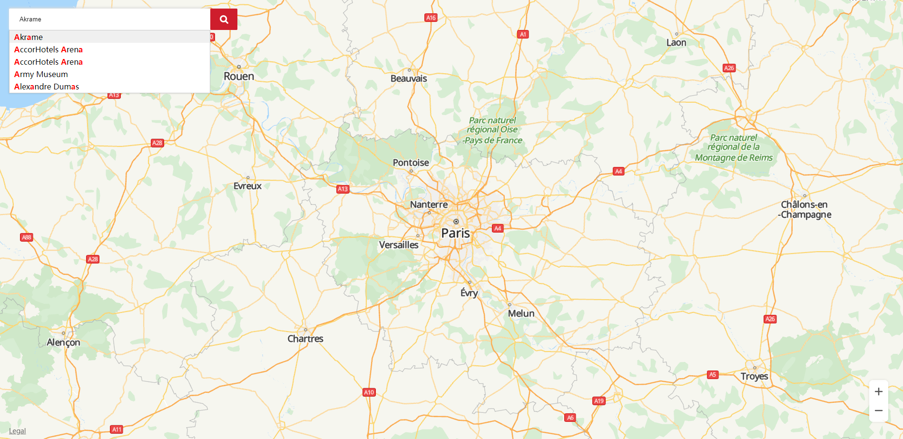

# 搜索控件<a name="ZH-CN_TOPIC_0000001145941041"></a>

-   [实现步骤](#section1370143573915)
-   [示例代码](#section161291227104018)

华为地图JavaScript API提供自动补全控件，当用户输入地址名称时，自动补全其余内容。

## 实现步骤<a name="section1370143573915"></a>

1.  创建html元素input。该元素为搜索框界面，供用户输入文字。
2.  创建搜索框参数对象acOptions。支持的参数参见[AutocompleteOptions](zh-cn_topic_0000001099181234.md#sea3723661c23416abe76f745765cce56)的参数部分（除query参数在搜索框输入）。
3.  通过HWMapJsSDK创建[HWAutocomplete](zh-cn_topic_0000001099181234.md)对象，传入第1步创建的input对象和第2步创建的搜索框参数对象acOptions。
4.  给第3步创建的[HWAutocomplete](zh-cn_topic_0000001099181234.md)对象设置侦听函数，搜索框每输入一个字符，搜索框会出现下拉框出现5条搜索建议，点击某一条搜索建议，会执行该侦听函数。通过该侦听函数可获取某一条位置信息。

## 示例代码<a name="section161291227104018"></a>

```
<style>
        html,
        body {
            margin: 0;
            padding: 0;
            height: 100%;
            width: 100%;
        }

        #map {
            height: 100%;
            width: 100%;
            margin: 0 auto;
        }

        strong {
            color: red;
        }

        .container {
            position: absolute;
            left: 20px;
            top: 20px;
        }

        #searchPosition {
            width: 423px;
            height: 45px;
            box-sizing: border-box;
            outline: none;
            border: 0;
            text-indent: 20px;
            border-radius: 2px;
            box-shadow: 0px -2px 5px rgb(219, 218, 218);
        }

        .iconfont_search {
            background: url('./assets/sprite.png') no-repeat 0 -72px #ce1d2c;
            background-size: cover;
            width: 57px;
            height: 45px;
            border-radius: 2px;
            cursor: pointer;
            position: absolute;
            right: -57px;
            top: 0;
        }
</style>
								
<body>
    <div id="map"></div>
    <div class="container">
            <input type="text" placeholder="Anything you want!" id="searchPosition">
            <div id="iconfont_search" class="iconfont_search"></div>
    </div>
    <script>
        function initMap() {
            var mapOptions = {};
            mapOptions.center = {lat: 48.856613, lng: 2.352222};
            mapOptions.zoom = 8;
            var searchBoxInput = document.getElementById('searchPosition');
            var iconfont_search = document.getElementById('iconfont_search');
            var map = new HWMapJsSDK.HWMap(document.getElementById('map'), mapOptions);
            // 创建搜索框参数
            var acOptions = {
                location: {
                    lat: 48.856613,
                    lng: 2.352222
                },
                radius: 10000,
                customHandler: callback
            };
            var autocomplete;
            // 获取input元素    
            // 创建HWAutocomplete对象，并设置侦听函数    
            autocomplete = new HWMapJsSDK.HWAutocomplete(searchBoxInput, acOptions);
            autocomplete.addListener('site_changed', printSites);

            // 处理搜索出来的值
            // index当前搜索数所在下标
            // data当前搜索返回内容
            // name带strong标签的关键字，
            function callback(index, data, name) {
                console.log(index, data, name);
                var div
                div = document.createElement('div');
                div.innerHTML = name;
                return div;
            }

            // 侦听函数    
            function printSites() {
                console.log("in print sites...");
                var site = autocomplete.getSite();
                var results = "Autocomplete Results:\n";
                var str = "Name=" + site.name + "\n"
                    + "SiteID=" + site.siteId + "\n"
                    + "Latitude=" + site.location.lat + "\n"
                    + "Longitude=" + site.location.lng + "\n"
                    + "Address=" + site.formatAddress + "\n";
                results = results + str;
            }

            iconfont_search.onclick = function () {
                console.log('处理相应逻辑');
            }
        }
    </script>
</body>
```

自动补全效果如[图1](#fig66751444112810)所示：

**图 1**  自动补全控件<a name="fig66751444112810"></a>  


