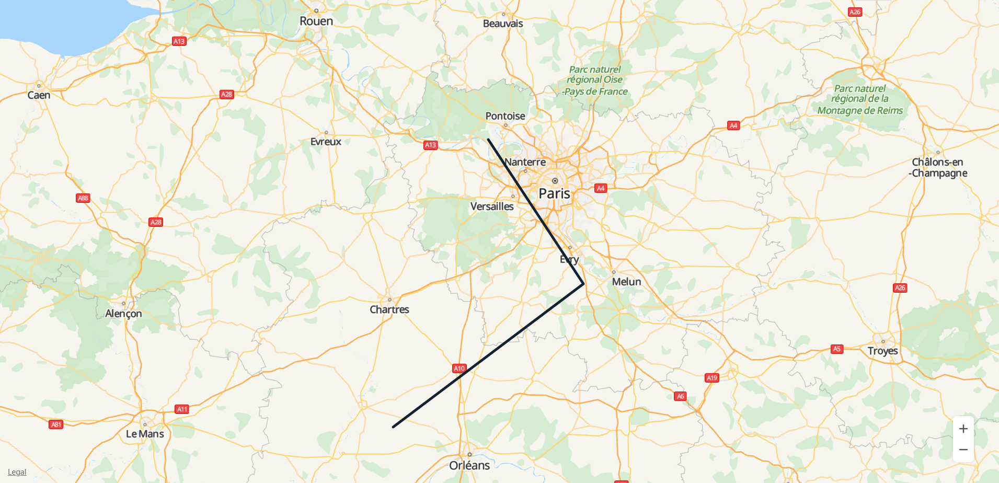
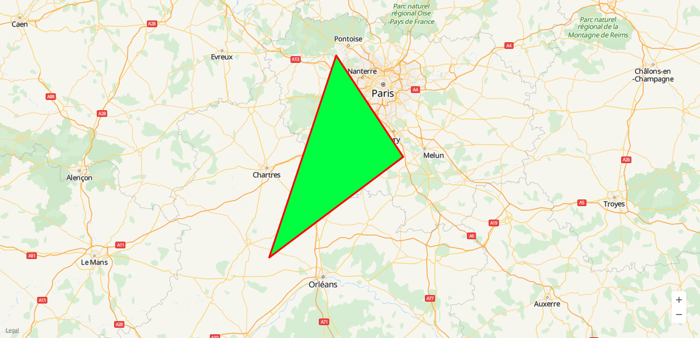
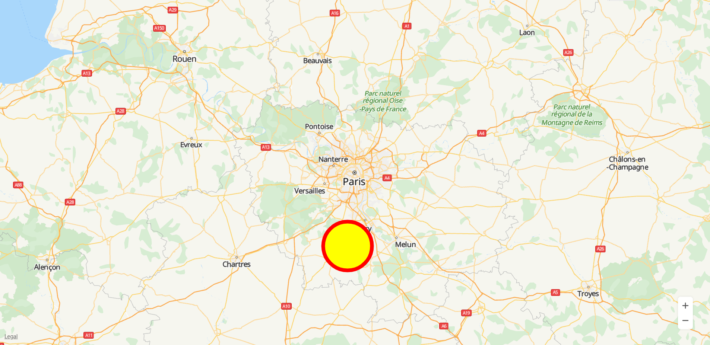

# 形状<a name="ZH-CN_TOPIC_0000001145541079"></a>

-   [折线](#section482392182016)
-   [多边形](#section740220982014)
-   [圆](#section01461815192010)

华为地图SDK支持在地图上绘制形状，主要包括三种形状：折线Polyline 、圆Circle、多边形Polygon。

## 折线<a name="section482392182016"></a>

Polyline是由多个经纬度点连接而成的折线。

1.  添加折线

    以下代码将创建一条折线到地图上：

    ```
    var map;
    var polyline;
    function initMap() { 
        var mapOptions = {}; 
        mapOptions.center = {lat: 48.856613, lng: 2.352222}; 
        mapOptions.zoom = 8; 
        map = new HWMapJsSDK.HWMap(document.getElementById('map'), mapOptions); 
        polyline = new HWMapJsSDK.HWPolyline({ 
            map: map, 
            path: [ 
                {lat: 49, lng: 2}, 
                {lat: 48.5, lng: 2.5}, 
                {lat: 48, lng: 1.5} 
            ], 
            strokeColor: '#112233', 
            strokeWeight: 5, 
        }); 
    }
    ```

    以上代码添加折线的效果如[图1](#fig1050735414718)所示：

    **图 1**  折线<a name="fig1050735414718"></a>  
    

2.  删除折线

    要从地图中移除折线，请调用setMap\(\)方法并将null作为传递参数。

    ```
    polyline.setMap(null);
    ```

    请注意，上述方法不会删除折线，它只是把折线从地图上移除。如果用户希望删除折线，则应将其从地图上移除，然后将折线本身置为null即可。

    ```
    polyline.setMap(null); 
    polyline = null;
    ```

3.  修改折线

    用户可以通过[HWPolyline](zh-cn_topic_0000001145781037.md)对象的方法对属性进行修改，以下代码示例修改Polyline的折线宽度：

    ```
    <tr> 
        <td>Polyline StrokeWeight:</td> 
        <td><input id="strokeWeightInput" type="text" value="2"/></td> 
    </tr>
    ```

    ```
    var strokeWeight = Number(document.getElementById("strokeWeightInput").value); 
    polyline.setStrokeWeight(strokeWeight);
    ```

    折线的以下属性支持自定义：

    <a name="table185387853512"></a>
    <table><thead align="left"><tr id="row05381087353"><th class="cellrowborder" valign="top" width="40%" id="mcps1.1.3.1.1"><p id="p81811522113514"><a name="p81811522113514"></a><a name="p81811522113514"></a>属性</p>
    </th>
    <th class="cellrowborder" valign="top" width="60%" id="mcps1.1.3.1.2"><p id="p13181422103517"><a name="p13181422103517"></a><a name="p13181422103517"></a>含义</p>
    </th>
    </tr>
    </thead>
    <tbody><tr id="row1053817812350"><td class="cellrowborder" valign="top" width="40%" headers="mcps1.1.3.1.1 "><p id="p618102273517"><a name="p618102273517"></a><a name="p618102273517"></a>setPath(path)</p>
    </td>
    <td class="cellrowborder" valign="top" width="60%" headers="mcps1.1.3.1.2 "><p id="p8181122133515"><a name="p8181122133515"></a><a name="p8181122133515"></a>设置折线的路径。</p>
    </td>
    </tr>
    <tr id="row105391585352"><td class="cellrowborder" valign="top" width="40%" headers="mcps1.1.3.1.1 "><p id="p2181122113514"><a name="p2181122113514"></a><a name="p2181122113514"></a>setStrokeColor(strokeColor)</p>
    </td>
    <td class="cellrowborder" valign="top" width="60%" headers="mcps1.1.3.1.2 "><p id="p01811622193510"><a name="p01811622193510"></a><a name="p01811622193510"></a>设置折线颜色。</p>
    </td>
    </tr>
    <tr id="row1153916873519"><td class="cellrowborder" valign="top" width="40%" headers="mcps1.1.3.1.1 "><p id="p1518112217358"><a name="p1518112217358"></a><a name="p1518112217358"></a>setStrokeWeight(strokeWeight)</p>
    </td>
    <td class="cellrowborder" valign="top" width="60%" headers="mcps1.1.3.1.2 "><p id="p81814227352"><a name="p81814227352"></a><a name="p81814227352"></a>设置折线宽度。</p>
    </td>
    </tr>
    <tr id="row135391823516"><td class="cellrowborder" valign="top" width="40%" headers="mcps1.1.3.1.1 "><p id="p91811922193518"><a name="p91811922193518"></a><a name="p91811922193518"></a>setVisible(visible)</p>
    </td>
    <td class="cellrowborder" valign="top" width="60%" headers="mcps1.1.3.1.2 "><p id="p618132273517"><a name="p618132273517"></a><a name="p618132273517"></a>设置可见性。</p>
    </td>
    </tr>
    </tbody>
    </table>

4.  折线事件

    [HWPolyline](zh-cn_topic_0000001145781037.md)支持多种事件回调，详细见下表。

    <a name="table282152763611"></a>
    <table><thead align="left"><tr id="row6821132703613"><th class="cellrowborder" valign="top" width="40%" id="mcps1.1.3.1.1"><p id="p964364319367"><a name="p964364319367"></a><a name="p964364319367"></a>事件</p>
    </th>
    <th class="cellrowborder" valign="top" width="60%" id="mcps1.1.3.1.2"><p id="p1164314434364"><a name="p1164314434364"></a><a name="p1164314434364"></a>含义</p>
    </th>
    </tr>
    </thead>
    <tbody><tr id="row6822112718364"><td class="cellrowborder" valign="top" width="40%" headers="mcps1.1.3.1.1 "><p id="p3643194353618"><a name="p3643194353618"></a><a name="p3643194353618"></a>click</p>
    </td>
    <td class="cellrowborder" valign="top" width="60%" headers="mcps1.1.3.1.2 "><p id="p20643643123620"><a name="p20643643123620"></a><a name="p20643643123620"></a>鼠标单击。</p>
    </td>
    </tr>
    <tr id="row198221727113615"><td class="cellrowborder" valign="top" width="40%" headers="mcps1.1.3.1.1 "><p id="p364394333617"><a name="p364394333617"></a><a name="p364394333617"></a>dbclick</p>
    </td>
    <td class="cellrowborder" valign="top" width="60%" headers="mcps1.1.3.1.2 "><p id="p364310438368"><a name="p364310438368"></a><a name="p364310438368"></a>鼠标双击。</p>
    </td>
    </tr>
    <tr id="row168221627163615"><td class="cellrowborder" valign="top" width="40%" headers="mcps1.1.3.1.1 "><p id="p1864316432367"><a name="p1864316432367"></a><a name="p1864316432367"></a>mousedown</p>
    </td>
    <td class="cellrowborder" valign="top" width="60%" headers="mcps1.1.3.1.2 "><p id="p19643134313364"><a name="p19643134313364"></a><a name="p19643134313364"></a>鼠标按下。</p>
    </td>
    </tr>
    <tr id="row138221271368"><td class="cellrowborder" valign="top" width="40%" headers="mcps1.1.3.1.1 "><p id="p146431043123615"><a name="p146431043123615"></a><a name="p146431043123615"></a>mouseup</p>
    </td>
    <td class="cellrowborder" valign="top" width="60%" headers="mcps1.1.3.1.2 "><p id="p664374313364"><a name="p664374313364"></a><a name="p664374313364"></a>鼠标放开。</p>
    </td>
    </tr>
    </tbody>
    </table>

    以下代码示例为鼠标单击事件监听，要在地图上设置此监听器，请调用[HWPolyline](zh-cn_topic_0000001145781037.md)对象的addListener\('click', callback\)方法：

    ```
    polyline.addListener('click', () => { 
        alert("On Polyline click."); 
    });
    ```


## 多边形<a name="section740220982014"></a>

Polygon是由多个经纬度点连接而成的多边形，与Polyline不同的是，它是内部填充的封闭形状。

1.  添加多边形

    以下代码将创建一个多边形到地图上：

    ```
    var map;
    var polygon;
    function initMap() { 
        var mapOptions = {}; 
        mapOptions.center = {lat: 48.856613, lng: 2.352222}; 
        mapOptions.zoom = 8; 
        map = new HWMapJsSDK.HWMap(document.getElementById('map'), mapOptions); 
        polygon = new HWMapJsSDK.HWPolygon({ 
            map : map, 
            paths: [ 
                [ 
                    {lat: 49, lng: 2}, 
                    {lat: 48.5, lng: 2.5}, 
                    {lat: 48, lng: 1.5} 
                ], 
            ], 
            fillColor: '#00ff41', 
            strokeColor: '#ff0000', 
            strokeWeight: 5, 
        }); 
    }
    ```

    以上代码添加多边形的效果如[图2](#fig28404248109)所示：

    **图 2**  多边形<a name="fig28404248109"></a>  
    

2.  删除多边形

    要从地图中移除多边形，请调用setMap\(\)方法并将null作为传递参数。

    ```
    polygon.setMap(null);
    ```

    请注意，上述方法不会删除多边形，它只是把多边形从地图上移除。如果用户希望删除多边形，则应将其从地图上移除，然后将多边形本身置为null即可。

    ```
    polygon.setMap(null); 
    polygon = null;
    ```

3.  修改多边形

    用户可以通过[HWPolygon](zh-cn_topic_0000001099341096.md)对象的方法对属性进行修改，以下代码示例修改Polygon的填充颜色：

    ```
    <tr> 
        <td>Polygon FillColor:</td> 
        <td><input id="fillColorInput" type="text" value="#999999"/></td> 
    </tr>
    ```

    ```
    var fillColor = document.getElementById("fillColorInput").value; 
    polygon.setFillColor(fillColor);
    ```

    多边形的以下属性支持自定义：

    <a name="table1237930195"></a>
    <table><thead align="left"><tr id="row1737910890"><th class="cellrowborder" valign="top" width="40%" id="mcps1.1.3.1.1"><p id="p58511712891"><a name="p58511712891"></a><a name="p58511712891"></a>属性</p>
    </th>
    <th class="cellrowborder" valign="top" width="60%" id="mcps1.1.3.1.2"><p id="p138518129915"><a name="p138518129915"></a><a name="p138518129915"></a>含义</p>
    </th>
    </tr>
    </thead>
    <tbody><tr id="row16379101695"><td class="cellrowborder" valign="top" width="40%" headers="mcps1.1.3.1.1 "><p id="p1085131219913"><a name="p1085131219913"></a><a name="p1085131219913"></a>setFillColor(fillColor)</p>
    </td>
    <td class="cellrowborder" valign="top" width="60%" headers="mcps1.1.3.1.2 "><p id="p4851212597"><a name="p4851212597"></a><a name="p4851212597"></a>设置填充颜色。</p>
    </td>
    </tr>
    <tr id="row7379170594"><td class="cellrowborder" valign="top" width="40%" headers="mcps1.1.3.1.1 "><p id="p28517126916"><a name="p28517126916"></a><a name="p28517126916"></a>setStrokeColor(strokeColor)</p>
    </td>
    <td class="cellrowborder" valign="top" width="60%" headers="mcps1.1.3.1.2 "><p id="p78511212398"><a name="p78511212398"></a><a name="p78511212398"></a>设置边框颜色。</p>
    </td>
    </tr>
    <tr id="row53796010913"><td class="cellrowborder" valign="top" width="40%" headers="mcps1.1.3.1.1 "><p id="p1785131218910"><a name="p1785131218910"></a><a name="p1785131218910"></a>setStrokeWeight(strokeWeight)</p>
    </td>
    <td class="cellrowborder" valign="top" width="60%" headers="mcps1.1.3.1.2 "><p id="p48514121099"><a name="p48514121099"></a><a name="p48514121099"></a>设置边框宽度。</p>
    </td>
    </tr>
    <tr id="row193801707913"><td class="cellrowborder" valign="top" width="40%" headers="mcps1.1.3.1.1 "><p id="p1085271214911"><a name="p1085271214911"></a><a name="p1085271214911"></a>setVisible(visible)</p>
    </td>
    <td class="cellrowborder" valign="top" width="60%" headers="mcps1.1.3.1.2 "><p id="p6852111210914"><a name="p6852111210914"></a><a name="p6852111210914"></a>设置可见性。</p>
    </td>
    </tr>
    </tbody>
    </table>

4.  多边形事件

    [HWPolygon](zh-cn_topic_0000001099341096.md)支持多种事件回调，详细见下表。

    <a name="table182761755497"></a>
    <table><thead align="left"><tr id="row2276195515915"><th class="cellrowborder" valign="top" width="40%" id="mcps1.1.3.1.1"><p id="p530737111010"><a name="p530737111010"></a><a name="p530737111010"></a>事件</p>
    </th>
    <th class="cellrowborder" valign="top" width="60%" id="mcps1.1.3.1.2"><p id="p1330715714108"><a name="p1330715714108"></a><a name="p1330715714108"></a>含义</p>
    </th>
    </tr>
    </thead>
    <tbody><tr id="row20277195515914"><td class="cellrowborder" valign="top" width="40%" headers="mcps1.1.3.1.1 "><p id="p330787131012"><a name="p330787131012"></a><a name="p330787131012"></a>click</p>
    </td>
    <td class="cellrowborder" valign="top" width="60%" headers="mcps1.1.3.1.2 "><p id="p1030797181016"><a name="p1030797181016"></a><a name="p1030797181016"></a>鼠标单击。</p>
    </td>
    </tr>
    <tr id="row1227719551096"><td class="cellrowborder" valign="top" width="40%" headers="mcps1.1.3.1.1 "><p id="p53071579107"><a name="p53071579107"></a><a name="p53071579107"></a>dbclick</p>
    </td>
    <td class="cellrowborder" valign="top" width="60%" headers="mcps1.1.3.1.2 "><p id="p143074711011"><a name="p143074711011"></a><a name="p143074711011"></a>鼠标双击。</p>
    </td>
    </tr>
    <tr id="row1327717551995"><td class="cellrowborder" valign="top" width="40%" headers="mcps1.1.3.1.1 "><p id="p4307207181010"><a name="p4307207181010"></a><a name="p4307207181010"></a>mousedown</p>
    </td>
    <td class="cellrowborder" valign="top" width="60%" headers="mcps1.1.3.1.2 "><p id="p6307578100"><a name="p6307578100"></a><a name="p6307578100"></a>鼠标按下。</p>
    </td>
    </tr>
    <tr id="row13277655897"><td class="cellrowborder" valign="top" width="40%" headers="mcps1.1.3.1.1 "><p id="p730716731014"><a name="p730716731014"></a><a name="p730716731014"></a>mouseup</p>
    </td>
    <td class="cellrowborder" valign="top" width="60%" headers="mcps1.1.3.1.2 "><p id="p230787191019"><a name="p230787191019"></a><a name="p230787191019"></a>鼠标放开。</p>
    </td>
    </tr>
    </tbody>
    </table>

    以下代码示例为鼠标单击事件监听，要在地图上设置此监听器，请调用[HWPolygon](zh-cn_topic_0000001099341096.md)对象的addListener\('click', callback\)方法：

    ```
    polygon.addListener('click', () => { 
          alert("On Polygon click."); 
    });
    ```


## 圆<a name="section01461815192010"></a>

圆包括两种情况，一种是实心圆，一种是空心圆。默认是空心圆，可以用Circle属性进行控制。

1.  添加圆

    以下代码将创建一个圆到地图上：

    ```
    var map;
    var circle;
    function initMap() { 
        var mapOptions = {}; 
        mapOptions.center = {lat: 48.856613, lng: 2.352222}; 
        mapOptions.zoom = 8; 
        map = new HWMapJsSDK.HWMap(document.getElementById('map'), mapOptions); 
        circle = new HWMapJsSDK.HWCircle({ 
            map: map, 
            center: {lat: 48.5, lng: 2.3}, 
            radius: 20000, 
            fillColor: 'yellow', 
            strokeColor:'red', 
            strokeWeight: 10, 
        }); 
    }
    ```

    以上代码添加圆的效果如[图3](#fig1820137131218)所示：

    **图 3**  圆<a name="fig1820137131218"></a>  
    

2.  删除圆

    要从地图中移除圆，请调用setMap\(\)方法并将null作为传递参数。

    ```
    circle.setMap(null);
    ```

    请注意，上述方法不会删除圆，它只是把圆从地图上移除。如果用户希望删除圆，则应将其从地图上移除，然后将圆本身置为null即可。

    ```
    circle.setMap(null); 
    circle = null;
    ```

3.  修改圆

    用户可以通过[HWCircle](zh-cn_topic_0000001099341054.md)对象的方法对属性进行修改，以下代码示例修改Circle的圆心位置：

    ```
    <tr> 
        <td>Center Lat:</td> 
        <td><input id="centerLatInput" type="text" value="48.6"/></td> 
    </tr> 
    <tr> 
        <td>Center Lng:</td> 
        <td><input id="centerLngInput" type="text" value="2.4"/></td> 
    </tr>
    ```

    ```
    var lat = Number(document.getElementById("centerLatInput").value); 
    var lng = Number(document.getElementById("centerLngInput").value); 
    circle.setCenter({lat: lat, lng: lng});
    ```

    圆的以下属性支持自定义：

    <a name="table113901411161814"></a>
    <table><thead align="left"><tr id="row173909111184"><th class="cellrowborder" valign="top" width="40%" id="mcps1.1.3.1.1"><p id="p523024161818"><a name="p523024161818"></a><a name="p523024161818"></a>属性</p>
    </th>
    <th class="cellrowborder" valign="top" width="60%" id="mcps1.1.3.1.2"><p id="p182332431820"><a name="p182332431820"></a><a name="p182332431820"></a>含义</p>
    </th>
    </tr>
    </thead>
    <tbody><tr id="row1339031111185"><td class="cellrowborder" valign="top" width="40%" headers="mcps1.1.3.1.1 "><p id="p123162410186"><a name="p123162410186"></a><a name="p123162410186"></a>setCenter(center)</p>
    </td>
    <td class="cellrowborder" valign="top" width="60%" headers="mcps1.1.3.1.2 "><p id="p1323122441810"><a name="p1323122441810"></a><a name="p1323122441810"></a>设置圆的圆心。</p>
    </td>
    </tr>
    <tr id="row339021101812"><td class="cellrowborder" valign="top" width="40%" headers="mcps1.1.3.1.1 "><p id="p32312249182"><a name="p32312249182"></a><a name="p32312249182"></a>setRadius(radius)</p>
    </td>
    <td class="cellrowborder" valign="top" width="60%" headers="mcps1.1.3.1.2 "><p id="p32311243188"><a name="p32311243188"></a><a name="p32311243188"></a>设置圆的半径。</p>
    </td>
    </tr>
    <tr id="row183905111181"><td class="cellrowborder" valign="top" width="40%" headers="mcps1.1.3.1.1 "><p id="p152411247185"><a name="p152411247185"></a><a name="p152411247185"></a>setFillColor(fillColor)</p>
    </td>
    <td class="cellrowborder" valign="top" width="60%" headers="mcps1.1.3.1.2 "><p id="p162412412183"><a name="p162412412183"></a><a name="p162412412183"></a>设置圆的填充颜色。</p>
    </td>
    </tr>
    <tr id="row18390121117180"><td class="cellrowborder" valign="top" width="40%" headers="mcps1.1.3.1.1 "><p id="p12245242182"><a name="p12245242182"></a><a name="p12245242182"></a>setStrokeColor(strokeColor)</p>
    </td>
    <td class="cellrowborder" valign="top" width="60%" headers="mcps1.1.3.1.2 "><p id="p172413249184"><a name="p172413249184"></a><a name="p172413249184"></a>设置圆的边框颜色。</p>
    </td>
    </tr>
    <tr id="row11390911121817"><td class="cellrowborder" valign="top" width="40%" headers="mcps1.1.3.1.1 "><p id="p824524181819"><a name="p824524181819"></a><a name="p824524181819"></a>setStrokeWeight(strokeWeight)</p>
    </td>
    <td class="cellrowborder" valign="top" width="60%" headers="mcps1.1.3.1.2 "><p id="p1824112418182"><a name="p1824112418182"></a><a name="p1824112418182"></a>设置圆的边框宽度。</p>
    </td>
    </tr>
    <tr id="row163901811191820"><td class="cellrowborder" valign="top" width="40%" headers="mcps1.1.3.1.1 "><p id="p1924142420187"><a name="p1924142420187"></a><a name="p1924142420187"></a>setVisible(visible)</p>
    </td>
    <td class="cellrowborder" valign="top" width="60%" headers="mcps1.1.3.1.2 "><p id="p624424171819"><a name="p624424171819"></a><a name="p624424171819"></a>设置圆的可见性。</p>
    </td>
    </tr>
    </tbody>
    </table>

4.  圆事件

    [HWCircle](zh-cn_topic_0000001099341054.md)支持多种事件回调，详细见下表。

    <a name="table1146963141916"></a>
    <table><thead align="left"><tr id="row1546913341910"><th class="cellrowborder" valign="top" width="40%" id="mcps1.1.3.1.1"><p id="p126444561912"><a name="p126444561912"></a><a name="p126444561912"></a>事件</p>
    </th>
    <th class="cellrowborder" valign="top" width="60%" id="mcps1.1.3.1.2"><p id="p16447518193"><a name="p16447518193"></a><a name="p16447518193"></a>含义</p>
    </th>
    </tr>
    </thead>
    <tbody><tr id="row1846913121912"><td class="cellrowborder" valign="top" width="40%" headers="mcps1.1.3.1.1 "><p id="p76441751190"><a name="p76441751190"></a><a name="p76441751190"></a>click</p>
    </td>
    <td class="cellrowborder" valign="top" width="60%" headers="mcps1.1.3.1.2 "><p id="p06441853199"><a name="p06441853199"></a><a name="p06441853199"></a>鼠标单击。</p>
    </td>
    </tr>
    <tr id="row1946917321912"><td class="cellrowborder" valign="top" width="40%" headers="mcps1.1.3.1.1 "><p id="p126451455191"><a name="p126451455191"></a><a name="p126451455191"></a>dbclick</p>
    </td>
    <td class="cellrowborder" valign="top" width="60%" headers="mcps1.1.3.1.2 "><p id="p1564519511919"><a name="p1564519511919"></a><a name="p1564519511919"></a>鼠标双击。</p>
    </td>
    </tr>
    <tr id="row3469163131918"><td class="cellrowborder" valign="top" width="40%" headers="mcps1.1.3.1.1 "><p id="p364515520191"><a name="p364515520191"></a><a name="p364515520191"></a>mousedown</p>
    </td>
    <td class="cellrowborder" valign="top" width="60%" headers="mcps1.1.3.1.2 "><p id="p464512510199"><a name="p464512510199"></a><a name="p464512510199"></a>鼠标按下。</p>
    </td>
    </tr>
    <tr id="row647015351917"><td class="cellrowborder" valign="top" width="40%" headers="mcps1.1.3.1.1 "><p id="p1645052196"><a name="p1645052196"></a><a name="p1645052196"></a>mouseup</p>
    </td>
    <td class="cellrowborder" valign="top" width="60%" headers="mcps1.1.3.1.2 "><p id="p264585141919"><a name="p264585141919"></a><a name="p264585141919"></a>鼠标放开。</p>
    </td>
    </tr>
    </tbody>
    </table>

    以下代码示例为鼠标单击事件监听，要在地图上设置此监听器，请调用[HWCircle](zh-cn_topic_0000001099341054.md)对象的addListener\('click', callback\)方法：

    ```
    circle.addListener('click', () => { 
        alert("On Circle click."); 
    });
    ```


