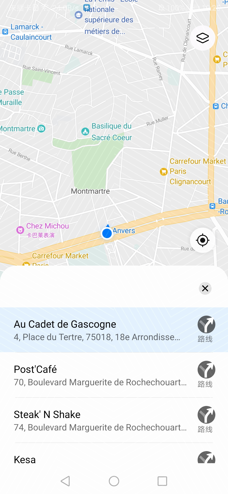

# 周边搜索<a name="ZH-CN_TOPIC_0000001099341090"></a>

基于用户设备位置进行地点查找。

-   Deeplink样例：

    ```
    petalmaps://nearbySearch?text=xxx
    mapapp://nearbySearch?text=xxx
    ```


-   参数列表：

    <a name="table1090724503720"></a>
    <table><thead align="left"><tr id="row1490734519378"><th class="cellrowborder" valign="top" width="20%" id="mcps1.1.5.1.1"><p id="p2090744523719"><a name="p2090744523719"></a><a name="p2090744523719"></a>参数</p>
    </th>
    <th class="cellrowborder" valign="top" width="15%" id="mcps1.1.5.1.2"><p id="p15907144593713"><a name="p15907144593713"></a><a name="p15907144593713"></a>是否必选</p>
    </th>
    <th class="cellrowborder" valign="top" width="15%" id="mcps1.1.5.1.3"><p id="p18907164553714"><a name="p18907164553714"></a><a name="p18907164553714"></a>参数类型</p>
    </th>
    <th class="cellrowborder" valign="top" width="50%" id="mcps1.1.5.1.4"><p id="p14907114553715"><a name="p14907114553715"></a><a name="p14907114553715"></a>描述</p>
    </th>
    </tr>
    </thead>
    <tbody><tr id="row139081145183718"><td class="cellrowborder" valign="top" width="20%" headers="mcps1.1.5.1.1 "><p id="p125mcpsimp"><a name="p125mcpsimp"></a><a name="p125mcpsimp"></a>text</p>
    </td>
    <td class="cellrowborder" valign="top" width="15%" headers="mcps1.1.5.1.2 "><p id="p1134241864114"><a name="p1134241864114"></a><a name="p1134241864114"></a>是</p>
    </td>
    <td class="cellrowborder" valign="top" width="15%" headers="mcps1.1.5.1.3 "><p id="p127mcpsimp"><a name="p127mcpsimp"></a><a name="p127mcpsimp"></a>String</p>
    </td>
    <td class="cellrowborder" valign="top" width="50%" headers="mcps1.1.5.1.4 "><p id="p856614018498"><a name="p856614018498"></a><a name="p856614018498"></a>周边搜索的关键词。</p>
    </td>
    </tr>
    <tr id="row5415142291711"><td class="cellrowborder" valign="top" width="20%" headers="mcps1.1.5.1.1 "><p id="p5416152215172"><a name="p5416152215172"></a><a name="p5416152215172"></a>utm_source</p>
    </td>
    <td class="cellrowborder" valign="top" width="15%" headers="mcps1.1.5.1.2 "><p id="p11416112217171"><a name="p11416112217171"></a><a name="p11416112217171"></a>否</p>
    </td>
    <td class="cellrowborder" valign="top" width="15%" headers="mcps1.1.5.1.3 "><p id="p174161322131710"><a name="p174161322131710"></a><a name="p174161322131710"></a>String</p>
    </td>
    <td class="cellrowborder" valign="top" width="50%" headers="mcps1.1.5.1.4 "><p id="p1884707181818"><a name="p1884707181818"></a><a name="p1884707181818"></a>渠道来源（应用可以传入App包名或者应用名）。</p>
    </td>
    </tr>
    <tr id="row5795131912188"><td class="cellrowborder" valign="top" width="20%" headers="mcps1.1.5.1.1 "><p id="p1079613193187"><a name="p1079613193187"></a><a name="p1079613193187"></a>utm_medium</p>
    </td>
    <td class="cellrowborder" valign="top" width="15%" headers="mcps1.1.5.1.2 "><p id="p295410466206"><a name="p295410466206"></a><a name="p295410466206"></a>否</p>
    </td>
    <td class="cellrowborder" valign="top" width="15%" headers="mcps1.1.5.1.3 "><p id="p87968195185"><a name="p87968195185"></a><a name="p87968195185"></a>String</p>
    </td>
    <td class="cellrowborder" valign="top" width="50%" headers="mcps1.1.5.1.4 "><p id="p179641917180"><a name="p179641917180"></a><a name="p179641917180"></a>媒介。</p>
    </td>
    </tr>
    <tr id="row1979016215180"><td class="cellrowborder" valign="top" width="20%" headers="mcps1.1.5.1.1 "><p id="p3790421101819"><a name="p3790421101819"></a><a name="p3790421101819"></a>utm_campaign</p>
    </td>
    <td class="cellrowborder" valign="top" width="15%" headers="mcps1.1.5.1.2 "><p id="p199621547172016"><a name="p199621547172016"></a><a name="p199621547172016"></a>否</p>
    </td>
    <td class="cellrowborder" valign="top" width="15%" headers="mcps1.1.5.1.3 "><p id="p12791021131813"><a name="p12791021131813"></a><a name="p12791021131813"></a>String</p>
    </td>
    <td class="cellrowborder" valign="top" width="50%" headers="mcps1.1.5.1.4 "><p id="p197917216189"><a name="p197917216189"></a><a name="p197917216189"></a>运营活动名称。</p>
    </td>
    </tr>
    <tr id="row41431240185"><td class="cellrowborder" valign="top" width="20%" headers="mcps1.1.5.1.1 "><p id="p12143122415186"><a name="p12143122415186"></a><a name="p12143122415186"></a>utm_term</p>
    </td>
    <td class="cellrowborder" valign="top" width="15%" headers="mcps1.1.5.1.2 "><p id="p162581249122012"><a name="p162581249122012"></a><a name="p162581249122012"></a>否</p>
    </td>
    <td class="cellrowborder" valign="top" width="15%" headers="mcps1.1.5.1.3 "><p id="p171439243189"><a name="p171439243189"></a><a name="p171439243189"></a>String</p>
    </td>
    <td class="cellrowborder" valign="top" width="50%" headers="mcps1.1.5.1.4 "><p id="p214362491810"><a name="p214362491810"></a><a name="p214362491810"></a>运营活动关键词。</p>
    </td>
    </tr>
    <tr id="row18235203432013"><td class="cellrowborder" valign="top" width="20%" headers="mcps1.1.5.1.1 "><p id="p923533412020"><a name="p923533412020"></a><a name="p923533412020"></a>utm_content</p>
    </td>
    <td class="cellrowborder" valign="top" width="15%" headers="mcps1.1.5.1.2 "><p id="p20306050102018"><a name="p20306050102018"></a><a name="p20306050102018"></a>否</p>
    </td>
    <td class="cellrowborder" valign="top" width="15%" headers="mcps1.1.5.1.3 "><p id="p13235123419206"><a name="p13235123419206"></a><a name="p13235123419206"></a>String</p>
    </td>
    <td class="cellrowborder" valign="top" width="50%" headers="mcps1.1.5.1.4 "><p id="p16235143419201"><a name="p16235143419201"></a><a name="p16235143419201"></a>运营活动内容。</p>
    </td>
    </tr>
    </tbody>
    </table>


-   代码样例

    Intent方式：

    ```
    // 初始化“关键字搜索”的URI字符串
    String uriString = "mapapp://nearbySearch?text=" + "The Eiffel Tower";
    String uriString = "petalmaps://nearbySearch?text=" + "The Eiffel Tower"+"&utm_source="+"fb";
    // 根据URI字符串创建Uri
    Uri content_url = Uri.parse(uriString);
    // 声明并初始化Intent实例
    Intent intent = new Intent(Intent.ACTION_VIEW, content_url);
    // 查询是否存在Activity能够启动当前intent
    if (intent.resolveActivity(getPackageManager()) != null) {
    	startActivity(intent);
    }
    ```

    运行后的效果如下图所示：

    


