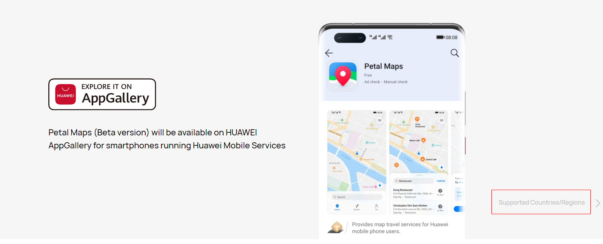

# 业务简介<a name="ZH-CN_TOPIC_0000001099181232"></a>

-   [支持的设备](#section20817330133210)
-   [支持的国家/地区](#section1661131753417)
-   [使用说明](#section2295129185117)

Map Kit为开发者提供直接调起花瓣地图应用以满足特定业务场景下应用需求的程序接口，您只需按照接口规范构造一条标准的URI，便可在应用中调起花瓣地图应用，实现周边搜索、关键字搜索、路径规划和导航等功能。

## 支持的设备<a name="section20817330133210"></a>

<a name="table342mcpsimp"></a>
<table><thead align="left"><tr id="row348mcpsimp"><th class="cellrowborder" valign="top" width="33.33333333333333%" id="mcps1.1.4.1.1"><p id="p352mcpsimp"><a name="p352mcpsimp"></a><a name="p352mcpsimp"></a>设备类型</p>
</th>
<th class="cellrowborder" valign="top" width="33.33333333333333%" id="mcps1.1.4.1.2"><p id="p1530104611285"><a name="p1530104611285"></a><a name="p1530104611285"></a>OS版本</p>
</th>
<th class="cellrowborder" valign="top" width="33.33333333333333%" id="mcps1.1.4.1.3"><p id="p85974818232"><a name="p85974818232"></a><a name="p85974818232"></a>HMS Core（APK）版本</p>
</th>
</tr>
</thead>
<tbody><tr id="row356mcpsimp"><td class="cellrowborder" valign="top" width="33.33333333333333%" headers="mcps1.1.4.1.1 "><p id="p358mcpsimp"><a name="p358mcpsimp"></a><a name="p358mcpsimp"></a>华为手机（RAM大于3GB）</p>
</td>
<td class="cellrowborder" valign="top" width="33.33333333333333%" headers="mcps1.1.4.1.2 "><p id="p17530346192814"><a name="p17530346192814"></a><a name="p17530346192814"></a>EMUI 10.0及以上</p>
</td>
<td class="cellrowborder" valign="top" width="33.33333333333333%" headers="mcps1.1.4.1.3 "><p id="p1959548172317"><a name="p1959548172317"></a><a name="p1959548172317"></a>5.0及以上版本</p>
</td>
</tr>
</tbody>
</table>

## 支持的国家/地区<a name="section1661131753417"></a>

请参见[支持的国家/地区](https://consumer.huawei.com/en/mobileservices/petalmaps/)。



## 使用说明<a name="section2295129185117"></a>

1.  创建Intent，指定为ACTION\_VIEW，并设置花瓣地图接口对应的URI。通过startActivity\(\)方法拉起花瓣地图。

    代码样例（以关键字搜索功能举例）：

    ```
    // 初始化“关键字搜索”的URI字符串
    String uriString = "petalmaps://textSearch?text=" + "The Eiffel Tower";
    String uriString = "mapapp://textSearch?text=" + "The Eiffel Tower";
    // 根据URI字符串创建Uri
    Uri content_url = Uri.parse(uriString);
    // 创建一个Intent并指定为ACTION_VIEW
    Intent intent = new Intent(Intent.ACTION_VIEW, content_url);
    // 通过startActivity()方法拉起花瓣地图
    startActivity(intent);
    ```

2.  如果手机上未安装花瓣地图App来响应Intent，程序存在崩溃的风险。所以在拉起花瓣地图前，需要增加对intent的空判断resolveActivity\(\)方法，不为空时，才执行startActivity\(\)方法。

    代码样例：

    ```
    // 初始化“关键字搜索”的URI字符串
    String uriString = "petalmaps://textSearch?text=" + "The Eiffel Tower";
    String uriString = "mapapp://textSearch?text=" + "The Eiffel Tower";
    // 根据URI字符串创建Uri
    Uri content_url = Uri.parse(uriString);
    // 声明并初始化Intent实例
    Intent intent = new Intent(Intent.ACTION_VIEW, content_url);
    // 查询是否存在Activity能够启动当前intent
    if(intent.resolveActivity(getPackageManager()) != null) {
    	startActivity(intent);
    }
    ```


