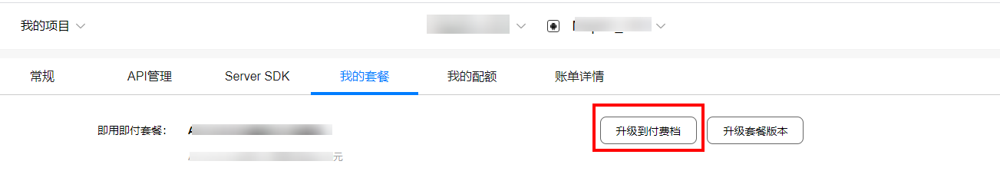

# 使用入门

-   [开发流程](#section1789025332016)
-   [开通付费](#section12268164318111)

## 开发流程

您需要按照如下流程完成应用的开发工作。

<table><thead align="left"><tr id="row15305163112618"><th class="cellrowborder" align="center" valign="top" width="6.9306930693069315%" id="mcps1.1.4.1.1">
序号

</th>
<th class="cellrowborder" valign="top" width="22.662266226622663%" id="mcps1.1.4.1.2">
步骤

</th>
<th class="cellrowborder" valign="top" width="70.4070407040704%" id="mcps1.1.4.1.3">
说明

</th>
</tr>
</thead>
<tbody><tr id="row528171163512"><td class="cellrowborder" align="center" valign="top" width="6.9306930693069315%" headers="mcps1.1.4.1.1 ">
1

</td>
<td class="cellrowborder" valign="top" width="22.662266226622663%" headers="mcps1.1.4.1.2 ">
<a href="web-api-preparations.md">开发准备</a>

</td>
<td class="cellrowborder" valign="top" width="70.4070407040704%" headers="mcps1.1.4.1.3 ">
在开发应用前，需要完成步骤：<a href="web-api-preparations.md#section47264296">注册成为开发者</a>、<a href="web-api-preparations.md#section196902382910">创建项目</a>、<a href="web-api-preparations.md#section294363472920">创建应用</a>、<a href="web-api-preparations.md#section2119133716579">打开相关服务</a>、<a href="web-api-preparations.md#section169441820428">获取API Key</a>。

如果您已经在<a href="https://developer.huawei.com/consumer/cn/service/josp/agc/index.html" target="_blank" rel="noopener noreferrer">AppGallery Connect</a>网站创建了应用，可直接<a href="web-api-preparations.md#section169441820428">获取API Key</a>使用本服务。

</td>
</tr>
<tr id="row552823953512"><td class="cellrowborder" align="center" valign="top" width="6.9306930693069315%" headers="mcps1.1.4.1.1 ">
2

</td>
<td class="cellrowborder" valign="top" width="22.662266226622663%" headers="mcps1.1.4.1.2 ">
<a href="#section12268164318111">开通付费</a>

</td>
<td class="cellrowborder" valign="top" width="70.4070407040704%" headers="mcps1.1.4.1.3 ">
您可以随时变更订阅的即用即付套餐档次。

</td>
</tr>
<tr id="row215818418196"><td class="cellrowborder" rowspan="4" align="center" valign="top" width="6.9306930693069315%" headers="mcps1.1.4.1.1 ">
3

</td>
<td class="cellrowborder" valign="top" width="22.662266226622663%" headers="mcps1.1.4.1.2 ">
<a href="web-diretions-api-introduction.md">Directions API</a>

</td>
<td class="cellrowborder" valign="top" width="70.4070407040704%" headers="mcps1.1.4.1.3 ">
提供步行、骑行、驾车路径规划以及行驶距离计算接口。

</td>
</tr>
<tr id="row14808202071911"><td class="cellrowborder" valign="top" headers="mcps1.1.4.1.1 ">
<a href="web-matrix-api-introduction.md">Matrix API</a>

</td>
<td class="cellrowborder" valign="top" headers="mcps1.1.4.1.2 ">
提供一次计算多组起点和目的地的路线距离和时间计算功能，包括步行，骑行及驾车三种模式。

</td>
</tr>
<tr id="row1913928104216"><td class="cellrowborder" valign="top" headers="mcps1.1.4.1.1 ">
<a href="web-static-map-introduction.md">Maps Static API</a>

</td>
<td class="cellrowborder" valign="top" headers="mcps1.1.4.1.2 ">
将地图以图片的形式嵌入到您的网页中。

</td>
</tr>
<tr id="row1561593020428"><td class="cellrowborder" valign="top" headers="mcps1.1.4.1.1 ">
<a href="web-tile-api-introduction.md">Tile API</a>

</td>
<td class="cellrowborder" valign="top" headers="mcps1.1.4.1.2 ">
直接访问华为地图瓦片数据，请求独立的地图瓦片，构建地图图层。

</td>
</tr>
</tbody>
</table>

## 开通付费

自2021年1月1日起，华为地图服务对部分接口制定了收费方案，详情请参见[服务定价](about-charging.md)。请到“我的项目  \>  我的套餐“，进行套餐升级。

