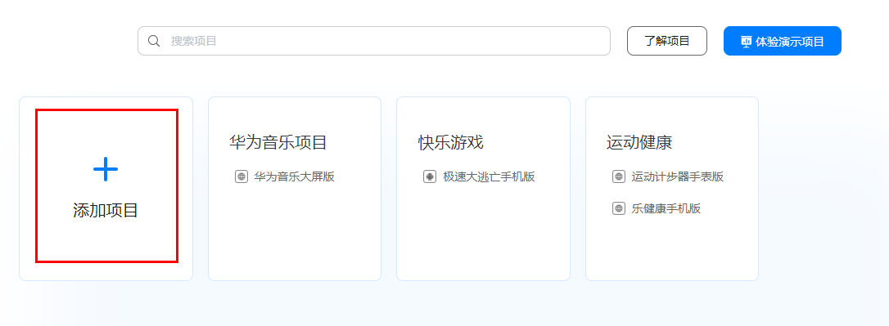
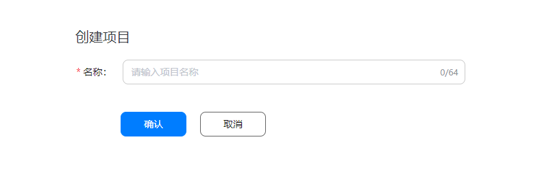
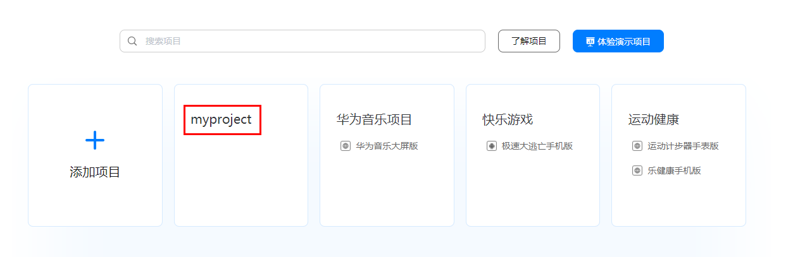
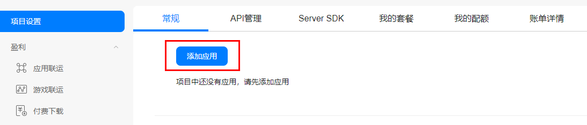
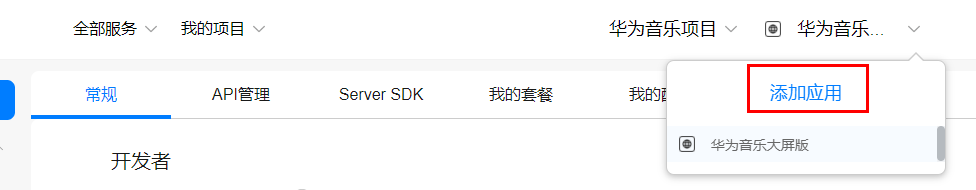
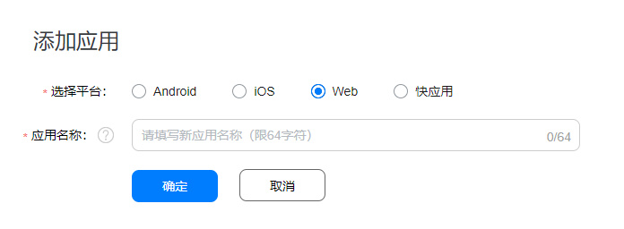

# 开发准备

-   [注册成为开发者](#section47264296)
-   [创建项目](#section196902382910)
-   [创建应用](#section294363472920)
-   [打开相关服务](#section2119133716579)
-   [获取API Key](#section169441820428)

## 注册成为开发者

在开发应用前需要在[华为开发者联盟](https://developer.huawei.com/consumer/cn)网站上注册成为开发者并完成实名认证，具体方法请参见[帐号注册认证](https://developer.huawei.com/consumer/cn/doc/start/registration-and-verification-0000001053628148)。

## 创建项目

项目是您在AGC中资源的组织实体，您可以将您的一个应用的不同平台版本添加到同一个项目中。在创建您的应用前，您需要先在AGC中创建您的项目。

1.  登录[AppGallery Connect](https://developer.huawei.com/consumer/cn/service/josp/agc/index.html)网站，选择“我的项目”。
2.  在我的项目页面点击“添加项目”。

    

3.  输入您预先规划的项目名称，点击“确定”。

    

4.  项目创建成功后，会自动进入“项目设置”页面。

    此时该项目中还没有应用，您下一步需要在该项目中添加应用。

## 创建应用

AGC服务主要在应用开发过程中提供各种开发能力，如果您还没有在您的AGC项目中添加应用，请先完成应用的添加。

1.  在[AppGallery Connect](https://developer.huawei.com/consumer/cn/service/josp/agc/index.html)网站首页选择“我的项目”。
2.  在项目列表中点击您的项目。

    

3.  在项目设置页面中点击“添加应用”。

    

    如果项目中已经存在应用，需要添加新的应用，展开页面顶部的应用选择区域，选择“添加应用”。

    

4.  在“添加应用”页面填写应用信息，点击“确定”。

    

    
    <table><thead align="left"><tr id="row9131193213579"><th class="cellrowborder" valign="top" width="20.53%" id="mcps1.1.3.1.1">
参数

    </th>
    <th class="cellrowborder" valign="top" width="79.47%" id="mcps1.1.3.1.2">
说明

    </th>
    </tr>
    </thead>
    <tbody><tr id="row5131153275713"><td class="cellrowborder" valign="top" width="20.53%" headers="mcps1.1.3.1.1 ">
选择平台

    </td>
    <td class="cellrowborder" valign="top" width="79.47%" headers="mcps1.1.3.1.2 ">
选择“Web”。

    </td>
    </tr>
    <tr id="row813114329579"><td class="cellrowborder" valign="top" width="20.53%" headers="mcps1.1.3.1.1 ">
应用名称

    </td>
    <td class="cellrowborder" valign="top" width="79.47%" headers="mcps1.1.3.1.2 ">
填写新创建的应用名称，要求1~64个字符，创建后将获取一个新的App ID，应用名称支持在应用信息中修改。

    </td>
    </tr>
    </tbody>
    </table>

## 打开相关服务

使用地图服务需要您在[AppGallery Connect](https://developer.huawei.com/consumer/cn/service/josp/agc/index.html)上打开Map Kit，具体操作步骤请参见[开通服务](https://developer.huawei.com/consumer/cn/doc/distribution/app/agc-enable_service)。

## 获取API Key

服务使用前，需要在[AppGallery Connect](https://developer.huawei.com/consumer/cn/service/josp/agc/index.html)上获取API Key。获取API Key的步骤如下：

1.  登录[AppGallery Connect](https://developer.huawei.com/consumer/cn/service/josp/agc/index.html)网站，点击“我的项目“。
2.  在项目列表中找到您的项目，在项目中点击对应的应用名称。
3.  在“项目设置“页面的“应用“区域，点击“API key“后面的即可获取。

    .png)

> **说明：** 
>使用API Key时需要调用URLEncoder.encode\("Your apiKey", "UTF-8"\)方法对API Key进行encodeURI编码。例如：原始API Key：ABC/DFG+ ，转换结果：ABC%2FDFG%2B。

