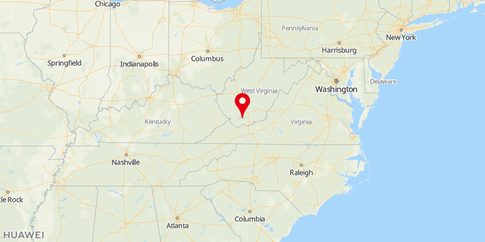
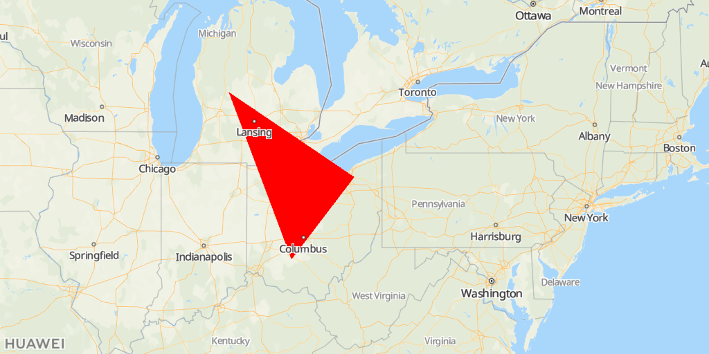
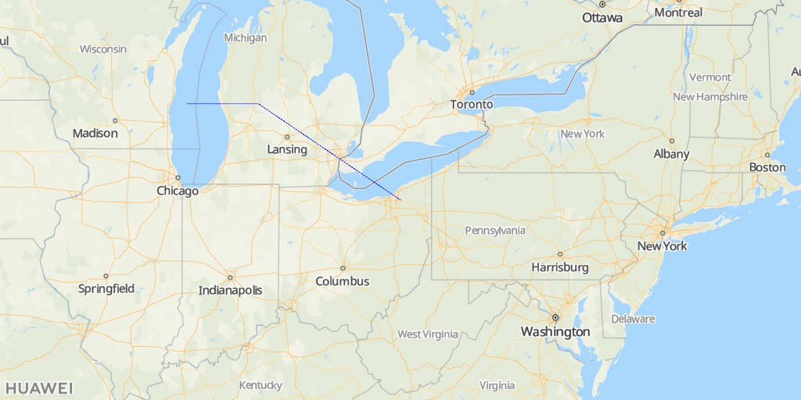

# Maps Static API<a name="ZH-CN_TOPIC_0000001145541055"></a>

-   [功能介绍](#section8455201431219)
-   [场景描述](#section733593991210)
-   [使用约束](#section5561220132)
-   [接口原型](#section195599118614)
-   [请求参数](#section23611821766)
-   [请求示例](#section71351039162)
-   [响应参数](#section157024016718)
-   [调用示例](#section284195414164)
    -   [\#ZH-CN\_TOPIC\_0000001145541055/section14325556781](#section14325556781)


## 功能介绍<a name="section8455201431219"></a>

静态图服务通过发送Http请求返回一张地图图片，您可以指定请求的地图位置、图片大小、以及在地图上添加覆盖物，如标签、折线、多边形。

<a name="table8143441144811"></a>
<table><tbody><tr id="row514364118481"><td class="row-nocellborder" style="border:none" valign="top" width="33.33333333333333%"><div class="fignone" id="fig19114135314216"><a name="fig19114135314216"></a><a name="fig19114135314216"></a><span class="figcap"><b>图1 </b>标签</span><br><a name="image926351316417"></a><a name="image926351316417"></a><span></span></div>
</td>
<td class="row-nocellborder" style="border:none" valign="top" width="33.33333333333333%"><div class="fignone" id="fig62631513541"><a name="fig62631513541"></a><a name="fig62631513541"></a><span class="figcap"><b>图2 </b>多边形</span><br><a name="image1519449542"></a><a name="image1519449542"></a><span></span></div>
</td>
<td class="cellrowborder" style="border:none" valign="top" width="33.33333333333333%"><div class="fignone" id="fig21944912410"><a name="fig21944912410"></a><a name="fig21944912410"></a><span class="figcap"><b>图3 </b>折线</span><br><a name="image129120817619"></a><a name="image129120817619"></a><span></span></div>
</td>
</tr>
</tbody>
</table>

## 场景描述<a name="section733593991210"></a>

通过HTTP请求发送的URL参数创建地图图片并直接嵌入到网页中，而无需通过JavaScript或动态页面加载。

## 使用约束<a name="section5561220132"></a>

服务调用量的限制请查看[服务定价](zh-cn_topic_0000001145860925.md)。

## 接口原型<a name="section195599118614"></a>

<a name="table11154520143815"></a>
<table><tbody><tr id="row18154202003811"><th class="firstcol" valign="top" width="20%" id="mcps1.1.3.1.1"><p id="p101546202386"><a name="p101546202386"></a><a name="p101546202386"></a>承载协议</p>
</th>
<td class="cellrowborder" valign="top" width="80%" headers="mcps1.1.3.1.1 "><p id="p81541720123818"><a name="p81541720123818"></a><a name="p81541720123818"></a>HTTPS GET</p>
</td>
</tr>
<tr id="row1115462019387"><th class="firstcol" valign="top" width="20%" id="mcps1.1.3.2.1"><p id="p12756174203813"><a name="p12756174203813"></a><a name="p12756174203813"></a>接口方向</p>
</th>
<td class="cellrowborder" valign="top" width="80%" headers="mcps1.1.3.2.1 "><p id="p16154112093811"><a name="p16154112093811"></a><a name="p16154112093811"></a>开发者-&gt;华为地图服务器</p>
</td>
</tr>
<tr id="row215413208388"><th class="firstcol" valign="top" width="20%" id="mcps1.1.3.3.1"><p id="p19782114513386"><a name="p19782114513386"></a><a name="p19782114513386"></a>接口URL</p>
</th>
<td class="cellrowborder" valign="top" width="80%" headers="mcps1.1.3.3.1 "><p id="p9827850185319"><a name="p9827850185319"></a><a name="p9827850185319"></a>https://mapapi.cloud.huawei.com/mapApi/v1/mapService/getStaticMap?参数?key=<i><span class="varname" id="varname168423113295"><a name="varname168423113295"></a><a name="varname168423113295"></a>API KEY</span></i></p>
<div class="note" id="note65176364306"><a name="note65176364306"></a><a name="note65176364306"></a><span class="notetitle"> 说明： </span><div class="notebody"><a name="zh-cn_topic_0000001099181294_ol42140252365"></a><a name="zh-cn_topic_0000001099181294_ol42140252365"></a><ol id="zh-cn_topic_0000001099181294_ol42140252365"><li>获取<i><span class="varname" id="zh-cn_topic_0000001099181294_varname6145746111817"><a name="zh-cn_topic_0000001099181294_varname6145746111817"></a><a name="zh-cn_topic_0000001099181294_varname6145746111817"></a>API KEY</span></i>的方式请参见<a href="zh-cn_topic_0000001099501072.md#section169441820428">获取API Key</a>。</li><li>使用API Key时需要调用URLEncoder.encode("Your apiKey", "UTF-8")方法对API Key进行encodeURI编码。例如：原始API Key：ABC/DFG+ ，转换结果：ABC%2FDFG%2B。</li></ol>
</div></div>
</td>
</tr>
<tr id="row39361834214"><th class="firstcol" valign="top" width="20%" id="mcps1.1.3.4.1"><p id="p59410184422"><a name="p59410184422"></a><a name="p59410184422"></a>数据格式</p>
</th>
<td class="cellrowborder" valign="top" width="80%" headers="mcps1.1.3.4.1 "><p id="p919916013510"><a name="p919916013510"></a><a name="p919916013510"></a>响应消息：Content-Type: image/png</p>
</td>
</tr>
</tbody>
</table>

## 请求参数<a name="section23611821766"></a>

**Query String**

<a name="table77202273214"></a>
<table><thead align="left"><tr id="row11729225326"><th class="cellrowborder" valign="top" width="18%" id="mcps1.1.5.1.1"><p id="p87210228329"><a name="p87210228329"></a><a name="p87210228329"></a>参数</p>
</th>
<th class="cellrowborder" valign="top" width="14.000000000000002%" id="mcps1.1.5.1.2"><p id="p129581029151016"><a name="p129581029151016"></a><a name="p129581029151016"></a>是否必选</p>
</th>
<th class="cellrowborder" valign="top" width="16%" id="mcps1.1.5.1.3"><p id="p18726222329"><a name="p18726222329"></a><a name="p18726222329"></a>参数类型</p>
</th>
<th class="cellrowborder" valign="top" width="52%" id="mcps1.1.5.1.4"><p id="p67242210323"><a name="p67242210323"></a><a name="p67242210323"></a>描述</p>
</th>
</tr>
</thead>
<tbody><tr id="row1872122203212"><td class="cellrowborder" valign="top" width="18%" headers="mcps1.1.5.1.1 "><p id="p6274235149"><a name="p6274235149"></a><a name="p6274235149"></a>width</p>
</td>
<td class="cellrowborder" valign="top" width="14.000000000000002%" headers="mcps1.1.5.1.2 "><p id="p1295852931019"><a name="p1295852931019"></a><a name="p1295852931019"></a>是</p>
</td>
<td class="cellrowborder" valign="top" width="16%" headers="mcps1.1.5.1.3 "><p id="p95731160406"><a name="p95731160406"></a><a name="p95731160406"></a>Integer</p>
</td>
<td class="cellrowborder" valign="top" width="52%" headers="mcps1.1.5.1.4 "><p id="p13388122364019"><a name="p13388122364019"></a><a name="p13388122364019"></a>图片宽度。scale=1，取值范围：(0, 1024]，scale=2，取值范围：(0, 512]</p>
</td>
</tr>
<tr id="row1772422133216"><td class="cellrowborder" valign="top" width="18%" headers="mcps1.1.5.1.1 "><p id="p127414351843"><a name="p127414351843"></a><a name="p127414351843"></a>height</p>
</td>
<td class="cellrowborder" valign="top" width="14.000000000000002%" headers="mcps1.1.5.1.2 "><p id="p995892921018"><a name="p995892921018"></a><a name="p995892921018"></a>是</p>
</td>
<td class="cellrowborder" valign="top" width="16%" headers="mcps1.1.5.1.3 "><p id="p55731816194019"><a name="p55731816194019"></a><a name="p55731816194019"></a>Integer</p>
</td>
<td class="cellrowborder" valign="top" width="52%" headers="mcps1.1.5.1.4 "><p id="p123881323134015"><a name="p123881323134015"></a><a name="p123881323134015"></a>图片高度。scale=1，取值范围：(0, 1024]，scale=2，取值范围：(0, 512]。</p>
</td>
</tr>
<tr id="row1872722153217"><td class="cellrowborder" valign="top" width="18%" headers="mcps1.1.5.1.1 "><p id="p127413514420"><a name="p127413514420"></a><a name="p127413514420"></a>location</p>
</td>
<td class="cellrowborder" valign="top" width="14.000000000000002%" headers="mcps1.1.5.1.2 "><p id="p19581029131019"><a name="p19581029131019"></a><a name="p19581029131019"></a>否</p>
</td>
<td class="cellrowborder" valign="top" width="16%" headers="mcps1.1.5.1.3 "><p id="p327483510411"><a name="p327483510411"></a><a name="p327483510411"></a>String</p>
</td>
<td class="cellrowborder" valign="top" width="52%" headers="mcps1.1.5.1.4 "><p id="p62741135148"><a name="p62741135148"></a><a name="p62741135148"></a>地址信息，支持经纬度、地址。经纬度采用逗号分隔，经纬度格式是：latitude,longitude，例如：41.43206,-81.38992，如无markers/path则是必选。</p>
</td>
</tr>
<tr id="row89629259496"><td class="cellrowborder" valign="top" width="18%" headers="mcps1.1.5.1.1 "><p id="p29631525154917"><a name="p29631525154917"></a><a name="p29631525154917"></a>zoom</p>
</td>
<td class="cellrowborder" valign="top" width="14.000000000000002%" headers="mcps1.1.5.1.2 "><p id="p396332510491"><a name="p396332510491"></a><a name="p396332510491"></a>否</p>
</td>
<td class="cellrowborder" valign="top" width="16%" headers="mcps1.1.5.1.3 "><p id="p2096392516497"><a name="p2096392516497"></a><a name="p2096392516497"></a>int</p>
</td>
<td class="cellrowborder" valign="top" width="52%" headers="mcps1.1.5.1.4 "><p id="p29631425114915"><a name="p29631425114915"></a><a name="p29631425114915"></a>缩放级别，如无markers/path则是必选。</p>
</td>
</tr>
<tr id="row869415407514"><td class="cellrowborder" valign="top" width="18%" headers="mcps1.1.5.1.1 "><p id="p136942409514"><a name="p136942409514"></a><a name="p136942409514"></a>scale</p>
</td>
<td class="cellrowborder" valign="top" width="14.000000000000002%" headers="mcps1.1.5.1.2 "><p id="p1915472914536"><a name="p1915472914536"></a><a name="p1915472914536"></a>否</p>
</td>
<td class="cellrowborder" valign="top" width="16%" headers="mcps1.1.5.1.3 "><p id="p36941740185112"><a name="p36941740185112"></a><a name="p36941740185112"></a>Integer</p>
</td>
<td class="cellrowborder" valign="top" width="52%" headers="mcps1.1.5.1.4 "><p id="p1969484095119"><a name="p1969484095119"></a><a name="p1969484095119"></a>清晰度比较尺。默认值为1，有效值为1和2。</p>
</td>
</tr>
<tr id="row103278557514"><td class="cellrowborder" valign="top" width="18%" headers="mcps1.1.5.1.1 "><p id="p932785595113"><a name="p932785595113"></a><a name="p932785595113"></a>pattern</p>
</td>
<td class="cellrowborder" valign="top" width="14.000000000000002%" headers="mcps1.1.5.1.2 "><p id="p1743113012534"><a name="p1743113012534"></a><a name="p1743113012534"></a>否</p>
</td>
<td class="cellrowborder" valign="top" width="16%" headers="mcps1.1.5.1.3 "><p id="p3327155115115"><a name="p3327155115115"></a><a name="p3327155115115"></a>String</p>
</td>
<td class="cellrowborder" valign="top" width="52%" headers="mcps1.1.5.1.4 "><p id="p11327155125112"><a name="p11327155125112"></a><a name="p11327155125112"></a>图片格式，当前只支持PNG。</p>
</td>
</tr>
<tr id="row2124425218"><td class="cellrowborder" valign="top" width="18%" headers="mcps1.1.5.1.1 "><p id="p1012194125213"><a name="p1012194125213"></a><a name="p1012194125213"></a>mapType</p>
</td>
<td class="cellrowborder" valign="top" width="14.000000000000002%" headers="mcps1.1.5.1.2 "><p id="p17983113110532"><a name="p17983113110532"></a><a name="p17983113110532"></a>否</p>
</td>
<td class="cellrowborder" valign="top" width="16%" headers="mcps1.1.5.1.3 "><p id="p191274105210"><a name="p191274105210"></a><a name="p191274105210"></a>String</p>
</td>
<td class="cellrowborder" valign="top" width="52%" headers="mcps1.1.5.1.4 "><p id="p17124418521"><a name="p17124418521"></a><a name="p17124418521"></a>标准roadmap，当前暂只支持标准roadmap。</p>
</td>
</tr>
<tr id="row4971125165213"><td class="cellrowborder" valign="top" width="18%" headers="mcps1.1.5.1.1 "><p id="p79711510525"><a name="p79711510525"></a><a name="p79711510525"></a>language</p>
</td>
<td class="cellrowborder" valign="top" width="14.000000000000002%" headers="mcps1.1.5.1.2 "><p id="p187831933205320"><a name="p187831933205320"></a><a name="p187831933205320"></a>否</p>
</td>
<td class="cellrowborder" valign="top" width="16%" headers="mcps1.1.5.1.3 "><p id="p14971195185212"><a name="p14971195185212"></a><a name="p14971195185212"></a>String</p>
</td>
<td class="cellrowborder" valign="top" width="52%" headers="mcps1.1.5.1.4 "><p id="p8345165225411"><a name="p8345165225411"></a><a name="p8345165225411"></a>图片显示语种，语言编码支持ISO 639-2 Code和BCP47。推荐使用BCP47，取值范围参见<a href="zh-cn_topic_0000001145860921.md">支持的语言</a>。</p>
</td>
</tr>
<tr id="row2244727522"><td class="cellrowborder" valign="top" width="18%" headers="mcps1.1.5.1.1 "><p id="p5244152185210"><a name="p5244152185210"></a><a name="p5244152185210"></a>markers</p>
</td>
<td class="cellrowborder" valign="top" width="14.000000000000002%" headers="mcps1.1.5.1.2 "><p id="p17631173517538"><a name="p17631173517538"></a><a name="p17631173517538"></a>否</p>
</td>
<td class="cellrowborder" valign="top" width="16%" headers="mcps1.1.5.1.3 "><p id="p1424422135213"><a name="p1424422135213"></a><a name="p1424422135213"></a>String</p>
</td>
<td class="cellrowborder" valign="top" width="52%" headers="mcps1.1.5.1.4 "><p id="p16534181016554"><a name="p16534181016554"></a><a name="p16534181016554"></a>marker描述信息，支持Marker样式、经纬度或地址，支持输入多组位置信息，通过|分开。</p>
<p id="p10534910155517"><a name="p10534910155517"></a><a name="p10534910155517"></a>markers=Marker样式|{纬度1,经度1}|{纬度2,经度2}|地址，如果不指定Marker样式，使用markerStyles作为默认样式。</p>
<div class="note" id="note156388351270"><a name="note156388351270"></a><a name="note156388351270"></a><span class="notetitle"> 说明： </span><div class="notebody"><p id="p1063853592711"><a name="p1063853592711"></a><a name="p1063853592711"></a>markers/path和location/zoom至少需要输入一组。如果都存在，以location/zoom为主。</p>
</div></div>
</td>
</tr>
<tr id="row8561183519529"><td class="cellrowborder" valign="top" width="18%" headers="mcps1.1.5.1.1 "><p id="p1656163515211"><a name="p1656163515211"></a><a name="p1656163515211"></a>markerStyles</p>
</td>
<td class="cellrowborder" valign="top" width="14.000000000000002%" headers="mcps1.1.5.1.2 "><p id="p1591636145316"><a name="p1591636145316"></a><a name="p1591636145316"></a>否</p>
</td>
<td class="cellrowborder" valign="top" width="16%" headers="mcps1.1.5.1.3 "><p id="p1356103555217"><a name="p1356103555217"></a><a name="p1356103555217"></a>String</p>
</td>
<td class="cellrowborder" valign="top" width="52%" headers="mcps1.1.5.1.4 "><p id="p39481453923"><a name="p39481453923"></a><a name="p39481453923"></a>marker样式描述信息，可指定的属性包括size，label和color。</p>
<p id="p1248518173556"><a name="p1248518173556"></a><a name="p1248518173556"></a>参考样例： size:mid|color:black|label:C。</p>
</td>
</tr>
<tr id="row325873819525"><td class="cellrowborder" valign="top" width="18%" headers="mcps1.1.5.1.1 "><p id="p192581238185218"><a name="p192581238185218"></a><a name="p192581238185218"></a>path</p>
</td>
<td class="cellrowborder" valign="top" width="14.000000000000002%" headers="mcps1.1.5.1.2 "><p id="p13910372537"><a name="p13910372537"></a><a name="p13910372537"></a>否</p>
</td>
<td class="cellrowborder" valign="top" width="16%" headers="mcps1.1.5.1.3 "><p id="p525863820526"><a name="p525863820526"></a><a name="p525863820526"></a>String</p>
</td>
<td class="cellrowborder" valign="top" width="52%" headers="mcps1.1.5.1.4 "><p id="p12214103225518"><a name="p12214103225518"></a><a name="p12214103225518"></a>Path描述信息，支持Path样式、经纬度或地址，支持输入多组位置信息，通过|分开。</p>
<p id="p192141532125515"><a name="p192141532125515"></a><a name="p192141532125515"></a>path=Path样式|{纬度1,经度1}|{纬度2,经度2}|地址，如果不指定Path样式，使用pathStyles作为默认样式。</p>
<div class="note" id="note189871157112718"><a name="note189871157112718"></a><a name="note189871157112718"></a><span class="notetitle"> 说明： </span><div class="notebody"><p id="p7987125712712"><a name="p7987125712712"></a><a name="p7987125712712"></a>markers/path和location/zoom至少需要输入一组。如果都存在，以location/zoom为主。</p>
</div></div>
</td>
</tr>
<tr id="row14935757175214"><td class="cellrowborder" valign="top" width="18%" headers="mcps1.1.5.1.1 "><p id="p593585711524"><a name="p593585711524"></a><a name="p593585711524"></a>pathStyles</p>
</td>
<td class="cellrowborder" valign="top" width="14.000000000000002%" headers="mcps1.1.5.1.2 "><p id="p142951938155312"><a name="p142951938155312"></a><a name="p142951938155312"></a>否</p>
</td>
<td class="cellrowborder" valign="top" width="16%" headers="mcps1.1.5.1.3 "><p id="p59351657195214"><a name="p59351657195214"></a><a name="p59351657195214"></a>String</p>
</td>
<td class="cellrowborder" valign="top" width="52%" headers="mcps1.1.5.1.4 "><p id="p690218417558"><a name="p690218417558"></a><a name="p690218417558"></a>path样式描述信息，可指定的属性包括color、weight和fillcolor。如果有fillcolor，表示path是多边形，否则是折线。</p>
<p id="p5902124116551"><a name="p5902124116551"></a><a name="p5902124116551"></a>参考样例：color:0x0000ff80|weight:1|fillcolor:0x0000ff80。</p>
</td>
</tr>
<tr id="row8430160165316"><td class="cellrowborder" valign="top" width="18%" headers="mcps1.1.5.1.1 "><p id="p124311102539"><a name="p124311102539"></a><a name="p124311102539"></a>logo</p>
</td>
<td class="cellrowborder" valign="top" width="14.000000000000002%" headers="mcps1.1.5.1.2 "><p id="p921511390532"><a name="p921511390532"></a><a name="p921511390532"></a>否</p>
</td>
<td class="cellrowborder" valign="top" width="16%" headers="mcps1.1.5.1.3 "><p id="p194317015312"><a name="p194317015312"></a><a name="p194317015312"></a>String</p>
</td>
<td class="cellrowborder" valign="top" width="52%" headers="mcps1.1.5.1.4 "><p id="p10690154955515"><a name="p10690154955515"></a><a name="p10690154955515"></a>logo样式描述信息，可指定的属性包括size、logoAnchor。</p>
<p id="p1869034985514"><a name="p1869034985514"></a><a name="p1869034985514"></a>参考样例：size:logo_normal|logoAnchor:bottomleft。</p>
</td>
</tr>
</tbody>
</table>

## 请求示例<a name="section71351039162"></a>

```
GET
https://mapapi.cloud.huawei.com/mapApi/v1/mapService/getStaticMap?
width=1024&
height=512&
location=41.43206,-81.38992&
scale=1&
zoom=5&
language=en&
logo=size:logo_normal|logoAnchor:bottomleft&
markers={41.43206,-81.38992}&
markers={43.43206,-85.38992}&
markerStyles=size:tiny|color:blue|label:p&
path={41.43206,-81.38992}|{43.43206,-85.38992}&
path=fillcolor:red|{41.43206,-81.38992}|{43.43206,-85.38992}|{39.43206,-83.38992}&
pathStyles=weight:1|color:0x0000ff80|fillcolor:0x0000ff80&
key=xxx
```

转义后：

```
GET
https://mapapi.cloud.huawei.com/mapApi/v1/mapService/getStaticMap?
width=1024&
height=512&
location=41.43206,-81.38992&
scale=1&
zoom=5&
language=en&
logo=size:logo_normal%7ClogoAnchor:bottomleft&
markers=%7B41.43206,-81.38992%7D&
markers=%7B43.43206,-85.38992%7D&
markerStyles=size:tiny%7Ccolor:blue%7Clabel:p&
path=%7B41.43206,-81.38992%7D%7C%7B43.43206,-85.38992%7D&
path=fillcolor:red%7C%7B41.43206,-81.38992%7D%7C%7B43.43206,-85.38992%7D%7C%7B39.43206,-83.38992%7D&
pathStyles=weight:1%7Ccolor:0x0000ff80%7Cfillcolor:0x0000ff80&
key=xxx
```

> **说明：** 
>请求时需要对符号进行转义，’|‘符号转义为**%7C**，’\{‘ 符号转义为**%7B**，’\}‘ 符号转义为**%7D**。

## 响应参数<a name="section157024016718"></a>

**状态码为200时：**

**Response Header**

<a name="table12509142914219"></a>
<table><thead align="left"><tr id="row1150982918214"><th class="cellrowborder" valign="top" width="18%" id="mcps1.1.5.1.1"><p id="p10509329102114"><a name="p10509329102114"></a><a name="p10509329102114"></a>参数</p>
</th>
<th class="cellrowborder" valign="top" width="14.000000000000002%" id="mcps1.1.5.1.2"><p id="p16509129132117"><a name="p16509129132117"></a><a name="p16509129132117"></a>是否必选</p>
</th>
<th class="cellrowborder" valign="top" width="18%" id="mcps1.1.5.1.3"><p id="p12509132915214"><a name="p12509132915214"></a><a name="p12509132915214"></a>参数类型</p>
</th>
<th class="cellrowborder" valign="top" width="50%" id="mcps1.1.5.1.4"><p id="p1650992972118"><a name="p1650992972118"></a><a name="p1650992972118"></a>描述</p>
</th>
</tr>
</thead>
<tbody><tr id="row18510102912216"><td class="cellrowborder" valign="top" width="18%" headers="mcps1.1.5.1.1 "><p id="p15510162932115"><a name="p15510162932115"></a><a name="p15510162932115"></a>Content-Type</p>
</td>
<td class="cellrowborder" valign="top" width="14.000000000000002%" headers="mcps1.1.5.1.2 "><p id="p19510112919214"><a name="p19510112919214"></a><a name="p19510112919214"></a>是</p>
</td>
<td class="cellrowborder" valign="top" width="18%" headers="mcps1.1.5.1.3 "><p id="p205101929182117"><a name="p205101929182117"></a><a name="p205101929182117"></a>image/png</p>
</td>
<td class="cellrowborder" valign="top" width="50%" headers="mcps1.1.5.1.4 "><p id="p1951092919216"><a name="p1951092919216"></a><a name="p1951092919216"></a>响应消息的数据格式。</p>
</td>
</tr>
</tbody>
</table>

**Response Body**

<a name="table157795718811"></a>
<table><thead align="left"><tr id="row277457982"><th class="cellrowborder" valign="top" width="20%" id="mcps1.1.4.1.1"><p id="p27785719818"><a name="p27785719818"></a><a name="p27785719818"></a>参数</p>
</th>
<th class="cellrowborder" valign="top" width="20%" id="mcps1.1.4.1.2"><p id="p16771157882"><a name="p16771157882"></a><a name="p16771157882"></a>参数类型</p>
</th>
<th class="cellrowborder" valign="top" width="60%" id="mcps1.1.4.1.3"><p id="p47712576815"><a name="p47712576815"></a><a name="p47712576815"></a>描述</p>
</th>
</tr>
</thead>
<tbody><tr id="row20774571781"><td class="cellrowborder" valign="top" width="20%" headers="mcps1.1.4.1.1 "><p id="p112811901011"><a name="p112811901011"></a><a name="p112811901011"></a>Body</p>
</td>
<td class="cellrowborder" valign="top" width="20%" headers="mcps1.1.4.1.2 "><p id="p1028139181014"><a name="p1028139181014"></a><a name="p1028139181014"></a>String</p>
</td>
<td class="cellrowborder" valign="top" width="60%" headers="mcps1.1.4.1.3 "><p id="p201582019431"><a name="p201582019431"></a><a name="p201582019431"></a>静态图。</p>
</td>
</tr>
</tbody>
</table>

## 调用示例<a name="section284195414164"></a>

```
public class GetStaticMapService {
    OkHttpClient client = new OkHttpClient();

    Request request = new Request.Builder()
            .url("https://mapapi.cloud.huawei.com/mapApi/v1/mapService/getStaticMap? " +
                    // 设置返回图片宽度为1024
                    "width=1024&" +
                    // 设置返回图片高度为512
                    "height=512&" +
                    // 地址信息，纬度：41.43206，经度：-81.38992
                    "location=41.43206%2C-81.38992&" +
                    // 设置清晰度比较尺为1
                    "scale=1&" +
                    // 设置缩放级别为5
                    "zoom=5&" +
                    // 设置图片格式：png
                    "pattern=PNG&" +
                    // 设置图片显示的语言为英语
                    "language=en&" +
                    // logo样式描述
                    "logo=size%3Alogo_normal%7ClogoAnchor%3Abottomleft&" +
                    // maker描述信息，纬度：41.43206，经度：-81.38992
                    "markers=%7B41.43206%2C-81.38992%7D&" +
                    // maker描述信息，纬度：43.43206，经度：-85.38992
                    "markers=%7B43.43206%2C-85.38992%7D&" +
                    // maker样式描述信息
                    "markerStyles=size%3Atiny%7Ccolor%3Ablue%7Clabel%3Amjy&" +
                    // path描述信息，{纬度，经度}：{41.43206，-81.38992}|{43.43206，-85.38992}
                    "path=%7B41.43206%2C-81.38992%7D%7C%7B43.43206%2C-85.38992%7D&" +
                    // path描述信息，样式为红色，{纬度，经度}：{41.43206，-81.38992}|{43.43206，-85.38992}|{39.43206，-83.38992}
                    "path=fillcolor%3Ared%7C%7B41.43206%2C-81.38992%7D%7C%7B43.43206%2C-85.38992%7D%7C%7B39.43206%2C-83.38992%7D&" +
                    // path样式描述信息
                    "pathStyles=weight%3A1%7Ccolor%3A0x0000ff80%7Cfillcolor%3A0x0000ff80&" +
                    "key=xxxx")
            .get()
            .build();

    Response response = client.newCall(request).execute();
}
```

**图 4**  获取静态图<a name="fig10996840165819"></a>  


