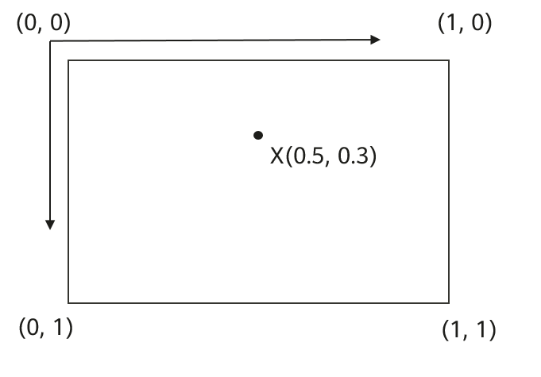

# Marker

-   [Public Method Summary](#section198571651191315)
-   [Public Methods](#section166797915511)
-   [equals](#section9995901416)
-   [getAlpha](#section19252111810145)
-   [getId](#section105771527101411)
-   [getPosition](#section49343761418)
-   [getRotation](#section26741745121414)
-   [getSnippet](#section7851155271416)
-   [getTag](#section1625517241520)
-   [getTitle](#section15178141116154)
-   [getZIndex](#section381418141514)
-   [hashCode](#section075815268151)
-   [hideInfoWindow](#section352393481515)
-   [isClusterable](#section12103164219159)
-   [isDraggable](#section1947358193318)
-   [isFlat](#section16358133310341)
-   [isInfoWindowShown](#section643110419342)
-   [isVisible](#section2207551183412)
-   [remove](#section6594131123511)
-   [setAlpha](#section1776118819353)
-   [setAnchor](#section14156191615354)
-   [setAnimation](#section138322612114)
-   [setDraggable](#section58671625103515)
-   [setFlat](#section1797433173511)
-   [setIcon](#section1680710531355)
-   [setInfoWindowAnchor](#section1858016183620)
-   [setMarkerAnchor](#section992613197119)
-   [setPosition](#section13917151362)
-   [h2setRotation](#section1989919222361)
-   [setSnippet](#section165927340363)
-   [setTag](#section893234843611)
-   [setTitle](#section13963185519361)
-   [setVisible](#section1775916212376)
-   [setZIndex](#section952413920376)
-   [showInfoWindow](#section13223817123711)
-   [startAnimation](#section13557451287)

<table><thead align="left"><tr id="row14559mcpsimp"><th class="cellrowborder" valign="top" width="100%" id="mcps1.1.2.1.1">
Class Info

</th>
</tr>
</thead>
<tbody><tr id="row14562mcpsimp"><td class="cellrowborder" valign="top" width="100%" headers="mcps1.1.2.1.1 ">
public class Marker

放在地图指定位置的图标，在调用<a href="huaweimap.md">HuaweiMap</a>类的<a href="huaweimap.md#section84151866413">addMarker</a>方法时会返回该类型的实例。

</td>
</tr>
</tbody>
</table>

## Public Method Summary

<table><thead align="left"><tr id="row14584mcpsimp"><th class="cellrowborder" valign="top" width="40%" id="mcps1.1.3.1.1">
Qualifier and Type

</th>
<th class="cellrowborder" valign="top" width="60%" id="mcps1.1.3.1.2">
Method Name and Description

</th>
</tr>
</thead>
<tbody><tr id="row14589mcpsimp"><td class="cellrowborder" valign="top" width="40%" headers="mcps1.1.3.1.1 ">
boolean

</td>
<td class="cellrowborder" valign="top" width="60%" headers="mcps1.1.3.1.2 ">
<a href="#section9995901416">equals</a>(Object other)

判断两个标记对象是否相等。

</td>
</tr>
<tr id="row14594mcpsimp"><td class="cellrowborder" valign="top" width="40%" headers="mcps1.1.3.1.1 ">
float

</td>
<td class="cellrowborder" valign="top" width="60%" headers="mcps1.1.3.1.2 ">
<a href="#section19252111810145">getAlpha</a>()

获取标记的透明度。

</td>
</tr>
<tr id="row14599mcpsimp"><td class="cellrowborder" valign="top" width="40%" headers="mcps1.1.3.1.1 ">
String

</td>
<td class="cellrowborder" valign="top" width="60%" headers="mcps1.1.3.1.2 ">
<a href="#section105771527101411">getId</a>()

获取标记的ID属性。

</td>
</tr>
<tr id="row14604mcpsimp"><td class="cellrowborder" valign="top" width="40%" headers="mcps1.1.3.1.1 ">
LatLng

</td>
<td class="cellrowborder" valign="top" width="60%" headers="mcps1.1.3.1.2 ">
<a href="#section49343761418">getPosition</a>()

获取标记的位置。

</td>
</tr>
<tr id="row14609mcpsimp"><td class="cellrowborder" valign="top" width="40%" headers="mcps1.1.3.1.1 ">
float

</td>
<td class="cellrowborder" valign="top" width="60%" headers="mcps1.1.3.1.2 ">
<a href="#section26741745121414">getRotation</a>()

获取标记的旋转角度。

</td>
</tr>
<tr id="row14614mcpsimp"><td class="cellrowborder" valign="top" width="40%" headers="mcps1.1.3.1.1 ">
String

</td>
<td class="cellrowborder" valign="top" width="60%" headers="mcps1.1.3.1.2 ">
<a href="#section7851155271416">getSnippet</a>()

获取标记的文字片段。

</td>
</tr>
<tr id="row14619mcpsimp"><td class="cellrowborder" valign="top" width="40%" headers="mcps1.1.3.1.1 ">
Object

</td>
<td class="cellrowborder" valign="top" width="60%" headers="mcps1.1.3.1.2 ">
<a href="#section1625517241520">getTag</a>()

获取标记的tag属性。

</td>
</tr>
<tr id="row14624mcpsimp"><td class="cellrowborder" valign="top" width="40%" headers="mcps1.1.3.1.1 ">
String

</td>
<td class="cellrowborder" valign="top" width="60%" headers="mcps1.1.3.1.2 ">
<a href="#section15178141116154">getTitle</a>()

获取标记的标题。

</td>
</tr>
<tr id="row14629mcpsimp"><td class="cellrowborder" valign="top" width="40%" headers="mcps1.1.3.1.1 ">
float

</td>
<td class="cellrowborder" valign="top" width="60%" headers="mcps1.1.3.1.2 ">
<a href="#section381418141514">getZIndex</a>()

获取标记的z指数。

</td>
</tr>
<tr id="row14634mcpsimp"><td class="cellrowborder" valign="top" width="40%" headers="mcps1.1.3.1.1 ">
int

</td>
<td class="cellrowborder" valign="top" width="60%" headers="mcps1.1.3.1.2 ">
<a href="#section075815268151">hashCode</a>()

获取标记的哈希值。

</td>
</tr>
<tr id="row14639mcpsimp"><td class="cellrowborder" valign="top" width="40%" headers="mcps1.1.3.1.1 ">
void

</td>
<td class="cellrowborder" valign="top" width="60%" headers="mcps1.1.3.1.2 ">
<a href="#section352393481515">hideInfoWindow</a>()

隐藏标记的标记信息窗口。

</td>
</tr>
<tr id="row14644mcpsimp"><td class="cellrowborder" valign="top" width="40%" headers="mcps1.1.3.1.1 ">
boolean

</td>
<td class="cellrowborder" valign="top" width="60%" headers="mcps1.1.3.1.2 ">
<a href="#section12103164219159">isClusterable</a>()

获取标记的聚合属性。

</td>
</tr>
<tr id="row14649mcpsimp"><td class="cellrowborder" valign="top" width="40%" headers="mcps1.1.3.1.1 ">
boolean

</td>
<td class="cellrowborder" valign="top" width="60%" headers="mcps1.1.3.1.2 ">
<a href="#section1947358193318">isDraggable</a>()

获取标记是否可以长按拖拽。

</td>
</tr>
<tr id="row14654mcpsimp"><td class="cellrowborder" valign="top" width="40%" headers="mcps1.1.3.1.1 ">
boolean

</td>
<td class="cellrowborder" valign="top" width="60%" headers="mcps1.1.3.1.2 ">
<a href="#section16358133310341">isFlat</a>()

获取标记是否平贴地图。

</td>
</tr>
<tr id="row14659mcpsimp"><td class="cellrowborder" valign="top" width="40%" headers="mcps1.1.3.1.1 ">
boolean

</td>
<td class="cellrowborder" valign="top" width="60%" headers="mcps1.1.3.1.2 ">
<a href="#section643110419342">isInfoWindowShown</a>()

获取标记的标记信息窗口是否在展示状态。

</td>
</tr>
<tr id="row14664mcpsimp"><td class="cellrowborder" valign="top" width="40%" headers="mcps1.1.3.1.1 ">
boolean

</td>
<td class="cellrowborder" valign="top" width="60%" headers="mcps1.1.3.1.2 ">
<a href="#section2207551183412">isVisible</a>()

获取标记的可见性。

</td>
</tr>
<tr id="row14669mcpsimp"><td class="cellrowborder" valign="top" width="40%" headers="mcps1.1.3.1.1 ">
void

</td>
<td class="cellrowborder" valign="top" width="60%" headers="mcps1.1.3.1.2 ">
<a href="#section6594131123511">remove</a>()

从地图移除标记。

</td>
</tr>
<tr id="row14674mcpsimp"><td class="cellrowborder" valign="top" width="40%" headers="mcps1.1.3.1.1 ">
void

</td>
<td class="cellrowborder" valign="top" width="60%" headers="mcps1.1.3.1.2 ">
<a href="#section1776118819353">setAlpha</a>(float alpha)

设置标记的透明度属性。

</td>
</tr>
<tr id="row14679mcpsimp"><td class="cellrowborder" valign="top" width="40%" headers="mcps1.1.3.1.1 ">
void

</td>
<td class="cellrowborder" valign="top" width="60%" headers="mcps1.1.3.1.2 ">
<a href="#section14156191615354">setAnchor</a>(float anchorU, float anchorV)

设置标记的锚点位置。

 注意： 

该接口已弃用，设置锚点位置请使用<a href="#section992613197119">setMarkerAnchor</a>。

</td>
</tr>
<tr id="row123527111969"><td class="cellrowborder" valign="top" width="40%" headers="mcps1.1.3.1.1 ">
void

</td>
<td class="cellrowborder" valign="top" width="60%" headers="mcps1.1.3.1.2 ">
<a href="#section138322612114">setAnimation</a>(<a href="animation.md">Animation</a> animation)

设置标记的动画。

</td>
</tr>
<tr id="row14684mcpsimp"><td class="cellrowborder" valign="top" width="40%" headers="mcps1.1.3.1.1 ">
void

</td>
<td class="cellrowborder" valign="top" width="60%" headers="mcps1.1.3.1.2 ">
<a href="#section58671625103515">setDraggable</a>(boolean draggable)

设置标记是否可以长按拖拽。

</td>
</tr>
<tr id="row14689mcpsimp"><td class="cellrowborder" valign="top" width="40%" headers="mcps1.1.3.1.1 ">
void

</td>
<td class="cellrowborder" valign="top" width="60%" headers="mcps1.1.3.1.2 ">
<a href="#section1797433173511">setFlat</a>(boolean flat)

设置标记是否平贴地图。

</td>
</tr>
<tr id="row14694mcpsimp"><td class="cellrowborder" valign="top" width="40%" headers="mcps1.1.3.1.1 ">
void

</td>
<td class="cellrowborder" valign="top" width="60%" headers="mcps1.1.3.1.2 ">
<a href="#section1680710531355">setIcon</a>(<a href="bitmapdescriptor.md">BitmapDescriptor </a>iconDescriptor)

设置标记的图标。

</td>
</tr>
<tr id="row14699mcpsimp"><td class="cellrowborder" valign="top" width="40%" headers="mcps1.1.3.1.1 ">
void

</td>
<td class="cellrowborder" valign="top" width="60%" headers="mcps1.1.3.1.2 ">
<a href="#section1858016183620">setInfoWindowAnchor</a>(float anchorU, float anchorV)

设置标记的标记信息窗口的锚点坐标， 这是在与锚点相同的坐标系中指定的， 默认值为标记图像的顶部中间。

</td>
</tr>
<tr id="row1810414251193"><td class="cellrowborder" valign="top" width="40%" headers="mcps1.1.3.1.1 ">
void

</td>
<td class="cellrowborder" valign="top" width="60%" headers="mcps1.1.3.1.2 ">
<a href="#section992613197119">setMarkerAnchor</a>(float anchorU, float anchorV)

设置标记的锚点位置。

</td>
</tr>
<tr id="row14704mcpsimp"><td class="cellrowborder" valign="top" width="40%" headers="mcps1.1.3.1.1 ">
void

</td>
<td class="cellrowborder" valign="top" width="60%" headers="mcps1.1.3.1.2 ">
<a href="#section13917151362">setPosition</a>(<a href="latlng.md">LatLng</a> latLng)

设置标记的位置坐标。

</td>
</tr>
<tr id="row14709mcpsimp"><td class="cellrowborder" valign="top" width="40%" headers="mcps1.1.3.1.1 ">
void

</td>
<td class="cellrowborder" valign="top" width="60%" headers="mcps1.1.3.1.2 ">
<a href="#section1989919222361">setRotation</a>(float rotation)

设置标记的旋转角度，即标记围绕标记锚点顺时针旋转的角度，旋转轴垂直于标记。

</td>
</tr>
<tr id="row14714mcpsimp"><td class="cellrowborder" valign="top" width="40%" headers="mcps1.1.3.1.1 ">
void

</td>
<td class="cellrowborder" valign="top" width="60%" headers="mcps1.1.3.1.2 ">
<a href="#section165927340363">setSnippet</a>(String snippet)

设置标记的文字片段，如果为空，则不显示文字片段。

</td>
</tr>
<tr id="row14719mcpsimp"><td class="cellrowborder" valign="top" width="40%" headers="mcps1.1.3.1.1 ">
void

</td>
<td class="cellrowborder" valign="top" width="60%" headers="mcps1.1.3.1.2 ">
<a href="#section893234843611">setTag</a>(Object tag)

设置标记的tag属性，如果为空，则清除tag。

</td>
</tr>
<tr id="row14724mcpsimp"><td class="cellrowborder" valign="top" width="40%" headers="mcps1.1.3.1.1 ">
void

</td>
<td class="cellrowborder" valign="top" width="60%" headers="mcps1.1.3.1.2 ">
<a href="#section13963185519361">setTitle</a>(String title)

设置标记的标题，默认为空。

</td>
</tr>
<tr id="row14729mcpsimp"><td class="cellrowborder" valign="top" width="40%" headers="mcps1.1.3.1.1 ">
void

</td>
<td class="cellrowborder" valign="top" width="60%" headers="mcps1.1.3.1.2 ">
<a href="#section1775916212376">setVisible</a>(boolean visible)

设置标记的可见性。

</td>
</tr>
<tr id="row14734mcpsimp"><td class="cellrowborder" valign="top" width="40%" headers="mcps1.1.3.1.1 ">
void

</td>
<td class="cellrowborder" valign="top" width="60%" headers="mcps1.1.3.1.2 ">
<a href="#section952413920376">setZIndex</a>(float zIndex)

设置标记的z指数。

</td>
</tr>
<tr id="row14739mcpsimp"><td class="cellrowborder" valign="top" width="40%" headers="mcps1.1.3.1.1 ">
void

</td>
<td class="cellrowborder" valign="top" width="60%" headers="mcps1.1.3.1.2 ">
<a href="#section13223817123711">showInfoWindow</a>()

展示标记的标记信息窗口。

</td>
</tr>
<tr id="row19417124219719"><td class="cellrowborder" valign="top" width="40%" headers="mcps1.1.3.1.1 ">
void

</td>
<td class="cellrowborder" valign="top" width="60%" headers="mcps1.1.3.1.2 ">
<a href="#section13557451287">startAnimation</a>()

使标记开始动画。

</td>
</tr>
</tbody>
</table>

## Public Methods

## equals

<table><thead align="left"><tr id="row14750mcpsimp"><th class="cellrowborder" valign="top" width="100%" id="mcps1.1.2.1.1">
Method

</th>
</tr>
</thead>
<tbody><tr id="row14753mcpsimp"><td class="cellrowborder" valign="top" width="100%" headers="mcps1.1.2.1.1 ">
public boolean equals(Object other)

判断两个标记对象是否相等。

</td>
</tr>
</tbody>
</table>

**Parameters**

<table><thead align="left"><tr id="row14766mcpsimp"><th class="cellrowborder" valign="top" width="47%" id="mcps1.1.3.1.1">
Name

</th>
<th class="cellrowborder" valign="top" width="53%" id="mcps1.1.3.1.2">
Description

</th>
</tr>
</thead>
<tbody><tr id="row14771mcpsimp"><td class="cellrowborder" valign="top" width="47%" headers="mcps1.1.3.1.1 ">
other

</td>
<td class="cellrowborder" valign="top" width="53%" headers="mcps1.1.3.1.2 ">
另一对象。

</td>
</tr>
</tbody>
</table>

**Returns**

<table><thead align="left"><tr id="row14783mcpsimp"><th class="cellrowborder" valign="top" width="47%" id="mcps1.1.3.1.1">
Type

</th>
<th class="cellrowborder" valign="top" width="53%" id="mcps1.1.3.1.2">
Description

</th>
</tr>
</thead>
<tbody><tr id="row14788mcpsimp"><td class="cellrowborder" valign="top" width="47%" headers="mcps1.1.3.1.1 ">
boolean

</td>
<td class="cellrowborder" valign="top" width="53%" headers="mcps1.1.3.1.2 ">
标记对象是否相等。true为相等，false为不相等。

</td>
</tr>
</tbody>
</table>

## getAlpha

<table><thead align="left"><tr id="row14798mcpsimp"><th class="cellrowborder" valign="top" width="100%" id="mcps1.1.2.1.1">
Method

</th>
</tr>
</thead>
<tbody><tr id="row14801mcpsimp"><td class="cellrowborder" valign="top" width="100%" headers="mcps1.1.2.1.1 ">
public float getAlpha()

您调用此API可以获取标记的透明度。

</td>
</tr>
</tbody>
</table>

**Returns**

<table><thead align="left"><tr id="row14817mcpsimp"><th class="cellrowborder" valign="top" width="47%" id="mcps1.1.3.1.1">
Type

</th>
<th class="cellrowborder" valign="top" width="53%" id="mcps1.1.3.1.2">
Description

</th>
</tr>
</thead>
<tbody><tr id="row14822mcpsimp"><td class="cellrowborder" valign="top" width="47%" headers="mcps1.1.3.1.1 ">
float

</td>
<td class="cellrowborder" valign="top" width="53%" headers="mcps1.1.3.1.2 ">
标记的透明度，取值范围：[0, 1]。

</td>
</tr>
</tbody>
</table>

## getId

<table><thead align="left"><tr id="row14832mcpsimp"><th class="cellrowborder" valign="top" width="100%" id="mcps1.1.2.1.1">
Method

</th>
</tr>
</thead>
<tbody><tr id="row14835mcpsimp"><td class="cellrowborder" valign="top" width="100%" headers="mcps1.1.2.1.1 ">
public final String getId()

您调用此API可以获取标记的ID属性，该ID在地图上的所有标记中都是唯一的。

</td>
</tr>
</tbody>
</table>

**Returns**

<table><thead align="left"><tr id="row14851mcpsimp"><th class="cellrowborder" valign="top" width="47%" id="mcps1.1.3.1.1">
Type

</th>
<th class="cellrowborder" valign="top" width="53%" id="mcps1.1.3.1.2">
Description

</th>
</tr>
</thead>
<tbody><tr id="row14856mcpsimp"><td class="cellrowborder" valign="top" width="47%" headers="mcps1.1.3.1.1 ">
String

</td>
<td class="cellrowborder" valign="top" width="53%" headers="mcps1.1.3.1.2 ">
标记的ID属性。

</td>
</tr>
</tbody>
</table>

## getPosition

<table><thead align="left"><tr id="row14866mcpsimp"><th class="cellrowborder" valign="top" width="100%" id="mcps1.1.2.1.1">
Method

</th>
</tr>
</thead>
<tbody><tr id="row14869mcpsimp"><td class="cellrowborder" valign="top" width="100%" headers="mcps1.1.2.1.1 ">
public final <a href="latlng.md">LatLng</a> getPosition()

您调用此API可以获取标记的位置。

</td>
</tr>
</tbody>
</table>

**Returns**

<table><thead align="left"><tr id="row14885mcpsimp"><th class="cellrowborder" valign="top" width="47%" id="mcps1.1.3.1.1">
Type

</th>
<th class="cellrowborder" valign="top" width="53%" id="mcps1.1.3.1.2">
Description

</th>
</tr>
</thead>
<tbody><tr id="row14890mcpsimp"><td class="cellrowborder" valign="top" width="47%" headers="mcps1.1.3.1.1 ">
<a href="latlng.md">LatLng</a>

</td>
<td class="cellrowborder" valign="top" width="53%" headers="mcps1.1.3.1.2 ">
标记的位置。

</td>
</tr>
</tbody>
</table>

## getRotation

<table><thead align="left"><tr id="row14900mcpsimp"><th class="cellrowborder" valign="top" width="100%" id="mcps1.1.2.1.1">
Method

</th>
</tr>
</thead>
<tbody><tr id="row14903mcpsimp"><td class="cellrowborder" valign="top" width="100%" headers="mcps1.1.2.1.1 ">
public final float getRotation()

您调用此API可以获取标记的旋转角度。

</td>
</tr>
</tbody>
</table>

**Returns**

<table><thead align="left"><tr id="row14919mcpsimp"><th class="cellrowborder" valign="top" width="47%" id="mcps1.1.3.1.1">
Type

</th>
<th class="cellrowborder" valign="top" width="53%" id="mcps1.1.3.1.2">
Description

</th>
</tr>
</thead>
<tbody><tr id="row14924mcpsimp"><td class="cellrowborder" valign="top" width="47%" headers="mcps1.1.3.1.1 ">
float

</td>
<td class="cellrowborder" valign="top" width="53%" headers="mcps1.1.3.1.2 ">
标记的旋转角度。

</td>
</tr>
</tbody>
</table>

## getSnippet

<table><thead align="left"><tr id="row14934mcpsimp"><th class="cellrowborder" valign="top" width="100%" id="mcps1.1.2.1.1">
Method

</th>
</tr>
</thead>
<tbody><tr id="row14937mcpsimp"><td class="cellrowborder" valign="top" width="100%" headers="mcps1.1.2.1.1 ">
public final String getSnippet()

您调用此API可以获取标记的文字片段。

</td>
</tr>
</tbody>
</table>

**Returns**

<table><thead align="left"><tr id="row14953mcpsimp"><th class="cellrowborder" valign="top" width="47%" id="mcps1.1.3.1.1">
Type

</th>
<th class="cellrowborder" valign="top" width="53%" id="mcps1.1.3.1.2">
Description

</th>
</tr>
</thead>
<tbody><tr id="row14958mcpsimp"><td class="cellrowborder" valign="top" width="47%" headers="mcps1.1.3.1.1 ">
String

</td>
<td class="cellrowborder" valign="top" width="53%" headers="mcps1.1.3.1.2 ">
标记的文字片段。

</td>
</tr>
</tbody>
</table>

## getTag

<table><thead align="left"><tr id="row14968mcpsimp"><th class="cellrowborder" valign="top" width="100%" id="mcps1.1.2.1.1">
Method

</th>
</tr>
</thead>
<tbody><tr id="row14971mcpsimp"><td class="cellrowborder" valign="top" width="100%" headers="mcps1.1.2.1.1 ">
public Object getTag()

您调用此API将获取标记的tag属性（如果标记的tag属性已被设置）。

</td>
</tr>
</tbody>
</table>

**Returns**

<table><thead align="left"><tr id="row14987mcpsimp"><th class="cellrowborder" valign="top" width="47%" id="mcps1.1.3.1.1">
Type

</th>
<th class="cellrowborder" valign="top" width="53%" id="mcps1.1.3.1.2">
Description

</th>
</tr>
</thead>
<tbody><tr id="row14992mcpsimp"><td class="cellrowborder" valign="top" width="47%" headers="mcps1.1.3.1.1 ">
Object

</td>
<td class="cellrowborder" valign="top" width="53%" headers="mcps1.1.3.1.2 ">
标记的tag属性。如果已设置tag，则返回Object；如果未设置，则返回null。

</td>
</tr>
</tbody>
</table>

## getTitle

<table><thead align="left"><tr id="row15002mcpsimp"><th class="cellrowborder" valign="top" width="100%" id="mcps1.1.2.1.1">
Method

</th>
</tr>
</thead>
<tbody><tr id="row15005mcpsimp"><td class="cellrowborder" valign="top" width="100%" headers="mcps1.1.2.1.1 ">
public final String getTitle()

您调用此API可以获取标记的标题。

</td>
</tr>
</tbody>
</table>

**Returns**

<table><thead align="left"><tr id="row15021mcpsimp"><th class="cellrowborder" valign="top" width="47%" id="mcps1.1.3.1.1">
Type

</th>
<th class="cellrowborder" valign="top" width="53%" id="mcps1.1.3.1.2">
Description

</th>
</tr>
</thead>
<tbody><tr id="row15026mcpsimp"><td class="cellrowborder" valign="top" width="47%" headers="mcps1.1.3.1.1 ">
String

</td>
<td class="cellrowborder" valign="top" width="53%" headers="mcps1.1.3.1.2 ">
标记的标题，字符串对象。

</td>
</tr>
</tbody>
</table>

## getZIndex

<table><thead align="left"><tr id="row15036mcpsimp"><th class="cellrowborder" valign="top" width="100%" id="mcps1.1.2.1.1">
Method

</th>
</tr>
</thead>
<tbody><tr id="row15039mcpsimp"><td class="cellrowborder" valign="top" width="100%" headers="mcps1.1.2.1.1 ">
public float getZIndex()

您调用此API可以获取标记的z指数。

</td>
</tr>
</tbody>
</table>

**Returns**

<table><thead align="left"><tr id="row15055mcpsimp"><th class="cellrowborder" valign="top" width="47%" id="mcps1.1.3.1.1">
Type

</th>
<th class="cellrowborder" valign="top" width="53%" id="mcps1.1.3.1.2">
Description

</th>
</tr>
</thead>
<tbody><tr id="row15060mcpsimp"><td class="cellrowborder" valign="top" width="47%" headers="mcps1.1.3.1.1 ">
float

</td>
<td class="cellrowborder" valign="top" width="53%" headers="mcps1.1.3.1.2 ">
z指数，即标记的叠加顺序。

</td>
</tr>
</tbody>
</table>

## hashCode

<table><thead align="left"><tr id="row15070mcpsimp"><th class="cellrowborder" valign="top" width="100%" id="mcps1.1.2.1.1">
Method

</th>
</tr>
</thead>
<tbody><tr id="row15073mcpsimp"><td class="cellrowborder" valign="top" width="100%" headers="mcps1.1.2.1.1 ">
public int hashCode()

您调用此API可以获取标记的哈希值。

</td>
</tr>
</tbody>
</table>

**Returns**

<table><thead align="left"><tr id="row15089mcpsimp"><th class="cellrowborder" valign="top" width="47%" id="mcps1.1.3.1.1">
Type

</th>
<th class="cellrowborder" valign="top" width="53%" id="mcps1.1.3.1.2">
Description

</th>
</tr>
</thead>
<tbody><tr id="row15094mcpsimp"><td class="cellrowborder" valign="top" width="47%" headers="mcps1.1.3.1.1 ">
int

</td>
<td class="cellrowborder" valign="top" width="53%" headers="mcps1.1.3.1.2 ">
标记的哈希值。

</td>
</tr>
</tbody>
</table>

## hideInfoWindow

<table><thead align="left"><tr id="row15104mcpsimp"><th class="cellrowborder" valign="top" width="100%" id="mcps1.1.2.1.1">
Method

</th>
</tr>
</thead>
<tbody><tr id="row15107mcpsimp"><td class="cellrowborder" valign="top" width="100%" headers="mcps1.1.2.1.1 ">
public final void hideInfoWindow()

您调用此API时可以隐藏标记的标记信息窗口，如果标记显示了信息窗口，则将其隐藏。如果标记不可见，则此方法无效。

</td>
</tr>
</tbody>
</table>

## isClusterable

<table><thead align="left"><tr id="row15124mcpsimp"><th class="cellrowborder" valign="top" width="100%" id="mcps1.1.2.1.1">
Method

</th>
</tr>
</thead>
<tbody><tr id="row15127mcpsimp"><td class="cellrowborder" valign="top" width="100%" headers="mcps1.1.2.1.1 ">
public boolean isClusterable()

您调用此API可以获取标记的聚合属性。

</td>
</tr>
</tbody>
</table>

**Returns**

<table><thead align="left"><tr id="row15143mcpsimp"><th class="cellrowborder" valign="top" width="47%" id="mcps1.1.3.1.1">
Type

</th>
<th class="cellrowborder" valign="top" width="53%" id="mcps1.1.3.1.2">
Description

</th>
</tr>
</thead>
<tbody><tr id="row15148mcpsimp"><td class="cellrowborder" valign="top" width="47%" headers="mcps1.1.3.1.1 ">
boolean

</td>
<td class="cellrowborder" valign="top" width="53%" headers="mcps1.1.3.1.2 ">
表示该标记是否可聚合，true表示可聚合，false表示不可聚合。

</td>
</tr>
</tbody>
</table>

## isDraggable

<table><thead align="left"><tr id="row15158mcpsimp"><th class="cellrowborder" valign="top" width="100%" id="mcps1.1.2.1.1">
Method

</th>
</tr>
</thead>
<tbody><tr id="row15161mcpsimp"><td class="cellrowborder" valign="top" width="100%" headers="mcps1.1.2.1.1 ">
public final boolean isDraggable()

您调用此API可以获取标记是否可以长按拖拽。

</td>
</tr>
</tbody>
</table>

**Returns**

<table><thead align="left"><tr id="row15177mcpsimp"><th class="cellrowborder" valign="top" width="47%" id="mcps1.1.3.1.1">
Type

</th>
<th class="cellrowborder" valign="top" width="53%" id="mcps1.1.3.1.2">
Description

</th>
</tr>
</thead>
<tbody><tr id="row15182mcpsimp"><td class="cellrowborder" valign="top" width="47%" headers="mcps1.1.3.1.1 ">
boolean

</td>
<td class="cellrowborder" valign="top" width="53%" headers="mcps1.1.3.1.2 ">
表示是否可以长按拖拽，true为可以，false为不可以。

</td>
</tr>
</tbody>
</table>

## isFlat

<table><thead align="left"><tr id="row15192mcpsimp"><th class="cellrowborder" valign="top" width="100%" id="mcps1.1.2.1.1">
Method

</th>
</tr>
</thead>
<tbody><tr id="row15195mcpsimp"><td class="cellrowborder" valign="top" width="100%" headers="mcps1.1.2.1.1 ">
public final boolean isFlat()

您调用此API可以获取标记是否平贴地图。

</td>
</tr>
</tbody>
</table>

**Returns**

<table><thead align="left"><tr id="row15211mcpsimp"><th class="cellrowborder" valign="top" width="47%" id="mcps1.1.3.1.1">
Type

</th>
<th class="cellrowborder" valign="top" width="53%" id="mcps1.1.3.1.2">
Description

</th>
</tr>
</thead>
<tbody><tr id="row15216mcpsimp"><td class="cellrowborder" valign="top" width="47%" headers="mcps1.1.3.1.1 ">
boolean

</td>
<td class="cellrowborder" valign="top" width="53%" headers="mcps1.1.3.1.2 ">
表示是否平贴地图，true为平贴地图，false为面对相机。

</td>
</tr>
</tbody>
</table>

## isInfoWindowShown

<table><thead align="left"><tr id="row15226mcpsimp"><th class="cellrowborder" valign="top" width="100%" id="mcps1.1.2.1.1">
Method

</th>
</tr>
</thead>
<tbody><tr id="row15229mcpsimp"><td class="cellrowborder" valign="top" width="100%" headers="mcps1.1.2.1.1 ">
public final boolean isInfoWindowShown()

您调用此API可以获取标记的标记信息窗口是否在展示状态，这不会考虑标记信息窗口在屏幕上是否实际可见。

</td>
</tr>
</tbody>
</table>

**Returns**

<table><thead align="left"><tr id="row15245mcpsimp"><th class="cellrowborder" valign="top" width="47%" id="mcps1.1.3.1.1">
Type

</th>
<th class="cellrowborder" valign="top" width="53%" id="mcps1.1.3.1.2">
Description

</th>
</tr>
</thead>
<tbody><tr id="row15250mcpsimp"><td class="cellrowborder" valign="top" width="47%" headers="mcps1.1.3.1.1 ">
boolean

</td>
<td class="cellrowborder" valign="top" width="53%" headers="mcps1.1.3.1.2 ">
表示标记信息窗口是否可见，true为可见，false为不可见。

</td>
</tr>
</tbody>
</table>

## isVisible

<table><thead align="left"><tr id="row15260mcpsimp"><th class="cellrowborder" valign="top" width="100%" id="mcps1.1.2.1.1">
Method

</th>
</tr>
</thead>
<tbody><tr id="row15263mcpsimp"><td class="cellrowborder" valign="top" width="100%" headers="mcps1.1.2.1.1 ">
public final boolean isVisible()

您调用此API可以获取标记的可见性。

</td>
</tr>
</tbody>
</table>

**Returns**

<table><thead align="left"><tr id="row15279mcpsimp"><th class="cellrowborder" valign="top" width="47%" id="mcps1.1.3.1.1">
Type

</th>
<th class="cellrowborder" valign="top" width="53%" id="mcps1.1.3.1.2">
Description

</th>
</tr>
</thead>
<tbody><tr id="row15284mcpsimp"><td class="cellrowborder" valign="top" width="47%" headers="mcps1.1.3.1.1 ">
boolean

</td>
<td class="cellrowborder" valign="top" width="53%" headers="mcps1.1.3.1.2 ">
标记的可见性，true为可见，false为不可见。

</td>
</tr>
</tbody>
</table>

## remove

<table><thead align="left"><tr id="row15294mcpsimp"><th class="cellrowborder" valign="top" width="100%" id="mcps1.1.2.1.1">
Method

</th>
</tr>
</thead>
<tbody><tr id="row15297mcpsimp"><td class="cellrowborder" valign="top" width="100%" headers="mcps1.1.2.1.1 ">
public final void remove()

您调用此API可以从地图移除标记。

</td>
</tr>
</tbody>
</table>

## setAlpha

<table><thead align="left"><tr id="row15314mcpsimp"><th class="cellrowborder" valign="top" width="100%" id="mcps1.1.2.1.1">
Method

</th>
</tr>
</thead>
<tbody><tr id="row15317mcpsimp"><td class="cellrowborder" valign="top" width="100%" headers="mcps1.1.2.1.1 ">
public final void setAlpha(float alpha)

您调用此API可以设置标记的透明度属性。

</td>
</tr>
</tbody>
</table>

**Parameters**

<table><thead align="left"><tr id="row15330mcpsimp"><th class="cellrowborder" valign="top" width="47%" id="mcps1.1.3.1.1">
Name

</th>
<th class="cellrowborder" valign="top" width="53%" id="mcps1.1.3.1.2">
Description

</th>
</tr>
</thead>
<tbody><tr id="row15335mcpsimp"><td class="cellrowborder" valign="top" width="47%" headers="mcps1.1.3.1.1 ">
alpha

</td>
<td class="cellrowborder" valign="top" width="53%" headers="mcps1.1.3.1.2 ">
透明度，取值范围：[0, 1]，0表示完全透明的，1表示完全不透明，默认为1。

</td>
</tr>
</tbody>
</table>

## setAnchor

> **注意：** 
>该接口已弃用，设置锚点位置请使用[setMarkerAnchor](#section992613197119)。

<table><thead align="left"><tr id="row15348mcpsimp"><th class="cellrowborder" valign="top" width="100%" id="mcps1.1.2.1.1">
Method

</th>
</tr>
</thead>
<tbody><tr id="row15351mcpsimp"><td class="cellrowborder" valign="top" width="100%" headers="mcps1.1.2.1.1 ">
public final void setAnchor(float anchorU, float anchorV)

您调用此API可以设置标记的锚点位置。当前已设置u，v固定值，所以该接口固定锚点位置为标记图标的底部。

</td>
</tr>
</tbody>
</table>

**Parameters**

<table><thead align="left"><tr id="row15365mcpsimp"><th class="cellrowborder" valign="top" width="47%" id="mcps1.1.3.1.1">
Name

</th>
<th class="cellrowborder" valign="top" width="53%" id="mcps1.1.3.1.2">
Description

</th>
</tr>
</thead>
<tbody><tr id="row15370mcpsimp"><td class="cellrowborder" valign="top" width="47%" headers="mcps1.1.3.1.1 ">
anchorU

</td>
<td class="cellrowborder" valign="top" width="53%" headers="mcps1.1.3.1.2 ">
锚点的水平坐标，以图像宽度的比例，在[0, 1]范围内。默认值为0.5。

</td>
</tr>
<tr id="row15375mcpsimp"><td class="cellrowborder" valign="top" width="47%" headers="mcps1.1.3.1.1 ">
anchorV

</td>
<td class="cellrowborder" valign="top" width="53%" headers="mcps1.1.3.1.2 ">
锚点的垂直坐标，以图像高度的比例，在[0, 1]范围内。默认值为0.5。

</td>
</tr>
</tbody>
</table>

## setAnimation

<table><thead align="left"><tr id="row198442631112"><th class="cellrowborder" valign="top" width="100%" id="mcps1.1.2.1.1">
Method

</th>
</tr>
</thead>
<tbody><tr id="row884172671117"><td class="cellrowborder" valign="top" width="100%" headers="mcps1.1.2.1.1 ">
public void setAnimation(Animation animation)

您调用此API可以设置标记的动画。

</td>
</tr>
</tbody>
</table>

**Parameters**

<table><thead align="left"><tr id="row1985126101115"><th class="cellrowborder" valign="top" width="47%" id="mcps1.1.3.1.1">
Name

</th>
<th class="cellrowborder" valign="top" width="53%" id="mcps1.1.3.1.2">
Description

</th>
</tr>
</thead>
<tbody><tr id="row385182661117"><td class="cellrowborder" valign="top" width="47%" headers="mcps1.1.3.1.1 ">
animation

</td>
<td class="cellrowborder" valign="top" width="53%" headers="mcps1.1.3.1.2 ">
动画。

</td>
</tr>
</tbody>
</table>

## setDraggable

<table><thead align="left"><tr id="row15388mcpsimp"><th class="cellrowborder" valign="top" width="100%" id="mcps1.1.2.1.1">
Method

</th>
</tr>
</thead>
<tbody><tr id="row15391mcpsimp"><td class="cellrowborder" valign="top" width="100%" headers="mcps1.1.2.1.1 ">
public final void setDraggable(boolean draggable)

您调用此API可以设置标记是否可以长按拖拽。

</td>
</tr>
</tbody>
</table>

**Parameters**

<table><thead align="left"><tr id="row15404mcpsimp"><th class="cellrowborder" valign="top" width="47%" id="mcps1.1.3.1.1">
Name

</th>
<th class="cellrowborder" valign="top" width="53%" id="mcps1.1.3.1.2">
Description

</th>
</tr>
</thead>
<tbody><tr id="row15409mcpsimp"><td class="cellrowborder" valign="top" width="47%" headers="mcps1.1.3.1.1 ">
draggable

</td>
<td class="cellrowborder" valign="top" width="53%" headers="mcps1.1.3.1.2 ">
是否可以长按拖拽，true为可以，false为不可以。默认值为false。

</td>
</tr>
</tbody>
</table>

## setFlat

<table><thead align="left"><tr id="row15422mcpsimp"><th class="cellrowborder" valign="top" width="100%" id="mcps1.1.2.1.1">
Method

</th>
</tr>
</thead>
<tbody><tr id="row15425mcpsimp"><td class="cellrowborder" valign="top" width="100%" headers="mcps1.1.2.1.1 ">
public final void setFlat(boolean flat)

您调用此API可以设置标记是否平贴地图。如果标记平贴地图，则在相机旋转和倾斜时，标记仍将停留在地图上，但与<a href="groundoverlay.md">GroundOverlay</a>不同，它将保持与照相机缩放时相同的大小。 如果标记面对相机，它将始终面向相机绘制，并随相机旋转和倾斜。

</td>
</tr>
</tbody>
</table>

**Parameters**

<table><thead align="left"><tr id="row15438mcpsimp"><th class="cellrowborder" valign="top" width="47%" id="mcps1.1.3.1.1">
Name

</th>
<th class="cellrowborder" valign="top" width="53%" id="mcps1.1.3.1.2">
Description

</th>
</tr>
</thead>
<tbody><tr id="row15443mcpsimp"><td class="cellrowborder" valign="top" width="47%" headers="mcps1.1.3.1.1 ">
flat

</td>
<td class="cellrowborder" valign="top" width="53%" headers="mcps1.1.3.1.2 ">
平贴地图设置为true，面对相机设置为false，默认值为false。

</td>
</tr>
</tbody>
</table>

## setIcon

<table><thead align="left"><tr id="row15456mcpsimp"><th class="cellrowborder" valign="top" width="100%" id="mcps1.1.2.1.1">
Method

</th>
</tr>
</thead>
<tbody><tr id="row15459mcpsimp"><td class="cellrowborder" valign="top" width="100%" headers="mcps1.1.2.1.1 ">
public final void setIcon(<a href="bitmapdescriptor.md">BitmapDescriptor</a> iconDescriptor)

您调用此API可以设置标记的图标，如果为空，则使用默认标记。

</td>
</tr>
</tbody>
</table>

**Parameters**

<table><thead align="left"><tr id="row15472mcpsimp"><th class="cellrowborder" valign="top" width="47%" id="mcps1.1.3.1.1">
Name

</th>
<th class="cellrowborder" valign="top" width="53%" id="mcps1.1.3.1.2">
Description

</th>
</tr>
</thead>
<tbody><tr id="row15477mcpsimp"><td class="cellrowborder" valign="top" width="47%" headers="mcps1.1.3.1.1 ">
iconDescriptor

</td>
<td class="cellrowborder" valign="top" width="53%" headers="mcps1.1.3.1.2 ">
包含图标的对象。

</td>
</tr>
</tbody>
</table>

## setInfoWindowAnchor

<table><thead align="left"><tr id="row15490mcpsimp"><th class="cellrowborder" valign="top" width="100%" id="mcps1.1.2.1.1">
Method

</th>
</tr>
</thead>
<tbody><tr id="row15493mcpsimp"><td class="cellrowborder" valign="top" width="100%" headers="mcps1.1.2.1.1 ">
public final void setInfoWindowAnchor(float anchorU, float anchorV)

您调用此API可以设置标记的标记信息窗口的锚点坐标， 这是在与锚点相同的坐标系中指定的， 默认值为标记图像的顶部中间。 有关更多详细信息，请参见<a href="#section992613197119">setMarkerAnchor</a>(float anchorU, float anchorV)。

</td>
</tr>
</tbody>
</table>

**Parameters**

<table><thead align="left"><tr id="row15506mcpsimp"><th class="cellrowborder" valign="top" width="34.46%" id="mcps1.1.3.1.1">
Name

</th>
<th class="cellrowborder" valign="top" width="65.53999999999999%" id="mcps1.1.3.1.2">
Description

</th>
</tr>
</thead>
<tbody><tr id="row15511mcpsimp"><td class="cellrowborder" valign="top" width="34.46%" headers="mcps1.1.3.1.1 ">
anchorU

</td>
<td class="cellrowborder" valign="top" width="65.53999999999999%" headers="mcps1.1.3.1.2 ">
标记信息窗口锚点的水平坐标，以图像宽度的比例，建议取值[0, 1]。

</td>
</tr>
<tr id="row15516mcpsimp"><td class="cellrowborder" valign="top" width="34.46%" headers="mcps1.1.3.1.1 ">
anchorV

</td>
<td class="cellrowborder" valign="top" width="65.53999999999999%" headers="mcps1.1.3.1.2 ">
标记信息窗口锚点的垂直坐标，以图像高度的比例，建议取值[0, 1]。

</td>
</tr>
</tbody>
</table>

## setMarkerAnchor

<table><thead align="left"><tr id="row1677485213249"><th class="cellrowborder" valign="top" width="100%" id="mcps1.1.2.1.1">
Method

</th>
</tr>
</thead>
<tbody><tr id="row1877455212247"><td class="cellrowborder" valign="top" width="100%" headers="mcps1.1.2.1.1 ">
public final void setMarkerAnchor(float anchorU, float anchorV)

您调用此API可以设置标记的锚点位置。锚点是标记图标接触地图平面的点，图标的左顶点为（0, 0）点，右顶点为（1, 0）点，左底点为（0, 1）点，右底点为（1, 1）点。例如，在标记X（0.5, 0.3）处的锚点坐标如下：

</td>
</tr>
</tbody>
</table>

**Parameters**

<table><thead align="left"><tr id="row16775155212247"><th class="cellrowborder" valign="top" width="47%" id="mcps1.1.3.1.1">
Name

</th>
<th class="cellrowborder" valign="top" width="53%" id="mcps1.1.3.1.2">
Description

</th>
</tr>
</thead>
<tbody><tr id="row1577605282418"><td class="cellrowborder" valign="top" width="47%" headers="mcps1.1.3.1.1 ">
anchorU

</td>
<td class="cellrowborder" valign="top" width="53%" headers="mcps1.1.3.1.2 ">
锚点的水平坐标，以图像宽度的比例，建议取值[0, 1]，默认值为0.5。

</td>
</tr>
<tr id="row1177665210241"><td class="cellrowborder" valign="top" width="47%" headers="mcps1.1.3.1.1 ">
anchorV

</td>
<td class="cellrowborder" valign="top" width="53%" headers="mcps1.1.3.1.2 ">
锚点的垂直坐标，以图像高度的比例，建议取值[0, 1]，默认值为1。

</td>
</tr>
</tbody>
</table>

## setPosition

<table><thead align="left"><tr id="row15529mcpsimp"><th class="cellrowborder" valign="top" width="100%" id="mcps1.1.2.1.1">
Method

</th>
</tr>
</thead>
<tbody><tr id="row15532mcpsimp"><td class="cellrowborder" valign="top" width="100%" headers="mcps1.1.2.1.1 ">
public final void setPosition(<a href="latlng.md">LatLng</a> latLng)

您调用此API可以设置标记的位置坐标。

</td>
</tr>
</tbody>
</table>

**Parameters**

<table><thead align="left"><tr id="row15545mcpsimp"><th class="cellrowborder" valign="top" width="47%" id="mcps1.1.3.1.1">
Name

</th>
<th class="cellrowborder" valign="top" width="53%" id="mcps1.1.3.1.2">
Description

</th>
</tr>
</thead>
<tbody><tr id="row15550mcpsimp"><td class="cellrowborder" valign="top" width="47%" headers="mcps1.1.3.1.1 ">
latLng

</td>
<td class="cellrowborder" valign="top" width="53%" headers="mcps1.1.3.1.2 ">
标记的位置坐标。

</td>
</tr>
</tbody>
</table>

**Throws**

<table><thead align="left"><tr id="row1799124416534"><th class="cellrowborder" valign="top" width="47%" id="mcps1.1.3.1.1">
Name

</th>
<th class="cellrowborder" valign="top" width="53%" id="mcps1.1.3.1.2">
Description

</th>
</tr>
</thead>
<tbody><tr id="row1880024412533"><td class="cellrowborder" valign="top" width="47%" headers="mcps1.1.3.1.1 ">
IllegalArgumentException

</td>
<td class="cellrowborder" valign="top" width="53%" headers="mcps1.1.3.1.2 ">
当latlng为空时，抛出异常。

</td>
</tr>
</tbody>
</table>

## h2setRotation

<table><thead align="left"><tr id="row15563mcpsimp"><th class="cellrowborder" valign="top" width="100%" id="mcps1.1.2.1.1">
Method

</th>
</tr>
</thead>
<tbody><tr id="row15566mcpsimp"><td class="cellrowborder" valign="top" width="100%" headers="mcps1.1.2.1.1 ">
public final void setRotation(float rotation)

您调用此API可以设置标记的旋转角度，即标记围绕标记锚点顺时针旋转的角度，旋转轴垂直于标记。默认旋转角度为0，默认位置为北对齐。

</td>
</tr>
</tbody>
</table>

**Parameters**

<table><thead align="left"><tr id="row15579mcpsimp"><th class="cellrowborder" valign="top" width="47%" id="mcps1.1.3.1.1">
Name

</th>
<th class="cellrowborder" valign="top" width="53%" id="mcps1.1.3.1.2">
Description

</th>
</tr>
</thead>
<tbody><tr id="row15584mcpsimp"><td class="cellrowborder" valign="top" width="47%" headers="mcps1.1.3.1.1 ">
rotation

</td>
<td class="cellrowborder" valign="top" width="53%" headers="mcps1.1.3.1.2 ">
标记的旋转角度，默认值为0。

</td>
</tr>
</tbody>
</table>

## setSnippet

<table><thead align="left"><tr id="row15597mcpsimp"><th class="cellrowborder" valign="top" width="100%" id="mcps1.1.2.1.1">
Method

</th>
</tr>
</thead>
<tbody><tr id="row15600mcpsimp"><td class="cellrowborder" valign="top" width="100%" headers="mcps1.1.2.1.1 ">
public final void setSnippet(String snippet)

您调用此API可以设置标记的文字片段，如果为空，则不显示文字片段。

</td>
</tr>
</tbody>
</table>

**Parameters**

<table><thead align="left"><tr id="row15613mcpsimp"><th class="cellrowborder" valign="top" width="47%" id="mcps1.1.3.1.1">
Name

</th>
<th class="cellrowborder" valign="top" width="53%" id="mcps1.1.3.1.2">
Description

</th>
</tr>
</thead>
<tbody><tr id="row15618mcpsimp"><td class="cellrowborder" valign="top" width="47%" headers="mcps1.1.3.1.1 ">
snippet

</td>
<td class="cellrowborder" valign="top" width="53%" headers="mcps1.1.3.1.2 ">
文字片段。

</td>
</tr>
</tbody>
</table>

## setTag

<table><thead align="left"><tr id="row15631mcpsimp"><th class="cellrowborder" valign="top" width="100%" id="mcps1.1.2.1.1">
Method

</th>
</tr>
</thead>
<tbody><tr id="row15634mcpsimp"><td class="cellrowborder" valign="top" width="100%" headers="mcps1.1.2.1.1 ">
public final void setTag(Object tag)

您调用此API可以设置标记的tag属性，tag属性可以是任意对象，如果设置为空，则清除tag。当您不再需要使用tag时，您可以调用setTag(null)清除tag，以防止应用程序发生内存泄漏。

</td>
</tr>
</tbody>
</table>

**Parameters**

<table><thead align="left"><tr id="row15647mcpsimp"><th class="cellrowborder" valign="top" width="47%" id="mcps1.1.3.1.1">
Name

</th>
<th class="cellrowborder" valign="top" width="53%" id="mcps1.1.3.1.2">
Description

</th>
</tr>
</thead>
<tbody><tr id="row15652mcpsimp"><td class="cellrowborder" valign="top" width="47%" headers="mcps1.1.3.1.1 ">
tag

</td>
<td class="cellrowborder" valign="top" width="53%" headers="mcps1.1.3.1.2 ">
标记的tag属性。

</td>
</tr>
</tbody>
</table>

## setTitle

<table><thead align="left"><tr id="row15665mcpsimp"><th class="cellrowborder" valign="top" width="100%" id="mcps1.1.2.1.1">
Method

</th>
</tr>
</thead>
<tbody><tr id="row15668mcpsimp"><td class="cellrowborder" valign="top" width="100%" headers="mcps1.1.2.1.1 ">
public final void setTitle(String title)

您调用此API可以设置标记的标题，默认为空。

</td>
</tr>
</tbody>
</table>

**Parameters**

<table><thead align="left"><tr id="row15681mcpsimp"><th class="cellrowborder" valign="top" width="47%" id="mcps1.1.3.1.1">
Name

</th>
<th class="cellrowborder" valign="top" width="53%" id="mcps1.1.3.1.2">
Description

</th>
</tr>
</thead>
<tbody><tr id="row15686mcpsimp"><td class="cellrowborder" valign="top" width="47%" headers="mcps1.1.3.1.1 ">
title

</td>
<td class="cellrowborder" valign="top" width="53%" headers="mcps1.1.3.1.2 ">
标题，字符串对象，如果为空，则清除标题。

</td>
</tr>
</tbody>
</table>

## setVisible

<table><thead align="left"><tr id="row15699mcpsimp"><th class="cellrowborder" valign="top" width="100%" id="mcps1.1.2.1.1">
Method

</th>
</tr>
</thead>
<tbody><tr id="row15702mcpsimp"><td class="cellrowborder" valign="top" width="100%" headers="mcps1.1.2.1.1 ">
public final void setVisible(boolean visible)

您调用此API可以设置标记的可见性。

</td>
</tr>
</tbody>
</table>

**Parameters**

<table><thead align="left"><tr id="row15715mcpsimp"><th class="cellrowborder" valign="top" width="47%" id="mcps1.1.3.1.1">
Name

</th>
<th class="cellrowborder" valign="top" width="53%" id="mcps1.1.3.1.2">
Description

</th>
</tr>
</thead>
<tbody><tr id="row15720mcpsimp"><td class="cellrowborder" valign="top" width="47%" headers="mcps1.1.3.1.1 ">
visible

</td>
<td class="cellrowborder" valign="top" width="53%" headers="mcps1.1.3.1.2 ">
标记的可见性，true为可见，false为不可见。默认值为true。

</td>
</tr>
</tbody>
</table>

## setZIndex

<table><thead align="left"><tr id="row15733mcpsimp"><th class="cellrowborder" valign="top" width="100%" id="mcps1.1.2.1.1">
Method

</th>
</tr>
</thead>
<tbody><tr id="row15736mcpsimp"><td class="cellrowborder" valign="top" width="100%" headers="mcps1.1.2.1.1 ">
public final void setZIndex(float zIndex)

用于设置标记的z指数。z指数指的是标记的叠加顺序，具有较大z指数的标记会绘制在具有较小z指数的标记上，具有相同z指数的叠加顺序为元素添加的先后顺序。

</td>
</tr>
</tbody>
</table>

**Parameters**

<table><thead align="left"><tr id="row15749mcpsimp"><th class="cellrowborder" valign="top" width="47%" id="mcps1.1.3.1.1">
Name

</th>
<th class="cellrowborder" valign="top" width="53%" id="mcps1.1.3.1.2">
Description

</th>
</tr>
</thead>
<tbody><tr id="row15754mcpsimp"><td class="cellrowborder" valign="top" width="47%" headers="mcps1.1.3.1.1 ">
zIndex

</td>
<td class="cellrowborder" valign="top" width="53%" headers="mcps1.1.3.1.2 ">
z指数，即标记的叠加顺序。默认的z指数是0。

 注意： 

当点击Marker时其层级将会被置顶，标记的z指数值被置为3.4028235E38。

</td>
</tr>
</tbody>
</table>

## showInfoWindow

<table><thead align="left"><tr id="row15767mcpsimp"><th class="cellrowborder" valign="top" width="100%" id="mcps1.1.2.1.1">
Method

</th>
</tr>
</thead>
<tbody><tr id="row15770mcpsimp"><td class="cellrowborder" valign="top" width="100%" headers="mcps1.1.2.1.1 ">
public final void showInfoWindow()

您调用此API可以展示标记的标记信息窗口。

</td>
</tr>
</tbody>
</table>

## startAnimation

<table><thead align="left"><tr id="row123550450818"><th class="cellrowborder" valign="top" width="100%" id="mcps1.1.2.1.1">
Method

</th>
</tr>
</thead>
<tbody><tr id="row10356154518818"><td class="cellrowborder" valign="top" width="100%" headers="mcps1.1.2.1.1 ">
public void startAnimation()

您调用此API可以使标记开始动画。

</td>
</tr>
</tbody>
</table>

