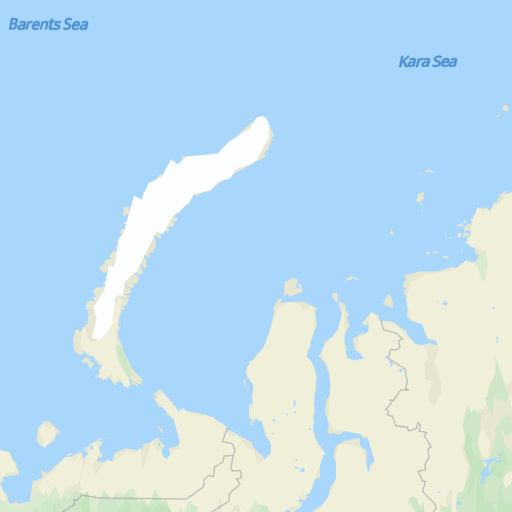

# Tile API<a name="ZH-CN_TOPIC_0000001145781033"></a>

-   [功能介绍](#section8455201431219)
-   [场景描述](#section2157144513547)
-   [使用约束](#section61115393106)
-   [接口原型](#section3346411124)
-   [请求参数](#section4128425141210)
-   [请求示例](#section6577114310124)
-   [响应参数](#section2445400135)
-   [调用示例](#section17816151918134)

## 功能介绍<a name="section8455201431219"></a>

Tile API服务通过HTTP请求发送的URL参数允许您直接访问获取栅格图瓦片数据。通过请求独立的地图瓦片，构建一个地图图层，使得地图可以方便的加载到已有的地图平台中。

## 场景描述<a name="section2157144513547"></a>

请求独立的地图瓦片，构建地图图层，将地图方便的加载到已有的地图平台中。例如在PC端将瓦片加载到QGIS，Arcgis上；在移动应用中以tile overlay形式加载到已有的地图上。

## 使用约束<a name="section61115393106"></a>

服务调用量的限制请查看[服务定价](zh-cn_topic_0000001145860925.md)。

## 接口原型<a name="section3346411124"></a>

<a name="table11154520143815"></a>
<table><tbody><tr id="row18154202003811"><th class="firstcol" valign="top" width="20%" id="mcps1.1.3.1.1"><p id="p101546202386"><a name="p101546202386"></a><a name="p101546202386"></a>承载协议</p>
</th>
<td class="cellrowborder" valign="top" width="80%" headers="mcps1.1.3.1.1 "><p id="p81541720123818"><a name="p81541720123818"></a><a name="p81541720123818"></a>HTTPS GET</p>
</td>
</tr>
<tr id="row1115462019387"><th class="firstcol" valign="top" width="20%" id="mcps1.1.3.2.1"><p id="p12756174203813"><a name="p12756174203813"></a><a name="p12756174203813"></a>接口方向</p>
</th>
<td class="cellrowborder" valign="top" width="80%" headers="mcps1.1.3.2.1 "><p id="p16154112093811"><a name="p16154112093811"></a><a name="p16154112093811"></a>开发者-&gt;华为地图服务器</p>
</td>
</tr>
<tr id="row215413208388"><th class="firstcol" valign="top" width="20%" id="mcps1.1.3.3.1"><p id="p19782114513386"><a name="p19782114513386"></a><a name="p19782114513386"></a>接口URL</p>
</th>
<td class="cellrowborder" valign="top" width="80%" headers="mcps1.1.3.3.1 "><p id="p9827850185319"><a name="p9827850185319"></a><a name="p9827850185319"></a>https://mapapi.cloud.huawei.com/mapApi/v1/mapService/getTile?参数?key=<i><span class="varname" id="varname168423113295"><a name="varname168423113295"></a><a name="varname168423113295"></a>API KEY</span></i></p>
<div class="note" id="note65176364306"><a name="note65176364306"></a><a name="note65176364306"></a><span class="notetitle"> 说明： </span><div class="notebody"><a name="zh-cn_topic_0000001099181294_ol42140252365"></a><a name="zh-cn_topic_0000001099181294_ol42140252365"></a><ol id="zh-cn_topic_0000001099181294_ol42140252365"><li>获取<i><span class="varname" id="zh-cn_topic_0000001099181294_varname6145746111817"><a name="zh-cn_topic_0000001099181294_varname6145746111817"></a><a name="zh-cn_topic_0000001099181294_varname6145746111817"></a>API KEY</span></i>的方式请参见<a href="zh-cn_topic_0000001099501072.md#section169441820428">获取API Key</a>。</li><li>使用API Key时需要调用URLEncoder.encode("Your apiKey", "UTF-8")方法对API Key进行encodeURI编码。例如：原始API Key：ABC/DFG+ ，转换结果：ABC%2FDFG%2B。</li></ol>
</div></div>
</td>
</tr>
<tr id="row39361834214"><th class="firstcol" valign="top" width="20%" id="mcps1.1.3.4.1"><p id="p59410184422"><a name="p59410184422"></a><a name="p59410184422"></a>数据格式</p>
</th>
<td class="cellrowborder" valign="top" width="80%" headers="mcps1.1.3.4.1 "><p id="p919916013510"><a name="p919916013510"></a><a name="p919916013510"></a>响应消息：Content-Type: image/png</p>
</td>
</tr>
</tbody>
</table>

## 请求参数<a name="section4128425141210"></a>

**Query String**

<a name="table77202273214"></a>
<table><thead align="left"><tr id="row11729225326"><th class="cellrowborder" valign="top" width="18%" id="mcps1.1.5.1.1"><p id="p87210228329"><a name="p87210228329"></a><a name="p87210228329"></a>参数</p>
</th>
<th class="cellrowborder" valign="top" width="14.000000000000002%" id="mcps1.1.5.1.2"><p id="p129581029151016"><a name="p129581029151016"></a><a name="p129581029151016"></a>是否必选</p>
</th>
<th class="cellrowborder" valign="top" width="18%" id="mcps1.1.5.1.3"><p id="p18726222329"><a name="p18726222329"></a><a name="p18726222329"></a>参数类型</p>
</th>
<th class="cellrowborder" valign="top" width="50%" id="mcps1.1.5.1.4"><p id="p67242210323"><a name="p67242210323"></a><a name="p67242210323"></a>描述</p>
</th>
</tr>
</thead>
<tbody><tr id="row1872122203212"><td class="cellrowborder" valign="top" width="18%" headers="mcps1.1.5.1.1 "><p id="p6274235149"><a name="p6274235149"></a><a name="p6274235149"></a>x</p>
</td>
<td class="cellrowborder" valign="top" width="14.000000000000002%" headers="mcps1.1.5.1.2 "><p id="p1295852931019"><a name="p1295852931019"></a><a name="p1295852931019"></a>是</p>
</td>
<td class="cellrowborder" valign="top" width="18%" headers="mcps1.1.5.1.3 "><p id="p95731160406"><a name="p95731160406"></a><a name="p95731160406"></a>Integer</p>
</td>
<td class="cellrowborder" valign="top" width="50%" headers="mcps1.1.5.1.4 "><p id="p192291810121710"><a name="p192291810121710"></a><a name="p192291810121710"></a>X轴坐标。</p>
</td>
</tr>
<tr id="row1772422133216"><td class="cellrowborder" valign="top" width="18%" headers="mcps1.1.5.1.1 "><p id="p127414351843"><a name="p127414351843"></a><a name="p127414351843"></a>y</p>
</td>
<td class="cellrowborder" valign="top" width="14.000000000000002%" headers="mcps1.1.5.1.2 "><p id="p995892921018"><a name="p995892921018"></a><a name="p995892921018"></a>是</p>
</td>
<td class="cellrowborder" valign="top" width="18%" headers="mcps1.1.5.1.3 "><p id="p55731816194019"><a name="p55731816194019"></a><a name="p55731816194019"></a>Integer</p>
</td>
<td class="cellrowborder" valign="top" width="50%" headers="mcps1.1.5.1.4 "><p id="p123881323134015"><a name="p123881323134015"></a><a name="p123881323134015"></a>Y轴坐标。</p>
</td>
</tr>
<tr id="row1872722153217"><td class="cellrowborder" valign="top" width="18%" headers="mcps1.1.5.1.1 "><p id="p127413514420"><a name="p127413514420"></a><a name="p127413514420"></a>z</p>
</td>
<td class="cellrowborder" valign="top" width="14.000000000000002%" headers="mcps1.1.5.1.2 "><p id="p19581029131019"><a name="p19581029131019"></a><a name="p19581029131019"></a>否</p>
</td>
<td class="cellrowborder" valign="top" width="18%" headers="mcps1.1.5.1.3 "><p id="p327483510411"><a name="p327483510411"></a><a name="p327483510411"></a>Integer</p>
</td>
<td class="cellrowborder" valign="top" width="50%" headers="mcps1.1.5.1.4 "><p id="p32732712176"><a name="p32732712176"></a><a name="p32732712176"></a>缩放级别。</p>
</td>
</tr>
<tr id="row89629259496"><td class="cellrowborder" valign="top" width="18%" headers="mcps1.1.5.1.1 "><p id="p29631525154917"><a name="p29631525154917"></a><a name="p29631525154917"></a>language</p>
</td>
<td class="cellrowborder" valign="top" width="14.000000000000002%" headers="mcps1.1.5.1.2 "><p id="p396332510491"><a name="p396332510491"></a><a name="p396332510491"></a>否</p>
</td>
<td class="cellrowborder" valign="top" width="18%" headers="mcps1.1.5.1.3 "><p id="p2096392516497"><a name="p2096392516497"></a><a name="p2096392516497"></a>String</p>
</td>
<td class="cellrowborder" valign="top" width="50%" headers="mcps1.1.5.1.4 "><p id="p29631425114915"><a name="p29631425114915"></a><a name="p29631425114915"></a><span>图片显示语种，语言编码支持ISO 639-2 Code和BCP47。推荐使用BCP47，取值范围参见</span><a href="zh-cn_topic_0000001145860921.md">支持的语言</a><span>。</span></p>
</td>
</tr>
<tr id="row869415407514"><td class="cellrowborder" valign="top" width="18%" headers="mcps1.1.5.1.1 "><p id="p136942409514"><a name="p136942409514"></a><a name="p136942409514"></a>scale</p>
</td>
<td class="cellrowborder" valign="top" width="14.000000000000002%" headers="mcps1.1.5.1.2 "><p id="p1915472914536"><a name="p1915472914536"></a><a name="p1915472914536"></a>否</p>
</td>
<td class="cellrowborder" valign="top" width="18%" headers="mcps1.1.5.1.3 "><p id="p36941740185112"><a name="p36941740185112"></a><a name="p36941740185112"></a>int</p>
</td>
<td class="cellrowborder" valign="top" width="50%" headers="mcps1.1.5.1.4 "><p id="p1969484095119"><a name="p1969484095119"></a><a name="p1969484095119"></a>清晰度比较尺，图片缩放比例。默认为1，可用值为1和2。</p>
</td>
</tr>
</tbody>
</table>

## 请求示例<a name="section6577114310124"></a>

```
GET
https://mapapi.cloud.huawei.com/mapApi/v1/mapService/getTile?x=5&y=1&z=3&language=en&scale=2&key=API KEY
```

## 响应参数<a name="section2445400135"></a>

**状态码为200时：**

**Response Header**

<a name="table12509142914219"></a>
<table><thead align="left"><tr id="row1150982918214"><th class="cellrowborder" valign="top" width="18%" id="mcps1.1.5.1.1"><p id="p10509329102114"><a name="p10509329102114"></a><a name="p10509329102114"></a>参数</p>
</th>
<th class="cellrowborder" valign="top" width="14.000000000000002%" id="mcps1.1.5.1.2"><p id="p16509129132117"><a name="p16509129132117"></a><a name="p16509129132117"></a>是否必选</p>
</th>
<th class="cellrowborder" valign="top" width="18%" id="mcps1.1.5.1.3"><p id="p12509132915214"><a name="p12509132915214"></a><a name="p12509132915214"></a>参数类型</p>
</th>
<th class="cellrowborder" valign="top" width="50%" id="mcps1.1.5.1.4"><p id="p1650992972118"><a name="p1650992972118"></a><a name="p1650992972118"></a>描述</p>
</th>
</tr>
</thead>
<tbody><tr id="row18510102912216"><td class="cellrowborder" valign="top" width="18%" headers="mcps1.1.5.1.1 "><p id="p15510162932115"><a name="p15510162932115"></a><a name="p15510162932115"></a>Content-Type</p>
</td>
<td class="cellrowborder" valign="top" width="14.000000000000002%" headers="mcps1.1.5.1.2 "><p id="p19510112919214"><a name="p19510112919214"></a><a name="p19510112919214"></a>是</p>
</td>
<td class="cellrowborder" valign="top" width="18%" headers="mcps1.1.5.1.3 "><p id="p205101929182117"><a name="p205101929182117"></a><a name="p205101929182117"></a>application/json</p>
</td>
<td class="cellrowborder" valign="top" width="50%" headers="mcps1.1.5.1.4 "><p id="p1951092919216"><a name="p1951092919216"></a><a name="p1951092919216"></a>响应消息的数据格式。</p>
</td>
</tr>
</tbody>
</table>

**Response Body**

<a name="table157795718811"></a>
<table><thead align="left"><tr id="row277457982"><th class="cellrowborder" valign="top" width="20%" id="mcps1.1.4.1.1"><p id="p27785719818"><a name="p27785719818"></a><a name="p27785719818"></a>参数</p>
</th>
<th class="cellrowborder" valign="top" width="20%" id="mcps1.1.4.1.2"><p id="p16771157882"><a name="p16771157882"></a><a name="p16771157882"></a>参数类型</p>
</th>
<th class="cellrowborder" valign="top" width="60%" id="mcps1.1.4.1.3"><p id="p47712576815"><a name="p47712576815"></a><a name="p47712576815"></a>描述</p>
</th>
</tr>
</thead>
<tbody><tr id="row20774571781"><td class="cellrowborder" valign="top" width="20%" headers="mcps1.1.4.1.1 "><p id="p112811901011"><a name="p112811901011"></a><a name="p112811901011"></a>Body</p>
</td>
<td class="cellrowborder" valign="top" width="20%" headers="mcps1.1.4.1.2 "><p id="p1028139181014"><a name="p1028139181014"></a><a name="p1028139181014"></a>String</p>
</td>
<td class="cellrowborder" valign="top" width="60%" headers="mcps1.1.4.1.3 "><p id="p201582019431"><a name="p201582019431"></a><a name="p201582019431"></a>返回栅格瓦片字节流。</p>
</td>
</tr>
</tbody>
</table>

## 调用示例<a name="section17816151918134"></a>

```
public class GetStaticMapService {
    OkHttpClient client = new OkHttpClient();

    Request request = new Request.Builder()
            .url("https://mapapi.cloud.huawei.com/mapApi/v1/mapService/getTile?x=5&y=1&z=3&language=en&scale=2&key=xxxx")
            .get()
            .build();

    Response response = client.newCall(request).execute();
}
```

**图 1**  获取栅格图<a name="fig7979641924"></a>  


