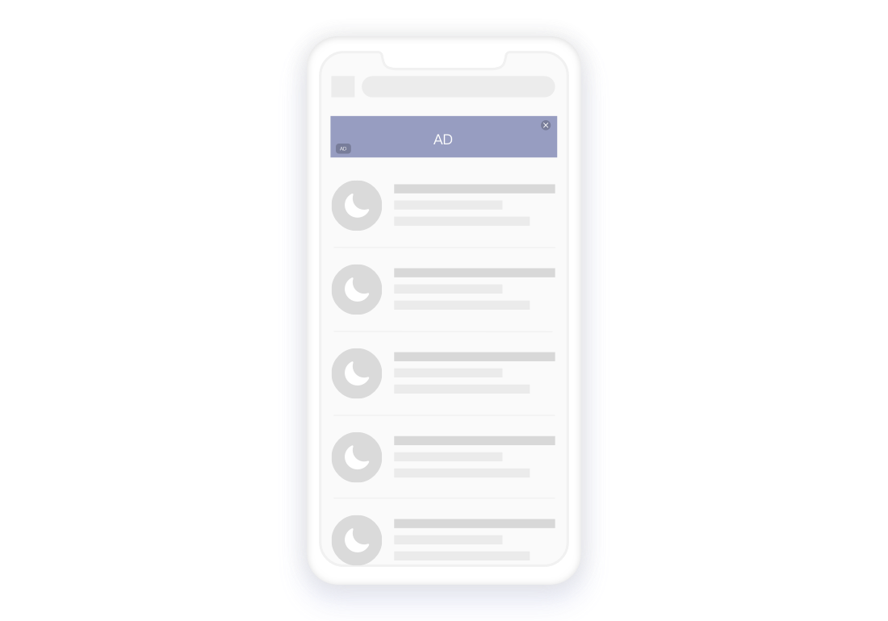
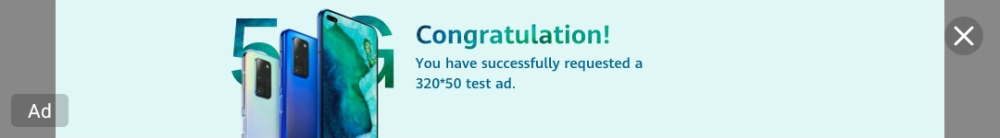

# Banner广告<a name="ZH-CN_TOPIC_0000001057202899"></a>

-   [添加Banner广告](#section16527185185612)
-   [常用广告尺寸](#section1395312137311)
-   [Smart Banner广告](#section2706194414318)
-   [测试Banner广告](#section1119713111418)

Banner广告是在应用程序顶部、中部或底部占据一个位置的矩形图片，广告内容每隔一段时间会自动刷新，点击内容时会跳转到广告主的页面。



## 添加Banner广告<a name="section16527185185612"></a>

1.  添加BannerView。

    HUAWEI Ads SDK支持以下两种方式添加[BannerView](zh-cn_topic_0000001056154911.md)来展示Banner广告：

    -   通过配置XML布局文件添加。

        在XML布局文件中添加[BannerView](zh-cn_topic_0000001056154911.md)，并通过配置hwads:adId和hwads:bannerSize属性，来设置广告位ID和尺寸。以下示例代码中展示了如何在XML布局文件中添加[BannerView](zh-cn_topic_0000001056154911.md)。

        ```
        <?xml version="1.0" encoding="utf-8"?>
        <RelativeLayout xmlns:hwads="http://schemas.android.com/apk/res-auto"
            android:layout_width="match_parent"
            android:layout_height="match_parent">
            
            <com.huawei.hms.ads.banner.BannerView
               android:id="@+id/hw_banner_view"
               android:layout_width="match_parent"
               android:layout_height="wrap_content"
               android:layout_alignParentBottom="true"
               android:layout_centerHorizontal="true"
               hwads:adId="testw6vs28auh3"
               hwads:bannerSize="BANNER_SIZE_360_57"/>
        </RelativeLayout>
        ```

        以下示例代码展示了如何获取[BannerView](zh-cn_topic_0000001056154911.md)。

        ```
        Java
        BannerView bannerView = findViewById(R.id.hw_banner_view);
        ```

        ```
        Kotlin
        var bannerView: BannerView? = findViewById(R.id.hw_banner_view)
        ```


    -   通过编程方式添加。

        在代码中添加[BannerView](zh-cn_topic_0000001056154911.md)，并设置广告位ID和尺寸。

        ```
        Java
        BannerView bannerView = new BannerView(this);
        // "testw6vs28auh3"为测试专用的广告位ID，App正式发布时需要改为正式的广告位ID
        bannerView.setAdId("testw6vs28auh3");
        bannerView.setBannerAdSize(BannerAdSize.BANNER_SIZE_360_57);
        FrameLayout adFrameLayout = findViewById(R.id.ad_frame);
        adFrameLayout.addView(bannerView);
        ```

        ```
        Kotlin
        var bannerView: BannerView? = BannerView(this)
        // "testw6vs28auh3"为测试专用的广告位ID，App正式发布时需要改为正式的广告位ID
        bannerView!!.adId = "testw6vs28auh3"
        bannerView!!.bannerAdSize = BannerAdSize.BANNER_SIZE_360_57
        var adFrameLayout: FrameLayout? = findViewById(R.id.ad_frame)
        adFrameLayout!!.addView(bannerView)
        ```


2.  获取广告。

    [BannerView](zh-cn_topic_0000001056154911.md)创建好之后，通过[BannerView](zh-cn_topic_0000001056154911.md)类的loadAd\(\)方法来获取广告。

    ```
    Java
    …
    import com.huawei.hms.ads.AdParam;
    import com.huawei.hms.ads.BannerAdSize;
    import com.huawei.hms.ads.banner.BannerView;
    public class MainActivity extends AppCompatActivity {
        @Override
        protected void onCreate(Bundle savedInstanceState) {
            super.onCreate(savedInstanceState);
            setContentView(R.layout.activity_main);
            // 获取BannerView
            BannerView bannerView = findViewById(R.id.hw_banner_view);
            // 设置广告位ID和广告尺寸，"testw6vs28auh3"为测试专用的广告位ID
            bannerView.setAdId("testw6vs28auh3");
            bannerView.setBannerAdSize(BannerAdSize.BANNER_SIZE_360_57);
            // 设置轮播时间间隔为30秒
            bannerView.setBannerRefresh(30);
            // 创建广告请求，获取广告
            AdParam adParam = new AdParam.Builder().build();
            bannerView.loadAd(adParam);
        }
    }
    ```

    ```
    Kotlin
    …
    import com.huawei.hms.ads.AdParam
    import com.huawei.hms.ads.BannerAdSize
    import com.huawei.hms.ads.banner.BannerView
    class MainActivity : AppCompatActivity() {
        override fun onCreate(savedInstanceState: Bundle?) {
            super.onCreate(savedInstanceState)
            setContentView(R.layout.activity_main)
            // 获取BannerView
            var bannerView: BannerView? = findViewById(R.id.hw_banner_view)
            // 设置广告位ID和广告尺寸，"testw6vs28auh3"为测试专用的广告位ID
            bannerView!!.adId = "testw6vs28auh3"
            bannerView!!.bannerAdSize = BannerAdSize.BANNER_SIZE_360_57
            // 设置轮播时间间隔为30秒
            bannerView!!.setBannerRefresh(30)
            // 创建广告请求，获取广告
            val adParam = AdParam.Builder().build()
            bannerView!!.loadAd(adParam)
        }
    }
    ```

3.  监听广告事件。

    通过实现[AdListener](zh-cn_topic_0000001057125170.md)类中的方法来监听广告事件。

    了解详细方法，请参见API文档中的[AdListener](zh-cn_topic_0000001057125170.md)类。

    ```
    Java
    bannerView.setAdListener(adListener);
    private AdListener adListener = new AdListener() {
        @Override
        public void onAdLoaded() {
            // 广告获取成功时调用
            ...
        }
        @Override
        public void onAdFailed(int errorCode) {
            // 广告获取失败时调用
            ...
        }
        @Override
        public void onAdOpened() {
            // 广告打开时调用
            ...
        }
        @Override
        public void onAdClicked() {
            // 广告点击时调用
            ...
        }
        @Override
        public void onAdLeave() {
            // 广告离开应用时调用
            ...
        }
        @Override
        public void onAdClosed() {
            // 广告关闭时调用
            ...
        }
    };
    ```

    ```
    Kotlin
    bannerView!!.adListener = adListener
    private val adListener: AdListener = object : AdListener() {
        override fun onAdLoaded() {
            // 广告获取成功时调用
            ...
        }
        override fun onAdFailed() {
            // 广告获取失败时调用
            ...
        }
        override fun onAdOpened() {
            // 广告打开时调用
            ...
        }
        override fun onAdClicked() {
            // 广告点击时调用
            ...
        }
        override fun onAdLeave() {
            // 广告离开应用时调用
            ...
        }
        override fun onAdClosed() {
            // 广告关闭时调用
            ...
        }
    }
    ```


## 常用广告尺寸<a name="section1395312137311"></a>

常用的标准横幅广告尺寸如下表所示：

<a name="table9898172816510"></a>
<table><thead align="left"><tr id="row089942813510"><th class="cellrowborder" valign="top" width="25.282528252825287%" id="mcps1.1.4.1.1"><p id="p7363103918515"><a name="p7363103918515"></a><a name="p7363103918515"></a>类型</p>
</th>
<th class="cellrowborder" valign="top" width="23.72237223722372%" id="mcps1.1.4.1.2"><p id="p336316391057"><a name="p336316391057"></a><a name="p336316391057"></a>尺寸（宽*高 以dp为单位）</p>
</th>
<th class="cellrowborder" valign="top" width="50.99509950995099%" id="mcps1.1.4.1.3"><p id="p173632396514"><a name="p173632396514"></a><a name="p173632396514"></a>说明</p>
</th>
</tr>
</thead>
<tbody><tr id="row178997281150"><td class="cellrowborder" valign="top" width="25.282528252825287%" headers="mcps1.1.4.1.1 "><p id="p1636310392056"><a name="p1636310392056"></a><a name="p1636310392056"></a>BANNER_SIZE_320_50</p>
</td>
<td class="cellrowborder" valign="top" width="23.72237223722372%" headers="mcps1.1.4.1.2 "><p id="p18363639855"><a name="p18363639855"></a><a name="p18363639855"></a>320x50</p>
</td>
<td class="cellrowborder" valign="top" width="50.99509950995099%" headers="mcps1.1.4.1.3 "><p id="p1136413920516"><a name="p1136413920516"></a><a name="p1136413920516"></a>普通Banner广告，适用于手机设备。</p>
</td>
</tr>
<tr id="row98994285511"><td class="cellrowborder" valign="top" width="25.282528252825287%" headers="mcps1.1.4.1.1 "><p id="p029171775414"><a name="p029171775414"></a><a name="p029171775414"></a>BANNER_SIZE_320_100</p>
</td>
<td class="cellrowborder" valign="top" width="23.72237223722372%" headers="mcps1.1.4.1.2 "><p id="p5364193913511"><a name="p5364193913511"></a><a name="p5364193913511"></a>320x100</p>
</td>
<td class="cellrowborder" valign="top" width="50.99509950995099%" headers="mcps1.1.4.1.3 "><p id="p103648391957"><a name="p103648391957"></a><a name="p103648391957"></a>大型Banner广告，适用于手机设备。</p>
</td>
</tr>
<tr id="row78999281454"><td class="cellrowborder" valign="top" width="25.282528252825287%" headers="mcps1.1.4.1.1 "><p id="p12470926135414"><a name="p12470926135414"></a><a name="p12470926135414"></a>BANNER_SIZE_300_250</p>
</td>
<td class="cellrowborder" valign="top" width="23.72237223722372%" headers="mcps1.1.4.1.2 "><p id="p1236483918513"><a name="p1236483918513"></a><a name="p1236483918513"></a>300x250</p>
</td>
<td class="cellrowborder" valign="top" width="50.99509950995099%" headers="mcps1.1.4.1.3 "><p id="p153641539558"><a name="p153641539558"></a><a name="p153641539558"></a>中矩形Banner广告，适用于手机设备。</p>
</td>
</tr>
<tr id="row840252016491"><td class="cellrowborder" valign="top" width="25.282528252825287%" headers="mcps1.1.4.1.1 "><p id="p94039206492"><a name="p94039206492"></a><a name="p94039206492"></a>BANNER_SIZE_360_57</p>
</td>
<td class="cellrowborder" valign="top" width="23.72237223722372%" headers="mcps1.1.4.1.2 "><p id="p1540392015493"><a name="p1540392015493"></a><a name="p1540392015493"></a>360x57</p>
</td>
<td class="cellrowborder" valign="top" width="50.99509950995099%" headers="mcps1.1.4.1.3 "><p id="p770702710506"><a name="p770702710506"></a><a name="p770702710506"></a>普通Banner广告，适用于1080*170px的广告素材。</p>
</td>
</tr>
<tr id="row7730132584916"><td class="cellrowborder" valign="top" width="25.282528252825287%" headers="mcps1.1.4.1.1 "><p id="p1373042514910"><a name="p1373042514910"></a><a name="p1373042514910"></a>BANNER_SIZE_360_144</p>
</td>
<td class="cellrowborder" valign="top" width="23.72237223722372%" headers="mcps1.1.4.1.2 "><p id="p37301325164913"><a name="p37301325164913"></a><a name="p37301325164913"></a>360x144</p>
</td>
<td class="cellrowborder" valign="top" width="50.99509950995099%" headers="mcps1.1.4.1.3 "><p id="p2707152755017"><a name="p2707152755017"></a><a name="p2707152755017"></a>大型Banner广告，适用于1080*432px的广告素材。</p>
</td>
</tr>
<tr id="row13899112817519"><td class="cellrowborder" valign="top" width="25.282528252825287%" headers="mcps1.1.4.1.1 "><p id="p132791043125619"><a name="p132791043125619"></a><a name="p132791043125619"></a>BANNER_SIZE_SMART</p>
</td>
<td class="cellrowborder" valign="top" width="23.72237223722372%" headers="mcps1.1.4.1.2 "><p id="p19105155625515"><a name="p19105155625515"></a><a name="p19105155625515"></a>屏幕宽度 x 32|50|90</p>
</td>
<td class="cellrowborder" valign="top" width="50.99509950995099%" headers="mcps1.1.4.1.3 "><p id="p910585610551"><a name="p910585610551"></a><a name="p910585610551"></a>自适应Banner广告，根据设备的宽高比自动调整广告尺寸，适用于手机设备。</p>
</td>
</tr>
</tbody>
</table>

> **说明：** 
>在中国大陆区域暂只支持BANNER\_SIZE\_360\_57和BANNER\_SIZE\_360\_144。
>更多广告尺寸请参见API文档中的[BannerAdSize](zh-cn_topic_0000001057043317.md)类。

## Smart Banner广告<a name="section2706194414318"></a>

Smart Banner是一种不拘泥于屏幕尺寸、屏幕方向可在设备上展示与屏幕等宽的Banner广告。获取广告时HUAWEI Ads SDK会根据当前设备屏幕方向，创建与屏幕等宽的广告视图，而广告高度是根据当前屏幕方向的高度来决定。

Smart Banner可实现三种广告高度：

<a name="table3728434201610"></a>
<table><thead align="left"><tr id="row147281341164"><th class="cellrowborder" valign="top" width="34.44%" id="mcps1.1.3.1.1"><p id="p13729173411615"><a name="p13729173411615"></a><a name="p13729173411615"></a>广告高度</p>
</th>
<th class="cellrowborder" valign="top" width="65.56%" id="mcps1.1.3.1.2"><p id="p127293340166"><a name="p127293340166"></a><a name="p127293340166"></a>屏幕高度</p>
</th>
</tr>
</thead>
<tbody><tr id="row1372933411164"><td class="cellrowborder" valign="top" width="34.44%" headers="mcps1.1.3.1.1 "><p id="p8729934201614"><a name="p8729934201614"></a><a name="p8729934201614"></a>32dp</p>
</td>
<td class="cellrowborder" valign="top" width="65.56%" headers="mcps1.1.3.1.2 "><p id="p1472963413166"><a name="p1472963413166"></a><a name="p1472963413166"></a>≤ 400dp</p>
</td>
</tr>
<tr id="row3729103491613"><td class="cellrowborder" valign="top" width="34.44%" headers="mcps1.1.3.1.1 "><p id="p9729153431615"><a name="p9729153431615"></a><a name="p9729153431615"></a>50dp</p>
</td>
<td class="cellrowborder" valign="top" width="65.56%" headers="mcps1.1.3.1.2 "><p id="p6729163414168"><a name="p6729163414168"></a><a name="p6729163414168"></a>&gt; 400dp 且 ≤ 720dp</p>
</td>
</tr>
<tr id="row19729163491610"><td class="cellrowborder" valign="top" width="34.44%" headers="mcps1.1.3.1.1 "><p id="p172913343160"><a name="p172913343160"></a><a name="p172913343160"></a>90dp</p>
</td>
<td class="cellrowborder" valign="top" width="65.56%" headers="mcps1.1.3.1.2 "><p id="p16729153419162"><a name="p16729153419162"></a><a name="p16729153419162"></a>&gt; 720dp</p>
</td>
</tr>
</tbody>
</table>

在手机上，当屏幕为纵向时，Smart Banner广告高度为50dp；当屏幕为横向时，广告高度为32dp。在平板电脑上，不论屏幕是纵向还是横向，广告高度均为90dp。

当广告图片素材不足以占据所分配的整个空间时，系统会居中放置图片，然后填充两侧剩余的空间。



使用Smart Banner时，需要将广告尺寸指定常量BANNER\_SIZE\_SMART，并将宽度设置为match\_parent，同时应考虑在不同设备上会存在不同的广告高度，需要将高度设置为wrap\_content。

```
    <com.huawei.hms.ads.banner.BannerView
        android:id="@+id/hw_banner_view"
        android:layout_width="match_parent"
        android:layout_height="wrap_content"
        hwads:adId="testw6vs28auh3"
        hwads:bannerSize="BANNER_SIZE_SMART" >
    </com.huawei.hms.ads.banner.BannerView>
```

> **说明：** 
>Smart Banner广告在中国大陆区域暂未支持，中国大陆区域的用户不会收到Smart Banner广告。

## 测试Banner广告<a name="section1119713111418"></a>

测试Banner广告时，需要使用专门的测试广告位ID来获取测试广告，以避免在测试过程中产生无效的广告点击量。Banner测试广告位ID仅作为功能调试使用，不可用于广告变现。您应在应用发布前[申请正式的广告位ID](https://developer.huawei.com/consumer/cn/monetize)并替换测试广告位ID。

以下表格中提供了Banner广告的专用测试广告位ID：

<a name="table51811811105816"></a>
<table><thead align="left"><tr id="row134611165816"><th class="cellrowborder" valign="top" width="33.333333333333336%" id="mcps1.1.4.1.1"><p id="p17346111155819"><a name="p17346111155819"></a><a name="p17346111155819"></a>广告形式</p>
</th>
<th class="cellrowborder" valign="top" width="33.333333333333336%" id="mcps1.1.4.1.2"><p id="p1334681113583"><a name="p1334681113583"></a><a name="p1334681113583"></a>展示形式</p>
</th>
<th class="cellrowborder" valign="top" width="33.333333333333336%" id="mcps1.1.4.1.3"><p id="p1834611116587"><a name="p1834611116587"></a><a name="p1834611116587"></a>测试广告位ID</p>
</th>
</tr>
</thead>
<tbody><tr id="row9346511135815"><td class="cellrowborder" valign="top" width="33.333333333333336%" headers="mcps1.1.4.1.1 "><p id="p7346411155812"><a name="p7346411155812"></a><a name="p7346411155812"></a>Banner</p>
</td>
<td class="cellrowborder" valign="top" width="33.333333333333336%" headers="mcps1.1.4.1.2 "><p id="p18346101110581"><a name="p18346101110581"></a><a name="p18346101110581"></a>纯图</p>
</td>
<td class="cellrowborder" valign="top" width="33.333333333333336%" headers="mcps1.1.4.1.3 "><p id="p734620118582"><a name="p734620118582"></a><a name="p734620118582"></a>testw6vs28auh3</p>
</td>
</tr>
</tbody>
</table>

下载Banner广告的[示例代码](zh-cn_topic_0000001057043351.md)并运行，可以看到如下效果图：


另外您也可以通过学习Codelab中的教程来集成[Banner广告](https://developer.huawei.com/consumer/cn/codelab/HUAWEIAdsSDK-BannerAds/index.html)。

