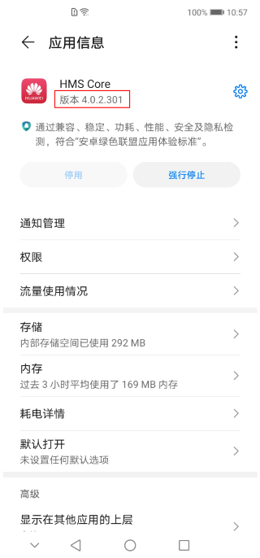

# FAQ

-   [App中集成HUAWEI Ads SDK后，获取不到广告，errorCode为3？](#section1384883631111)
-   [原生广告视频播放不了，一直显示加载中？](#section16782132313401)
-   [Banner广告只有360x57和360x144尺寸可以请求到广告？](#section1381062610475)
-   [Ads Kit提供的ads-lite 、ads-identifier和ads-installreferrer 3个SDK包有什么不同？](#section1241101113125)
-   [为什么获取鉴权信息失败？](#section566045810314)
-   [已经获取过access\_token，为什么获取变现报表提示无权限？](#section10257174663214)
-   [如何查看HMS Core的版本？](#section96712494121)

如果您在下面没有找到需要的问题，请加入[Stack Overflow](https://stackoverflow.com/questions/tagged/huawei-mobile-services?tab=Newest)社区参与讨论。

## App中集成HUAWEI Ads SDK后，获取不到广告，errorCode为3？

errorCode为3，说明广告请求成功，但是服务器没有返回可用的广告素材。需要检查广告位ID是否生效、测试手机连接的网络是否正确，或联系客服支持。

更多信息可以请参见[错误码](错误码.md)。

## 原生广告视频播放不了，一直显示加载中？

在targetSdkVersion 28及以上的手机上会存在广告视频素材下载失败的情况，需要配置App允许HTTP\(S\)网络请求。请参见[配置网络权限](集成HMS-Core-SDK.md#section19869145195218)进行配置。

## Banner广告只有360x57和360x144尺寸可以请求到广告？

如果您使用的是中国版本的手机和网络环境，在中国区域Banner广告暂只支持这2个Banner尺寸。而在海外所有尺寸都支持，连接海外环境测试需要海外版本手机和可以访问海外的网络。

## Ads Kit提供的ads-lite 、ads-identifier和ads-installreferrer 3个SDK包有什么不同？

-   ads-lite：面向广告媒体开发者。您可以根据适合的场景选择不同的广告类型集成到App中，使用广告服务平台提供的高品质广告服务，实现流量变现。
-   ads-identifier：面向广告主开发者。广告平台可基于广告标识符（OAID），向用户提供更加个性化的营销活动或商业广告，提升转化效果。
-   ads-installreferrer：面向三方广告平台或三方监测平台开发者。提供的转化跟踪参数（Install Referrer），广告主可以跟踪App的转化渠道，对App推广的转化效果进行深度分析。

## 为什么获取鉴权信息失败？

变现报表接口仅支持OAuth 2.0客户端鉴权，请在开发者联盟界面选择正确的鉴权方式。

## 已经获取过access\_token，为什么获取变现报表提示无权限？

access\_token信息超时，默认有效时间一小时，需要重新获取access\_token信息。

## 如何查看HMS Core的版本？

HUAWEI Ads SDK依赖HMS Core（APK）4.0.0.300及以上版本。

查看HMS Core的版本的方法：通过设备上“设置  \>  应用  \>  应用管理“搜索HMS Core。

