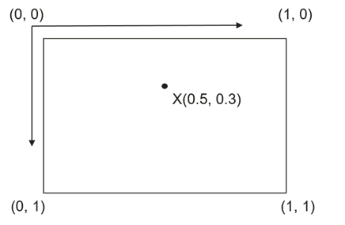

# GroundOverlayOptions

-   [Public Constructor Summary](#section795412714816)
-   [Public Method Summary](#section15311281918)
-   [Public Methods](#section14621195651919)
-   [anchor](#section25201542411)
-   [bearing](#section611612432290)
-   [clickable](#section6602193363017)
-   [getAnchorU](#section1325535053013)
-   [getAnchorV](#section8421423113110)
-   [getBearing](#section1457714507314)
-   [getBounds](#section18230114483216)
-   [getHeight](#section15528168103313)
-   [getImage](#section116509346333)
-   [getLocation](#section1664721283414)
-   [getTransparency](#section0265153112343)
-   [getWidth](#section7391091354)
-   [getZIndex](#section19884132218368)
-   [image](#section19876145116369)
-   [isClickable](#section1559761915375)
-   [isVisible](#section183891514193816)
-   [position\(LatLng location, float width\)](#section18441164103913)
-   [position\(LatLng location, float width, float height\)](#section1263995883915)
-   [positionFromBounds](#section1971542716405)
-   [transparency](#section146372104217)
-   [visible](#section1986154284211)
-   [zIndex](#section109261034311)

<table><thead align="left"><tr id="row12752mcpsimp"><th class="cellrowborder" valign="top" width="100%" id="mcps1.1.2.1.1">
Class Info

</th>
</tr>
</thead>
<tbody><tr id="row12755mcpsimp"><td class="cellrowborder" valign="top" width="100%" headers="mcps1.1.2.1.1 ">
public class GroundOverlayOptions

Defines attributes for a <a href="groundoverlay.md">GroundOverlay</a> object.

</td>
</tr>
</tbody>
</table>

## Public Constructor Summary

<table><thead align="left"><tr id="row12763mcpsimp"><th class="cellrowborder" valign="top" width="100%" id="mcps1.1.2.1.1">
Constructor Name

</th>
</tr>
</thead>
<tbody><tr id="row12766mcpsimp"><td class="cellrowborder" valign="top" width="100%" headers="mcps1.1.2.1.1 ">
<a href="groundoverlayoptions.md">GroundOverlayOptions</a>()

Default constructor of the <strong id="b122931721178">GroundOverlayOptions</strong> class.

</td>
</tr>
</tbody>
</table>

## Public Method Summary

<table><thead align="left"><tr id="row12775mcpsimp"><th class="cellrowborder" valign="top" width="40%" id="mcps1.1.3.1.1">
Qualifier and Type

</th>
<th class="cellrowborder" valign="top" width="60%" id="mcps1.1.3.1.2">
Method Name and Description

</th>
</tr>
</thead>
<tbody><tr id="row12780mcpsimp"><td class="cellrowborder" valign="top" width="40%" headers="mcps1.1.3.1.1 ">
<a href="groundoverlayoptions.md">GroundOverlayOptions</a>

</td>
<td class="cellrowborder" valign="top" width="60%" headers="mcps1.1.3.1.2 ">
<a href="#section25201542411">anchor</a>(float u, float v)

Sets the alignment (that is, anchor point) of a ground overlay. 

</td>
</tr>
<tr id="row12785mcpsimp"><td class="cellrowborder" valign="top" width="40%" headers="mcps1.1.3.1.1 ">
<a href="groundoverlayoptions.md">GroundOverlayOptions</a>

</td>
<td class="cellrowborder" valign="top" width="60%" headers="mcps1.1.3.1.2 ">
<a href="#section611612432290">bearing</a>(float bearing)

Sets the bearing of a ground overlay, in degrees clockwise from north.

</td>
</tr>
<tr id="row12790mcpsimp"><td class="cellrowborder" valign="top" width="40%" headers="mcps1.1.3.1.1 ">
<a href="groundoverlayoptions.md">GroundOverlayOptions</a>

</td>
<td class="cellrowborder" valign="top" width="60%" headers="mcps1.1.3.1.2 ">
<a href="#section6602193363017">clickable</a>(boolean clickable)

Sets whether a ground overlay is tappable.

</td>
</tr>
<tr id="row12795mcpsimp"><td class="cellrowborder" valign="top" width="40%" headers="mcps1.1.3.1.1 ">
float

</td>
<td class="cellrowborder" valign="top" width="60%" headers="mcps1.1.3.1.2 ">
<a href="#section1325535053013">getAnchorU</a>()

Obtains the horizontal coordinate of the anchor point of a ground overlay.

</td>
</tr>
<tr id="row12800mcpsimp"><td class="cellrowborder" valign="top" width="40%" headers="mcps1.1.3.1.1 ">
float

</td>
<td class="cellrowborder" valign="top" width="60%" headers="mcps1.1.3.1.2 ">
<a href="#section8421423113110">getAnchorV</a>()

Obtains the vertical coordinate of the anchor point of a ground overlay.

</td>
</tr>
<tr id="row12805mcpsimp"><td class="cellrowborder" valign="top" width="40%" headers="mcps1.1.3.1.1 ">
float

</td>
<td class="cellrowborder" valign="top" width="60%" headers="mcps1.1.3.1.2 ">
<a href="#section1457714507314">getBearing</a>()

Obtains the bearing of a ground overlay.

</td>
</tr>
<tr id="row12810mcpsimp"><td class="cellrowborder" valign="top" width="40%" headers="mcps1.1.3.1.1 ">
<a href="latlngbounds.md">LatLngBounds</a>

</td>
<td class="cellrowborder" valign="top" width="60%" headers="mcps1.1.3.1.2 ">
<a href="#section18230114483216">getBounds</a>()

Obtains the bounds of a ground overlay.

</td>
</tr>
<tr id="row12815mcpsimp"><td class="cellrowborder" valign="top" width="40%" headers="mcps1.1.3.1.1 ">
float

</td>
<td class="cellrowborder" valign="top" width="60%" headers="mcps1.1.3.1.2 ">
<a href="#section15528168103313">getHeight</a>()

Obtains the height of a ground overlay.

</td>
</tr>
<tr id="row12820mcpsimp"><td class="cellrowborder" valign="top" width="40%" headers="mcps1.1.3.1.1 ">
<a href="bitmapdescriptor.md">BitmapDescriptor</a>

</td>
<td class="cellrowborder" valign="top" width="60%" headers="mcps1.1.3.1.2 ">
<a href="#section116509346333">getImage</a>()

Obtains the image of a ground overlay.

</td>
</tr>
<tr id="row12825mcpsimp"><td class="cellrowborder" valign="top" width="40%" headers="mcps1.1.3.1.1 ">
LatLng

</td>
<td class="cellrowborder" valign="top" width="60%" headers="mcps1.1.3.1.2 ">
<a href="#section1664721283414">getLocation</a>()

Obtains the position of a ground overlay.

</td>
</tr>
<tr id="row12830mcpsimp"><td class="cellrowborder" valign="top" width="40%" headers="mcps1.1.3.1.1 ">
float

</td>
<td class="cellrowborder" valign="top" width="60%" headers="mcps1.1.3.1.2 ">
<a href="#section0265153112343">getTransparency</a>()

Obtains the transparency of a ground overlay.

</td>
</tr>
<tr id="row12835mcpsimp"><td class="cellrowborder" valign="top" width="40%" headers="mcps1.1.3.1.1 ">
float

</td>
<td class="cellrowborder" valign="top" width="60%" headers="mcps1.1.3.1.2 ">
<a href="#section7391091354">getWidth</a>()

Obtains the width of a ground overlay.

</td>
</tr>
<tr id="row12840mcpsimp"><td class="cellrowborder" valign="top" width="40%" headers="mcps1.1.3.1.1 ">
float

</td>
<td class="cellrowborder" valign="top" width="60%" headers="mcps1.1.3.1.2 ">
<a href="#section19884132218368">getZIndex</a>()

Obtains the z-index of a ground overlay.

</td>
</tr>
<tr id="row12845mcpsimp"><td class="cellrowborder" valign="top" width="40%" headers="mcps1.1.3.1.1 ">
<a href="groundoverlayoptions.md">GroundOverlayOptions</a>

</td>
<td class="cellrowborder" valign="top" width="60%" headers="mcps1.1.3.1.2 ">
<a href="#section19876145116369">image</a>(<a href="bitmapdescriptor.md">BitmapDescriptor</a> imageDescriptor)

Sets the image for a ground overlay.

</td>
</tr>
<tr id="row12850mcpsimp"><td class="cellrowborder" valign="top" width="40%" headers="mcps1.1.3.1.1 ">
boolean

</td>
<td class="cellrowborder" valign="top" width="60%" headers="mcps1.1.3.1.2 ">
<a href="#section1559761915375">isClickable</a>()

Checks whether a ground overlay is tappable.

</td>
</tr>
<tr id="row12855mcpsimp"><td class="cellrowborder" valign="top" width="40%" headers="mcps1.1.3.1.1 ">
boolean

</td>
<td class="cellrowborder" valign="top" width="60%" headers="mcps1.1.3.1.2 ">
<a href="#section183891514193816">isVisible</a>()

Checks whether a ground overlay is visible.

</td>
</tr>
<tr id="row12860mcpsimp"><td class="cellrowborder" valign="top" width="40%" headers="mcps1.1.3.1.1 ">
<a href="groundoverlayoptions.md">GroundOverlayOptions</a>

</td>
<td class="cellrowborder" valign="top" width="60%" headers="mcps1.1.3.1.2 ">
<a href="#section18441164103913">position</a>(<a href="latlng.md">LatLng</a> location, float width)

Sets a ground overlay by specifying the anchor point and width.

</td>
</tr>
<tr id="row12865mcpsimp"><td class="cellrowborder" valign="top" width="40%" headers="mcps1.1.3.1.1 ">
<a href="groundoverlayoptions.md">GroundOverlayOptions</a>

</td>
<td class="cellrowborder" valign="top" width="60%" headers="mcps1.1.3.1.2 ">
<a href="#section1263995883915">position</a>(<a href="latlng.md">LatLng</a> location, float width, float height)

Sets a ground overlay by specifying the anchor point, width, and height.

</td>
</tr>
<tr id="row12870mcpsimp"><td class="cellrowborder" valign="top" width="40%" headers="mcps1.1.3.1.1 ">
<a href="groundoverlayoptions.md">GroundOverlayOptions</a>

</td>
<td class="cellrowborder" valign="top" width="60%" headers="mcps1.1.3.1.2 ">
<a href="#section1971542716405">positionFromBounds</a>(<a href="latlngbounds.md">LatLngBounds</a> bounds)

Sets the position of a ground overlay using longitude and latitude bounds.

</td>
</tr>
<tr id="row12875mcpsimp"><td class="cellrowborder" valign="top" width="40%" headers="mcps1.1.3.1.1 ">
<a href="groundoverlayoptions.md">GroundOverlayOptions</a>

</td>
<td class="cellrowborder" valign="top" width="60%" headers="mcps1.1.3.1.2 ">
<a href="#section146372104217">transparency</a>(float transparency)

Sets the transparency of a ground overlay.

</td>
</tr>
<tr id="row12880mcpsimp"><td class="cellrowborder" valign="top" width="40%" headers="mcps1.1.3.1.1 ">
<a href="groundoverlayoptions.md">GroundOverlayOptions</a>

</td>
<td class="cellrowborder" valign="top" width="60%" headers="mcps1.1.3.1.2 ">
<a href="#section1986154284211">visible</a>(boolean visible)

Sets whether a ground overlay is visible.

</td>
</tr>
<tr id="row12885mcpsimp"><td class="cellrowborder" valign="top" width="40%" headers="mcps1.1.3.1.1 ">
<a href="groundoverlayoptions.md">GroundOverlayOptions</a>

</td>
<td class="cellrowborder" valign="top" width="60%" headers="mcps1.1.3.1.2 ">
<a href="#section109261034311">zIndex</a>(float zIndex)

Sets the z-index of a ground overlay.

</td>
</tr>
</tbody>
</table>

## Public Methods

## anchor

<table><thead align="left"><tr id="row399413352314"><th class="cellrowborder" valign="top" width="100%" id="mcps1.1.2.1.1">
Method

</th>
</tr>
</thead>
<tbody><tr id="row129941433132310"><td class="cellrowborder" valign="top" width="100%" headers="mcps1.1.2.1.1 ">
public <a href="groundoverlayoptions.md">GroundOverlayOptions</a> anchor(float u, float v)

Sets the alignment (that is, anchor point) of a ground overlay. The coordinates (0, 0), (1, 0), (0, 1), and (1, 1) respectively indicate the top-left, top-right, bottom-left, and bottom-right corners of the ground overlay. If no anchor point is set, the center point (0.5, 0.5) of the ground overlay will be used by default. The following figure shows a ground overlay's anchor point X whose coordinates are (0.5, 0.3).

</td>
</tr>
</tbody>
</table>

**Parameters**

<table><thead align="left"><tr id="row1599473314239"><th class="cellrowborder" valign="top" width="47.02%" id="mcps1.1.3.1.1">
Name

</th>
<th class="cellrowborder" valign="top" width="52.980000000000004%" id="mcps1.1.3.1.2">
Description

</th>
</tr>
</thead>
<tbody><tr id="row1995163311234"><td class="cellrowborder" valign="top" width="47.02%" headers="mcps1.1.3.1.1 ">
u

</td>
<td class="cellrowborder" valign="top" width="52.980000000000004%" headers="mcps1.1.3.1.2 ">
Horizontal coordinate of the anchor point of a marker. The recommended value range is [0,1], expressed in a proportion of the marker image width. The default value is <strong id="b721217113114">0.5</strong>.

</td>
</tr>
<tr id="row17995633162311"><td class="cellrowborder" valign="top" width="47.02%" headers="mcps1.1.3.1.1 ">
v

</td>
<td class="cellrowborder" valign="top" width="52.980000000000004%" headers="mcps1.1.3.1.2 ">
Vertical coordinate of the anchor point of a marker. The recommended value range is [0,1], expressed in a proportion of the marker image height. The default value is <strong id="b944916519116">0.5</strong>.

</td>
</tr>
</tbody>
</table>

**Returns**

<table><thead align="left"><tr id="row4995133315234"><th class="cellrowborder" valign="top" width="47.02%" id="mcps1.1.3.1.1">
Type

</th>
<th class="cellrowborder" valign="top" width="52.980000000000004%" id="mcps1.1.3.1.2">
Description

</th>
</tr>
</thead>
<tbody><tr id="row19995153314231"><td class="cellrowborder" valign="top" width="47.02%" headers="mcps1.1.3.1.1 ">
GroundOverlayOptions

</td>
<td class="cellrowborder" valign="top" width="52.980000000000004%" headers="mcps1.1.3.1.2 ">
<a href="groundoverlayoptions.md">GroundOverlayOptions</a> object with the new alignment.

</td>
</tr>
</tbody>
</table>

## bearing

<table><thead align="left"><tr id="row1641892112254"><th class="cellrowborder" valign="top" width="100%" id="mcps1.1.2.1.1">
Method

</th>
</tr>
</thead>
<tbody><tr id="row12419132119258"><td class="cellrowborder" valign="top" width="100%" headers="mcps1.1.2.1.1 ">
public <a href="groundoverlayoptions.md">GroundOverlayOptions</a> bearing(float bearing)

Sets the bearing of a ground overlay, in degrees clockwise from north.

</td>
</tr>
</tbody>
</table>

**Parameters**

<table><thead align="left"><tr id="row1941942117251"><th class="cellrowborder" valign="top" width="47.02%" id="mcps1.1.3.1.1">
Name

</th>
<th class="cellrowborder" valign="top" width="52.980000000000004%" id="mcps1.1.3.1.2">
Description

</th>
</tr>
</thead>
<tbody><tr id="row1341962118252"><td class="cellrowborder" valign="top" width="47.02%" headers="mcps1.1.3.1.1 ">
bearing

</td>
<td class="cellrowborder" valign="top" width="52.980000000000004%" headers="mcps1.1.3.1.2 ">
Bearing of a ground overlay, in degrees clockwise from north. The value ranges from 0 to 360 (excluded). The default value is <strong id="b4468129914">0</strong>.

</td>
</tr>
</tbody>
</table>

**Returns**

<table><thead align="left"><tr id="row941916218254"><th class="cellrowborder" valign="top" width="47.02%" id="mcps1.1.3.1.1">
Type

</th>
<th class="cellrowborder" valign="top" width="52.980000000000004%" id="mcps1.1.3.1.2">
Description

</th>
</tr>
</thead>
<tbody><tr id="row1841912113256"><td class="cellrowborder" valign="top" width="47.02%" headers="mcps1.1.3.1.1 ">
GroundOverlayOptions

</td>
<td class="cellrowborder" valign="top" width="52.980000000000004%" headers="mcps1.1.3.1.2 ">
<a href="groundoverlayoptions.md">GroundOverlayOptions</a> object with the new bearing.

</td>
</tr>
</tbody>
</table>

## clickable

<table><thead align="left"><tr id="row12419142132518"><th class="cellrowborder" valign="top" width="100%" id="mcps1.1.2.1.1">
Method

</th>
</tr>
</thead>
<tbody><tr id="row1741919219259"><td class="cellrowborder" valign="top" width="100%" headers="mcps1.1.2.1.1 ">
public <a href="groundoverlayoptions.md">GroundOverlayOptions</a> clickable(boolean clickable)

Sets whether a ground overlay is tappable.

</td>
</tr>
</tbody>
</table>

**Parameters**

<table><thead align="left"><tr id="row1142022117257"><th class="cellrowborder" valign="top" width="47.02%" id="mcps1.1.3.1.1">
Name

</th>
<th class="cellrowborder" valign="top" width="52.980000000000004%" id="mcps1.1.3.1.2">
Description

</th>
</tr>
</thead>
<tbody><tr id="row1420021172517"><td class="cellrowborder" valign="top" width="47.02%" headers="mcps1.1.3.1.1 ">
clickable

</td>
<td class="cellrowborder" valign="top" width="52.980000000000004%" headers="mcps1.1.3.1.2 ">
Indicates whether a ground overlay is tappable. By default, a ground overlay is not tappable.

</td>
</tr>
</tbody>
</table>

**Returns**

<table><thead align="left"><tr id="row14420521182517"><th class="cellrowborder" valign="top" width="47.02%" id="mcps1.1.3.1.1">
Type

</th>
<th class="cellrowborder" valign="top" width="52.980000000000004%" id="mcps1.1.3.1.2">
Description

</th>
</tr>
</thead>
<tbody><tr id="row1342022182519"><td class="cellrowborder" valign="top" width="47.02%" headers="mcps1.1.3.1.1 ">
GroundOverlayOptions

</td>
<td class="cellrowborder" valign="top" width="52.980000000000004%" headers="mcps1.1.3.1.2 ">
<a href="groundoverlayoptions.md">GroundOverlayOptions</a> object with the new tappability setting.

</td>
</tr>
</tbody>
</table>

## getAnchorU

<table><thead align="left"><tr id="row1142019211257"><th class="cellrowborder" valign="top" width="100%" id="mcps1.1.2.1.1">
Method

</th>
</tr>
</thead>
<tbody><tr id="row4420192112258"><td class="cellrowborder" valign="top" width="100%" headers="mcps1.1.2.1.1 ">
public float getAnchorU()

Obtains the horizontal coordinate of the anchor point of a ground overlay.

</td>
</tr>
</tbody>
</table>

**Returns**

<table><thead align="left"><tr id="row1542110212253"><th class="cellrowborder" valign="top" width="47.02%" id="mcps1.1.3.1.1">
Type

</th>
<th class="cellrowborder" valign="top" width="52.980000000000004%" id="mcps1.1.3.1.2">
Description

</th>
</tr>
</thead>
<tbody><tr id="row642115219252"><td class="cellrowborder" valign="top" width="47.02%" headers="mcps1.1.3.1.1 ">
float

</td>
<td class="cellrowborder" valign="top" width="52.980000000000004%" headers="mcps1.1.3.1.2 ">
Horizontal coordinate of the anchor point. The value ranges from 0 to 1.

</td>
</tr>
</tbody>
</table>

## getAnchorV

<table><thead align="left"><tr id="row1942182152518"><th class="cellrowborder" valign="top" width="100%" id="mcps1.1.2.1.1">
Method

</th>
</tr>
</thead>
<tbody><tr id="row1842122113259"><td class="cellrowborder" valign="top" width="100%" headers="mcps1.1.2.1.1 ">
public float getAnchorV()

Obtains the vertical coordinate of the anchor point of a ground overlay.

</td>
</tr>
</tbody>
</table>

**Returns**

<table><thead align="left"><tr id="row742114215255"><th class="cellrowborder" valign="top" width="47.02%" id="mcps1.1.3.1.1">
Type

</th>
<th class="cellrowborder" valign="top" width="52.980000000000004%" id="mcps1.1.3.1.2">
Description

</th>
</tr>
</thead>
<tbody><tr id="row842115218255"><td class="cellrowborder" valign="top" width="47.02%" headers="mcps1.1.3.1.1 ">
float

</td>
<td class="cellrowborder" valign="top" width="52.980000000000004%" headers="mcps1.1.3.1.2 ">
Vertical coordinate of the anchor point. The value ranges from 0 to 1.

</td>
</tr>
</tbody>
</table>

## getBearing

<table><thead align="left"><tr id="row14216217258"><th class="cellrowborder" valign="top" width="100%" id="mcps1.1.2.1.1">
Method

</th>
</tr>
</thead>
<tbody><tr id="row144211321142511"><td class="cellrowborder" valign="top" width="100%" headers="mcps1.1.2.1.1 ">
public float getBearing()

Obtains the bearing of a ground overlay.

</td>
</tr>
</tbody>
</table>

**Returns**

<table><thead align="left"><tr id="row1442232172519"><th class="cellrowborder" valign="top" width="47.02%" id="mcps1.1.3.1.1">
Type

</th>
<th class="cellrowborder" valign="top" width="52.980000000000004%" id="mcps1.1.3.1.2">
Description

</th>
</tr>
</thead>
<tbody><tr id="row2422821192519"><td class="cellrowborder" valign="top" width="47.02%" headers="mcps1.1.3.1.1 ">
float

</td>
<td class="cellrowborder" valign="top" width="52.980000000000004%" headers="mcps1.1.3.1.2 ">
Bearing of a ground overlay. The value ranges from 0 to 360 (excluded).

</td>
</tr>
</tbody>
</table>

## getBounds

<table><thead align="left"><tr id="row94223214252"><th class="cellrowborder" valign="top" width="100%" id="mcps1.1.2.1.1">
Method

</th>
</tr>
</thead>
<tbody><tr id="row1842219217254"><td class="cellrowborder" valign="top" width="100%" headers="mcps1.1.2.1.1 ">
public <a href="latlngbounds.md">LatLngBounds</a> getBounds()

Obtains the bounds of a ground overlay.

</td>
</tr>
</tbody>
</table>

**Returns**

<table><thead align="left"><tr id="row124227215258"><th class="cellrowborder" valign="top" width="47.02%" id="mcps1.1.3.1.1">
Type

</th>
<th class="cellrowborder" valign="top" width="52.980000000000004%" id="mcps1.1.3.1.2">
Description

</th>
</tr>
</thead>
<tbody><tr id="row15422122102516"><td class="cellrowborder" valign="top" width="47.02%" headers="mcps1.1.3.1.1 ">
<a href="latlngbounds.md">LatLngBounds</a>

</td>
<td class="cellrowborder" valign="top" width="52.980000000000004%" headers="mcps1.1.3.1.2 ">
Bounds of a ground overlay.

</td>
</tr>
</tbody>
</table>

## getHeight

<table><thead align="left"><tr id="row842310214256"><th class="cellrowborder" valign="top" width="100%" id="mcps1.1.2.1.1">
Method

</th>
</tr>
</thead>
<tbody><tr id="row154239217259"><td class="cellrowborder" valign="top" width="100%" headers="mcps1.1.2.1.1 ">
public float getHeight()

Obtains the height of a ground overlay.

</td>
</tr>
</tbody>
</table>

**Returns**

<table><thead align="left"><tr id="row194236216256"><th class="cellrowborder" valign="top" width="47.02%" id="mcps1.1.3.1.1">
Type

</th>
<th class="cellrowborder" valign="top" width="52.980000000000004%" id="mcps1.1.3.1.2">
Description

</th>
</tr>
</thead>
<tbody><tr id="row242310216251"><td class="cellrowborder" valign="top" width="47.02%" headers="mcps1.1.3.1.1 ">
float

</td>
<td class="cellrowborder" valign="top" width="52.980000000000004%" headers="mcps1.1.3.1.2 ">
Height of a ground overlay, in meters.

</td>
</tr>
</tbody>
</table>

## getImage

<table><thead align="left"><tr id="row8423152152517"><th class="cellrowborder" valign="top" width="100%" id="mcps1.1.2.1.1">
Method

</th>
</tr>
</thead>
<tbody><tr id="row1042372132511"><td class="cellrowborder" valign="top" width="100%" headers="mcps1.1.2.1.1 ">
public <a href="bitmapdescriptor.md">BitmapDescriptor</a> getImage()

Obtains the image of a ground overlay.

</td>
</tr>
</tbody>
</table>

**Returns**

<table><thead align="left"><tr id="row5423142112516"><th class="cellrowborder" valign="top" width="47.02%" id="mcps1.1.3.1.1">
Type

</th>
<th class="cellrowborder" valign="top" width="52.980000000000004%" id="mcps1.1.3.1.2">
Description

</th>
</tr>
</thead>
<tbody><tr id="row7424132162517"><td class="cellrowborder" valign="top" width="47.02%" headers="mcps1.1.3.1.1 ">
<a href="bitmapdescriptor.md">BitmapDescriptor</a>

</td>
<td class="cellrowborder" valign="top" width="52.980000000000004%" headers="mcps1.1.3.1.2 ">
Image of a ground overlay.

</td>
</tr>
</tbody>
</table>

## getLocation

<table><thead align="left"><tr id="row942452142519"><th class="cellrowborder" valign="top" width="100%" id="mcps1.1.2.1.1">
Method

</th>
</tr>
</thead>
<tbody><tr id="row1342442120252"><td class="cellrowborder" valign="top" width="100%" headers="mcps1.1.2.1.1 ">
public <a href="latlng.md">LatLng</a> getLocation()

Obtains the position of a ground overlay.

</td>
</tr>
</tbody>
</table>

**Returns**

<table><thead align="left"><tr id="row24241121142514"><th class="cellrowborder" valign="top" width="47.02%" id="mcps1.1.3.1.1">
Type

</th>
<th class="cellrowborder" valign="top" width="52.980000000000004%" id="mcps1.1.3.1.2">
Description

</th>
</tr>
</thead>
<tbody><tr id="row17424182117250"><td class="cellrowborder" valign="top" width="47.02%" headers="mcps1.1.3.1.1 ">
<a href="latlng.md">LatLng</a>

</td>
<td class="cellrowborder" valign="top" width="52.980000000000004%" headers="mcps1.1.3.1.2 ">
Longitude and latitude of a ground overlay.

</td>
</tr>
</tbody>
</table>

## getTransparency

<table><thead align="left"><tr id="row7424182172519"><th class="cellrowborder" valign="top" width="100%" id="mcps1.1.2.1.1">
Method

</th>
</tr>
</thead>
<tbody><tr id="row842402192516"><td class="cellrowborder" valign="top" width="100%" headers="mcps1.1.2.1.1 ">
public float getTransparency()

Obtains the transparency of a ground overlay.

</td>
</tr>
</tbody>
</table>

**Returns**

<table><thead align="left"><tr id="row124250212259"><th class="cellrowborder" valign="top" width="47.02%" id="mcps1.1.3.1.1">
Type

</th>
<th class="cellrowborder" valign="top" width="52.980000000000004%" id="mcps1.1.3.1.2">
Description

</th>
</tr>
</thead>
<tbody><tr id="row13425142118257"><td class="cellrowborder" valign="top" width="47.02%" headers="mcps1.1.3.1.1 ">
float

</td>
<td class="cellrowborder" valign="top" width="52.980000000000004%" headers="mcps1.1.3.1.2 ">
Transparency of a ground overlay. The value ranges from 0 to 1. The value <strong id="b89926593264">0</strong> indicates opaque and the value <strong id="b1099715922619">1</strong> indicates transparent.

</td>
</tr>
</tbody>
</table>

## getWidth

<table><thead align="left"><tr id="row11425221102510"><th class="cellrowborder" valign="top" width="100%" id="mcps1.1.2.1.1">
Method

</th>
</tr>
</thead>
<tbody><tr id="row12425142122515"><td class="cellrowborder" valign="top" width="100%" headers="mcps1.1.2.1.1 ">
public float getWidth()

Obtains the width of a ground overlay.

</td>
</tr>
</tbody>
</table>

**Returns**

<table><thead align="left"><tr id="row2425112119258"><th class="cellrowborder" valign="top" width="47.02%" id="mcps1.1.3.1.1">
Type

</th>
<th class="cellrowborder" valign="top" width="52.980000000000004%" id="mcps1.1.3.1.2">
Description

</th>
</tr>
</thead>
<tbody><tr id="row942515215256"><td class="cellrowborder" valign="top" width="47.02%" headers="mcps1.1.3.1.1 ">
float

</td>
<td class="cellrowborder" valign="top" width="52.980000000000004%" headers="mcps1.1.3.1.2 ">
Width of a ground overlay.

</td>
</tr>
</tbody>
</table>

## getZIndex

<table><thead align="left"><tr id="row6425621202518"><th class="cellrowborder" valign="top" width="100%" id="mcps1.1.2.1.1">
Method

</th>
</tr>
</thead>
<tbody><tr id="row842619211251"><td class="cellrowborder" valign="top" width="100%" headers="mcps1.1.2.1.1 ">
public float getZIndex()

Obtains the z-index of a ground overlay.

</td>
</tr>
</tbody>
</table>

**Returns**

<table><thead align="left"><tr id="row164264216252"><th class="cellrowborder" valign="top" width="47.02%" id="mcps1.1.3.1.1">
Type

</th>
<th class="cellrowborder" valign="top" width="52.980000000000004%" id="mcps1.1.3.1.2">
Description

</th>
</tr>
</thead>
<tbody><tr id="row1742672110258"><td class="cellrowborder" valign="top" width="47.02%" headers="mcps1.1.3.1.1 ">
float

</td>
<td class="cellrowborder" valign="top" width="52.980000000000004%" headers="mcps1.1.3.1.2 ">
Z-index, which indicates the overlapping order of a ground overlay.

</td>
</tr>
</tbody>
</table>

## image

<table><thead align="left"><tr id="row19426112115251"><th class="cellrowborder" valign="top" width="100%" id="mcps1.1.2.1.1">
Method

</th>
</tr>
</thead>
<tbody><tr id="row144261421142518"><td class="cellrowborder" valign="top" width="100%" headers="mcps1.1.2.1.1 ">
public <a href="groundoverlayoptions.md">GroundOverlayOptions</a> image(<a href="bitmapdescriptor.md">BitmapDescriptor</a> imageDescriptor)

Sets the image for a ground overlay.

</td>
</tr>
</tbody>
</table>

**Parameters**

<table><thead align="left"><tr id="row142292097120"><th class="cellrowborder" valign="top" width="47.02%" id="mcps1.1.3.1.1">
Name

</th>
<th class="cellrowborder" valign="top" width="52.980000000000004%" id="mcps1.1.3.1.2">
Description

</th>
</tr>
</thead>
<tbody><tr id="row222919181219"><td class="cellrowborder" valign="top" width="47.02%" headers="mcps1.1.3.1.1 ">
imageDescriptor

</td>
<td class="cellrowborder" valign="top" width="52.980000000000004%" headers="mcps1.1.3.1.2 ">
Image for a ground overlay.

</td>
</tr>
</tbody>
</table>

**Returns**

<table><thead align="left"><tr id="row44261921142512"><th class="cellrowborder" valign="top" width="47.02%" id="mcps1.1.3.1.1">
Type

</th>
<th class="cellrowborder" valign="top" width="52.980000000000004%" id="mcps1.1.3.1.2">
Description

</th>
</tr>
</thead>
<tbody><tr id="row104261621162510"><td class="cellrowborder" valign="top" width="47.02%" headers="mcps1.1.3.1.1 ">
GroundOverlayOptions

</td>
<td class="cellrowborder" valign="top" width="52.980000000000004%" headers="mcps1.1.3.1.2 ">
<a href="groundoverlayoptions.md">GroundOverlayOptions</a> object with the new image.

</td>
</tr>
</tbody>
</table>

## isClickable

<table><thead align="left"><tr id="row7428122112511"><th class="cellrowborder" valign="top" width="100%" id="mcps1.1.2.1.1">
Method

</th>
</tr>
</thead>
<tbody><tr id="row3428921172515"><td class="cellrowborder" valign="top" width="100%" headers="mcps1.1.2.1.1 ">
public boolean isClickable()

Checks whether a ground overlay is tappable.

</td>
</tr>
</tbody>
</table>

**Returns**

<table><thead align="left"><tr id="row14428132172517"><th class="cellrowborder" valign="top" width="47.02%" id="mcps1.1.3.1.1">
Type

</th>
<th class="cellrowborder" valign="top" width="52.980000000000004%" id="mcps1.1.3.1.2">
Description

</th>
</tr>
</thead>
<tbody><tr id="row74287217255"><td class="cellrowborder" valign="top" width="47.02%" headers="mcps1.1.3.1.1 ">
boolean

</td>
<td class="cellrowborder" valign="top" width="52.980000000000004%" headers="mcps1.1.3.1.2 ">
<strong id="b191774862819">true</strong> if a ground overlay is tappable; <strong id="b15468125742711">false</strong> otherwise.

</td>
</tr>
</tbody>
</table>

## isVisible

<table><thead align="left"><tr id="row14282021182519"><th class="cellrowborder" valign="top" width="100%" id="mcps1.1.2.1.1">
Method

</th>
</tr>
</thead>
<tbody><tr id="row4429192122510"><td class="cellrowborder" valign="top" width="100%" headers="mcps1.1.2.1.1 ">
public boolean isVisible()

Checks whether a ground overlay is visible.

</td>
</tr>
</tbody>
</table>

**Returns**

<table><thead align="left"><tr id="row1442912192518"><th class="cellrowborder" valign="top" width="47.02%" id="mcps1.1.3.1.1">
Type

</th>
<th class="cellrowborder" valign="top" width="52.980000000000004%" id="mcps1.1.3.1.2">
Description

</th>
</tr>
</thead>
<tbody><tr id="row16429821132519"><td class="cellrowborder" valign="top" width="47.02%" headers="mcps1.1.3.1.1 ">
boolean

</td>
<td class="cellrowborder" valign="top" width="52.980000000000004%" headers="mcps1.1.3.1.2 ">
<strong id="b13281163852812">true</strong> if a ground overlay is visible; <strong id="b759819261281">false</strong> otherwise.

</td>
</tr>
</tbody>
</table>

## position\(LatLng location, float width\)

<table><thead align="left"><tr id="row12429421122515"><th class="cellrowborder" valign="top" width="100%" id="mcps1.1.2.1.1">
Method

</th>
</tr>
</thead>
<tbody><tr id="row18429321142514"><td class="cellrowborder" valign="top" width="100%" headers="mcps1.1.2.1.1 ">
public <a href="groundoverlayoptions.md">GroundOverlayOptions</a> position(<a href="latlng.md">LatLng</a> location, float width)

Sets a ground overlay by specifying the anchor point and width. The height of the ground overlay will be adapted according to the aspect ratio of the image.

</td>
</tr>
</tbody>
</table>

**Parameters**

<table><thead align="left"><tr id="row64298215253"><th class="cellrowborder" valign="top" width="47.02%" id="mcps1.1.3.1.1">
Name

</th>
<th class="cellrowborder" valign="top" width="52.980000000000004%" id="mcps1.1.3.1.2">
Description

</th>
</tr>
</thead>
<tbody><tr id="row1242916211250"><td class="cellrowborder" valign="top" width="47.02%" headers="mcps1.1.3.1.1 ">
location

</td>
<td class="cellrowborder" valign="top" width="52.980000000000004%" headers="mcps1.1.3.1.2 ">
Position of an anchor point. By default, the anchor point is half to the top and left of the image.

</td>
</tr>
<tr id="row11430182142515"><td class="cellrowborder" valign="top" width="47.02%" headers="mcps1.1.3.1.1 ">
width

</td>
<td class="cellrowborder" valign="top" width="52.980000000000004%" headers="mcps1.1.3.1.2 ">
Width of a ground overlay, in meters.

</td>
</tr>
</tbody>
</table>

**Throws**

<table><thead align="left"><tr id="row18430721142511"><th class="cellrowborder" valign="top" width="47.02%" id="mcps1.1.3.1.1">
Name

</th>
<th class="cellrowborder" valign="top" width="52.980000000000004%" id="mcps1.1.3.1.2">
Description

</th>
</tr>
</thead>
<tbody><tr id="row7430321102514"><td class="cellrowborder" valign="top" width="47.02%" headers="mcps1.1.3.1.1 ">
IllegalArgumentException

</td>
<td class="cellrowborder" valign="top" width="52.980000000000004%" headers="mcps1.1.3.1.2 ">
If the anchor point position is <strong id="b1849325562913">null</strong> or the passed width is a negative number.

</td>
</tr>
<tr id="row2430121142520"><td class="cellrowborder" valign="top" width="47.02%" headers="mcps1.1.3.1.1 ">
IllegalStateException

</td>
<td class="cellrowborder" valign="top" width="52.980000000000004%" headers="mcps1.1.3.1.2 ">
If the position has been set using the <a href="#section1971542716405">positionFromBounds</a>(<a href="latlngbounds.md">LatLngBounds</a>) method.

</td>
</tr>
</tbody>
</table>

**Returns**

<table><thead align="left"><tr id="row843092132514"><th class="cellrowborder" valign="top" width="47.02%" id="mcps1.1.3.1.1">
Type

</th>
<th class="cellrowborder" valign="top" width="52.980000000000004%" id="mcps1.1.3.1.2">
Description

</th>
</tr>
</thead>
<tbody><tr id="row11430182118252"><td class="cellrowborder" valign="top" width="47.02%" headers="mcps1.1.3.1.1 ">
GroundOverlayOptions

</td>
<td class="cellrowborder" valign="top" width="52.980000000000004%" headers="mcps1.1.3.1.2 ">
<a href="groundoverlayoptions.md">GroundOverlayOptions</a> object with the new anchor point and width.

</td>
</tr>
</tbody>
</table>

## position\(LatLng location, float width, float height\)

<table><thead align="left"><tr id="row443062113250"><th class="cellrowborder" valign="top" width="100%" id="mcps1.1.2.1.1">
Method

</th>
</tr>
</thead>
<tbody><tr id="row1743162192519"><td class="cellrowborder" valign="top" width="100%" headers="mcps1.1.2.1.1 ">
public <a href="groundoverlayoptions.md">GroundOverlayOptions</a> position(<a href="latlng.md">LatLng</a> location, float width, float height)

Sets a ground overlay by specifying the anchor point, width, and height. The image will be scaled to fit the dimensions.

</td>
</tr>
</tbody>
</table>

**Parameters**

<table><thead align="left"><tr id="row94312021132514"><th class="cellrowborder" valign="top" width="47.02%" id="mcps1.1.3.1.1">
Name

</th>
<th class="cellrowborder" valign="top" width="52.980000000000004%" id="mcps1.1.3.1.2">
Description

</th>
</tr>
</thead>
<tbody><tr id="row1343212120252"><td class="cellrowborder" valign="top" width="47.02%" headers="mcps1.1.3.1.1 ">
location

</td>
<td class="cellrowborder" valign="top" width="52.980000000000004%" headers="mcps1.1.3.1.2 ">
Position of an anchor point. By default, the anchor point is half to the top and left of the image.

</td>
</tr>
<tr id="row12432162172514"><td class="cellrowborder" valign="top" width="47.02%" headers="mcps1.1.3.1.1 ">
width

</td>
<td class="cellrowborder" valign="top" width="52.980000000000004%" headers="mcps1.1.3.1.2 ">
Width of a ground overlay, in meters.

</td>
</tr>
<tr id="row114321821162510"><td class="cellrowborder" valign="top" width="47.02%" headers="mcps1.1.3.1.1 ">
height

</td>
<td class="cellrowborder" valign="top" width="52.980000000000004%" headers="mcps1.1.3.1.2 ">
Height of a ground overlay, in meters.

</td>
</tr>
</tbody>
</table>

**Throws**

<table><thead align="left"><tr id="row114332021122512"><th class="cellrowborder" valign="top" width="47.02%" id="mcps1.1.3.1.1">
Name

</th>
<th class="cellrowborder" valign="top" width="52.980000000000004%" id="mcps1.1.3.1.2">
Description

</th>
</tr>
</thead>
<tbody><tr id="row18433162116252"><td class="cellrowborder" valign="top" width="47.02%" headers="mcps1.1.3.1.1 ">
IllegalArgumentException

</td>
<td class="cellrowborder" valign="top" width="52.980000000000004%" headers="mcps1.1.3.1.2 ">
If the anchor point position is <strong id="b9886174803116">null</strong> or the passed <strong id="b51481737165710">width</strong> or <strong id="b125615397579">height</strong> is a negative number.

</td>
</tr>
<tr id="row10433142142516"><td class="cellrowborder" valign="top" width="47.02%" headers="mcps1.1.3.1.1 ">
IllegalStateException

</td>
<td class="cellrowborder" valign="top" width="52.980000000000004%" headers="mcps1.1.3.1.2 ">
If the position has been set using the <a href="#section1971542716405">positionFromBounds</a>(<a href="latlngbounds.md">LatLngBounds</a>) method.

</td>
</tr>
</tbody>
</table>

**Returns**

<table><thead align="left"><tr id="row19432121152516"><th class="cellrowborder" valign="top" width="47.02%" id="mcps1.1.3.1.1">
Type

</th>
<th class="cellrowborder" valign="top" width="52.980000000000004%" id="mcps1.1.3.1.2">
Description

</th>
</tr>
</thead>
<tbody><tr id="row543215212258"><td class="cellrowborder" valign="top" width="47.02%" headers="mcps1.1.3.1.1 ">
GroundOverlayOptions

</td>
<td class="cellrowborder" valign="top" width="52.980000000000004%" headers="mcps1.1.3.1.2 ">
<a href="groundoverlayoptions.md">GroundOverlayOptions</a> object with the new anchor point, width, and height.

</td>
</tr>
</tbody>
</table>

## positionFromBounds

<table><thead align="left"><tr id="row743342110255"><th class="cellrowborder" valign="top" width="100%" id="mcps1.1.2.1.1">
Method

</th>
</tr>
</thead>
<tbody><tr id="row16433102162517"><td class="cellrowborder" valign="top" width="100%" headers="mcps1.1.2.1.1 ">
public <a href="groundoverlayoptions.md">GroundOverlayOptions</a> positionFromBounds(<a href="latlngbounds.md">LatLngBounds</a> bounds)

Sets the position of a ground overlay using longitude and latitude bounds.

</td>
</tr>
</tbody>
</table>

**Parameters**

<table><thead align="left"><tr id="row10433121172512"><th class="cellrowborder" valign="top" width="47.02%" id="mcps1.1.3.1.1">
Name

</th>
<th class="cellrowborder" valign="top" width="52.980000000000004%" id="mcps1.1.3.1.2">
Description

</th>
</tr>
</thead>
<tbody><tr id="row18433162112515"><td class="cellrowborder" valign="top" width="47.02%" headers="mcps1.1.3.1.1 ">
bounds

</td>
<td class="cellrowborder" valign="top" width="52.980000000000004%" headers="mcps1.1.3.1.2 ">
Bounds of a ground overlay.

</td>
</tr>
</tbody>
</table>

**Throws**

<table><thead align="left"><tr id="row1434152192516"><th class="cellrowborder" valign="top" width="47.02%" id="mcps1.1.3.1.1">
Name

</th>
<th class="cellrowborder" valign="top" width="52.980000000000004%" id="mcps1.1.3.1.2">
Description

</th>
</tr>
</thead>
<tbody><tr id="row14434142182510"><td class="cellrowborder" valign="top" width="47.02%" headers="mcps1.1.3.1.1 ">
IllegalStateException

</td>
<td class="cellrowborder" valign="top" width="52.980000000000004%" headers="mcps1.1.3.1.2 ">
If the position has been set using the <a href="#section18441164103913">position</a>(<a href="latlng.md">LatLng</a>, float) or <a href="#section1263995883915">position</a>(<a href="latlng.md">LatLng</a>, float, float) method.

</td>
</tr>
</tbody>
</table>

**Returns**

<table><thead align="left"><tr id="row15434112162510"><th class="cellrowborder" valign="top" width="47.02%" id="mcps1.1.3.1.1">
Type

</th>
<th class="cellrowborder" valign="top" width="52.980000000000004%" id="mcps1.1.3.1.2">
Description

</th>
</tr>
</thead>
<tbody><tr id="row343420215259"><td class="cellrowborder" valign="top" width="47.02%" headers="mcps1.1.3.1.1 ">
GroundOverlayOptions

</td>
<td class="cellrowborder" valign="top" width="52.980000000000004%" headers="mcps1.1.3.1.2 ">
<a href="groundoverlayoptions.md">GroundOverlayOptions</a> object with the new position.

</td>
</tr>
</tbody>
</table>

## transparency

<table><thead align="left"><tr id="row64341021152520"><th class="cellrowborder" valign="top" width="100%" id="mcps1.1.2.1.1">
Method

</th>
</tr>
</thead>
<tbody><tr id="row4434321182514"><td class="cellrowborder" valign="top" width="100%" headers="mcps1.1.2.1.1 ">
public <a href="groundoverlayoptions.md">GroundOverlayOptions</a> transparency(float transparency)

Sets the transparency of a ground overlay. The value ranges from 0 to 1. The value <strong id="b129611712163719">0</strong> indicates opaque and the value <strong id="b15968121214379">1</strong> indicates transparent.

</td>
</tr>
</tbody>
</table>

**Parameters**

<table><thead align="left"><tr id="row13434102114254"><th class="cellrowborder" valign="top" width="47.02%" id="mcps1.1.3.1.1">
Name

</th>
<th class="cellrowborder" valign="top" width="52.980000000000004%" id="mcps1.1.3.1.2">
Description

</th>
</tr>
</thead>
<tbody><tr id="row1543582115252"><td class="cellrowborder" valign="top" width="47.02%" headers="mcps1.1.3.1.1 ">
transparency

</td>
<td class="cellrowborder" valign="top" width="52.980000000000004%" headers="mcps1.1.3.1.2 ">
Transparency of the ground overlay. The default value is <strong id="b103031291828">0</strong>.

</td>
</tr>
</tbody>
</table>

**Throws**

<table><thead align="left"><tr id="row167591827164013"><th class="cellrowborder" valign="top" width="47.02%" id="mcps1.1.3.1.1">
Name

</th>
<th class="cellrowborder" valign="top" width="52.980000000000004%" id="mcps1.1.3.1.2">
Description

</th>
</tr>
</thead>
<tbody><tr id="row12760327154011"><td class="cellrowborder" valign="top" width="47.02%" headers="mcps1.1.3.1.1 ">
IllegalArgumentException

</td>
<td class="cellrowborder" valign="top" width="52.980000000000004%" headers="mcps1.1.3.1.2 ">
If the transparency is not in the range of [0, 1].

</td>
</tr>
</tbody>
</table>

**Returns**

<table><thead align="left"><tr id="row104353210256"><th class="cellrowborder" valign="top" width="47.02%" id="mcps1.1.3.1.1">
Type

</th>
<th class="cellrowborder" valign="top" width="52.980000000000004%" id="mcps1.1.3.1.2">
Description

</th>
</tr>
</thead>
<tbody><tr id="row114355217250"><td class="cellrowborder" valign="top" width="47.02%" headers="mcps1.1.3.1.1 ">
GroundOverlayOptions

</td>
<td class="cellrowborder" valign="top" width="52.980000000000004%" headers="mcps1.1.3.1.2 ">
<a href="groundoverlayoptions.md">GroundOverlayOptions</a> object with the new transparency.

</td>
</tr>
</tbody>
</table>

## visible

<table><thead align="left"><tr id="row20435421172514"><th class="cellrowborder" valign="top" width="100%" id="mcps1.1.2.1.1">
Method

</th>
</tr>
</thead>
<tbody><tr id="row104357216255"><td class="cellrowborder" valign="top" width="100%" headers="mcps1.1.2.1.1 ">
public <a href="groundoverlayoptions.md">GroundOverlayOptions</a> visible(boolean visible)

Sets whether a ground overlay is visible. If the ground overlay is invisible, it will not be drawn but all other states will be preserved.

</td>
</tr>
</tbody>
</table>

**Parameters**

<table><thead align="left"><tr id="row194358212257"><th class="cellrowborder" valign="top" width="47.02%" id="mcps1.1.3.1.1">
Name

</th>
<th class="cellrowborder" valign="top" width="52.980000000000004%" id="mcps1.1.3.1.2">
Description

</th>
</tr>
</thead>
<tbody><tr id="row15435102117258"><td class="cellrowborder" valign="top" width="47.02%" headers="mcps1.1.3.1.1 ">
visible

</td>
<td class="cellrowborder" valign="top" width="52.980000000000004%" headers="mcps1.1.3.1.2 ">
Indicates whether a ground overlay is visible. By default, a ground overlay is visible.

</td>
</tr>
</tbody>
</table>

**Returns**

<table><thead align="left"><tr id="row15436202102520"><th class="cellrowborder" valign="top" width="47.02%" id="mcps1.1.3.1.1">
Type

</th>
<th class="cellrowborder" valign="top" width="52.980000000000004%" id="mcps1.1.3.1.2">
Description

</th>
</tr>
</thead>
<tbody><tr id="row15436162120254"><td class="cellrowborder" valign="top" width="47.02%" headers="mcps1.1.3.1.1 ">
GroundOverlayOptions

</td>
<td class="cellrowborder" valign="top" width="52.980000000000004%" headers="mcps1.1.3.1.2 ">
<a href="groundoverlayoptions.md">GroundOverlayOptions</a> object with the new visibility setting.

</td>
</tr>
</tbody>
</table>

## zIndex

<table><thead align="left"><tr id="row5436521192511"><th class="cellrowborder" valign="top" width="100%" id="mcps1.1.2.1.1">
Method

</th>
</tr>
</thead>
<tbody><tr id="row1743620216253"><td class="cellrowborder" valign="top" width="100%" headers="mcps1.1.2.1.1 ">
public <a href="groundoverlayoptions.md">GroundOverlayOptions</a> zIndex(float zIndex)

Sets the z-index of a ground overlay. The z-index indicates the overlapping order of a ground overlay. A ground overlay with a larger z-index overlaps that with a smaller z-index. Ground overlays with the same z-index overlap each other by the order in which they are added.

</td>
</tr>
</tbody>
</table>

**Parameters**

<table><thead align="left"><tr id="row64362021172515"><th class="cellrowborder" valign="top" width="47.02%" id="mcps1.1.3.1.1">
Name

</th>
<th class="cellrowborder" valign="top" width="52.980000000000004%" id="mcps1.1.3.1.2">
Description

</th>
</tr>
</thead>
<tbody><tr id="row164361121172515"><td class="cellrowborder" valign="top" width="47.02%" headers="mcps1.1.3.1.1 ">
zIndex

</td>
<td class="cellrowborder" valign="top" width="52.980000000000004%" headers="mcps1.1.3.1.2 ">
Z-index, which indicates the overlapping order of a ground overlay. By default, the z-index is 0.

</td>
</tr>
</tbody>
</table>

**Returns**

<table><thead align="left"><tr id="row1143722132514"><th class="cellrowborder" valign="top" width="47.02%" id="mcps1.1.3.1.1">
Type

</th>
<th class="cellrowborder" valign="top" width="52.980000000000004%" id="mcps1.1.3.1.2">
Description

</th>
</tr>
</thead>
<tbody><tr id="row7437021152515"><td class="cellrowborder" valign="top" width="47.02%" headers="mcps1.1.3.1.1 ">
GroundOverlayOptions

</td>
<td class="cellrowborder" valign="top" width="52.980000000000004%" headers="mcps1.1.3.1.2 ">
<a href="groundoverlayoptions.md">GroundOverlayOptions</a> object with the new z-index.

</td>
</tr>
</tbody>
</table>

