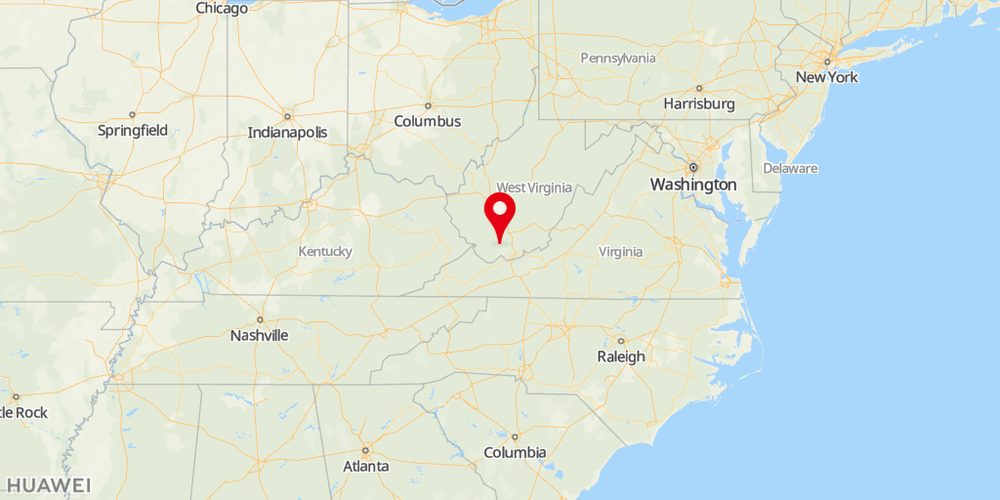
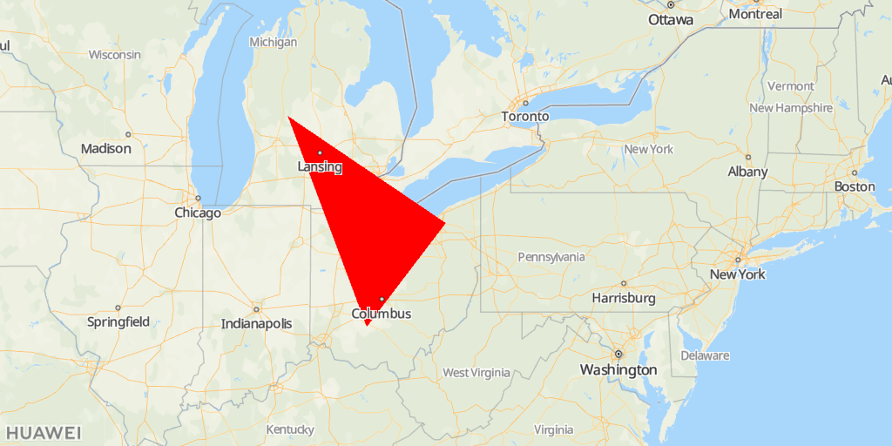
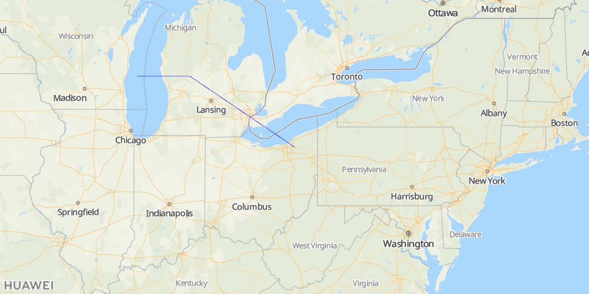
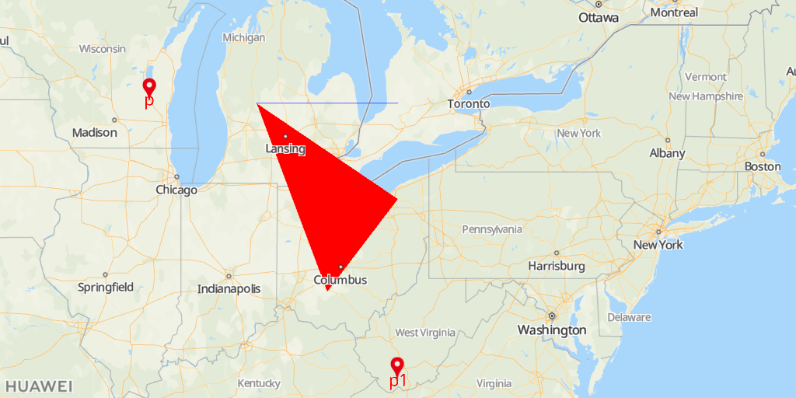

# Maps Static APIs<a name="EN-US_TOPIC_0000001145541055"></a>

-   [Function](#section8455201431219)
-   [Scenario](#section733593991210)
-   [Restrictions](#section5561220132)
-   [Prototype](#section195599118614)
-   [Request Parameters](#section23611821766)
-   [Request Example](#section71351039162)
-   [Response Parameters](#section157024016718)
-   [Call Example](#section284195414164)
    -   [Sample Code Without the Signature](#section14325556781)
    -   [Sample Code with the Signature](#section36549215549)


## Function<a name="section8455201431219"></a>

Returns a map image in response to an HTTP request. You can specify the location for requesting the map and the map image size, as well as add ground overlays such as markers, polylines, and polygons.

<a name="table8143441144811"></a>
<table><tbody><tr id="row514364118481"><td class="row-nocellborder" style="border:none" valign="top" width="33.33333333333333%"><div class="fignone" id="fig19114135314216"><a name="fig19114135314216"></a><a name="fig19114135314216"></a><span class="figcap"><b>Figure 1 </b>Marker</span><br><a name="image926351316417"></a><a name="image926351316417"></a><span></span></div>
</td>
<td class="row-nocellborder" style="border:none" valign="top" width="33.33333333333333%"><div class="fignone" id="fig62631513541"><a name="fig62631513541"></a><a name="fig62631513541"></a><span class="figcap"><b>Figure 2 </b>Polygon</span><br><a name="image1519449542"></a><a name="image1519449542"></a><span></span></div>
</td>
<td class="cellrowborder" style="border:none" valign="top" width="33.33333333333333%"><div class="fignone" id="fig21944912410"><a name="fig21944912410"></a><a name="fig21944912410"></a><span class="figcap"><b>Figure 3 </b>Polyline</span><br><a name="image129120817619"></a><a name="image129120817619"></a><span></span></div>
</td>
</tr>
</tbody>
</table>

## Scenario<a name="section733593991210"></a>

You can create a map image based on the URL parameter in the HTTP request, and directly embed the map image to the web page, without using the JavaScript or dynamic page loading.

## Restrictions<a name="section5561220132"></a>

For details about service call quota, please refer to  [Service Pricing](en-us_topic_0000001145860925.md).

## Prototype<a name="section195599118614"></a>

<a name="table11154520143815"></a>
<table><tbody><tr id="row18154202003811"><th class="firstcol" valign="top" width="20%" id="mcps1.1.3.1.1"><p id="p101546202386"><a name="p101546202386"></a><a name="p101546202386"></a>Protocol</p>
</th>
<td class="cellrowborder" valign="top" width="80%" headers="mcps1.1.3.1.1 "><p id="p81541720123818"><a name="p81541720123818"></a><a name="p81541720123818"></a>HTTPS GET</p>
</td>
</tr>
<tr id="row1115462019387"><th class="firstcol" valign="top" width="20%" id="mcps1.1.3.2.1"><p id="p12756174203813"><a name="p12756174203813"></a><a name="p12756174203813"></a>Direction</p>
</th>
<td class="cellrowborder" valign="top" width="80%" headers="mcps1.1.3.2.1 "><p id="p16154112093811"><a name="p16154112093811"></a><a name="p16154112093811"></a>Your server -&gt; HUAWEI Map Kit server</p>
</td>
</tr>
<tr id="row215413208388"><th class="firstcol" valign="top" width="20%" id="mcps1.1.3.3.1"><p id="p19782114513386"><a name="p19782114513386"></a><a name="p19782114513386"></a>URL</p>
</th>
<td class="cellrowborder" valign="top" width="80%" headers="mcps1.1.3.3.1 "><p id="p9827850185319"><a name="p9827850185319"></a><a name="p9827850185319"></a>https://mapapi.cloud.huawei.com/mapApi/v1/mapService/getStaticMap?Parameter?key=<i><span class="varname" id="varname168423113295"><a name="varname168423113295"></a><a name="varname168423113295"></a>API KEY</span></i></p>
<div class="note" id="note65176364306"><a name="note65176364306"></a><a name="note65176364306"></a><span class="notetitle"> NOTE: </span><div class="notebody"><a name="en-us_topic_0000001099181294_ol42140252365"></a><a name="en-us_topic_0000001099181294_ol42140252365"></a><ol id="en-us_topic_0000001099181294_ol42140252365"><li>For details about how to obtain an API key, please refer to <a href="en-us_topic_0000001099501072.md#section169441820428">Obtaining the API Key</a>.</li><li>You need to call the <strong id="en-us_topic_0000001099181294_b144635512110"><a name="en-us_topic_0000001099181294_b144635512110"></a><a name="en-us_topic_0000001099181294_b144635512110"></a>URLEncoder.encode("Your apiKey", "UTF-8")</strong> method to encode the API key using <strong id="en-us_topic_0000001099181294_b646418511120"><a name="en-us_topic_0000001099181294_b646418511120"></a><a name="en-us_topic_0000001099181294_b646418511120"></a>encodeURI</strong>. For example, if the original API key is <strong id="en-us_topic_0000001099181294_b14422031224"><a name="en-us_topic_0000001099181294_b14422031224"></a><a name="en-us_topic_0000001099181294_b14422031224"></a>ABC/DFG+</strong>, the conversion result is <strong id="en-us_topic_0000001099181294_b2431137214"><a name="en-us_topic_0000001099181294_b2431137214"></a><a name="en-us_topic_0000001099181294_b2431137214"></a>ABC%2FDFG%2B</strong>.</li></ol>
</div></div>
</td>
</tr>
<tr id="row39361834214"><th class="firstcol" valign="top" width="20%" id="mcps1.1.3.4.1"><p id="p59410184422"><a name="p59410184422"></a><a name="p59410184422"></a>Data Format</p>
</th>
<td class="cellrowborder" valign="top" width="80%" headers="mcps1.1.3.4.1 "><p id="p919916013510"><a name="p919916013510"></a><a name="p919916013510"></a>Response: Content-Type: image/png</p>
</td>
</tr>
</tbody>
</table>

## Request Parameters<a name="section23611821766"></a>

**Query String**

<a name="table77202273214"></a>
<table><thead align="left"><tr id="row11729225326"><th class="cellrowborder" valign="top" width="18%" id="mcps1.1.5.1.1"><p id="p87210228329"><a name="p87210228329"></a><a name="p87210228329"></a>Parameter</p>
</th>
<th class="cellrowborder" valign="top" width="14.000000000000002%" id="mcps1.1.5.1.2"><p id="p129581029151016"><a name="p129581029151016"></a><a name="p129581029151016"></a>Mandatory/Optional</p>
</th>
<th class="cellrowborder" valign="top" width="16%" id="mcps1.1.5.1.3"><p id="p18726222329"><a name="p18726222329"></a><a name="p18726222329"></a>Type</p>
</th>
<th class="cellrowborder" valign="top" width="52%" id="mcps1.1.5.1.4"><p id="p67242210323"><a name="p67242210323"></a><a name="p67242210323"></a>Description</p>
</th>
</tr>
</thead>
<tbody><tr id="row1872122203212"><td class="cellrowborder" valign="top" width="18%" headers="mcps1.1.5.1.1 "><p id="p6274235149"><a name="p6274235149"></a><a name="p6274235149"></a>width</p>
</td>
<td class="cellrowborder" valign="top" width="14.000000000000002%" headers="mcps1.1.5.1.2 "><p id="p1295852931019"><a name="p1295852931019"></a><a name="p1295852931019"></a>Mandatory</p>
</td>
<td class="cellrowborder" valign="top" width="16%" headers="mcps1.1.5.1.3 "><p id="p95731160406"><a name="p95731160406"></a><a name="p95731160406"></a>Integer</p>
</td>
<td class="cellrowborder" valign="top" width="52%" headers="mcps1.1.5.1.4 "><p id="p13388122364019"><a name="p13388122364019"></a><a name="p13388122364019"></a>Image width. If <strong id="b163084542116"><a name="b163084542116"></a><a name="b163084542116"></a>scale</strong> is set to <strong id="b93194512213"><a name="b93194512213"></a><a name="b93194512213"></a>1</strong>, the value range is (0, 1024]. If <strong id="b1863736132114"><a name="b1863736132114"></a><a name="b1863736132114"></a>scale</strong> is set to <strong id="b4926113818213"><a name="b4926113818213"></a><a name="b4926113818213"></a>2</strong>, the value range is (0, 512].</p>
</td>
</tr>
<tr id="row1772422133216"><td class="cellrowborder" valign="top" width="18%" headers="mcps1.1.5.1.1 "><p id="p127414351843"><a name="p127414351843"></a><a name="p127414351843"></a>height</p>
</td>
<td class="cellrowborder" valign="top" width="14.000000000000002%" headers="mcps1.1.5.1.2 "><p id="p995892921018"><a name="p995892921018"></a><a name="p995892921018"></a>Mandatory</p>
</td>
<td class="cellrowborder" valign="top" width="16%" headers="mcps1.1.5.1.3 "><p id="p55731816194019"><a name="p55731816194019"></a><a name="p55731816194019"></a>Integer</p>
</td>
<td class="cellrowborder" valign="top" width="52%" headers="mcps1.1.5.1.4 "><p id="p123881323134015"><a name="p123881323134015"></a><a name="p123881323134015"></a>Image height. If <strong id="b440564162220"><a name="b440564162220"></a><a name="b440564162220"></a>scale</strong> is set to <strong id="b164119420221"><a name="b164119420221"></a><a name="b164119420221"></a>1</strong>, the value range is (0, 1024]. If <strong id="b341114152219"><a name="b341114152219"></a><a name="b341114152219"></a>scale</strong> is set to <strong id="b14111744228"><a name="b14111744228"></a><a name="b14111744228"></a>2</strong>, the value range is (0, 512].</p>
</td>
</tr>
<tr id="row1872722153217"><td class="cellrowborder" valign="top" width="18%" headers="mcps1.1.5.1.1 "><p id="p127413514420"><a name="p127413514420"></a><a name="p127413514420"></a>location</p>
</td>
<td class="cellrowborder" valign="top" width="14.000000000000002%" headers="mcps1.1.5.1.2 "><p id="p19581029131019"><a name="p19581029131019"></a><a name="p19581029131019"></a>Optional</p>
</td>
<td class="cellrowborder" valign="top" width="16%" headers="mcps1.1.5.1.3 "><p id="p327483510411"><a name="p327483510411"></a><a name="p327483510411"></a>String</p>
</td>
<td class="cellrowborder" valign="top" width="52%" headers="mcps1.1.5.1.4 "><p id="p62741135148"><a name="p62741135148"></a><a name="p62741135148"></a>Address information. The value can be a pair of latitude and longitude or a specific address. The latitude and longitude are in the <strong id="b9172191813582"><a name="b9172191813582"></a><a name="b9172191813582"></a>Latitude,Longitude</strong> format, for example, <strong id="b187373435918"><a name="b187373435918"></a><a name="b187373435918"></a>41.43206,-81.38992</strong>. If <strong id="b16490142945910"><a name="b16490142945910"></a><a name="b16490142945910"></a>markers</strong> and <strong id="b1536415319596"><a name="b1536415319596"></a><a name="b1536415319596"></a>path</strong> are not set, this parameter is mandatory.</p>
</td>
</tr>
<tr id="row89629259496"><td class="cellrowborder" valign="top" width="18%" headers="mcps1.1.5.1.1 "><p id="p29631525154917"><a name="p29631525154917"></a><a name="p29631525154917"></a>zoom</p>
</td>
<td class="cellrowborder" valign="top" width="14.000000000000002%" headers="mcps1.1.5.1.2 "><p id="p396332510491"><a name="p396332510491"></a><a name="p396332510491"></a>Optional</p>
</td>
<td class="cellrowborder" valign="top" width="16%" headers="mcps1.1.5.1.3 "><p id="p2096392516497"><a name="p2096392516497"></a><a name="p2096392516497"></a>int</p>
</td>
<td class="cellrowborder" valign="top" width="52%" headers="mcps1.1.5.1.4 "><p id="p29631425114915"><a name="p29631425114915"></a><a name="p29631425114915"></a>Zoom level. If <strong id="b4804333192411"><a name="b4804333192411"></a><a name="b4804333192411"></a>markers</strong> and <strong id="b183233610245"><a name="b183233610245"></a><a name="b183233610245"></a>path</strong> are not set, this parameter is mandatory.</p>
</td>
</tr>
<tr id="row869415407514"><td class="cellrowborder" valign="top" width="18%" headers="mcps1.1.5.1.1 "><p id="p136942409514"><a name="p136942409514"></a><a name="p136942409514"></a>scale</p>
</td>
<td class="cellrowborder" valign="top" width="14.000000000000002%" headers="mcps1.1.5.1.2 "><p id="p1915472914536"><a name="p1915472914536"></a><a name="p1915472914536"></a>Optional</p>
</td>
<td class="cellrowborder" valign="top" width="16%" headers="mcps1.1.5.1.3 "><p id="p36941740185112"><a name="p36941740185112"></a><a name="p36941740185112"></a>Integer</p>
</td>
<td class="cellrowborder" valign="top" width="52%" headers="mcps1.1.5.1.4 "><p id="p1969484095119"><a name="p1969484095119"></a><a name="p1969484095119"></a>Map scale. The options are <strong id="b899217290254"><a name="b899217290254"></a><a name="b899217290254"></a>1</strong> and <strong id="b66962315250"><a name="b66962315250"></a><a name="b66962315250"></a>2</strong>. The default value is <strong id="b186971840172517"><a name="b186971840172517"></a><a name="b186971840172517"></a>1</strong>.</p>
</td>
</tr>
<tr id="row103278557514"><td class="cellrowborder" valign="top" width="18%" headers="mcps1.1.5.1.1 "><p id="p932785595113"><a name="p932785595113"></a><a name="p932785595113"></a>pattern</p>
</td>
<td class="cellrowborder" valign="top" width="14.000000000000002%" headers="mcps1.1.5.1.2 "><p id="p1743113012534"><a name="p1743113012534"></a><a name="p1743113012534"></a>Optional</p>
</td>
<td class="cellrowborder" valign="top" width="16%" headers="mcps1.1.5.1.3 "><p id="p3327155115115"><a name="p3327155115115"></a><a name="p3327155115115"></a>String</p>
</td>
<td class="cellrowborder" valign="top" width="52%" headers="mcps1.1.5.1.4 "><p id="p11327155125112"><a name="p11327155125112"></a><a name="p11327155125112"></a>Map image format. Currently, only PNG images are supported.</p>
</td>
</tr>
<tr id="row2124425218"><td class="cellrowborder" valign="top" width="18%" headers="mcps1.1.5.1.1 "><p id="p1012194125213"><a name="p1012194125213"></a><a name="p1012194125213"></a>mapType</p>
</td>
<td class="cellrowborder" valign="top" width="14.000000000000002%" headers="mcps1.1.5.1.2 "><p id="p17983113110532"><a name="p17983113110532"></a><a name="p17983113110532"></a>Optional</p>
</td>
<td class="cellrowborder" valign="top" width="16%" headers="mcps1.1.5.1.3 "><p id="p191274105210"><a name="p191274105210"></a><a name="p191274105210"></a>String</p>
</td>
<td class="cellrowborder" valign="top" width="52%" headers="mcps1.1.5.1.4 "><p id="p17124418521"><a name="p17124418521"></a><a name="p17124418521"></a>Map type. Currently, only the standard map type <strong id="b725993120277"><a name="b725993120277"></a><a name="b725993120277"></a>roadmap</strong> is supported.</p>
</td>
</tr>
<tr id="row4971125165213"><td class="cellrowborder" valign="top" width="18%" headers="mcps1.1.5.1.1 "><p id="p79711510525"><a name="p79711510525"></a><a name="p79711510525"></a>language</p>
</td>
<td class="cellrowborder" valign="top" width="14.000000000000002%" headers="mcps1.1.5.1.2 "><p id="p187831933205320"><a name="p187831933205320"></a><a name="p187831933205320"></a>Optional</p>
</td>
<td class="cellrowborder" valign="top" width="16%" headers="mcps1.1.5.1.3 "><p id="p14971195185212"><a name="p14971195185212"></a><a name="p14971195185212"></a>String</p>
</td>
<td class="cellrowborder" valign="top" width="52%" headers="mcps1.1.5.1.4 "><p id="p8345165225411"><a name="p8345165225411"></a><a name="p8345165225411"></a>Map display language. The value is a language code complying with ISO 639-2 or BCP47. BCP47 is recommended. For details about the value range, please refer to <a href="en-us_topic_0000001145860921.md">Supported Languages</a>.</p>
</td>
</tr>
<tr id="row2244727522"><td class="cellrowborder" valign="top" width="18%" headers="mcps1.1.5.1.1 "><p id="p5244152185210"><a name="p5244152185210"></a><a name="p5244152185210"></a>markers</p>
</td>
<td class="cellrowborder" valign="top" width="14.000000000000002%" headers="mcps1.1.5.1.2 "><p id="p17631173517538"><a name="p17631173517538"></a><a name="p17631173517538"></a>Optional</p>
</td>
<td class="cellrowborder" valign="top" width="16%" headers="mcps1.1.5.1.3 "><p id="p1424422135213"><a name="p1424422135213"></a><a name="p1424422135213"></a>String</p>
</td>
<td class="cellrowborder" valign="top" width="52%" headers="mcps1.1.5.1.4 "><p id="p16534181016554"><a name="p16534181016554"></a><a name="p16534181016554"></a>Marker description. The value can be marker styles, longitudes and latitudes, or addresses. You can enter multiple groups of location information and separate them using vertical bars (|). The following is an example:</p>
<p id="p1188419486403"><a name="p1188419486403"></a><a name="p1188419486403"></a>markers=Marker style|{Latitude 1,Longitude 1}|{Latitude 2,Longitude 2}|Address</p>
<p id="p42191772332"><a name="p42191772332"></a><a name="p42191772332"></a>If the marker style is not specified, <strong id="b16702182516404"><a name="b16702182516404"></a><a name="b16702182516404"></a>markerStyles</strong> is used as the default style.</p>
<div class="note" id="note156388351270"><a name="note156388351270"></a><a name="note156388351270"></a><span class="notetitle"> NOTE: </span><div class="notebody"><p id="p1063853592711"><a name="p1063853592711"></a><a name="p1063853592711"></a>You must set at least one of the following groups of parameters: <strong id="b6737123741219"><a name="b6737123741219"></a><a name="b6737123741219"></a>markers</strong>/<strong id="b27441937151212"><a name="b27441937151212"></a><a name="b27441937151212"></a>path</strong> and <strong id="b14744133711123"><a name="b14744133711123"></a><a name="b14744133711123"></a>location</strong>/<strong id="b1974515377129"><a name="b1974515377129"></a><a name="b1974515377129"></a>zoom</strong>. If both groups are set, the <strong id="b152333219112"><a name="b152333219112"></a><a name="b152333219112"></a>location</strong>/<strong id="b829193214119"><a name="b829193214119"></a><a name="b829193214119"></a>zoom</strong> group takes precedence.</p>
</div></div>
</td>
</tr>
<tr id="row8561183519529"><td class="cellrowborder" valign="top" width="18%" headers="mcps1.1.5.1.1 "><p id="p1656163515211"><a name="p1656163515211"></a><a name="p1656163515211"></a>markerStyles</p>
</td>
<td class="cellrowborder" valign="top" width="14.000000000000002%" headers="mcps1.1.5.1.2 "><p id="p1591636145316"><a name="p1591636145316"></a><a name="p1591636145316"></a>Optional</p>
</td>
<td class="cellrowborder" valign="top" width="16%" headers="mcps1.1.5.1.3 "><p id="p1356103555217"><a name="p1356103555217"></a><a name="p1356103555217"></a>String</p>
</td>
<td class="cellrowborder" valign="top" width="52%" headers="mcps1.1.5.1.4 "><p id="p39481453923"><a name="p39481453923"></a><a name="p39481453923"></a>Marker style description. The attributes that can be set include <strong id="b13761655114311"><a name="b13761655114311"></a><a name="b13761655114311"></a>size</strong>, <strong id="b14768125513431"><a name="b14768125513431"></a><a name="b14768125513431"></a>label</strong>, and <strong id="b5769175514313"><a name="b5769175514313"></a><a name="b5769175514313"></a>color</strong>. </p>
<p id="p1248518173556"><a name="p1248518173556"></a><a name="p1248518173556"></a>Example: size:mid|color:black|label:C</p>
</td>
</tr>
<tr id="row325873819525"><td class="cellrowborder" valign="top" width="18%" headers="mcps1.1.5.1.1 "><p id="p192581238185218"><a name="p192581238185218"></a><a name="p192581238185218"></a>path</p>
</td>
<td class="cellrowborder" valign="top" width="14.000000000000002%" headers="mcps1.1.5.1.2 "><p id="p13910372537"><a name="p13910372537"></a><a name="p13910372537"></a>Optional</p>
</td>
<td class="cellrowborder" valign="top" width="16%" headers="mcps1.1.5.1.3 "><p id="p525863820526"><a name="p525863820526"></a><a name="p525863820526"></a>String</p>
</td>
<td class="cellrowborder" valign="top" width="52%" headers="mcps1.1.5.1.4 "><p id="p12214103225518"><a name="p12214103225518"></a><a name="p12214103225518"></a>Path description. The value can be path styles, longitudes and latitudes, or addresses. You can enter multiple groups of location information and separate them using vertical bars (|). The following is an example:</p>
<p id="p014914324612"><a name="p014914324612"></a><a name="p014914324612"></a>path=Path style|{Latitude 1,Longitude 1}|{Latitude 2,Longitude 2}|Address</p>
<p id="p182191277339"><a name="p182191277339"></a><a name="p182191277339"></a>If the path style is not specified, <strong id="b7445153604519"><a name="b7445153604519"></a><a name="b7445153604519"></a>pathStyles</strong> is used as the default style.</p>
<div class="note" id="note189871157112718"><a name="note189871157112718"></a><a name="note189871157112718"></a><span class="notetitle"> NOTE: </span><div class="notebody"><p id="p7987125712712"><a name="p7987125712712"></a><a name="p7987125712712"></a>You must set at least one of the following groups of parameters: <strong id="b1870164991211"><a name="b1870164991211"></a><a name="b1870164991211"></a>markers</strong>/<strong id="b1370294991211"><a name="b1370294991211"></a><a name="b1370294991211"></a>path</strong> and <strong id="b147021949181212"><a name="b147021949181212"></a><a name="b147021949181212"></a>location</strong>/<strong id="b1370214495126"><a name="b1370214495126"></a><a name="b1370214495126"></a>zoom</strong>. If both groups are set, the <strong id="b165973549127"><a name="b165973549127"></a><a name="b165973549127"></a>location</strong>/<strong id="b1560412547121"><a name="b1560412547121"></a><a name="b1560412547121"></a>zoom</strong> group takes precedence.</p>
</div></div>
</td>
</tr>
<tr id="row14935757175214"><td class="cellrowborder" valign="top" width="18%" headers="mcps1.1.5.1.1 "><p id="p593585711524"><a name="p593585711524"></a><a name="p593585711524"></a>pathStyles</p>
</td>
<td class="cellrowborder" valign="top" width="14.000000000000002%" headers="mcps1.1.5.1.2 "><p id="p142951938155312"><a name="p142951938155312"></a><a name="p142951938155312"></a>Optional</p>
</td>
<td class="cellrowborder" valign="top" width="16%" headers="mcps1.1.5.1.3 "><p id="p59351657195214"><a name="p59351657195214"></a><a name="p59351657195214"></a>String</p>
</td>
<td class="cellrowborder" valign="top" width="52%" headers="mcps1.1.5.1.4 "><p id="p690218417558"><a name="p690218417558"></a><a name="p690218417558"></a>Path style description. The attributes that can be set include <strong id="b137391424104618"><a name="b137391424104618"></a><a name="b137391424104618"></a>color</strong>, <strong id="b147441240467"><a name="b147441240467"></a><a name="b147441240467"></a>weight</strong>, and <strong id="b6744182410469"><a name="b6744182410469"></a><a name="b6744182410469"></a>fillcolor</strong>. If <strong id="b89814570468"><a name="b89814570468"></a><a name="b89814570468"></a>fillcolor</strong> is set, the path style is polygon. Otherwise, the path style is polyline.</p>
<p id="p5902124116551"><a name="p5902124116551"></a><a name="p5902124116551"></a>Example: color:0x0000ff80|weight:1|fillcolor:0x0000ff80</p>
</td>
</tr>
<tr id="row8430160165316"><td class="cellrowborder" valign="top" width="18%" headers="mcps1.1.5.1.1 "><p id="p124311102539"><a name="p124311102539"></a><a name="p124311102539"></a>logo</p>
</td>
<td class="cellrowborder" valign="top" width="14.000000000000002%" headers="mcps1.1.5.1.2 "><p id="p921511390532"><a name="p921511390532"></a><a name="p921511390532"></a>Optional</p>
</td>
<td class="cellrowborder" valign="top" width="16%" headers="mcps1.1.5.1.3 "><p id="p194317015312"><a name="p194317015312"></a><a name="p194317015312"></a>String</p>
</td>
<td class="cellrowborder" valign="top" width="52%" headers="mcps1.1.5.1.4 "><p id="p10690154955515"><a name="p10690154955515"></a><a name="p10690154955515"></a>Logo style description. The attributes that can be set include <strong id="b1688035318493"><a name="b1688035318493"></a><a name="b1688035318493"></a>size</strong> and <strong id="b088612532497"><a name="b088612532497"></a><a name="b088612532497"></a>logoAnchor</strong>. </p>
<p id="p1869034985514"><a name="p1869034985514"></a><a name="p1869034985514"></a>Example: size:logo_normal|logoAnchor:bottomleft</p>
</td>
</tr>
<tr id="row79111025184710"><td class="cellrowborder" valign="top" width="18%" headers="mcps1.1.5.1.1 "><p id="p491218258473"><a name="p491218258473"></a><a name="p491218258473"></a>signature</p>
</td>
<td class="cellrowborder" valign="top" width="14.000000000000002%" headers="mcps1.1.5.1.2 "><p id="p391222515477"><a name="p391222515477"></a><a name="p391222515477"></a>Optional</p>
</td>
<td class="cellrowborder" valign="top" width="16%" headers="mcps1.1.5.1.3 "><p id="p139129256474"><a name="p139129256474"></a><a name="p139129256474"></a>String</p>
</td>
<td class="cellrowborder" valign="top" width="52%" headers="mcps1.1.5.1.4 "><p id="p691222514474"><a name="p691222514474"></a><a name="p691222514474"></a>Message signature generated using the signature key. You are advised to use the signature with the API key to ensure API security.</p>
<div class="note" id="note76031436192212"><a name="note76031436192212"></a><a name="note76031436192212"></a><span class="notetitle"> NOTE: </span><div class="notebody"><p id="p18603183602219"><a name="p18603183602219"></a><a name="p18603183602219"></a>For details about how to obtain the signature key, please refer to <a href="en-us_topic_0000001145941063.md#section91071644142315">Obtaining the Signature Key</a>.</p>
</div></div>
</td>
</tr>
</tbody>
</table>

## Request Example<a name="section71351039162"></a>

```
GET
https://mapapi.cloud.huawei.com/mapApi/v1/mapService/getStaticMap?
width=1024&
height=512&
location=41.43206,-81.38992&
scale=1&
zoom=5&
language=en&
logo=size:logo_normal|logoAnchor:bottomleft&
markers={41.43206,-81.38992}&
markers={43.43206,-85.38992}&
markerStyles=size:tiny|color:blue|label:p&
path={41.43206,-81.38992}|{43.43206,-85.38992}&
path=fillcolor:red|{41.43206,-81.38992}|{43.43206,-85.38992}|{39.43206,-83.38992}&
pathStyles=weight:1|color:0x0000ff80|fillcolor:0x0000ff80&
key=xxx&
signature=xxx
```

After escape:

```
GET
https://mapapi.cloud.huawei.com/mapApi/v1/mapService/getStaticMap?
width=1024&
height=512&
location=41.43206,-81.38992&
scale=1&
zoom=5&
language=en&
logo=size:logo_normal%7ClogoAnchor:bottomleft&
markers=%7B41.43206,-81.38992%7D&
markers=%7B43.43206,-85.38992%7D&
markerStyles=size:tiny%7Ccolor:blue%7Clabel:p&
path=%7B41.43206,-81.38992%7D%7C%7B43.43206,-85.38992%7D&
path=fillcolor:red%7C%7B41.43206,-81.38992%7D%7C%7B43.43206,-85.38992%7D%7C%7B39.43206,-83.38992%7D&
pathStyles=weight:1%7Ccolor:0x0000ff80%7Cfillcolor:0x0000ff80&
key=xxx&
signature=xxx
```

> **NOTE:** 
>When using the sample code, you need to escape the vertical bar \(|\) with  **%7C**, left curly brace \(\{\) with  **%7B**, and right curly brace \(\}\) with  **%7D**.

## Response Parameters<a name="section157024016718"></a>

**When the status code is 200:**

**Response Header**

<a name="table12509142914219"></a>
<table><thead align="left"><tr id="row1150982918214"><th class="cellrowborder" valign="top" width="18%" id="mcps1.1.5.1.1"><p id="p10509329102114"><a name="p10509329102114"></a><a name="p10509329102114"></a>Parameter</p>
</th>
<th class="cellrowborder" valign="top" width="14.000000000000002%" id="mcps1.1.5.1.2"><p id="p16509129132117"><a name="p16509129132117"></a><a name="p16509129132117"></a>Mandatory/Optional</p>
</th>
<th class="cellrowborder" valign="top" width="18%" id="mcps1.1.5.1.3"><p id="p12509132915214"><a name="p12509132915214"></a><a name="p12509132915214"></a>Type</p>
</th>
<th class="cellrowborder" valign="top" width="50%" id="mcps1.1.5.1.4"><p id="p1650992972118"><a name="p1650992972118"></a><a name="p1650992972118"></a>Description</p>
</th>
</tr>
</thead>
<tbody><tr id="row18510102912216"><td class="cellrowborder" valign="top" width="18%" headers="mcps1.1.5.1.1 "><p id="p15510162932115"><a name="p15510162932115"></a><a name="p15510162932115"></a>Content-Type</p>
</td>
<td class="cellrowborder" valign="top" width="14.000000000000002%" headers="mcps1.1.5.1.2 "><p id="p19510112919214"><a name="p19510112919214"></a><a name="p19510112919214"></a>Mandatory</p>
</td>
<td class="cellrowborder" valign="top" width="18%" headers="mcps1.1.5.1.3 "><p id="p205101929182117"><a name="p205101929182117"></a><a name="p205101929182117"></a>image/png</p>
</td>
<td class="cellrowborder" valign="top" width="50%" headers="mcps1.1.5.1.4 "><p id="p1951092919216"><a name="p1951092919216"></a><a name="p1951092919216"></a>Response data format.</p>
</td>
</tr>
</tbody>
</table>

**Response Body**

<a name="table157795718811"></a>
<table><thead align="left"><tr id="row277457982"><th class="cellrowborder" valign="top" width="20%" id="mcps1.1.4.1.1"><p id="p27785719818"><a name="p27785719818"></a><a name="p27785719818"></a>Parameter</p>
</th>
<th class="cellrowborder" valign="top" width="20%" id="mcps1.1.4.1.2"><p id="p16771157882"><a name="p16771157882"></a><a name="p16771157882"></a>Type</p>
</th>
<th class="cellrowborder" valign="top" width="60%" id="mcps1.1.4.1.3"><p id="p47712576815"><a name="p47712576815"></a><a name="p47712576815"></a>Description</p>
</th>
</tr>
</thead>
<tbody><tr id="row20774571781"><td class="cellrowborder" valign="top" width="20%" headers="mcps1.1.4.1.1 "><p id="p112811901011"><a name="p112811901011"></a><a name="p112811901011"></a>Body</p>
</td>
<td class="cellrowborder" valign="top" width="20%" headers="mcps1.1.4.1.2 "><p id="p1028139181014"><a name="p1028139181014"></a><a name="p1028139181014"></a>String</p>
</td>
<td class="cellrowborder" valign="top" width="60%" headers="mcps1.1.4.1.3 "><p id="p201582019431"><a name="p201582019431"></a><a name="p201582019431"></a>Static map image.</p>
</td>
</tr>
</tbody>
</table>

## Call Example<a name="section284195414164"></a>

### Sample Code Without the Signature<a name="section14325556781"></a>

```
public class GetStaticMapService {
    OkHttpClient client = new OkHttpClient();

    Request request = new Request.Builder()
            .url("https://mapapi.cloud.huawei.com/mapApi/v1/mapService/getStaticMap? " +
                    // Set the width of the returned map image to 1024.
                    "width=1024&" +
                    // Set the height of the returned map image to 512.
                    "height=512&" +
                    // Set the address information. (Latitude: 41.43206; Longitude: -81.38992)
                    "location=41.43206%2C-81.38992&" +
                    // Set the map scale to 1.
                    "scale=1&" +
                    // Set the zoom level to 5.
                    "zoom=5&" +
                    // Set the map image format to PNG.
                    "pattern=PNG&" +
                    // Set the map display language to English.
                    "language=en&" +
                    // Set the logo style description.
                    "logo=size%3Alogo_normal%7ClogoAnchor%3Abottomleft&" +
                    // Set the maker description information. (Latitude: 41.43206; Longitude: -81.38992)
                    "markers=%7B41.43206%2C-81.38992%7D&" +
                    // Set the maker description information. (Latitude: 43.43206; Longitude: -85.38992)
                    "markers=%7B43.43206%2C-85.38992%7D&" +
                    // Set the maker style description.
                    "markerStyles=size%3Atiny%7Ccolor%3Ablue%7Clabel%3Amjy&" +
                    // Set the path description information. {Latitude, Longitude}: {41.43206, -81.38992}|{43.43206, -85.38992}
                    "path=%7B41.43206%2C-81.38992%7D%7C%7B43.43206%2C-85.38992%7D&" +
                    // Set the path description, and path style to red. {Latitude, Longitude}: {41.43206, -81.38992}|{43.43206, -85.38992}|{39.43206, -83.38992}
                    "path=fillcolor%3Ared%7C%7B41.43206%2C-81.38992%7D%7C%7B43.43206%2C-85.38992%7D%7C%7B39.43206%2C-83.38992%7D&" +
                    // Set the path style description.
                    "pathStyles=weight%3A1%7Ccolor%3A0x0000ff80%7Cfillcolor%3A0x0000ff80&" +
                    "key=xxxx")
            .get()
            .build();

    Response response = client.newCall(request).execute();
}
```

**Figure  4**  Static map image<a name="fig10996840165819"></a>  


### Sample Code with the Signature<a name="section36549215549"></a>

```
import java.io.IOException;
import java.io.UnsupportedEncodingException;
import java.net.MalformedURLException;
import java.net.URL;
import java.net.URLDecoder;
import java.nio.charset.StandardCharsets;
import java.nio.file.Files;
import java.nio.file.Paths;
import java.security.InvalidKeyException;
import java.security.NoSuchAlgorithmException;
import java.util.ArrayList;
import java.util.Base64;
import java.util.List;
import java.util.SortedMap;
import java.util.TreeMap;

import javax.crypto.Mac;
import javax.crypto.SecretKey;
import javax.crypto.spec.SecretKeySpec;

import okhttp3.HttpUrl;
import okhttp3.OkHttpClient;
import okhttp3.Request;
import okhttp3.Response;

public class Demo {
    public static void main(String[] args) throws Exception {
        new Demo().getStaticMapWithUrlSignature();
    }

    private void getStaticMapWithUrlSignature() throws NoSuchAlgorithmException, InvalidKeyException, IOException {
        OkHttpClient client = new OkHttpClient();
        HttpUrl httpUrl = new HttpUrl.Builder().scheme("https")
            .host("mapapi.cloud.huawei.com")
            .encodedPath("/mapApi/v1/mapService/getStaticMap")
            // Set the width of the returned map image to 1024.
            .addQueryParameter("width", "1024")
            // Set the height of the returned map image to 512.
            .addQueryParameter("height", "512")
            // Set the address information. (Latitude: 41.43206; Longitude: -81.38992)
            .addQueryParameter("location", "41.43206,-81.38992")
            // Set the map scale to 1. 
            .addQueryParameter("scale", "1")
            // Set the zoom level to 5.
            .addQueryParameter("zoom", "5")
            // Set the map display language to English. 
            .addQueryParameter("language", "en")
            // Set the logo style description.
            .addQueryParameter("logo", "size:logo_normal|logoAnchor:bottomleft")
            // Set the maker description information. (Latitude: 41.43206; Longitude: -81.38992)
            .addQueryParameter("markers", "{41.43206,-81.38992}")
            // Set the maker description information. (Latitude: 43.43206; Longitude: -85.38992)
            .addQueryParameter("markers", "{43.43206,-85.38992}")
            // Set the maker style description.
            .addQueryParameter("markerStyles", "size:tiny|color:blue|label:p")
            // Set the path description information. {Latitude, Longitude}: {41.43206, -81.38992}|{43.43206, -85.38992}
            .addQueryParameter("path", "{41.43206,-81.38992}|{43.43206,-85.38992}")
            // Set the path description, and path style to red. {Latitude, Longitude}: {41.43206, -81.38992}|{43.43206, -85.38992}|{39.43206, -83.38992}
            .addQueryParameter("path", "fillcolor:red|{41.43206,-81.38992}|{43.43206,-85.38992}|{39.43206,-83.38992}")
            // Set the path style description.
            .addQueryParameter("pathStyles", "weight:1|color:0x0000ff80|fillcolor:0x0000ff80")
            .build();
        String urlToSign = httpUrl.toString();
        // Signature key.
        String secret = "xxx"; 
        String signature = sign(urlToSign, secret);
        // API key encoded using URLEncoder.encode.        
        String encodedApiKey = "xxx"; 
        String url = urlToSign + "&key=" + encodedApiKey + "&signature=" + signature;
        Request request = new Request.Builder().url(url).get().build();

        Response response = client.newCall(request).execute();
        // Handle the response.
    }

    private String sign(String urlToSign, String secret)
        throws MalformedURLException, NoSuchAlgorithmException, InvalidKeyException {
        URL url = new URL(urlToSign);
        String canonicalUrl = url.getPath() + "?" + new CanonicalQueryString(url.getQuery()).toString();

        SecretKey secretKey = new SecretKeySpec(secret.getBytes(StandardCharsets.UTF_8), "HmacSHA256");
        Mac mac = Mac.getInstance("HmacSHA256");
        mac.init(secretKey);
        byte[] sigBytes = mac.doFinal(canonicalUrl.getBytes());
        String signature = Base64.getEncoder().encodeToString(sigBytes);
        signature = signature.replace('+', '-');
        signature = signature.replace('/', '_');
        return signature;
    }

    static class CanonicalQueryString {
        private static final int INIT_BUFFER_SIZE = 128;

        /**
         * The constant PARAMETER_EQ.
         */
        public static final String PARAMETER_EQ = "=";

        /**
         * The constant PARAMETER_SEP.
         */
        public static final String PARAMETER_SEP = "&";

        private SortedMap<String, List<String>> params = new TreeMap<>();

        /**
         * Instantiates a new Canonical query string.
         *
         * @param queryString the query string
         */
        public CanonicalQueryString(String queryString) {
            if (queryString == null || queryString.length() == 0) {
                return;
            }

            for (String pair : queryString.split(PARAMETER_SEP)) {
                int idx = pair.indexOf(PARAMETER_EQ);
                if (idx != -1) {
                    String value = pair.substring(idx + 1);
                    if (value == null || value.length() == 0) {
                        continue;
                    }
                    String paramKey = pair.substring(0, idx);
                    List<String> values = params.computeIfAbsent(paramKey, key -> new ArrayList<>());
                    try {
                        values.add(URLDecoder.decode(value, "UTF-8"));
                    } catch (UnsupportedEncodingException e) {
                        // ignore
                    }
                }
            }
        }

        @Override
        public String toString() {
            StringBuilder sb = new StringBuilder(INIT_BUFFER_SIZE);
            for (SortedMap.Entry<String, List<String>> item : params.entrySet()) {
                String key = item.getKey();
                for (String value : item.getValue()) {
                    if (sb.length() > 0) {
                        sb.append(PARAMETER_SEP);
                    }
                    sb.append(key).append(PARAMETER_EQ).append(value);
                }
            }

            return sb.toString();
        }
    }
}
```

**Figure  5**  Static map image<a name="fig627025225810"></a>  


