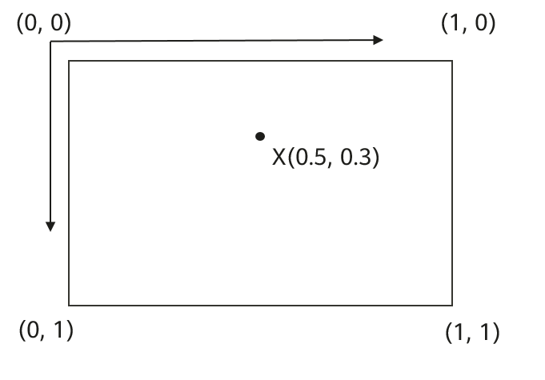

# MarkerOptions

-   [Public Constructor Summary](#section555713615148)
-   [Public Method Summary](#section4327440131410)
-   [Public Methods](#section1411112224221)
-   [alpha](#section34311726293)
-   [anchor](#section1326516357302)
-   [anchorMarker](#section95121330125810)
-   [clusterable](#section99273302577)
-   [draggable](#section0702145819302)
-   [flat](#section2727192393111)
-   [getAlpha](#section1832455019318)
-   [getAnchorU](#section155871213163216)
-   [getMarkerAnchorU](#section1930718125268)
-   [getAnchorV](#section42741744163220)
-   [getMarkerAnchorV](#section3991833123317)
-   [getIcon](#section168698343319)
-   [getInfoWindowAnchorU](#section155505241338)
-   [getInfoWindowAnchorV](#section133371542203315)
-   [getPosition](#section4923215113418)
-   [getRotation](#section7334736113412)
-   [getSnippet](#section1305114363414)
-   [getTitle](#section109271048183419)
-   [getZIndex](#section1060212123512)
-   [icon](#section4119596355)
-   [infoWindowAnchor](#section114908172352)
-   [isDraggable](#section8566122333511)
-   [isFlat](#section7919729183512)
-   [ismClusterable](#section147631875440)
-   [isVisible](#section1952123613518)
-   [position](#section339524313354)
-   [rotation](#section1986735018353)
-   [snippet](#section1266276203610)
-   [title](#section144310304569)
-   [visible](#section47301652195614)
-   [zIndex](#section551291175715)

<table><thead align="left"><tr id="row15804mcpsimp"><th class="cellrowborder" valign="top" width="100%" id="mcps1.1.2.1.1">
Class Info

</th>
</tr>
</thead>
<tbody><tr id="row15807mcpsimp"><td class="cellrowborder" valign="top" width="100%" headers="mcps1.1.2.1.1 ">
public class MarkerOptions

Defines attributes for a marker.

</td>
</tr>
</tbody>
</table>

## Public Constructor Summary

<table><thead align="left"><tr id="row15817mcpsimp"><th class="cellrowborder" valign="top" width="100%" id="mcps1.1.2.1.1">
Constructor Name

</th>
</tr>
</thead>
<tbody><tr id="row15820mcpsimp"><td class="cellrowborder" valign="top" width="100%" headers="mcps1.1.2.1.1 ">
<a href="markeroptions.md">MarkerOptions</a>()

Default constructor of the <strong id="b661919257712">MarkerOptions</strong> class.

</td>
</tr>
</tbody>
</table>

## Public Method Summary

<table><thead align="left"><tr id="row15829mcpsimp"><th class="cellrowborder" valign="top" width="40%" id="mcps1.1.3.1.1">
Qualifier and Type

</th>
<th class="cellrowborder" valign="top" width="60%" id="mcps1.1.3.1.2">
Method Name and Description

</th>
</tr>
</thead>
<tbody><tr id="row15834mcpsimp"><td class="cellrowborder" valign="top" width="40%" headers="mcps1.1.3.1.1 ">
<a href="markeroptions.md">MarkerOptions</a>

</td>
<td class="cellrowborder" valign="top" width="60%" headers="mcps1.1.3.1.2 ">
<a href="#section34311726293">alpha</a>(float alpha)

Sets the transparency of a marker.

</td>
</tr>
<tr id="row15839mcpsimp"><td class="cellrowborder" valign="top" width="40%" headers="mcps1.1.3.1.1 ">
<a href="markeroptions.md">MarkerOptions</a>

</td>
<td class="cellrowborder" valign="top" width="60%" headers="mcps1.1.3.1.2 ">
<a href="#section1326516357302">anchor</a>(float u, float v)

Sets the anchor point of a marker.

 CAUTION: 

This method has been deprecated. To set an anchor point, call <a href="#section95121330125810">anchorMarker</a>. 

</td>
</tr>
<tr id="row956244355712"><td class="cellrowborder" valign="top" width="40%" headers="mcps1.1.3.1.1 ">
<a href="markeroptions.md">MarkerOptions</a>

</td>
<td class="cellrowborder" valign="top" width="60%" headers="mcps1.1.3.1.2 ">
<a href="#section95121330125810">anchorMarker</a>(float anchorU, float anchorV)

Sets the anchor point of a marker.

</td>
</tr>
<tr id="row71930274218"><td class="cellrowborder" valign="top" width="40%" headers="mcps1.1.3.1.1 ">
<a href="markeroptions.md">MarkerOptions</a>

</td>
<td class="cellrowborder" valign="top" width="60%" headers="mcps1.1.3.1.2 ">
<a href="#section99273302577">clusterable</a>(boolean clusterable)

Sets whether a marker can be clustered.

</td>
</tr>
<tr id="row15844mcpsimp"><td class="cellrowborder" valign="top" width="40%" headers="mcps1.1.3.1.1 ">
<a href="markeroptions.md">MarkerOptions</a>

</td>
<td class="cellrowborder" valign="top" width="60%" headers="mcps1.1.3.1.2 ">
<a href="#section0702145819302">draggable</a>(boolean draggable)

Sets whether users can long press a marker and drag it.

</td>
</tr>
<tr id="row15849mcpsimp"><td class="cellrowborder" valign="top" width="40%" headers="mcps1.1.3.1.1 ">
<a href="markeroptions.md">MarkerOptions</a>

</td>
<td class="cellrowborder" valign="top" width="60%" headers="mcps1.1.3.1.2 ">
<a href="#section2727192393111">flat</a>(boolean flat)

Sets whether to flatly attach a marker to the map.

</td>
</tr>
<tr id="row15854mcpsimp"><td class="cellrowborder" valign="top" width="40%" headers="mcps1.1.3.1.1 ">
float

</td>
<td class="cellrowborder" valign="top" width="60%" headers="mcps1.1.3.1.2 ">
<a href="#section1832455019318">getAlpha</a>()

Obtains the transparency of a marker.

</td>
</tr>
<tr id="row15859mcpsimp"><td class="cellrowborder" valign="top" width="40%" headers="mcps1.1.3.1.1 ">
float

</td>
<td class="cellrowborder" valign="top" width="60%" headers="mcps1.1.3.1.2 ">
<a href="#section155871213163216">getAnchorU</a>()

Obtains the horizontal coordinate of the anchor point of a marker. 

 CAUTION: 

This method has been deprecated. To obtain the horizontal coordinate of the anchor point of a marker, call the <a href="#section1930718125268">getMarkerAnchorU</a> method. 

</td>
</tr>
<tr id="row19254554203116"><td class="cellrowborder" valign="top" width="40%" headers="mcps1.1.3.1.1 ">
float

</td>
<td class="cellrowborder" valign="top" width="60%" headers="mcps1.1.3.1.2 ">
<a href="#section1930718125268">getMarkerAnchorU</a>()

Obtains the horizontal coordinate of the anchor point of a marker. 

</td>
</tr>
<tr id="row15864mcpsimp"><td class="cellrowborder" valign="top" width="40%" headers="mcps1.1.3.1.1 ">
float

</td>
<td class="cellrowborder" valign="top" width="60%" headers="mcps1.1.3.1.2 ">
<a href="#section42741744163220">getAnchorV</a>()

Obtains the vertical coordinate of the anchor point of a marker. 

 CAUTION: 

This method has been deprecated. To obtain the vertical coordinate of the anchor point of a marker, call the <a href="#section3991833123317">getMarkerAnchorV</a> method. 

</td>
</tr>
<tr id="row03412571358"><td class="cellrowborder" valign="top" width="40%" headers="mcps1.1.3.1.1 ">
float

</td>
<td class="cellrowborder" valign="top" width="60%" headers="mcps1.1.3.1.2 ">
<a href="#section3991833123317">getMarkerAnchorV</a>()

Obtains the vertical coordinate of the anchor point of a marker. 

</td>
</tr>
<tr id="row15869mcpsimp"><td class="cellrowborder" valign="top" width="40%" headers="mcps1.1.3.1.1 ">
<a href="bitmapdescriptor.md">BitmapDescriptor</a>

</td>
<td class="cellrowborder" valign="top" width="60%" headers="mcps1.1.3.1.2 ">
<a href="#section168698343319">getIcon</a>()

Obtains the icon of a marker.

</td>
</tr>
<tr id="row15874mcpsimp"><td class="cellrowborder" valign="top" width="40%" headers="mcps1.1.3.1.1 ">
float

</td>
<td class="cellrowborder" valign="top" width="60%" headers="mcps1.1.3.1.2 ">
<a href="#section155505241338">getInfoWindowAnchorU</a>()

Obtains the horizontal coordinate of the anchor point of a marker's information window. 

</td>
</tr>
<tr id="row15879mcpsimp"><td class="cellrowborder" valign="top" width="40%" headers="mcps1.1.3.1.1 ">
float

</td>
<td class="cellrowborder" valign="top" width="60%" headers="mcps1.1.3.1.2 ">
<a href="#section133371542203315">getInfoWindowAnchorV</a>()

Obtains the vertical coordinate of the anchor point of a marker's information window. 

</td>
</tr>
<tr id="row15884mcpsimp"><td class="cellrowborder" valign="top" width="40%" headers="mcps1.1.3.1.1 ">
LatLng

</td>
<td class="cellrowborder" valign="top" width="60%" headers="mcps1.1.3.1.2 ">
<a href="#section4923215113418">getPosition</a>()

Obtains the position of a marker.

</td>
</tr>
<tr id="row15889mcpsimp"><td class="cellrowborder" valign="top" width="40%" headers="mcps1.1.3.1.1 ">
float

</td>
<td class="cellrowborder" valign="top" width="60%" headers="mcps1.1.3.1.2 ">
<a href="#section7334736113412">getRotation</a>()

Obtains the rotation angle of a marker.

</td>
</tr>
<tr id="row15894mcpsimp"><td class="cellrowborder" valign="top" width="40%" headers="mcps1.1.3.1.1 ">
String

</td>
<td class="cellrowborder" valign="top" width="60%" headers="mcps1.1.3.1.2 ">
<a href="#section1305114363414">getSnippet</a>()

Obtains the text snippet of a marker.

</td>
</tr>
<tr id="row15899mcpsimp"><td class="cellrowborder" valign="top" width="40%" headers="mcps1.1.3.1.1 ">
String

</td>
<td class="cellrowborder" valign="top" width="60%" headers="mcps1.1.3.1.2 ">
<a href="#section109271048183419">getTitle</a>()

Obtains the title of a marker.

</td>
</tr>
<tr id="row15904mcpsimp"><td class="cellrowborder" valign="top" width="40%" headers="mcps1.1.3.1.1 ">
float

</td>
<td class="cellrowborder" valign="top" width="60%" headers="mcps1.1.3.1.2 ">
<a href="#section1060212123512">getZIndex</a>()

Obtains the z-index of a marker.

</td>
</tr>
<tr id="row15909mcpsimp"><td class="cellrowborder" valign="top" width="40%" headers="mcps1.1.3.1.1 ">
<a href="markeroptions.md">MarkerOptions</a>

</td>
<td class="cellrowborder" valign="top" width="60%" headers="mcps1.1.3.1.2 ">
<a href="#section4119596355">icon</a>(<a href="bitmapdescriptor.md">BitmapDescriptor</a> iconDescriptor)

Sets the icon of a marker.

</td>
</tr>
<tr id="row15914mcpsimp"><td class="cellrowborder" valign="top" width="40%" headers="mcps1.1.3.1.1 ">
<a href="markeroptions.md">MarkerOptions</a>

</td>
<td class="cellrowborder" valign="top" width="60%" headers="mcps1.1.3.1.2 ">
<a href="#section114908172352">infoWindowAnchor</a>(float u, float v)

Sets the anchor point of a marker's information window.

</td>
</tr>
<tr id="row15919mcpsimp"><td class="cellrowborder" valign="top" width="40%" headers="mcps1.1.3.1.1 ">
boolean

</td>
<td class="cellrowborder" valign="top" width="60%" headers="mcps1.1.3.1.2 ">
<a href="#section8566122333511">isDraggable</a>()

Checks whether users can long press a marker and drag it.

</td>
</tr>
<tr id="row15924mcpsimp"><td class="cellrowborder" valign="top" width="40%" headers="mcps1.1.3.1.1 ">
boolean

</td>
<td class="cellrowborder" valign="top" width="60%" headers="mcps1.1.3.1.2 ">
<a href="#section7919729183512">isFlat</a>()

Checks whether a marker is flatly attached to the map.

</td>
</tr>
<tr id="row201112717432"><td class="cellrowborder" valign="top" width="40%" headers="mcps1.1.3.1.1 ">
boolean

</td>
<td class="cellrowborder" valign="top" width="60%" headers="mcps1.1.3.1.2 ">
<a href="#section147631875440">ismClusterable</a>()

Checks whether a marker can be clustered.

</td>
</tr>
<tr id="row15929mcpsimp"><td class="cellrowborder" valign="top" width="40%" headers="mcps1.1.3.1.1 ">
boolean

</td>
<td class="cellrowborder" valign="top" width="60%" headers="mcps1.1.3.1.2 ">
<a href="#section1952123613518">isVisible</a>()

Checks whether a marker is visible.

</td>
</tr>
<tr id="row15934mcpsimp"><td class="cellrowborder" valign="top" width="40%" headers="mcps1.1.3.1.1 ">
<a href="markeroptions.md">MarkerOptions</a>

</td>
<td class="cellrowborder" valign="top" width="60%" headers="mcps1.1.3.1.2 ">
<a href="#section339524313354">position</a>(LatLng latLng)

Sets the position coordinates of a marker.

</td>
</tr>
<tr id="row15939mcpsimp"><td class="cellrowborder" valign="top" width="40%" headers="mcps1.1.3.1.1 ">
<a href="markeroptions.md">MarkerOptions</a>

</td>
<td class="cellrowborder" valign="top" width="60%" headers="mcps1.1.3.1.2 ">
<a href="#section1986735018353">rotation</a>(float rotation)

Sets the rotation angle of a marker, that is, the angle in which the marker rotates around the anchor point clockwise. The rotation axis is perpendicular to the marker. 

</td>
</tr>
<tr id="row15944mcpsimp"><td class="cellrowborder" valign="top" width="40%" headers="mcps1.1.3.1.1 ">
<a href="markeroptions.md">MarkerOptions</a>

</td>
<td class="cellrowborder" valign="top" width="60%" headers="mcps1.1.3.1.2 ">
<a href="#section1266276203610">snippet</a>(String snippet)

Sets the text snippet of a marker.

</td>
</tr>
<tr id="row15949mcpsimp"><td class="cellrowborder" valign="top" width="40%" headers="mcps1.1.3.1.1 ">
<a href="markeroptions.md">MarkerOptions</a>

</td>
<td class="cellrowborder" valign="top" width="60%" headers="mcps1.1.3.1.2 ">
<a href="#section144310304569">title</a>(String title)

Sets the title of a marker.

</td>
</tr>
<tr id="row15954mcpsimp"><td class="cellrowborder" valign="top" width="40%" headers="mcps1.1.3.1.1 ">
<a href="markeroptions.md">MarkerOptions</a>

</td>
<td class="cellrowborder" valign="top" width="60%" headers="mcps1.1.3.1.2 ">
<a href="#section47301652195614">visible</a>(boolean visible)

Sets whether a marker is visible.

</td>
</tr>
<tr id="row15959mcpsimp"><td class="cellrowborder" valign="top" width="40%" headers="mcps1.1.3.1.1 ">
<a href="markeroptions.md">MarkerOptions</a>

</td>
<td class="cellrowborder" valign="top" width="60%" headers="mcps1.1.3.1.2 ">
<a href="#section551291175715">zIndex</a>(float zIndex)

Sets the z-index of a marker.

</td>
</tr>
</tbody>
</table>

## Public Methods

## alpha

<table><thead align="left"><tr id="row15975mcpsimp"><th class="cellrowborder" valign="top" width="100%" id="mcps1.1.2.1.1">
Method

</th>
</tr>
</thead>
<tbody><tr id="row15978mcpsimp"><td class="cellrowborder" valign="top" width="100%" headers="mcps1.1.2.1.1 ">
public <a href="markeroptions.md">MarkerOptions</a> alpha(float alpha)

Sets the transparency of a marker.

</td>
</tr>
</tbody>
</table>

**Parameters**

<table><thead align="left"><tr id="row15991mcpsimp"><th class="cellrowborder" valign="top" width="47%" id="mcps1.1.3.1.1">
Name

</th>
<th class="cellrowborder" valign="top" width="53%" id="mcps1.1.3.1.2">
Description

</th>
</tr>
</thead>
<tbody><tr id="row15996mcpsimp"><td class="cellrowborder" valign="top" width="47%" headers="mcps1.1.3.1.1 ">
alpha

</td>
<td class="cellrowborder" valign="top" width="53%" headers="mcps1.1.3.1.2 ">
Transparency of a marker. The value ranges from 0 (completely transparent) to 1 (completely opaque). The default value is <strong id="b8358470315">1</strong>.

</td>
</tr>
</tbody>
</table>

**Returns**

<table><thead align="left"><tr id="row16008mcpsimp"><th class="cellrowborder" valign="top" width="47%" id="mcps1.1.3.1.1">
Type

</th>
<th class="cellrowborder" valign="top" width="53%" id="mcps1.1.3.1.2">
Description

</th>
</tr>
</thead>
<tbody><tr id="row16013mcpsimp"><td class="cellrowborder" valign="top" width="47%" headers="mcps1.1.3.1.1 ">
MarkerOptions

</td>
<td class="cellrowborder" valign="top" width="53%" headers="mcps1.1.3.1.2 ">
<a href="markeroptions.md">MarkerOptions</a> object with the new transparency.

</td>
</tr>
</tbody>
</table>

## anchor

> **CAUTION:** 
>This method has been deprecated. To set an anchor point, call  [anchorMarker](#section95121330125810). 

<table><thead align="left"><tr id="row16023mcpsimp"><th class="cellrowborder" valign="top" width="100%" id="mcps1.1.2.1.1">
Method

</th>
</tr>
</thead>
<tbody><tr id="row16026mcpsimp"><td class="cellrowborder" valign="top" width="100%" headers="mcps1.1.2.1.1 ">
public <a href="markeroptions.md">MarkerOptions</a> anchor(float u, float v)

Sets the anchor point of a marker. Since of the values of <strong id="b1977185010262">U</strong> and <strong id="b10977550102611">V</strong> are fixed, this method always sets the anchor point to the middle of the marker icon. 

</td>
</tr>
</tbody>
</table>

**Parameters**

<table><thead align="left"><tr id="row16040mcpsimp"><th class="cellrowborder" valign="top" width="47%" id="mcps1.1.3.1.1">
Name

</th>
<th class="cellrowborder" valign="top" width="53%" id="mcps1.1.3.1.2">
Description

</th>
</tr>
</thead>
<tbody><tr id="row16045mcpsimp"><td class="cellrowborder" valign="top" width="47%" headers="mcps1.1.3.1.1 ">
u

</td>
<td class="cellrowborder" valign="top" width="53%" headers="mcps1.1.3.1.2 ">
Horizontal coordinate of the anchor point of a marker. The value ranges from 0 to 1, expressed in a proportion of the marker image width.

</td>
</tr>
<tr id="row16050mcpsimp"><td class="cellrowborder" valign="top" width="47%" headers="mcps1.1.3.1.1 ">
v

</td>
<td class="cellrowborder" valign="top" width="53%" headers="mcps1.1.3.1.2 ">
Vertical coordinate of the anchor point of a marker. The value ranges from 0 to 1, expressed in a proportion of the marker image height.

</td>
</tr>
</tbody>
</table>

**Returns**

<table><thead align="left"><tr id="row16062mcpsimp"><th class="cellrowborder" valign="top" width="47%" id="mcps1.1.3.1.1">
Type

</th>
<th class="cellrowborder" valign="top" width="53%" id="mcps1.1.3.1.2">
Description

</th>
</tr>
</thead>
<tbody><tr id="row16067mcpsimp"><td class="cellrowborder" valign="top" width="47%" headers="mcps1.1.3.1.1 ">
MarkerOptions

</td>
<td class="cellrowborder" valign="top" width="53%" headers="mcps1.1.3.1.2 ">
<a href="markeroptions.md">MarkerOptions</a> object with the new anchor point.

</td>
</tr>
</tbody>
</table>

## anchorMarker

<table><thead align="left"><tr id="row1320185012589"><th class="cellrowborder" valign="top" width="100%" id="mcps1.1.2.1.1">
Method

</th>
</tr>
</thead>
<tbody><tr id="row1820550175813"><td class="cellrowborder" valign="top" width="100%" headers="mcps1.1.2.1.1 ">
public <a href="markeroptions.md">MarkerOptions</a> anchorMarker(float anchorU, float anchorV)

Sets the anchor point of a marker. The anchor point is used to anchor a marker image to the map. The coordinates (0, 0), (1, 0), (0, 1), and (1, 1) respectively indicate the top-left, top-right, bottom-left, and bottom-right corners of the marker image. The following figure shows a marker's anchor point X whose coordinates are (0.5, 0.3).

</td>
</tr>
</tbody>
</table>

**Parameters**

<table><thead align="left"><tr id="row220145085813"><th class="cellrowborder" valign="top" width="47%" id="mcps1.1.3.1.1">
Name

</th>
<th class="cellrowborder" valign="top" width="53%" id="mcps1.1.3.1.2">
Description

</th>
</tr>
</thead>
<tbody><tr id="row520205010583"><td class="cellrowborder" valign="top" width="47%" headers="mcps1.1.3.1.1 ">
u

</td>
<td class="cellrowborder" valign="top" width="53%" headers="mcps1.1.3.1.2 ">
Horizontal coordinate of the anchor point of a marker. The recommended value range is [0,1], expressed in a proportion of the marker image width. The default value is <strong id="b4681745155817">0.5</strong>.

</td>
</tr>
<tr id="row2510340195914"><td class="cellrowborder" valign="top" width="47%" headers="mcps1.1.3.1.1 ">
v

</td>
<td class="cellrowborder" valign="top" width="53%" headers="mcps1.1.3.1.2 ">
Vertical coordinate of the anchor point of a marker. The recommended value range is [0,1], expressed in a proportion of the marker image height. The default value is <strong id="b5871155014586">1</strong>.

</td>
</tr>
</tbody>
</table>

**Returns**

<table><thead align="left"><tr id="row6211850135811"><th class="cellrowborder" valign="top" width="47%" id="mcps1.1.3.1.1">
Type

</th>
<th class="cellrowborder" valign="top" width="53%" id="mcps1.1.3.1.2">
Description

</th>
</tr>
</thead>
<tbody><tr id="row1221175017587"><td class="cellrowborder" valign="top" width="47%" headers="mcps1.1.3.1.1 ">
MarkerOptions

</td>
<td class="cellrowborder" valign="top" width="53%" headers="mcps1.1.3.1.2 ">
<a href="markeroptions.md">MarkerOptions</a> object with the new anchor point.

</td>
</tr>
</tbody>
</table>

## clusterable

<table><thead align="left"><tr id="row16653122255717"><th class="cellrowborder" valign="top" width="100%" id="mcps1.1.2.1.1">
Method

</th>
</tr>
</thead>
<tbody><tr id="row26537224574"><td class="cellrowborder" valign="top" width="100%" headers="mcps1.1.2.1.1 ">
public <a href="markeroptions.md">MarkerOptions</a> clusterable(boolean clusterable)

Sets whether a marker can be clustered.

</td>
</tr>
</tbody>
</table>

**Parameters**

<table><thead align="left"><tr id="row965432219571"><th class="cellrowborder" valign="top" width="47.88%" id="mcps1.1.3.1.1">
Name

</th>
<th class="cellrowborder" valign="top" width="52.12%" id="mcps1.1.3.1.2">
Description

</th>
</tr>
</thead>
<tbody><tr id="row126544227571"><td class="cellrowborder" valign="top" width="47.88%" headers="mcps1.1.3.1.1 ">
clusterable

</td>
<td class="cellrowborder" valign="top" width="52.12%" headers="mcps1.1.3.1.2 ">
Indicates whether a marker can be clustered. <strong id="b195481922104917">true</strong>: yes; <strong id="b118154240499">false</strong>: no. The default value is <strong id="b1617412314437">false</strong>.

</td>
</tr>
</tbody>
</table>

**Returns**

<table><thead align="left"><tr id="row8654172216574"><th class="cellrowborder" valign="top" width="48.02%" id="mcps1.1.3.1.1">
Type

</th>
<th class="cellrowborder" valign="top" width="51.980000000000004%" id="mcps1.1.3.1.2">
Description

</th>
</tr>
</thead>
<tbody><tr id="row4654132215715"><td class="cellrowborder" valign="top" width="48.02%" headers="mcps1.1.3.1.1 ">
MarkerOptions

</td>
<td class="cellrowborder" valign="top" width="51.980000000000004%" headers="mcps1.1.3.1.2 ">
<a href="markeroptions.md">MarkerOptions</a> object with the new <strong id="b172582614918">clusterable</strong> attribute setting.

</td>
</tr>
</tbody>
</table>

## draggable

<table><thead align="left"><tr id="row16077mcpsimp"><th class="cellrowborder" valign="top" width="100%" id="mcps1.1.2.1.1">
Method

</th>
</tr>
</thead>
<tbody><tr id="row16080mcpsimp"><td class="cellrowborder" valign="top" width="100%" headers="mcps1.1.2.1.1 ">
public <a href="markeroptions.md">MarkerOptions</a> draggable(boolean draggable)

Sets whether users can long press a marker and drag it.

</td>
</tr>
</tbody>
</table>

**Parameters**

<table><thead align="left"><tr id="row16093mcpsimp"><th class="cellrowborder" valign="top" width="47%" id="mcps1.1.3.1.1">
Name

</th>
<th class="cellrowborder" valign="top" width="53%" id="mcps1.1.3.1.2">
Description

</th>
</tr>
</thead>
<tbody><tr id="row16098mcpsimp"><td class="cellrowborder" valign="top" width="47%" headers="mcps1.1.3.1.1 ">
draggable

</td>
<td class="cellrowborder" valign="top" width="53%" headers="mcps1.1.3.1.2 ">
Indicates whether users can long press a marker and drag it. <strong id="b20297141063420">true</strong>: yes; <strong id="b183058107348">false</strong>: no. The default value is <strong id="b113541480313">false</strong>.

</td>
</tr>
</tbody>
</table>

**Returns**

<table><thead align="left"><tr id="row16110mcpsimp"><th class="cellrowborder" valign="top" width="47%" id="mcps1.1.3.1.1">
Type

</th>
<th class="cellrowborder" valign="top" width="53%" id="mcps1.1.3.1.2">
Description

</th>
</tr>
</thead>
<tbody><tr id="row16115mcpsimp"><td class="cellrowborder" valign="top" width="47%" headers="mcps1.1.3.1.1 ">
MarkerOptions

</td>
<td class="cellrowborder" valign="top" width="53%" headers="mcps1.1.3.1.2 ">
<a href="markeroptions.md">MarkerOptions</a> object with the new <strong id="b2755103043414">draggable</strong> attribute setting.

</td>
</tr>
</tbody>
</table>

## flat

<table><thead align="left"><tr id="row16125mcpsimp"><th class="cellrowborder" valign="top" width="100%" id="mcps1.1.2.1.1">
Method

</th>
</tr>
</thead>
<tbody><tr id="row16128mcpsimp"><td class="cellrowborder" valign="top" width="100%" headers="mcps1.1.2.1.1 ">
public <a href="markeroptions.md">MarkerOptions</a> flat(boolean flat)

Sets whether to flatly attach a marker to the map. If the marker is flatly attached to the map, it will stay on the map when the camera rotates or tilts. Different from a ground overlay (<a href="groundoverlay.md">GroundOverlay</a>), the marker will remain the same size when the camera zooms in or out. If the marker faces the camera, it will always be drawn facing the camera and rotates or tilts with the camera.

</td>
</tr>
</tbody>
</table>

**Parameters**

<table><thead align="left"><tr id="row16141mcpsimp"><th class="cellrowborder" valign="top" width="47%" id="mcps1.1.3.1.1">
Name

</th>
<th class="cellrowborder" valign="top" width="53%" id="mcps1.1.3.1.2">
Description

</th>
</tr>
</thead>
<tbody><tr id="row16146mcpsimp"><td class="cellrowborder" valign="top" width="47%" headers="mcps1.1.3.1.1 ">
flat

</td>
<td class="cellrowborder" valign="top" width="53%" headers="mcps1.1.3.1.2 ">
Indicates whether to flatly attach a marker to the map. <strong id="b188201548111514">true</strong>: flatly attaching to the map; <strong id="b3820174871510">false</strong>: facing the camera. The default value is <strong id="b1829316891612">false</strong>.

</td>
</tr>
</tbody>
</table>

**Returns**

<table><thead align="left"><tr id="row16158mcpsimp"><th class="cellrowborder" valign="top" width="47%" id="mcps1.1.3.1.1">
Type

</th>
<th class="cellrowborder" valign="top" width="53%" id="mcps1.1.3.1.2">
Description

</th>
</tr>
</thead>
<tbody><tr id="row16163mcpsimp"><td class="cellrowborder" valign="top" width="47%" headers="mcps1.1.3.1.1 ">
MarkerOptions

</td>
<td class="cellrowborder" valign="top" width="53%" headers="mcps1.1.3.1.2 ">
<a href="markeroptions.md">MarkerOptions</a> object with the new <strong id="b129573043811">flat</strong> attribute setting.

</td>
</tr>
</tbody>
</table>

## getAlpha

<table><thead align="left"><tr id="row16173mcpsimp"><th class="cellrowborder" valign="top" width="100%" id="mcps1.1.2.1.1">
Method

</th>
</tr>
</thead>
<tbody><tr id="row16176mcpsimp"><td class="cellrowborder" valign="top" width="100%" headers="mcps1.1.2.1.1 ">
public float getAlpha()

Obtains the transparency of a marker. 

</td>
</tr>
</tbody>
</table>

**Returns**

<table><thead align="left"><tr id="row16192mcpsimp"><th class="cellrowborder" valign="top" width="47%" id="mcps1.1.3.1.1">
Type

</th>
<th class="cellrowborder" valign="top" width="53%" id="mcps1.1.3.1.2">
Description

</th>
</tr>
</thead>
<tbody><tr id="row16197mcpsimp"><td class="cellrowborder" valign="top" width="47%" headers="mcps1.1.3.1.1 ">
float

</td>
<td class="cellrowborder" valign="top" width="53%" headers="mcps1.1.3.1.2 ">
Transparency of a marker. The value ranges from 0 to 1.

</td>
</tr>
</tbody>
</table>

## getAnchorU

> **CAUTION:** 
>This method has been deprecated. To obtain the horizontal coordinate of the anchor point of a marker, call the  [getMarkerAnchorU](#section1930718125268)  method. 

<table><thead align="left"><tr id="row16207mcpsimp"><th class="cellrowborder" valign="top" width="100%" id="mcps1.1.2.1.1">
Method

</th>
</tr>
</thead>
<tbody><tr id="row16210mcpsimp"><td class="cellrowborder" valign="top" width="100%" headers="mcps1.1.2.1.1 ">
public float getAnchorU()

Obtains the horizontal coordinate of the anchor point of a marker. The coordinate ranges from 0 to 1, starting from the left edge of the marker image.

</td>
</tr>
</tbody>
</table>

**Returns**

<table><thead align="left"><tr id="row16226mcpsimp"><th class="cellrowborder" valign="top" width="47%" id="mcps1.1.3.1.1">
Type

</th>
<th class="cellrowborder" valign="top" width="53%" id="mcps1.1.3.1.2">
Description

</th>
</tr>
</thead>
<tbody><tr id="row16231mcpsimp"><td class="cellrowborder" valign="top" width="47%" headers="mcps1.1.3.1.1 ">
float

</td>
<td class="cellrowborder" valign="top" width="53%" headers="mcps1.1.3.1.2 ">
Horizontal coordinate of the anchor point of a marker.

</td>
</tr>
</tbody>
</table>

## getMarkerAnchorU

<table><thead align="left"><tr id="row030791219265"><th class="cellrowborder" valign="top" width="100%" id="mcps1.1.2.1.1">
Method

</th>
</tr>
</thead>
<tbody><tr id="row1230711125263"><td class="cellrowborder" valign="top" width="100%" headers="mcps1.1.2.1.1 ">
public float getMarkerAnchorU()

Obtains the horizontal coordinate of the anchor point of a marker. The coordinate ranges from 0 to 1, starting from the left edge of the marker image.

</td>
</tr>
</tbody>
</table>

**Returns**

<table><thead align="left"><tr id="row2308111292610"><th class="cellrowborder" valign="top" width="47%" id="mcps1.1.3.1.1">
Type

</th>
<th class="cellrowborder" valign="top" width="53%" id="mcps1.1.3.1.2">
Description

</th>
</tr>
</thead>
<tbody><tr id="row1130871262614"><td class="cellrowborder" valign="top" width="47%" headers="mcps1.1.3.1.1 ">
float

</td>
<td class="cellrowborder" valign="top" width="53%" headers="mcps1.1.3.1.2 ">
Horizontal coordinate of the anchor point of a marker.

</td>
</tr>
</tbody>
</table>

## getAnchorV

> **CAUTION:** 
>This method has been deprecated. To obtain the vertical coordinate of the anchor point of a marker, call the  [getMarkerAnchorV](#section3991833123317)  method. 

<table><thead align="left"><tr id="row16241mcpsimp"><th class="cellrowborder" valign="top" width="100%" id="mcps1.1.2.1.1">
Method

</th>
</tr>
</thead>
<tbody><tr id="row16244mcpsimp"><td class="cellrowborder" valign="top" width="100%" headers="mcps1.1.2.1.1 ">
public float getAnchorV()

Obtains the vertical coordinate of the anchor point of a marker. The coordinate ranges from 0 to 1, starting from the top edge of the marker image.

</td>
</tr>
</tbody>
</table>

**Returns**

<table><thead align="left"><tr id="row16260mcpsimp"><th class="cellrowborder" valign="top" width="47%" id="mcps1.1.3.1.1">
Type

</th>
<th class="cellrowborder" valign="top" width="53%" id="mcps1.1.3.1.2">
Description

</th>
</tr>
</thead>
<tbody><tr id="row16265mcpsimp"><td class="cellrowborder" valign="top" width="47%" headers="mcps1.1.3.1.1 ">
float

</td>
<td class="cellrowborder" valign="top" width="53%" headers="mcps1.1.3.1.2 ">
Vertical coordinate of the anchor point of a marker.

</td>
</tr>
</tbody>
</table>

## getMarkerAnchorV

<table><thead align="left"><tr id="row1999173311332"><th class="cellrowborder" valign="top" width="100%" id="mcps1.1.2.1.1">
Method

</th>
</tr>
</thead>
<tbody><tr id="row69953333317"><td class="cellrowborder" valign="top" width="100%" headers="mcps1.1.2.1.1 ">
public float getMarkerAnchorV()

Obtains the vertical coordinate of the anchor point of a marker. The coordinate ranges from 0 to 1, starting from the top edge of the marker image.

</td>
</tr>
</tbody>
</table>

**Returns**

<table><thead align="left"><tr id="row9100153314330"><th class="cellrowborder" valign="top" width="47%" id="mcps1.1.3.1.1">
Type

</th>
<th class="cellrowborder" valign="top" width="53%" id="mcps1.1.3.1.2">
Description

</th>
</tr>
</thead>
<tbody><tr id="row191005336331"><td class="cellrowborder" valign="top" width="47%" headers="mcps1.1.3.1.1 ">
float

</td>
<td class="cellrowborder" valign="top" width="53%" headers="mcps1.1.3.1.2 ">
Vertical coordinate of the anchor point of a marker.

</td>
</tr>
</tbody>
</table>

## getIcon

<table><thead align="left"><tr id="row16275mcpsimp"><th class="cellrowborder" valign="top" width="100%" id="mcps1.1.2.1.1">
Method

</th>
</tr>
</thead>
<tbody><tr id="row16278mcpsimp"><td class="cellrowborder" valign="top" width="100%" headers="mcps1.1.2.1.1 ">
public <a href="bitmapdescriptor.md">BitmapDescriptor</a> getIcon()

Obtains the icon of a marker.

</td>
</tr>
</tbody>
</table>

**Returns**

<table><thead align="left"><tr id="row16294mcpsimp"><th class="cellrowborder" valign="top" width="47%" id="mcps1.1.3.1.1">
Type

</th>
<th class="cellrowborder" valign="top" width="53%" id="mcps1.1.3.1.2">
Description

</th>
</tr>
</thead>
<tbody><tr id="row16299mcpsimp"><td class="cellrowborder" valign="top" width="47%" headers="mcps1.1.3.1.1 ">
BitmapDescriptor

</td>
<td class="cellrowborder" valign="top" width="53%" headers="mcps1.1.3.1.2 ">
<a href="bitmapdescriptor.md">BitmapDescriptor</a> object of an icon.

</td>
</tr>
</tbody>
</table>

## getInfoWindowAnchorU

<table><thead align="left"><tr id="row16309mcpsimp"><th class="cellrowborder" valign="top" width="100%" id="mcps1.1.2.1.1">
Method

</th>
</tr>
</thead>
<tbody><tr id="row16312mcpsimp"><td class="cellrowborder" valign="top" width="100%" headers="mcps1.1.2.1.1 ">
public float getInfoWindowAnchorU()

Obtains the horizontal coordinate of the anchor point of a marker's information window. The coordinate ranges from 0 to 1, starting from the left edge of the marker icon.

</td>
</tr>
</tbody>
</table>

**Returns**

<table><thead align="left"><tr id="row16328mcpsimp"><th class="cellrowborder" valign="top" width="47%" id="mcps1.1.3.1.1">
Type

</th>
<th class="cellrowborder" valign="top" width="53%" id="mcps1.1.3.1.2">
Description

</th>
</tr>
</thead>
<tbody><tr id="row16333mcpsimp"><td class="cellrowborder" valign="top" width="47%" headers="mcps1.1.3.1.1 ">
float

</td>
<td class="cellrowborder" valign="top" width="53%" headers="mcps1.1.3.1.2 ">
Horizontal coordinate of the anchor point of an information window.

</td>
</tr>
</tbody>
</table>

## getInfoWindowAnchorV

<table><thead align="left"><tr id="row16343mcpsimp"><th class="cellrowborder" valign="top" width="100%" id="mcps1.1.2.1.1">
Method

</th>
</tr>
</thead>
<tbody><tr id="row16346mcpsimp"><td class="cellrowborder" valign="top" width="100%" headers="mcps1.1.2.1.1 ">
public float getInfoWindowAnchorV()

Obtains the vertical coordinate of the anchor point of a marker's information window. The coordinate ranges from 0 to 1, starting from the top edge of the marker icon.

</td>
</tr>
</tbody>
</table>

**Returns**

<table><thead align="left"><tr id="row16362mcpsimp"><th class="cellrowborder" valign="top" width="47%" id="mcps1.1.3.1.1">
Type

</th>
<th class="cellrowborder" valign="top" width="53%" id="mcps1.1.3.1.2">
Description

</th>
</tr>
</thead>
<tbody><tr id="row16367mcpsimp"><td class="cellrowborder" valign="top" width="47%" headers="mcps1.1.3.1.1 ">
float

</td>
<td class="cellrowborder" valign="top" width="53%" headers="mcps1.1.3.1.2 ">
Vertical coordinate of the anchor point of an information window.

</td>
</tr>
</tbody>
</table>

## getPosition

<table><thead align="left"><tr id="row16377mcpsimp"><th class="cellrowborder" valign="top" width="100%" id="mcps1.1.2.1.1">
Method

</th>
</tr>
</thead>
<tbody><tr id="row16380mcpsimp"><td class="cellrowborder" valign="top" width="100%" headers="mcps1.1.2.1.1 ">
public <a href="latlng.md">LatLng</a> getPosition()

Obtains the position of a marker.

</td>
</tr>
</tbody>
</table>

**Returns**

<table><thead align="left"><tr id="row16396mcpsimp"><th class="cellrowborder" valign="top" width="47%" id="mcps1.1.3.1.1">
Type

</th>
<th class="cellrowborder" valign="top" width="53%" id="mcps1.1.3.1.2">
Description

</th>
</tr>
</thead>
<tbody><tr id="row16401mcpsimp"><td class="cellrowborder" valign="top" width="47%" headers="mcps1.1.3.1.1 ">
<a href="latlng.md">LatLng</a>

</td>
<td class="cellrowborder" valign="top" width="53%" headers="mcps1.1.3.1.2 ">
Position of a marker.

</td>
</tr>
</tbody>
</table>

## getRotation

<table><thead align="left"><tr id="row16411mcpsimp"><th class="cellrowborder" valign="top" width="100%" id="mcps1.1.2.1.1">
Method

</th>
</tr>
</thead>
<tbody><tr id="row16414mcpsimp"><td class="cellrowborder" valign="top" width="100%" headers="mcps1.1.2.1.1 ">
public float getRotation()

Obtains the rotation angle of a marker.

</td>
</tr>
</tbody>
</table>

**Returns**

<table><thead align="left"><tr id="row16430mcpsimp"><th class="cellrowborder" valign="top" width="47%" id="mcps1.1.3.1.1">
Type

</th>
<th class="cellrowborder" valign="top" width="53%" id="mcps1.1.3.1.2">
Description

</th>
</tr>
</thead>
<tbody><tr id="row16435mcpsimp"><td class="cellrowborder" valign="top" width="47%" headers="mcps1.1.3.1.1 ">
float

</td>
<td class="cellrowborder" valign="top" width="53%" headers="mcps1.1.3.1.2 ">
Rotation angle of a marker.

</td>
</tr>
</tbody>
</table>

## getSnippet

<table><thead align="left"><tr id="row16445mcpsimp"><th class="cellrowborder" valign="top" width="100%" id="mcps1.1.2.1.1">
Method

</th>
</tr>
</thead>
<tbody><tr id="row16448mcpsimp"><td class="cellrowborder" valign="top" width="100%" headers="mcps1.1.2.1.1 ">
public String getSnippet()

Obtains the text snippet of a marker.

</td>
</tr>
</tbody>
</table>

**Returns**

<table><thead align="left"><tr id="row16464mcpsimp"><th class="cellrowborder" valign="top" width="47%" id="mcps1.1.3.1.1">
Type

</th>
<th class="cellrowborder" valign="top" width="53%" id="mcps1.1.3.1.2">
Description

</th>
</tr>
</thead>
<tbody><tr id="row16469mcpsimp"><td class="cellrowborder" valign="top" width="47%" headers="mcps1.1.3.1.1 ">
String

</td>
<td class="cellrowborder" valign="top" width="53%" headers="mcps1.1.3.1.2 ">
Text snippet of a marker.

</td>
</tr>
</tbody>
</table>

## getTitle

<table><thead align="left"><tr id="row16479mcpsimp"><th class="cellrowborder" valign="top" width="100%" id="mcps1.1.2.1.1">
Method

</th>
</tr>
</thead>
<tbody><tr id="row16482mcpsimp"><td class="cellrowborder" valign="top" width="100%" headers="mcps1.1.2.1.1 ">
public String getTitle()

Obtains the title of a marker.

</td>
</tr>
</tbody>
</table>

**Returns**

<table><thead align="left"><tr id="row16498mcpsimp"><th class="cellrowborder" valign="top" width="47%" id="mcps1.1.3.1.1">
Type

</th>
<th class="cellrowborder" valign="top" width="53%" id="mcps1.1.3.1.2">
Description

</th>
</tr>
</thead>
<tbody><tr id="row16503mcpsimp"><td class="cellrowborder" valign="top" width="47%" headers="mcps1.1.3.1.1 ">
String

</td>
<td class="cellrowborder" valign="top" width="53%" headers="mcps1.1.3.1.2 ">
Title of a marker.

</td>
</tr>
</tbody>
</table>

## getZIndex

<table><thead align="left"><tr id="row16513mcpsimp"><th class="cellrowborder" valign="top" width="100%" id="mcps1.1.2.1.1">
Method

</th>
</tr>
</thead>
<tbody><tr id="row16516mcpsimp"><td class="cellrowborder" valign="top" width="100%" headers="mcps1.1.2.1.1 ">
public float getZIndex()

Obtains the z-index of a marker.

</td>
</tr>
</tbody>
</table>

**Returns**

<table><thead align="left"><tr id="row16532mcpsimp"><th class="cellrowborder" valign="top" width="47%" id="mcps1.1.3.1.1">
Type

</th>
<th class="cellrowborder" valign="top" width="53%" id="mcps1.1.3.1.2">
Description

</th>
</tr>
</thead>
<tbody><tr id="row16537mcpsimp"><td class="cellrowborder" valign="top" width="47%" headers="mcps1.1.3.1.1 ">
float

</td>
<td class="cellrowborder" valign="top" width="53%" headers="mcps1.1.3.1.2 ">
Z-index, which indicates the overlapping order of a marker.

</td>
</tr>
</tbody>
</table>

## icon

<table><thead align="left"><tr id="row16547mcpsimp"><th class="cellrowborder" valign="top" width="100%" id="mcps1.1.2.1.1">
Method

</th>
</tr>
</thead>
<tbody><tr id="row16550mcpsimp"><td class="cellrowborder" valign="top" width="100%" headers="mcps1.1.2.1.1 ">
public <a href="markeroptions.md">MarkerOptions</a> icon(<a href="bitmapdescriptor.md">BitmapDescriptor </a>iconDescriptor)

Sets the icon of a marker. If <strong id="b036453724215">null</strong> is passed, the default marker icon will be used.

</td>
</tr>
</tbody>
</table>

**Parameters**

<table><thead align="left"><tr id="row16563mcpsimp"><th class="cellrowborder" valign="top" width="47%" id="mcps1.1.3.1.1">
Name

</th>
<th class="cellrowborder" valign="top" width="53%" id="mcps1.1.3.1.2">
Description

</th>
</tr>
</thead>
<tbody><tr id="row16568mcpsimp"><td class="cellrowborder" valign="top" width="47%" headers="mcps1.1.3.1.1 ">
iconDescriptor

</td>
<td class="cellrowborder" valign="top" width="53%" headers="mcps1.1.3.1.2 ">
Object containing a new icon.

</td>
</tr>
</tbody>
</table>

**Returns**

<table><thead align="left"><tr id="row16580mcpsimp"><th class="cellrowborder" valign="top" width="47%" id="mcps1.1.3.1.1">
Type

</th>
<th class="cellrowborder" valign="top" width="53%" id="mcps1.1.3.1.2">
Description

</th>
</tr>
</thead>
<tbody><tr id="row16585mcpsimp"><td class="cellrowborder" valign="top" width="47%" headers="mcps1.1.3.1.1 ">
MarkerOptions

</td>
<td class="cellrowborder" valign="top" width="53%" headers="mcps1.1.3.1.2 ">
<a href="markeroptions.md">MarkerOptions</a> object with the new icon.

</td>
</tr>
</tbody>
</table>

## infoWindowAnchor

<table><thead align="left"><tr id="row16595mcpsimp"><th class="cellrowborder" valign="top" width="100%" id="mcps1.1.2.1.1">
Method

</th>
</tr>
</thead>
<tbody><tr id="row16598mcpsimp"><td class="cellrowborder" valign="top" width="100%" headers="mcps1.1.2.1.1 ">
public <a href="markeroptions.md">MarkerOptions</a> infoWindowAnchor(float u, float v)

Sets the anchor point of a marker's information window. The coordinate system used is the same as that of the anchor point of a marker. By default, the top-middle point of the marker image is used as the anchor point. For details, please refer to <a href="#section95121330125810">anchorMarker</a><strong id="b519125118436">(float anchorU, float anchorV)</strong>.

</td>
</tr>
</tbody>
</table>

**Parameters**

<table><thead align="left"><tr id="row16611mcpsimp"><th class="cellrowborder" valign="top" width="47%" id="mcps1.1.3.1.1">
Name

</th>
<th class="cellrowborder" valign="top" width="53%" id="mcps1.1.3.1.2">
Description

</th>
</tr>
</thead>
<tbody><tr id="row16616mcpsimp"><td class="cellrowborder" valign="top" width="47%" headers="mcps1.1.3.1.1 ">
u

</td>
<td class="cellrowborder" valign="top" width="53%" headers="mcps1.1.3.1.2 ">
Horizontal coordinate of the anchor point of an information window. The recommended value range is [0,1], expressed in a proportion of the information window width. The default value is <strong id="b0625191935917">0.5</strong>.

</td>
</tr>
<tr id="row16621mcpsimp"><td class="cellrowborder" valign="top" width="47%" headers="mcps1.1.3.1.1 ">
v

</td>
<td class="cellrowborder" valign="top" width="53%" headers="mcps1.1.3.1.2 ">
Vertical coordinate of the anchor point of an information window. The recommended value range is [0,1], expressed in a proportion of the information window height. The default value is <strong id="b3196142395916">1</strong>.

</td>
</tr>
</tbody>
</table>

**Returns**

<table><thead align="left"><tr id="row16633mcpsimp"><th class="cellrowborder" valign="top" width="47%" id="mcps1.1.3.1.1">
Type

</th>
<th class="cellrowborder" valign="top" width="53%" id="mcps1.1.3.1.2">
Description

</th>
</tr>
</thead>
<tbody><tr id="row16638mcpsimp"><td class="cellrowborder" valign="top" width="47%" headers="mcps1.1.3.1.1 ">
MarkerOptions

</td>
<td class="cellrowborder" valign="top" width="53%" headers="mcps1.1.3.1.2 ">
<a href="markeroptions.md">MarkerOptions</a> object with new coordinates of the anchor point of an information window.

</td>
</tr>
</tbody>
</table>

## isDraggable

<table><thead align="left"><tr id="row16648mcpsimp"><th class="cellrowborder" valign="top" width="100%" id="mcps1.1.2.1.1">
Method

</th>
</tr>
</thead>
<tbody><tr id="row16651mcpsimp"><td class="cellrowborder" valign="top" width="100%" headers="mcps1.1.2.1.1 ">
public boolean isDraggable()

Checks whether users can long press a marker and drag it.

</td>
</tr>
</tbody>
</table>

**Returns**

<table><thead align="left"><tr id="row16667mcpsimp"><th class="cellrowborder" valign="top" width="47%" id="mcps1.1.3.1.1">
Type

</th>
<th class="cellrowborder" valign="top" width="53%" id="mcps1.1.3.1.2">
Description

</th>
</tr>
</thead>
<tbody><tr id="row16672mcpsimp"><td class="cellrowborder" valign="top" width="47%" headers="mcps1.1.3.1.1 ">
boolean

</td>
<td class="cellrowborder" valign="top" width="53%" headers="mcps1.1.3.1.2 ">
<strong id="b164941946114410">true</strong> if users can long press a marker and drag it; <strong id="b880838114420">false</strong> otherwise.

</td>
</tr>
</tbody>
</table>

## isFlat

<table><thead align="left"><tr id="row16682mcpsimp"><th class="cellrowborder" valign="top" width="100%" id="mcps1.1.2.1.1">
Method

</th>
</tr>
</thead>
<tbody><tr id="row16685mcpsimp"><td class="cellrowborder" valign="top" width="100%" headers="mcps1.1.2.1.1 ">
public boolean isFlat()

Checks whether a marker is flatly attached to the map.

</td>
</tr>
</tbody>
</table>

**Returns**

<table><thead align="left"><tr id="row16701mcpsimp"><th class="cellrowborder" valign="top" width="47%" id="mcps1.1.3.1.1">
Type

</th>
<th class="cellrowborder" valign="top" width="53%" id="mcps1.1.3.1.2">
Description

</th>
</tr>
</thead>
<tbody><tr id="row16706mcpsimp"><td class="cellrowborder" valign="top" width="47%" headers="mcps1.1.3.1.1 ">
boolean

</td>
<td class="cellrowborder" valign="top" width="53%" headers="mcps1.1.3.1.2 ">
<strong id="b85623794518">true</strong> if a marker is flatly attached to the map; <strong id="b8571137144517">false</strong> otherwise.

</td>
</tr>
</tbody>
</table>

## ismClusterable

<table><thead align="left"><tr id="row15765157184411"><th class="cellrowborder" valign="top" width="100%" id="mcps1.1.2.1.1">
Method

</th>
</tr>
</thead>
<tbody><tr id="row127654784414"><td class="cellrowborder" valign="top" width="100%" headers="mcps1.1.2.1.1 ">
public boolean ismClusterable()

Checks whether a marker can be clustered.

</td>
</tr>
</tbody>
</table>

**Returns**

<table><thead align="left"><tr id="row16769778441"><th class="cellrowborder" valign="top" width="48.02%" id="mcps1.1.3.1.1">
Type

</th>
<th class="cellrowborder" valign="top" width="51.980000000000004%" id="mcps1.1.3.1.2">
Description

</th>
</tr>
</thead>
<tbody><tr id="row12770127144419"><td class="cellrowborder" valign="top" width="48.02%" headers="mcps1.1.3.1.1 ">
boolean

</td>
<td class="cellrowborder" valign="top" width="51.980000000000004%" headers="mcps1.1.3.1.2 ">
<strong id="b16447115310519">true</strong> if the object can be clustered; <strong id="b0969656125119">false</strong> otherwise.

</td>
</tr>
</tbody>
</table>

## isVisible

<table><thead align="left"><tr id="row16716mcpsimp"><th class="cellrowborder" valign="top" width="100%" id="mcps1.1.2.1.1">
Method

</th>
</tr>
</thead>
<tbody><tr id="row16719mcpsimp"><td class="cellrowborder" valign="top" width="100%" headers="mcps1.1.2.1.1 ">
public boolean isVisible()

Checks whether a marker is visible.

</td>
</tr>
</tbody>
</table>

**Returns**

<table><thead align="left"><tr id="row16735mcpsimp"><th class="cellrowborder" valign="top" width="47%" id="mcps1.1.3.1.1">
Type

</th>
<th class="cellrowborder" valign="top" width="53%" id="mcps1.1.3.1.2">
Description

</th>
</tr>
</thead>
<tbody><tr id="row16740mcpsimp"><td class="cellrowborder" valign="top" width="47%" headers="mcps1.1.3.1.1 ">
boolean

</td>
<td class="cellrowborder" valign="top" width="53%" headers="mcps1.1.3.1.2 ">
<strong id="b3648182744515">true</strong> if the marker is visible; <strong id="b113939184451">false</strong> otherwise.

</td>
</tr>
</tbody>
</table>

## position

<table><thead align="left"><tr id="row16750mcpsimp"><th class="cellrowborder" valign="top" width="100%" id="mcps1.1.2.1.1">
Method

</th>
</tr>
</thead>
<tbody><tr id="row16753mcpsimp"><td class="cellrowborder" valign="top" width="100%" headers="mcps1.1.2.1.1 ">
public <a href="markeroptions.md">MarkerOptions</a> position(<a href="latlng.md">LatLng</a> latLng)

Sets the position coordinates of a marker.

</td>
</tr>
</tbody>
</table>

**Parameters**

<table><thead align="left"><tr id="row16766mcpsimp"><th class="cellrowborder" valign="top" width="47%" id="mcps1.1.3.1.1">
Name

</th>
<th class="cellrowborder" valign="top" width="53%" id="mcps1.1.3.1.2">
Description

</th>
</tr>
</thead>
<tbody><tr id="row16771mcpsimp"><td class="cellrowborder" valign="top" width="47%" headers="mcps1.1.3.1.1 ">
latLng

</td>
<td class="cellrowborder" valign="top" width="53%" headers="mcps1.1.3.1.2 ">
Position coordinates of a marker.

</td>
</tr>
</tbody>
</table>

**Returns**

<table><thead align="left"><tr id="row16783mcpsimp"><th class="cellrowborder" valign="top" width="47%" id="mcps1.1.3.1.1">
Type

</th>
<th class="cellrowborder" valign="top" width="53%" id="mcps1.1.3.1.2">
Description

</th>
</tr>
</thead>
<tbody><tr id="row16788mcpsimp"><td class="cellrowborder" valign="top" width="47%" headers="mcps1.1.3.1.1 ">
MarkerOptions

</td>
<td class="cellrowborder" valign="top" width="53%" headers="mcps1.1.3.1.2 ">
<a href="markeroptions.md">MarkerOptions</a> object with the new position coordinates.

</td>
</tr>
</tbody>
</table>

## rotation

<table><thead align="left"><tr id="row16798mcpsimp"><th class="cellrowborder" valign="top" width="100%" id="mcps1.1.2.1.1">
Method

</th>
</tr>
</thead>
<tbody><tr id="row16801mcpsimp"><td class="cellrowborder" valign="top" width="100%" headers="mcps1.1.2.1.1 ">
public <a href="markeroptions.md">MarkerOptions</a> rotation(float rotation)

Sets the rotation angle of a marker, that is, the angle in which the marker rotates around the anchor point clockwise. The rotation axis is perpendicular to the marker. By default, the marker is north aligned, and the rotation angle is 0 degrees.

</td>
</tr>
</tbody>
</table>

**Parameters**

<table><thead align="left"><tr id="row16814mcpsimp"><th class="cellrowborder" valign="top" width="47%" id="mcps1.1.3.1.1">
Name

</th>
<th class="cellrowborder" valign="top" width="53%" id="mcps1.1.3.1.2">
Description

</th>
</tr>
</thead>
<tbody><tr id="row16819mcpsimp"><td class="cellrowborder" valign="top" width="47%" headers="mcps1.1.3.1.1 ">
rotation

</td>
<td class="cellrowborder" valign="top" width="53%" headers="mcps1.1.3.1.2 ">
Rotation angle of a marker. The default value is <strong id="b9267134024610">0</strong>.

</td>
</tr>
</tbody>
</table>

**Returns**

<table><thead align="left"><tr id="row16831mcpsimp"><th class="cellrowborder" valign="top" width="47%" id="mcps1.1.3.1.1">
Type

</th>
<th class="cellrowborder" valign="top" width="53%" id="mcps1.1.3.1.2">
Description

</th>
</tr>
</thead>
<tbody><tr id="row16836mcpsimp"><td class="cellrowborder" valign="top" width="47%" headers="mcps1.1.3.1.1 ">
MarkerOptions

</td>
<td class="cellrowborder" valign="top" width="53%" headers="mcps1.1.3.1.2 ">
<a href="markeroptions.md">MarkerOptions</a> object with the new rotation angle.

</td>
</tr>
</tbody>
</table>

## snippet

<table><thead align="left"><tr id="row16846mcpsimp"><th class="cellrowborder" valign="top" width="100%" id="mcps1.1.2.1.1">
Method

</th>
</tr>
</thead>
<tbody><tr id="row16849mcpsimp"><td class="cellrowborder" valign="top" width="100%" headers="mcps1.1.2.1.1 ">
public <a href="markeroptions.md">MarkerOptions</a> snippet(String snippet)

Sets the text snippet of a marker.

</td>
</tr>
</tbody>
</table>

**Parameters**

<table><thead align="left"><tr id="row16862mcpsimp"><th class="cellrowborder" valign="top" width="47%" id="mcps1.1.3.1.1">
Name

</th>
<th class="cellrowborder" valign="top" width="53%" id="mcps1.1.3.1.2">
Description

</th>
</tr>
</thead>
<tbody><tr id="row16867mcpsimp"><td class="cellrowborder" valign="top" width="47%" headers="mcps1.1.3.1.1 ">
snippet

</td>
<td class="cellrowborder" valign="top" width="53%" headers="mcps1.1.3.1.2 ">
Text snippet of a marker.

</td>
</tr>
</tbody>
</table>

**Returns**

<table><thead align="left"><tr id="row16879mcpsimp"><th class="cellrowborder" valign="top" width="47%" id="mcps1.1.3.1.1">
Type

</th>
<th class="cellrowborder" valign="top" width="53%" id="mcps1.1.3.1.2">
Description

</th>
</tr>
</thead>
<tbody><tr id="row16884mcpsimp"><td class="cellrowborder" valign="top" width="47%" headers="mcps1.1.3.1.1 ">
MarkerOptions

</td>
<td class="cellrowborder" valign="top" width="53%" headers="mcps1.1.3.1.2 ">
<a href="markeroptions.md">MarkerOptions</a> object with the new text.

</td>
</tr>
</tbody>
</table>

## title

<table><thead align="left"><tr id="row16915319185615"><th class="cellrowborder" valign="top" width="100%" id="mcps1.1.2.1.1">
Method

</th>
</tr>
</thead>
<tbody><tr id="row1291581917565"><td class="cellrowborder" valign="top" width="100%" headers="mcps1.1.2.1.1 ">
public <a href="markeroptions.md">MarkerOptions</a> title(String title)

Sets the title of a marker.

</td>
</tr>
</tbody>
</table>

**Parameters**

<table><thead align="left"><tr id="row0916171985616"><th class="cellrowborder" valign="top" width="47.589999999999996%" id="mcps1.1.3.1.1">
Name

</th>
<th class="cellrowborder" valign="top" width="52.410000000000004%" id="mcps1.1.3.1.2">
Description

</th>
</tr>
</thead>
<tbody><tr id="row19916191975610"><td class="cellrowborder" valign="top" width="47.589999999999996%" headers="mcps1.1.3.1.1 ">
title

</td>
<td class="cellrowborder" valign="top" width="52.410000000000004%" headers="mcps1.1.3.1.2 ">
Title.

</td>
</tr>
</tbody>
</table>

**Returns**

<table><thead align="left"><tr id="row1991721918563"><th class="cellrowborder" valign="top" width="48.02%" id="mcps1.1.3.1.1">
Type

</th>
<th class="cellrowborder" valign="top" width="51.980000000000004%" id="mcps1.1.3.1.2">
Description

</th>
</tr>
</thead>
<tbody><tr id="row19173197565"><td class="cellrowborder" valign="top" width="48.02%" headers="mcps1.1.3.1.1 ">
MarkerOptions

</td>
<td class="cellrowborder" valign="top" width="51.980000000000004%" headers="mcps1.1.3.1.2 ">
<a href="markeroptions.md">MarkerOptions</a> object with the new title.

</td>
</tr>
</tbody>
</table>

## visible

<table><thead align="left"><tr id="row14669174425614"><th class="cellrowborder" valign="top" width="100%" id="mcps1.1.2.1.1">
Method

</th>
</tr>
</thead>
<tbody><tr id="row106694445560"><td class="cellrowborder" valign="top" width="100%" headers="mcps1.1.2.1.1 ">
public <a href="markeroptions.md">MarkerOptions</a> visible(boolean visible)

Sets whether a marker is visible.

</td>
</tr>
</tbody>
</table>

**Parameters**

<table><thead align="left"><tr id="row867018443566"><th class="cellrowborder" valign="top" width="47.589999999999996%" id="mcps1.1.3.1.1">
Name

</th>
<th class="cellrowborder" valign="top" width="52.410000000000004%" id="mcps1.1.3.1.2">
Description

</th>
</tr>
</thead>
<tbody><tr id="row767004445611"><td class="cellrowborder" valign="top" width="47.589999999999996%" headers="mcps1.1.3.1.1 ">
visible

</td>
<td class="cellrowborder" valign="top" width="52.410000000000004%" headers="mcps1.1.3.1.2 ">
Indicates whether a marker is visible. <strong id="b193191027144713">true</strong>: yes; <strong id="b173251279478">false</strong>: no. The default value is <strong id="b8184190312">true</strong>.

</td>
</tr>
</tbody>
</table>

**Returns**

<table><thead align="left"><tr id="row3671184410567"><th class="cellrowborder" valign="top" width="48.02%" id="mcps1.1.3.1.1">
Type

</th>
<th class="cellrowborder" valign="top" width="51.980000000000004%" id="mcps1.1.3.1.2">
Description

</th>
</tr>
</thead>
<tbody><tr id="row156711344165618"><td class="cellrowborder" valign="top" width="48.02%" headers="mcps1.1.3.1.1 ">
MarkerOptions

</td>
<td class="cellrowborder" valign="top" width="51.980000000000004%" headers="mcps1.1.3.1.2 ">
<a href="markeroptions.md">MarkerOptions</a> object with the new visibility setting.

</td>
</tr>
</tbody>
</table>

## zIndex

<table><thead align="left"><tr id="row145151541572"><th class="cellrowborder" valign="top" width="100%" id="mcps1.1.2.1.1">
Method

</th>
</tr>
</thead>
<tbody><tr id="row1551610485713"><td class="cellrowborder" valign="top" width="100%" headers="mcps1.1.2.1.1 ">
public <a href="markeroptions.md">MarkerOptions</a> zIndex(float zIndex)

Sets the z-index of a marker. The z-index indicates the overlapping order of a marker. A marker with a larger z-index overlaps that with a smaller z-index. Markers with the same z-index overlap each other by the order in which they are added.

</td>
</tr>
</tbody>
</table>

**Parameters**

<table><thead align="left"><tr id="row105168445718"><th class="cellrowborder" valign="top" width="47.589999999999996%" id="mcps1.1.3.1.1">
Name

</th>
<th class="cellrowborder" valign="top" width="52.410000000000004%" id="mcps1.1.3.1.2">
Description

</th>
</tr>
</thead>
<tbody><tr id="row105161142577"><td class="cellrowborder" valign="top" width="47.589999999999996%" headers="mcps1.1.3.1.1 ">
zIndex

</td>
<td class="cellrowborder" valign="top" width="52.410000000000004%" headers="mcps1.1.3.1.2 ">
Z-index, which indicates the overlapping order of a marker. By default, the z-index is 0.

</td>
</tr>
</tbody>
</table>

**Returns**

<table><thead align="left"><tr id="row10516144165712"><th class="cellrowborder" valign="top" width="48.02%" id="mcps1.1.3.1.1">
Type

</th>
<th class="cellrowborder" valign="top" width="51.980000000000004%" id="mcps1.1.3.1.2">
Description

</th>
</tr>
</thead>
<tbody><tr id="row1551754115718"><td class="cellrowborder" valign="top" width="48.02%" headers="mcps1.1.3.1.1 ">
MarkerOptions

</td>
<td class="cellrowborder" valign="top" width="51.980000000000004%" headers="mcps1.1.3.1.2 ">
<a href="markeroptions.md">MarkerOptions</a> object with the new z-index.

</td>
</tr>
</tbody>
</table>

