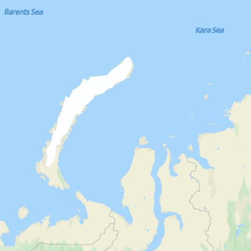

# Tile APIs<a name="EN-US_TOPIC_0000001145781033"></a>

-   [Function](#section8455201431219)
-   [Scenario](#section2157144513547)
-   [Restrictions](#section61115393106)
-   [Prototype](#section3346411124)
-   [Request Parameters](#section4128425141210)
-   [Request Example](#section6577114310124)
-   [Response Parameters](#section2445400135)
-   [Call Example](#section17816151918134)

## Function<a name="section8455201431219"></a>

Allows you to directly access and obtain grid map tile data through the URL parameter in the HTTP request. You can request independent map tiles to build a map layer, so that the map can be easily loaded to an existing map platform.

## Scenario<a name="section2157144513547"></a>

You can request independent map tiles to build a map layer, so that the map can be easily loaded to an existing map platform. For example, you can load the tiles to the QGIS or ArcGIS platform on the PC, or to the existing map as tile overlays in mobile apps.

## Restrictions<a name="section61115393106"></a>

For details about service call quota, please refer to  [Service Pricing](en-us_topic_0000001145860925.md).

## Prototype<a name="section3346411124"></a>

<a name="table11154520143815"></a>
<table><tbody><tr id="row18154202003811"><th class="firstcol" valign="top" width="20%" id="mcps1.1.3.1.1"><p id="p101546202386"><a name="p101546202386"></a><a name="p101546202386"></a>Protocol</p>
</th>
<td class="cellrowborder" valign="top" width="80%" headers="mcps1.1.3.1.1 "><p id="p81541720123818"><a name="p81541720123818"></a><a name="p81541720123818"></a>HTTPS GET</p>
</td>
</tr>
<tr id="row1115462019387"><th class="firstcol" valign="top" width="20%" id="mcps1.1.3.2.1"><p id="p12756174203813"><a name="p12756174203813"></a><a name="p12756174203813"></a>Direction</p>
</th>
<td class="cellrowborder" valign="top" width="80%" headers="mcps1.1.3.2.1 "><p id="p16154112093811"><a name="p16154112093811"></a><a name="p16154112093811"></a>Your server -&gt; HUAWEI Map Kit server</p>
</td>
</tr>
<tr id="row215413208388"><th class="firstcol" valign="top" width="20%" id="mcps1.1.3.3.1"><p id="p19782114513386"><a name="p19782114513386"></a><a name="p19782114513386"></a>URL</p>
</th>
<td class="cellrowborder" valign="top" width="80%" headers="mcps1.1.3.3.1 "><p id="p9827850185319"><a name="p9827850185319"></a><a name="p9827850185319"></a>https://mapapi.cloud.huawei.com/mapApi/v1/mapService/getTile?Parameter?key=<i><span class="varname" id="varname168423113295"><a name="varname168423113295"></a><a name="varname168423113295"></a>API KEY</span></i></p>
<div class="note" id="note65176364306"><a name="note65176364306"></a><a name="note65176364306"></a><span class="notetitle"> NOTE: </span><div class="notebody"><a name="en-us_topic_0000001099181294_ol42140252365"></a><a name="en-us_topic_0000001099181294_ol42140252365"></a><ol id="en-us_topic_0000001099181294_ol42140252365"><li>For details about how to obtain an API key, please refer to <a href="en-us_topic_0000001099501072.md#section169441820428">Obtaining the API Key</a>.</li><li>You need to call the <strong id="en-us_topic_0000001099181294_b144635512110"><a name="en-us_topic_0000001099181294_b144635512110"></a><a name="en-us_topic_0000001099181294_b144635512110"></a>URLEncoder.encode("Your apiKey", "UTF-8")</strong> method to encode the API key using <strong id="en-us_topic_0000001099181294_b646418511120"><a name="en-us_topic_0000001099181294_b646418511120"></a><a name="en-us_topic_0000001099181294_b646418511120"></a>encodeURI</strong>. For example, if the original API key is <strong id="en-us_topic_0000001099181294_b14422031224"><a name="en-us_topic_0000001099181294_b14422031224"></a><a name="en-us_topic_0000001099181294_b14422031224"></a>ABC/DFG+</strong>, the conversion result is <strong id="en-us_topic_0000001099181294_b2431137214"><a name="en-us_topic_0000001099181294_b2431137214"></a><a name="en-us_topic_0000001099181294_b2431137214"></a>ABC%2FDFG%2B</strong>.</li></ol>
</div></div>
</td>
</tr>
<tr id="row39361834214"><th class="firstcol" valign="top" width="20%" id="mcps1.1.3.4.1"><p id="p59410184422"><a name="p59410184422"></a><a name="p59410184422"></a>Data Format</p>
</th>
<td class="cellrowborder" valign="top" width="80%" headers="mcps1.1.3.4.1 "><p id="p919916013510"><a name="p919916013510"></a><a name="p919916013510"></a>Response: Content-Type: image/png</p>
</td>
</tr>
</tbody>
</table>

## Request Parameters<a name="section4128425141210"></a>

**Query String**

<a name="table77202273214"></a>
<table><thead align="left"><tr id="row11729225326"><th class="cellrowborder" valign="top" width="18%" id="mcps1.1.5.1.1"><p id="p87210228329"><a name="p87210228329"></a><a name="p87210228329"></a>Parameter</p>
</th>
<th class="cellrowborder" valign="top" width="14.000000000000002%" id="mcps1.1.5.1.2"><p id="p129581029151016"><a name="p129581029151016"></a><a name="p129581029151016"></a>Mandatory/Optional</p>
</th>
<th class="cellrowborder" valign="top" width="18%" id="mcps1.1.5.1.3"><p id="p18726222329"><a name="p18726222329"></a><a name="p18726222329"></a>Type</p>
</th>
<th class="cellrowborder" valign="top" width="50%" id="mcps1.1.5.1.4"><p id="p67242210323"><a name="p67242210323"></a><a name="p67242210323"></a>Description</p>
</th>
</tr>
</thead>
<tbody><tr id="row1872122203212"><td class="cellrowborder" valign="top" width="18%" headers="mcps1.1.5.1.1 "><p id="p6274235149"><a name="p6274235149"></a><a name="p6274235149"></a>x</p>
</td>
<td class="cellrowborder" valign="top" width="14.000000000000002%" headers="mcps1.1.5.1.2 "><p id="p1295852931019"><a name="p1295852931019"></a><a name="p1295852931019"></a>Mandatory</p>
</td>
<td class="cellrowborder" valign="top" width="18%" headers="mcps1.1.5.1.3 "><p id="p95731160406"><a name="p95731160406"></a><a name="p95731160406"></a>Integer</p>
</td>
<td class="cellrowborder" valign="top" width="50%" headers="mcps1.1.5.1.4 "><p id="p192291810121710"><a name="p192291810121710"></a><a name="p192291810121710"></a>X coordinate.</p>
</td>
</tr>
<tr id="row1772422133216"><td class="cellrowborder" valign="top" width="18%" headers="mcps1.1.5.1.1 "><p id="p127414351843"><a name="p127414351843"></a><a name="p127414351843"></a>y</p>
</td>
<td class="cellrowborder" valign="top" width="14.000000000000002%" headers="mcps1.1.5.1.2 "><p id="p995892921018"><a name="p995892921018"></a><a name="p995892921018"></a>Mandatory</p>
</td>
<td class="cellrowborder" valign="top" width="18%" headers="mcps1.1.5.1.3 "><p id="p55731816194019"><a name="p55731816194019"></a><a name="p55731816194019"></a>Integer</p>
</td>
<td class="cellrowborder" valign="top" width="50%" headers="mcps1.1.5.1.4 "><p id="p123881323134015"><a name="p123881323134015"></a><a name="p123881323134015"></a>Y coordinate.</p>
</td>
</tr>
<tr id="row1872722153217"><td class="cellrowborder" valign="top" width="18%" headers="mcps1.1.5.1.1 "><p id="p127413514420"><a name="p127413514420"></a><a name="p127413514420"></a>z</p>
</td>
<td class="cellrowborder" valign="top" width="14.000000000000002%" headers="mcps1.1.5.1.2 "><p id="p19581029131019"><a name="p19581029131019"></a><a name="p19581029131019"></a>Optional</p>
</td>
<td class="cellrowborder" valign="top" width="18%" headers="mcps1.1.5.1.3 "><p id="p327483510411"><a name="p327483510411"></a><a name="p327483510411"></a>Integer</p>
</td>
<td class="cellrowborder" valign="top" width="50%" headers="mcps1.1.5.1.4 "><p id="p32732712176"><a name="p32732712176"></a><a name="p32732712176"></a>Zoom level.</p>
</td>
</tr>
<tr id="row89629259496"><td class="cellrowborder" valign="top" width="18%" headers="mcps1.1.5.1.1 "><p id="p29631525154917"><a name="p29631525154917"></a><a name="p29631525154917"></a>language</p>
</td>
<td class="cellrowborder" valign="top" width="14.000000000000002%" headers="mcps1.1.5.1.2 "><p id="p396332510491"><a name="p396332510491"></a><a name="p396332510491"></a>Optional</p>
</td>
<td class="cellrowborder" valign="top" width="18%" headers="mcps1.1.5.1.3 "><p id="p2096392516497"><a name="p2096392516497"></a><a name="p2096392516497"></a>String</p>
</td>
<td class="cellrowborder" valign="top" width="50%" headers="mcps1.1.5.1.4 "><p id="p29631425114915"><a name="p29631425114915"></a><a name="p29631425114915"></a>Map display language. The value is a language code complying with ISO 639-2 or BCP47. BCP47 is recommended. For details about the value range, please refer to <a href="en-us_topic_0000001145860921.md">Supported Languages</a>.</p>
</td>
</tr>
<tr id="row869415407514"><td class="cellrowborder" valign="top" width="18%" headers="mcps1.1.5.1.1 "><p id="p136942409514"><a name="p136942409514"></a><a name="p136942409514"></a>scale</p>
</td>
<td class="cellrowborder" valign="top" width="14.000000000000002%" headers="mcps1.1.5.1.2 "><p id="p1915472914536"><a name="p1915472914536"></a><a name="p1915472914536"></a>Optional</p>
</td>
<td class="cellrowborder" valign="top" width="18%" headers="mcps1.1.5.1.3 "><p id="p36941740185112"><a name="p36941740185112"></a><a name="p36941740185112"></a>int</p>
</td>
<td class="cellrowborder" valign="top" width="50%" headers="mcps1.1.5.1.4 "><p id="p1969484095119"><a name="p1969484095119"></a><a name="p1969484095119"></a>Map scale. The options are <strong id="b064664510510"><a name="b064664510510"></a><a name="b064664510510"></a>1</strong> and <strong id="b18652145353"><a name="b18652145353"></a><a name="b18652145353"></a>2</strong>. The default value is <strong id="b1265211451857"><a name="b1265211451857"></a><a name="b1265211451857"></a>1</strong>.</p>
</td>
</tr>
</tbody>
</table>

## Request Example<a name="section6577114310124"></a>

```
GET
https://mapapi.cloud.huawei.com/mapApi/v1/mapService/getTile?x=5&y=1&z=3&language=en&scale=2&key=API KEY
```

## Response Parameters<a name="section2445400135"></a>

**When the status code is 200:**

**Response Header**

<a name="table12509142914219"></a>
<table><thead align="left"><tr id="row1150982918214"><th class="cellrowborder" valign="top" width="18%" id="mcps1.1.5.1.1"><p id="p10509329102114"><a name="p10509329102114"></a><a name="p10509329102114"></a>Parameter</p>
</th>
<th class="cellrowborder" valign="top" width="14.000000000000002%" id="mcps1.1.5.1.2"><p id="p16509129132117"><a name="p16509129132117"></a><a name="p16509129132117"></a>Mandatory/Optional</p>
</th>
<th class="cellrowborder" valign="top" width="18%" id="mcps1.1.5.1.3"><p id="p12509132915214"><a name="p12509132915214"></a><a name="p12509132915214"></a>Type</p>
</th>
<th class="cellrowborder" valign="top" width="50%" id="mcps1.1.5.1.4"><p id="p1650992972118"><a name="p1650992972118"></a><a name="p1650992972118"></a>Description</p>
</th>
</tr>
</thead>
<tbody><tr id="row18510102912216"><td class="cellrowborder" valign="top" width="18%" headers="mcps1.1.5.1.1 "><p id="p15510162932115"><a name="p15510162932115"></a><a name="p15510162932115"></a>Content-Type</p>
</td>
<td class="cellrowborder" valign="top" width="14.000000000000002%" headers="mcps1.1.5.1.2 "><p id="p19510112919214"><a name="p19510112919214"></a><a name="p19510112919214"></a>Mandatory</p>
</td>
<td class="cellrowborder" valign="top" width="18%" headers="mcps1.1.5.1.3 "><p id="p205101929182117"><a name="p205101929182117"></a><a name="p205101929182117"></a>application/json</p>
</td>
<td class="cellrowborder" valign="top" width="50%" headers="mcps1.1.5.1.4 "><p id="p1951092919216"><a name="p1951092919216"></a><a name="p1951092919216"></a>Response data format.</p>
</td>
</tr>
</tbody>
</table>

**Response Body**

<a name="table157795718811"></a>
<table><thead align="left"><tr id="row277457982"><th class="cellrowborder" valign="top" width="20%" id="mcps1.1.4.1.1"><p id="p27785719818"><a name="p27785719818"></a><a name="p27785719818"></a>Parameter</p>
</th>
<th class="cellrowborder" valign="top" width="20%" id="mcps1.1.4.1.2"><p id="p16771157882"><a name="p16771157882"></a><a name="p16771157882"></a>Type</p>
</th>
<th class="cellrowborder" valign="top" width="60%" id="mcps1.1.4.1.3"><p id="p47712576815"><a name="p47712576815"></a><a name="p47712576815"></a>Description</p>
</th>
</tr>
</thead>
<tbody><tr id="row20774571781"><td class="cellrowborder" valign="top" width="20%" headers="mcps1.1.4.1.1 "><p id="p112811901011"><a name="p112811901011"></a><a name="p112811901011"></a>Body</p>
</td>
<td class="cellrowborder" valign="top" width="20%" headers="mcps1.1.4.1.2 "><p id="p1028139181014"><a name="p1028139181014"></a><a name="p1028139181014"></a>String</p>
</td>
<td class="cellrowborder" valign="top" width="60%" headers="mcps1.1.4.1.3 "><p id="p201582019431"><a name="p201582019431"></a><a name="p201582019431"></a>Byte stream of grid map tiles.</p>
</td>
</tr>
</tbody>
</table>

## Call Example<a name="section17816151918134"></a>

```
public class GetStaticMapService {
    OkHttpClient client = new OkHttpClient();

    Request request = new Request.Builder()
            .url("https://mapapi.cloud.huawei.com/mapApi/v1/mapService/getTile?x=5&y=1&z=3&language=en&scale=2&key=xxxx")
            .get()
            .build();

    Response response = client.newCall(request).execute();
}
```

**Figure  1**  Grid map tiles<a name="fig7979641924"></a>  


