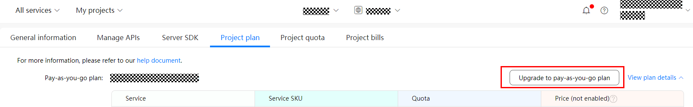

# Service Pricing

-   [Service Subscription](#section785395184220)
-   [Service Pricing Details](#section1414211664213)
-   [Subscribing to a Pay-As-You-Go Plan](#section7921102111484)

## Service Subscription

1.  Map Kit uses the pay-as-you-go mode for settlement. From January 1, 2021, Huawei offers each developer with a  **coupon of US$300 each month**, which the developer can use to pay for the usage of Location Kit, Map Kit, and Site Kit. The coupon is valid only  **in the month when it is delivered**.
2.  After you successfully register as a Huawei developer and create a project in AppGallery Connect, Huawei will automatically enable corresponding free plans for your project. If you are an enterprise developer and want to use paid APIs of Map Kit, subscribe to the relevant pay-as-you-go plan in AppGallery Connect. For details, please refer to  [Service Pricing and Subscription](https://developer.huawei.com/consumer/en/doc/development/AppGallery-connect-Guides/agc-service-billing). If your are an individual developer, Huawei offers you a free quota. If the free quota is used up, send an email to  [mapteam@huawei.com](mailto:mapteam@huawei.com)  to apply for more quota.
3.  Huawei will charge you for paid services of AppGallery Connect based on your actual service usage. To prevent service interruption, ensure that your account has sufficient balance. For details, please refer to  [Service Pricing and Subscription](https://developer.huawei.com/consumer/en/doc/development/AppGallery-connect-Guides/agc-service-billing).

## Service Pricing Details

<table><thead align="left"><tr id="row7241259114419"><th class="cellrowborder" align="left" valign="top" width="29.98%" id="mcps1.1.4.1.1">
<strong id="b1682872328">Service</strong>

</th>
<th class="cellrowborder" align="left" valign="top" width="37.76%" id="mcps1.1.4.1.2">
<strong id="b128519393326">Pay-As-You-Go Price</strong>

</th>
<th class="cellrowborder" align="left" valign="top" width="32.26%" id="mcps1.1.4.1.3">
<strong id="b1385314332">Remarks</strong>

</th>
</tr>
</thead>
<tbody><tr id="row152421859164418"><td class="cellrowborder" align="left" valign="top" width="29.98%" headers="mcps1.1.4.1.1 ">
Map loading (Android SDK)

</td>
<td class="cellrowborder" align="left" valign="top" width="37.76%" headers="mcps1.1.4.1.2 ">
Free

</td>
<td class="cellrowborder" rowspan="11" align="left" valign="top" width="32.26%" headers="mcps1.1.4.1.3 ">
From January 1, 2021, Huawei offers each developer with a coupon of US$300 each month, which the developer can use to pay for the usage of Location Kit, Map Kit, and Site Kit. The coupon is valid only in the month when it is delivered.

 NOTE: 

Map Kit, Site Kit, and Location Kit share the coupon of US$300. 

</td>
</tr>
<tr id="row724211593444"><td class="cellrowborder" align="left" valign="top" headers="mcps1.1.4.1.1 ">
Static map (Android SDK)

</td>
<td class="cellrowborder" align="left" valign="top" headers="mcps1.1.4.1.2 ">
Free

</td>
</tr>
<tr id="row5243145984419"><td class="cellrowborder" align="left" valign="top" headers="mcps1.1.4.1.1 ">
Map loading (JavaScript API)

</td>
<td class="cellrowborder" align="left" valign="top" headers="mcps1.1.4.1.2 ">
0–100,000 times/month: US$5 per thousand times

100,001 or more times/month: US$4 per thousand times

</td>
</tr>
<tr id="row11381649192913"><td class="cellrowborder" align="left" valign="top" headers="mcps1.1.4.1.1 ">
Static map (Web API)

</td>
<td class="cellrowborder" align="left" valign="top" headers="mcps1.1.4.1.2 ">
0–100,000 times/month: US$1.5 per thousand times

100,001 or more times/month: US$1.2 per thousand times

</td>
</tr>
<tr id="row218714214381"><td class="cellrowborder" align="left" valign="top" headers="mcps1.1.4.1.1 ">
Raster tiles (Web API)

</td>
<td class="cellrowborder" align="left" valign="top" headers="mcps1.1.4.1.2 ">
0–100,000 times/month: US$0.25 per thousand times

100,001 or more times/month: US$0.2 per thousand times

</td>
</tr>
<tr id="row9245175914418"><td class="cellrowborder" align="left" valign="top" headers="mcps1.1.4.1.1 ">
Walking route planning (Directions API)

</td>
<td class="cellrowborder" align="left" valign="top" headers="mcps1.1.4.1.2 ">
0–100,000 times/month: US$3.5 per thousand times

100,001 or more times/month: US$2.8 per thousand times

</td>
</tr>
<tr id="row14247165911444"><td class="cellrowborder" align="left" valign="top" headers="mcps1.1.4.1.1 ">
Cycling route planning (Directions API)

</td>
<td class="cellrowborder" align="left" valign="top" headers="mcps1.1.4.1.2 ">
0–100,000 times/month: US$3.5 per thousand times

100,001 or more times/month: US$2.8 per thousand times

</td>
</tr>
<tr id="row1724810598448"><td class="cellrowborder" align="left" valign="top" headers="mcps1.1.4.1.1 ">
Driving route planning (Directions API)

</td>
<td class="cellrowborder" align="left" valign="top" headers="mcps1.1.4.1.2 ">
0–100,000 times/month: US$3.5 per thousand times

100,001 or more times/month: US$2.8 per thousand times

</td>
</tr>
<tr id="row1493582652619"><td class="cellrowborder" align="left" valign="top" headers="mcps1.1.4.1.1 ">
Walking route planning (Matrix API)

</td>
<td class="cellrowborder" align="left" valign="top" headers="mcps1.1.4.1.2 ">
0–100,000 times/month: US$3.5 per thousand times 

100,001 or more times/month: US$2.8 per thousand times

</td>
</tr>
<tr id="row16475515269"><td class="cellrowborder" align="left" valign="top" headers="mcps1.1.4.1.1 ">
Cycling route planning (Matrix API)

</td>
<td class="cellrowborder" align="left" valign="top" headers="mcps1.1.4.1.2 ">
0–100,000 times/month: US$3.5 per thousand times

100,001 or more times/month: US$2.8 per thousand times

</td>
</tr>
<tr id="row1520655415261"><td class="cellrowborder" align="left" valign="top" headers="mcps1.1.4.1.1 ">
Driving route planning (Matrix API)

</td>
<td class="cellrowborder" align="left" valign="top" headers="mcps1.1.4.1.2 ">
0–100,000 times/month: US$3.5 per thousand times

100,001 or more times/month: US$2.8 per thousand times

</td>
</tr>
</tbody>
</table>

## Subscribing to a Pay-As-You-Go Plan

From January 1, 2021, Map Kit will offer pay-as-you-go plans for some of its APIs. To upgrade the pay-as-you-go plan for your project, sign in to  [AppGallery Connect](https://developer.huawei.com/consumer/en/service/josp/agc/index.html#/), click  **My projects**, click your project, and go to  **Project settings**  \>  **Project plan**.

