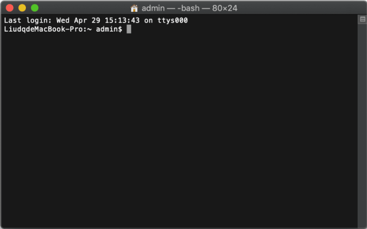
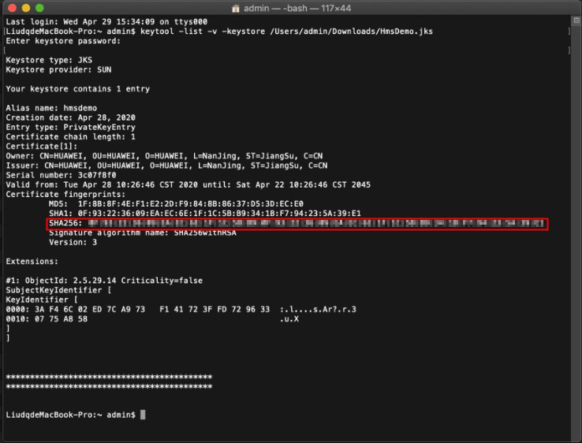

# Configuring App Information in AppGallery Connect<a name="EN-US_TOPIC_0000001098843584"></a>

-   [Registering as a Developer](#section47264296)
-   [Creating a Project](#section83893131911)
-   [Creating an App](#section0592162815915)
-   [Generating a Signing Certificate Fingerprint](#section147011294331)
-   [Configuring the Signing Certificate Fingerprint](#section4972271336)
-   [Enabling Required Services](#section58097464)

Before you start developing an app, configure app information in AppGallery Connect.

## Registering as a Developer<a name="section47264296"></a>

Before you get started, you must register as a Huawei developer and complete identity verification on  [HUAWEI Developers](https://developer.huawei.com/consumer/en). For details, please refer to  [Registration and Verification](https://developer.huawei.com/consumer/en/doc/start/registration-and-verification-0000001053628148).

## Creating a Project<a name="section83893131911"></a>

Follow instructions in  [Creating an AppGallery Connect Project](https://developer.huawei.com/consumer/en/doc/development/AppGallery-connect-Guides/agc-get-started#h1-1587521853252)  to create a project.

## Creating an App<a name="section0592162815915"></a>

Add an app to your project. For details, please refer to  [Adding an App to the Project](https://developer.huawei.com/consumer/en/doc/development/AppGallery-connect-Guides/agc-get-started#h1-1587521946133). Set relevant parameters as follows:

-   Platform:  **Android**
-   Device:  **Mobile phone**
-   App category:  **App**  or  **Game**

## Generating a Signing Certificate Fingerprint<a name="section147011294331"></a>

The signing certificate fingerprint is used to verify the authenticity of an app. Before releasing an app, you must generate a signing certificate fingerprint locally based on the signing certificate and configure it in AppGallery Connect.

Before you do this, make sure that the following conditions are met:

-   You have created the app's signing certificate. For details, please refer to  [Generating a Signing Certificate](https://developer.huawei.com/consumer/en/codelab/HMSPreparation/index.html#2).
-   The  [JDK](https://www.oracle.com/java/technologies/javase-downloads.html)  has been installed on your PC.

To generate a signing certificate fingerprint, perform the following steps:

-   Windows
    1.  Open the command-line interface \(CLI\) using the  **cmd**  command, and run the  **cd**  command to go to the directory where  **keytool.exe**  is located. In the following example, the JDK is installed in the  **Program Files**  folder in drive C.

        ```
        cd C:\Program Files\Java\jdk\bin
        ```

    2.  Run  **keytool -list -v -keystore **_<keystore-file\>_  and respond as prompted. In the command,  _<keystore-file\>_  indicates the absolute path to the app's signing certificate.

        Example:

        ```
        keytool -list -v -keystore C:\TestApp.jks
        ```

    3.  Obtain the SHA-256 certificate fingerprint.

        .png)


-   macOS
    1.  Open Terminal.

        

    2.  Run  **keytool -list -v -keystore **_<keystore-file\>_  and respond as prompted. In the command,  _<keystore-file\>_  indicates the absolute path to the app's signing certificate.

        Example:

        ```
        keytool -list -v -keystore /Users/admin/Downloads/HmsDemo.jks
        ```

    3.  Obtain the SHA-256 certificate fingerprint.

        


## Configuring the Signing Certificate Fingerprint<a name="section4972271336"></a>

1.  Sign in to  [AppGallery Connect](https://developer.huawei.com/consumer/en/service/josp/agc/index.html)  and click  **My projects**.
2.  Find your app project, and click the desired app name.
3.  Go to  **Project settings**  \>  **General information**. In the  **App information**  area, click the    icon next to  **SHA-256 certificate fingerprint**, and enter the obtained SHA-256 certificate fingerprint.

    .png)

    > **NOTE:** 
    >1.  Go to  **Project settings**  \>  **General information**. In the  **App information**  area, click the    icon next to  **API key**. The API key will then be copied to the clipboard.
    >2.  The API key must be encoded using  **encodeURI**. For example, if the original API key is  **ABC/DFG+**, the conversion result is  **ABC%2FDFG%2B**.

4.  After completing the configuration, click  .

## Enabling Required Services<a name="section58097464"></a>

To use Map Kit, you need to enable it in  [AppGallery Connect](https://developer.huawei.com/consumer/en/service/josp/agc/index.html). For details, please refer to  [Enabling Services](https://developer.huawei.com/consumer/en/doc/distribution/app/agc-enable_service).

