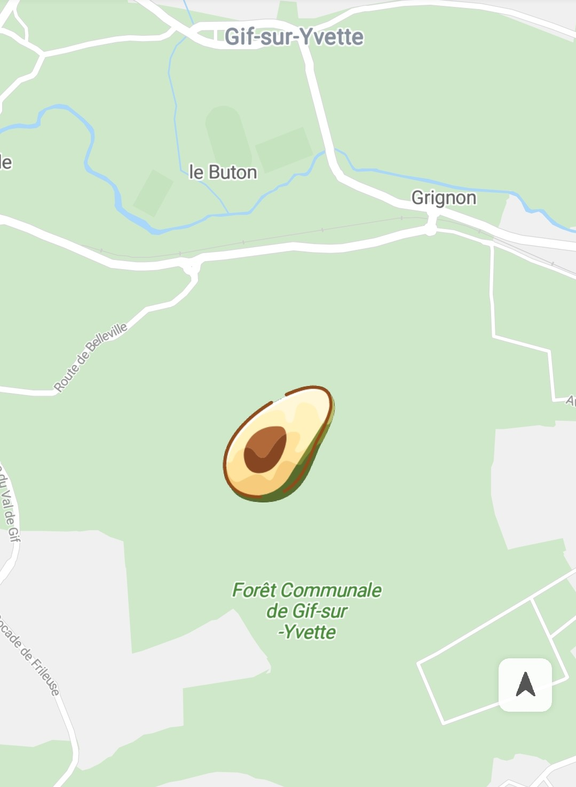

# Ground Overlay<a name="EN-US_TOPIC_0000001098683764"></a>

-   [Adding a Ground Overlay](#section182724503583)
-   [Listening for Ground Overlay Events](#section191618511427)

A ground overlay is an image fixed on a map.

## Adding a Ground Overlay<a name="section182724503583"></a>

1.  Use  [BitmapDescriptorFactory](en-us_topic_0000001145523543.md)  to create a  [BitmapDescriptor](en-us_topic_0000001145843379.md)  object.

    The sample code is as follows:

    ```
    Java
    BitmapDescriptor descriptorFromAsset = BitmapDescriptorFactory.fromAsset("images/avocado.jpg");
    BitmapDescriptor descriptorFromBitmap = BitmapDescriptorFactory.fromBitmap(bitmap);
    BitmapDescriptor descriptorFromFile = BitmapDescriptorFactory.fromFile(fileName);
    BitmapDescriptor descriptorFromPath = BitmapDescriptorFactory.fromPath(path);
    BitmapDescriptor descriptorFromResource = BitmapDescriptorFactory.fromResource(R.drawable.makalong);
    ```

    ```
    Kotlin
    val descriptorFromAsset = BitmapDescriptorFactory.fromAsset("images/avocado.jpg")
    val descriptorFromBitmap = BitmapDescriptorFactory.fromBitmap(bitmap)
    val descriptorFromFile = BitmapDescriptorFactory.fromFile(fileName)
    val descriptorFromPath = BitmapDescriptorFactory.fromPath(path)
    val descriptorFromResource = BitmapDescriptorFactory.fromResource(R.drawable.makalong)
    ```

2.  Create a  [GroundOverlayOptions](en-us_topic_0000001145523519.md)  object to determine the image and position of the ground overlay to be added.

    The sample code is as follows:

    ```
    Java
    GroundOverlayOptions options =
        new GroundOverlayOptions().position(new LatLng(48.893478, 2.334595), 60, 30).image(descriptor);
    ```

    ```
    Kotlin
    val options = GroundOverlayOptions().position(LatLng(48.893478, 2.334595), 60f, 30f).image(descriptor)
    ```

3.  Use the  [addGroundOverlay](en-us_topic_0000001098683684.md#section374112486409)\([GroundOverlayOptions](en-us_topic_0000001145523519.md)\) method of the  [HuaweiMap](en-us_topic_0000001098683684.md)  object to add a ground overlay, as shown in  [Figure 1](#fig1214423215566). The method returns the  [GroundOverlay](en-us_topic_0000001099163498.md)  object.

    The sample code is as follows:

    ```
    Java
    private GroundOverlay mGroundOverlay;
    
    // Add a ground overlay on the map.
    mGroundOverlay = hMap.addGroundOverlay(options);
    ```

    ```
    Kotlin
    private var mGroundOverlay: GroundOverlay? = null
    
    // Add a ground overlay on the map.
    mGroundOverlay = hMap.addGroundOverlay(options)
    ```

    **Figure  1**  Ground overlay<a name="fig1214423215566"></a>  
    

4.  Modify and remove the ground overlay.

    The sample code is as follows:

    ```
    Java
    if (null != mGroundOverlay) {
        // Set a ground overlay.
        mGroundOverlay.setImage(BitmapDescriptorFactory.fromResource(R.drawable.makalong));
    }
    
    if (null != mGroundOverlay) {
        // Remove the ground overlay.
        mGroundOverlay.remove();
    }
    ```

    ```
    Kotlin
    if (null != mGroundOverlay) {
        // Set a ground overlay.
        mGroundOverlay?.setImage(BitmapDescriptorFactory.fromResource(R.drawable.makalong))
    }
    
    if (null != mGroundOverlay) {
        // Remove the ground overlay.
        mGroundOverlay?.remove()
    }
    ```

5.  Set the position of the ground overlay.

    > **NOTE:** 
    >The  [position](en-us_topic_0000001145523519.md#section18441164103913)**\(**[LatLng](en-us_topic_0000001099003538.md)** location, float width\)**  and  [position](en-us_topic_0000001145523519.md#section1263995883915)**\(**[LatLng](en-us_topic_0000001099003538.md)** location, float width, float height\)**  methods cannot be used together with  [positionFromBounds](en-us_topic_0000001145523519.md#section1971542716405)**\(**[LatLngBounds](en-us_topic_0000001098683710.md)** bounds\)**. Otherwise, exception  **IllegalStateException**  will be reported.

    -   public  [GroundOverlayOptions](en-us_topic_0000001145523519.md)  position\([LatLng](en-us_topic_0000001099003538.md)  location, float width\)

        This method sets the position of a ground overlay based on the longitude and latitude and image width \(in meters\). The image height is automatically calculated and adjusted based on the aspect ratio and width of the image.


    -   public  [GroundOverlayOptions](en-us_topic_0000001145523519.md)  position\([LatLng](en-us_topic_0000001099003538.md)  location, float width, float height\)

        This method sets the position of a ground overlay based on the longitude and latitude, image width \(in meters\), and image height \(in meters\). The image will be zoomed to adapt to the specified resolutions and may be deformed.


    -   public  [GroundOverlayOptions](en-us_topic_0000001145523519.md)  positionFromBounds\([LatLngBounds](en-us_topic_0000001098683710.md)  bounds\)

        This method specifies a  [LatLngBounds](en-us_topic_0000001098683710.md)  object that provides two  [LatLng](en-us_topic_0000001099003538.md)  objects \(southwest corner and northeast corner\) to form a rectangle area. It will set the position of a ground overlay based on the rectangle area. 


## Listening for Ground Overlay Events<a name="section191618511427"></a>

**Ground Overlay Tap Event**

You can use  [HuaweiMap.OnGroundOverlayClickListener](en-us_topic_0000001145923503.md)  to listen for ground overlay tap events. To set a listener on a map, call the  [setOnGroundOverlayClickListener](en-us_topic_0000001098683684.md#section48222916516)\([HuaweiMap.OnGroundOverlayClickListener](en-us_topic_0000001145923503.md)\) method of the  [HuaweiMap](en-us_topic_0000001098683684.md)  object. When a user taps a ground overlay,  [onGroundOverlayClick](en-us_topic_0000001145923503.md#section1448704115373)\([GroundOverlay](en-us_topic_0000001099163498.md)\) calls the ground overlay.

The sample code is as follows:

```
Java
hMap.setOnGroundOverlayClickListener(new HuaweiMap.OnGroundOverlayClickListener() {
    @Override
    public void onGroundOverlayClick(GroundOverlay groundOverlay) {
        Toast.makeText(getApplicationContext(), "GroundOverlay is clicked.", Toast.LENGTH_LONG).show();
    }
});
```

```
Kotlin
hMap.setOnGroundOverlayClickListener { Toast.makeText(applicationContext, "GroundOverlay is clicked.", Toast.LENGTH_LONG).show() }
```

