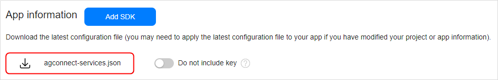
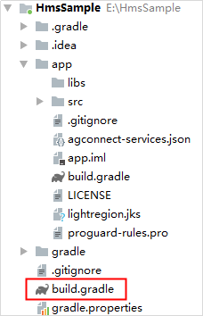
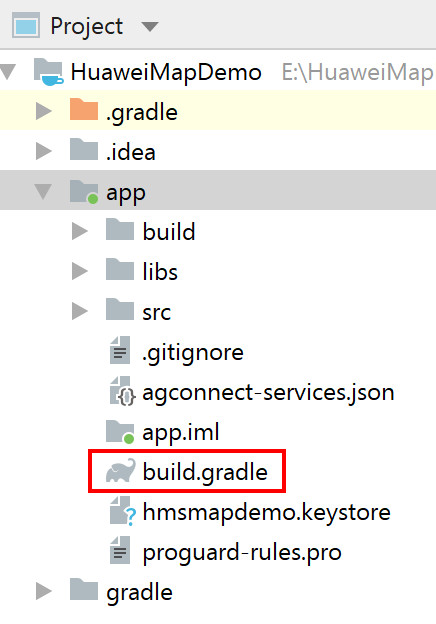
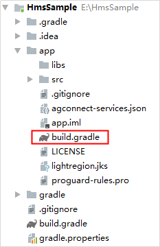

# Integrating the HMS Core SDK<a name="EN-US_TOPIC_0000001145923559"></a>

-   [Adding the AppGallery Connect Configuration File of Your App](#section4256162815361)
-   [Configuring the Maven Repository Address for the HMS Core SDK](#section2258112812366)
-   [Adding Build Dependencies](#section926020288361)
-   [Defining Multi-language Settings](#section52581942164415)
-   [Synchronizing the Project](#section056712581457)
-   [Configuring Metadata](#section14837619928)
-   [Configuring the AndroidManifest.xml File](#section149683326513)

If you are using Android Studio, you can integrate the HMS Core SDK via the Maven repository. Before you start developing an app, integrate the HMS Core SDK into your Android Studio project.

## Adding the AppGallery Connect Configuration File of Your App<a name="section4256162815361"></a>

If you have enabled certain services in AppGallery Connect, add the  **agconnect-services.json**  file to your app.

1.  Sign in to  [AppGallery Connect](https://developer.huawei.com/consumer/en/service/josp/agc/index.html)  and click  **My projects**.
2.  Find your app project and click the app that needs to integrate the HMS Core SDK.
3.  Go to  **Project settings**  \>  **General information**. In the  **App information**  area, download the  **agconnect-services.json**  file.

    

4.  Copy the  **agconnect-services.json**  file to the  **app**  directory of your Android Studio project.

    


## Configuring the Maven Repository Address for the HMS Core SDK<a name="section2258112812366"></a>

1.  Open the  **build.gradle**  file in the root directory of your Android Studio project.

    

2.  Add the AppGallery Connect plugin and the Maven repository.

    -   Go to  **buildscript**  \>  **repositories**  and configure the Maven repository address for the HMS Core SDK.
    -   Go to  **allprojects**  \>  **repositories**  and configure the Maven repository address for the HMS Core SDK.
    -   If the  **agconnect-services.json**  file has been added to the app, go to  **buildscript**  \>  **dependencies**  and add the AppGallery Connect plugin configuration.

    ```
    buildscript {
        repositories {
            google()
            jcenter()
            // Configure the Maven repository address for the HMS Core SDK.
            maven {url 'https://developer.huawei.com/repo/'}
        }
        dependencies {
            ...
            // Add the AppGallery Connect plugin configuration.
            classpath 'com.huawei.agconnect:agcp:1.4.2.300'
        }
    }
    
    allprojects {
        repositories {
            google()
            jcenter()
            // Configure the Maven repository address for the HMS Core SDK.
            maven {url 'https://developer.huawei.com/repo/'}
        }
    } 
    ```

    > **NOTE:** 
    >The Maven repository address cannot be accessed from a browser. It can only be configured in the IDE. If there are multiple Maven repositories, add the Maven repository address of Huawei as the last one.


## Adding Build Dependencies<a name="section926020288361"></a>

1.  Open the  **build.gradle**  file in the  **app**  directory.

    

2.  Add build dependencies.

    1.  Add build dependencies in the  **dependencies**  block.

        ```
        dependencies {
               implementation 'com.huawei.hms:maps:{version}'
        }
        ```

    2.  Add dependencies on fallbacks in the  **dependencies**  block.

        To use Map Kit independent of HMS Core \(APK\), add the following dependencies on the two fallbacks in the  **dependencies**  block. In this case, no default location sources are provided, and you need to configure location sources if you need to use the function of locating the current device location. After adding dependencies on the two fallbacks, you must pass the API key or configure it in the  **agconnect-services.json**  file of your app when calling Map Kit. If the API key is not configured in the  **agconnect-services.json**  file, you can call the  [setApiKey](en-us_topic_0000001145523547.md#section1389444514617)  method of the  [MapsInitializer](en-us_topic_0000001145523547.md)  class to set the API key. For details about how to obtain the API key, please refer to the note on API key in  [Configuring App Information in AppGallery Connect](android-sdk-config-agc.md#note127421480115).

        The Map SDK and fallbacks need to work together. The fallback version must be the same as the Map SDK version. Otherwise, relevant functions may be unavailable due to API level inconsistence. After dependencies on the fallbacks are added, Map Kit can be used without depending on HMS Core \(APK\). However, the Map SDK co-working with the fallbacks is large and cannot be updated online. To use a new version, you must integrate the Map SDK and fallbacks of the new version into your app.

        ```
        dependencies {
               implementation 'com.huawei.hms:maproute-fallback:{version}'
               implementation 'com.huawei.hms:hwmaps-fallback:{version}'
        }
        ```


    > **NOTE:** 
    >1.  Replace  _\{version\}_  with the actual SDK version number, for example,  **implementation 'com.huawei.hms:maps:5.2.0.302'**,  **implementation 'com.huawei.hms:maproute-fallback:5.2.0.302'**, and  **implementation 'com.huawei.hms:hwmaps-fallback:5.2.0.302'**. For details about the version number, please refer to  [Version Change History](android-sdk-version-change-history.md).
    >2.  If your Map SDK version is 3.0.2.301 or later, you need to replace  **'com.android.support:appcompat-\{version\}'**  with  **'androidx.appcompat:appcompat:\{version\}'**, for example,  **implementation 'androidx.appcompat:appcompat:1.0.2'**. In this case, you need to add  **android.useAndroidX=true**  to the  **gradle.properties**  file. 

3.  Add the following information under  **apply plugin: 'com.android.application'**  in the file header:

    ```
    apply plugin: 'com.huawei.agconnect'
    ```

    > **NOTE:** 
    >-   Make sure that you configure  **apply plugin: 'com.huawei.agconnect'**  after  **apply plugin: 'com.android.application'**.
    >-   The minimum Android API level \(**minSdkVersion**\) required for the HMS Core Map SDK is 19.

4.  Copy the signing certificate generated in  [Generating a Signing Certificate](https://developer.huawei.com/consumer/en/codelab/HMSPreparation/index.html#2)  to the  **app**  directory of your project, and configure the signing certificate in  **android**  in the  **build.gradle**  file.

    ```
    android {
        signingConfigs {
            release {
                // Signing certificate.
                storeFile file("**.**")
                // KeyStore password.
                storePassword "******"
                // Alias.
                keyAlias "******"
                // Key password.
                keyPassword "******"
                v2SigningEnabled true
            }
        }
        buildTypes {
            release {
                minifyEnabled false
                proguardFiles getDefaultProguardFile('proguard-android-optimize.txt'), 'proguard-rules.pro'
                signingConfig signingConfigs.release
            }
            debug {
                signingConfig signingConfigs.release
            }
        }
    }
    ```


## Defining Multi-language Settings<a name="section52581942164415"></a>

-   By default, your app supports all languages provided by the HMS Core SDK. If your app uses all these languages, skip the operation procedure in this section.
-   If your app uses only some of these languages, follow the operation procedure in this section to complete the required configuration.

    1.  Open the  **build.gradle**  file in the  **app**  directory of your project.

        


    1.  Go to  **android**  \>  **defaultConfig**, add  **resConfigs**, and configure the supported languages as follows: 

        ```
        android {
                defaultConfig {
                        ...
                        resConfigs "en", "zh-rCN", "Other languages supported by your app"
                }
        }        
        ```


    For details about the languages supported by the HMS Core SDK, please refer to  [Languages Supported by the HMS Core SDK](en-us_topic_0000001050040564.md).


## Synchronizing the Project<a name="section056712581457"></a>

After completing the preceding configuration, click the synchronization icon on the toolbar to synchronize the Gradle files.


> **NOTE:** 
>If an error occurs, check the network connection and the configuration in the Gradle files.

## Configuring Metadata<a name="section14837619928"></a>

> **NOTE:** 
>-   In the following scenario, configure metadata to prompt users to download HMS Core \(APK\):
>    The app store \(such as HUAWEI AppGallery\) allows your app to download other apps in the background, and you call relevant APIs through an activity.
>-   In the following scenario, skip steps in this section. Currently, no way is available for prompting users to download HMS Core \(APK\).
>    The app store \(such as Google Play\) does not allow your app to download other apps in the background, or you call relevant APIs through a context.

Add the following code to the  **application**  element in the  **AndroidManifest.xml**  file, prompting users to download HMS Core \(APK\):

```
<application ...>
    <meta-data     
       android:name="com.huawei.hms.client.channel.androidMarket"  
       android:value="false" />
    ...
</application>
```

After HMS Core \(APK\) is downloaded, the HMS Core SDK will automatically install or update HMS Core \(APK\).

## Configuring the AndroidManifest.xml File<a name="section149683326513"></a>

In Android 11, the way for an app to query other apps on the user device and interact with them has been changed. You can use the  **<queries\>**  element to define a group of apps which your app can access.

If  **targetSdkVersion**  is  **30**  or later, add the  **<queries\>**  element in the  **manifest**  element in  **AndroidManifest.xml**  to allow your app to access HMS Core \(APK\). 

```
<manifest ...>
    ...
    <queries>
        <intent>
            <action android:name="com.huawei.hms.core.aidlservice" />
        </intent>
    </queries>
    ...
</manifest>
```

> **NOTE:** 
>The  **<queries\>**  element requires the following:
>-   Your Android Studio version is 3.3 or later. 
>-   The  [Android Gradle plugin](https://developer.android.com/studio/releases/gradle-plugin)  supported by your Android Studio is in the latest dot release. To learn more, click  [here](https://android-developers.googleblog.com/2020/07/preparing-your-build-for-package-visibility-in-android-11.html). 

