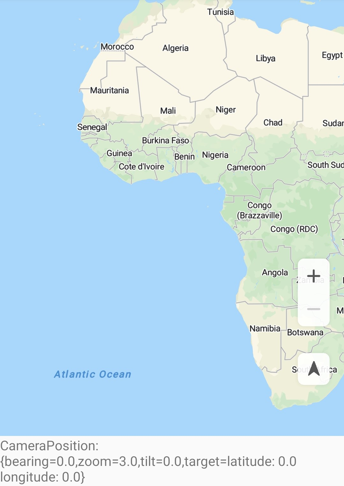
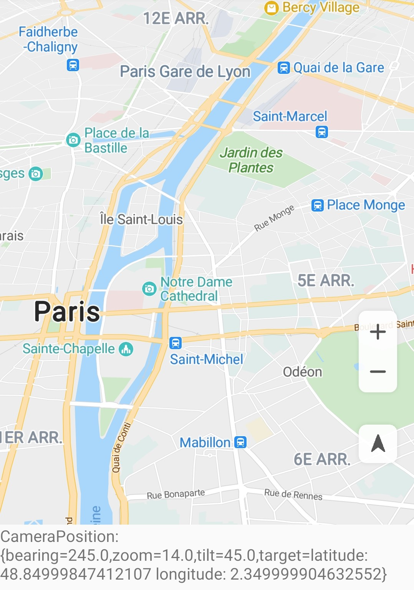

# Map Camera<a name="EN-US_TOPIC_0000001098683766"></a>

-   [Camera Attributes](#section74325714424)
-   [Camera Movement](#section149815252431)
    -   [Methods of Creating a CameraUpdate Object](#section205245430168)
    -   [Methods of Changing the Camera Position](#section75216307182)
    -   [Methods of Setting the Preferred Minimum and Maximum Camera Zoom Levels](#section18861830141919)

-   [Area Constraints](#section1830482964420)

## Camera Attributes<a name="section74325714424"></a>

The following table describes the camera attributes.

<a name="table27510975"></a>
<table><thead align="left"><tr id="row35991756"><th class="cellrowborder" valign="top" width="30.29%" id="mcps1.1.3.1.1"><p id="p52928499"><a name="p52928499"></a><a name="p52928499"></a>Attribute</p>
</th>
<th class="cellrowborder" valign="top" width="69.71000000000001%" id="mcps1.1.3.1.2"><p id="p42622588"><a name="p42622588"></a><a name="p42622588"></a>Description</p>
</th>
</tr>
</thead>
<tbody><tr id="row48058978"><td class="cellrowborder" valign="top" width="30.29%" headers="mcps1.1.3.1.1 "><p id="p37517544"><a name="p37517544"></a><a name="p37517544"></a>target</p>
</td>
<td class="cellrowborder" valign="top" width="69.71000000000001%" headers="mcps1.1.3.1.2 "><p id="p64406624"><a name="p64406624"></a><a name="p64406624"></a>Longitude and latitude of the map center.</p>
</td>
</tr>
<tr id="row42788708"><td class="cellrowborder" valign="top" width="30.29%" headers="mcps1.1.3.1.1 "><p id="p20340317"><a name="p20340317"></a><a name="p20340317"></a>bearing</p>
</td>
<td class="cellrowborder" valign="top" width="69.71000000000001%" headers="mcps1.1.3.1.2 "><p id="p40398935"><a name="p40398935"></a><a name="p40398935"></a>Angle of a map rotated from the north in the clockwise direction. </p>
</td>
</tr>
<tr id="row28046098"><td class="cellrowborder" valign="top" width="30.29%" headers="mcps1.1.3.1.1 "><p id="p65058097"><a name="p65058097"></a><a name="p65058097"></a>tilt</p>
</td>
<td class="cellrowborder" valign="top" width="69.71000000000001%" headers="mcps1.1.3.1.2 "><p id="p33803490"><a name="p33803490"></a><a name="p33803490"></a>Angle of the camera from the nadir (directly facing the Earth), in degrees.</p>
</td>
</tr>
<tr id="row35795957"><td class="cellrowborder" valign="top" width="30.29%" headers="mcps1.1.3.1.1 "><p id="p43365007"><a name="p43365007"></a><a name="p43365007"></a>zoom</p>
</td>
<td class="cellrowborder" valign="top" width="69.71000000000001%" headers="mcps1.1.3.1.2 "><p id="p43338186"><a name="p43338186"></a><a name="p43338186"></a>Zoom level near the center of the screen.</p>
</td>
</tr>
</tbody>
</table>

## Camera Movement<a name="section149815252431"></a>

Huawei maps are moved by simulating camera movement. You can control the visible region of a map by changing the camera's position. To change the camera's position, create different types of  [CameraUpdate](en-us_topic_0000001099163510.md)  objects using the  [CameraUpdateFactory](en-us_topic_0000001098683706.md)  class, and use these objects to move the camera.

### Methods of Creating a CameraUpdate Object<a name="section205245430168"></a>

The sample code is as follows:

```
Java
// Method 1: Increase the camera zoom level by 1 and retain other attribute settings.
CameraUpdate cameraUpdate = CameraUpdateFactory.zoomIn();

// Method 2: Decrease the camera zoom level by 1 and retain other attribute settings.
CameraUpdate cameraUpdate1 = CameraUpdateFactory.zoomOut();

// Method 3: Set the camera zoom level to a specified value and retain other attribute settings.
float zoom = 8.0f;
CameraUpdate cameraUpdate2 = CameraUpdateFactory.zoomTo(zoom);

// Method 4: Increase or decrease the camera zoom level by a specified value.
float amount = 2.0f;
CameraUpdate cameraUpdate3 = CameraUpdateFactory.zoomBy(amount);

// Method 5: Move the camera to the specified center point and increase or decrease the camera zoom level
// by a specified value. 
Point point = new Point(31, 118);
float amount = 2.0f;
CameraUpdate cameraUpdate4 = CameraUpdateFactory.zoomBy(amount, point);

// Method 6: Set the latitude and longitude of the camera and retain other attribute settings.
LatLng latLng1 = new LatLng(31.5, 118.9);
CameraUpdate cameraUpdate5 = CameraUpdateFactory.newLatLng(latLng1);

// Method 7: Set the visible region and padding.
int padding = 100;
LatLng latLng1 = new LatLng(31.5, 118.9);
LatLng latLng2 = new LatLng(32.5, 119.9);
LatLngBounds latLngBounds = new LatLngBounds(latLng1, latLng2);
CameraUpdate cameraUpdate6 = CameraUpdateFactory.newLatLngBounds(latLngBounds, padding);

// Method 8: Set the center point and zoom level of the camera.
float zoom = 0.0f;
LatLng latLng2 = new LatLng(32.5, 119.9);
CameraUpdate cameraUpdate7 = CameraUpdateFactory.newLatLngZoom(latLng2, zoom);

// Method 9: Scroll the camera by specified number of pixels.
float x = 100.0f;
float y = 100.0f;
CameraUpdate cameraUpdate8 = CameraUpdateFactory.scrollBy(x, y);

// Method 10: Specify the camera position.
// Set the tilt.
float tilt = 2.2f;
// Set the bearing.
float bearing = 31.5f;
CameraPosition cameraPosition = new CameraPosition(latLng1,zoom,tilt,bearing);
CameraUpdate cameraUpdate9 = CameraUpdateFactory.newCameraPosition(cameraPosition);
```

```
Kotlin
// Method 1: Increase the camera zoom level by 1 and retain other attribute settings.
val cameraUpdate = CameraUpdateFactory.zoomIn()

// Method 2: Decrease the camera zoom level by 1 and retain other attribute settings.
val cameraUpdate1 = CameraUpdateFactory.zoomOut()

// Method 3: Set the camera zoom level to a specified value and retain other attribute settings.
val zoom = 8.0f
val cameraUpdate2 = CameraUpdateFactory.zoomTo(zoom)

// Method 4: Increase or decrease the camera zoom level by a specified value.
val amount = 2.0f
val cameraUpdate3 = CameraUpdateFactory.zoomBy(amount)

// Method 5: Move the camera to the specified center point and increase or decrease the camera zoom level
// by a specified value. 
val point = Point(31, 118)
val amount = 2.0f
val cameraUpdate4 = CameraUpdateFactory.zoomBy(amount, point)

// Method 6: Set the latitude and longitude of the camera and retain other attribute settings.
val latLng1 = LatLng(31.5, 118.9)
val cameraUpdate5 = CameraUpdateFactory.newLatLng(latLng1)

// Method 7: Set the visible region and padding.
val padding = 100
val latLng1 = LatLng(31.5, 118.9)
val latLng2 = LatLng(32.5, 119.9)
val latLngBounds = LatLngBounds(latLng1, latLng2)
val cameraUpdate6 = CameraUpdateFactory.newLatLngBounds(latLngBounds, padding)

// Method 8: Set the center point and zoom level of the camera.
val zoom = 0.0f
val latLng2 = LatLng(32.5, 119.9)
val cameraUpdate7 = CameraUpdateFactory.newLatLngZoom(latLng2, zoom)

// Method 9: Scroll the camera by specified number of pixels.
val x = 100.0f
val y = 100.0f
val cameraUpdate8 = CameraUpdateFactory.scrollBy(x, y)

// Method 10: Specify the camera position.
// Set the tilt.
val tilt = 2.2f
// Set the bearing.
val bearing = 31.5f
val cameraPosition = CameraPosition(latLng1, zoom, tilt, bearing)
val cameraUpdate9 = CameraUpdateFactory.newCameraPosition(cameraPosition)
```

### Methods of Changing the Camera Position<a name="section75216307182"></a>

You can move the map camera in animation or non-animation mode.

When moving the map camera in animation mode, you can set the animation duration and API to be called back when the animation stops. By default, the animation duration is 250 ms.

Camera movement in non-animation mode is transient.

The sample code is as follows:

```
Java
// Move the map camera in animation mode.
hMap.animateCamera(cameraUpdate);
// Move the map camera in animation mode, and set the API to be called back when the animation stops.
hMap.animateCamera(cameraUpdate, cancelableCallback);
// Move the map camera in animation mode, and set the animation duration and API to be called back when the animation stops. 
hMap.animateCamera(cameraUpdate, durationMs, cancelableCallback);

// Move the map camera in non-animation mode.
hMap.moveCamera(cameraUpdate);
```

```
Kotlin
// Move the map camera in animation mode.
hMap.animateCamera(cameraUpdate)
// Move the map camera in animation mode, and set the API to be called back when the animation stops.
hMap.animateCamera(cameraUpdate, cancelableCallback)
// Move the map camera in animation mode, and set the animation duration and API to be called back when the animation stops. 
hMap.animateCamera(cameraUpdate, durationMs, cancelableCallback)

// Move the map camera in non-animation mode.
hMap.moveCamera(cameraUpdate)
```

### Methods of Setting the Preferred Minimum and Maximum Camera Zoom Levels<a name="section18861830141919"></a>

The sample code is as follows:

```
Java
// Set the preferred minimum zoom level. The value ranges from 3 to 20.
hMap.setMinZoomPreference(3);
// Set the preferred maximum zoom level. The value ranges from 3 to 20.
hMap.setMaxZoomPreference(14);
// Reset the preferred maximum and minimum zoom levels.
hMap.resetMinMaxZoomPreference();
```

```
Kotlin
// Set the preferred minimum zoom level.
hMap.setMinZoomPreference(3)
// Set the preferred maximum zoom level.
hMap.setMaxZoomPreference(14)
// Reset the preferred maximum and minimum zoom levels.
hMap.resetMinMaxZoomPreference()
```

[Figure 1](#fig13952630101917)  and  [Figure 2](#fig1295310301193)  show the effect before and after the camera position is specified. 

<a name="table1795323014196"></a>
<table><tbody><tr id="row129531630181911"><td class="row-nocellborder" style="border:none" valign="top" width="50%"><div class="fignone" id="fig13952630101917"><a name="fig13952630101917"></a><a name="fig13952630101917"></a><span class="figcap"><b>Figure 1 </b>Screen before specifying the camera position</span><br><a name="image895283014197"></a><a name="image895283014197"></a><span></span></div>
</td>
<td class="cellrowborder" style="border:none" valign="top" width="50%"><div class="fignone" id="fig1295310301193"><a name="fig1295310301193"></a><a name="fig1295310301193"></a><span class="figcap"><b>Figure 2 </b>Screen after specifying the camera position</span><br><a name="image9953530161912"></a><a name="image9953530161912"></a><span></span></div>
</td>
</tr>
</tbody>
</table>

## Area Constraints<a name="section1830482964420"></a>

The HMS Core Map SDK allows you to set the map camera bounds. You can call the  [setLatLngBoundsForCameraTarget](en-us_topic_0000001098683684.md#section11439194715114)\([LatLngBounds](en-us_topic_0000001098683710.md)\) API to specify a  [LatLngBounds](en-us_topic_0000001098683710.md)  object to constrain the camera target so it will not get out of the specified bounds when users scroll the map camera. If this parameter is set to  **null**, the map camera bounds will be cleared.

