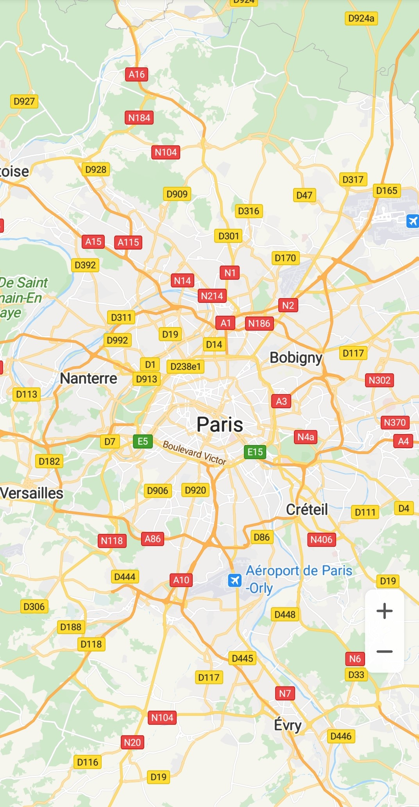
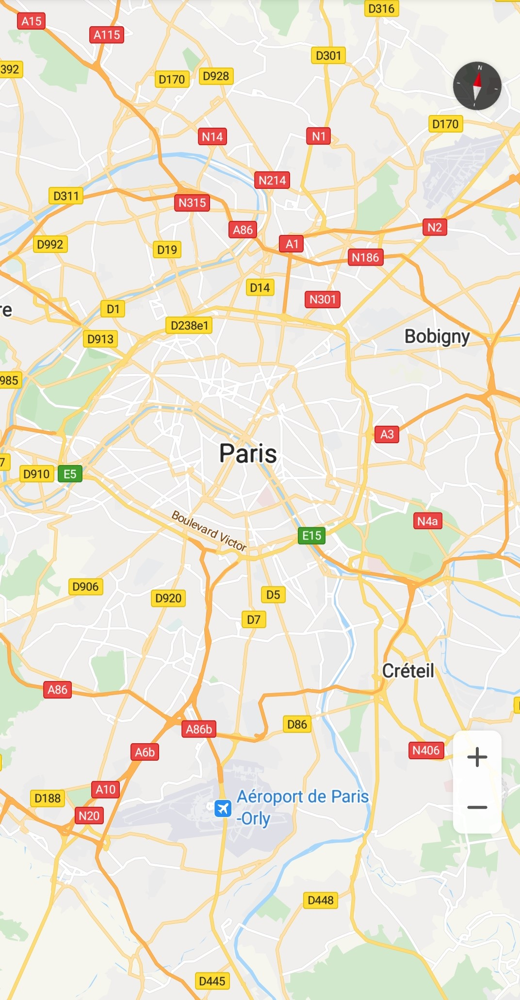

# Map Instance Creation<a name="EN-US_TOPIC_0000001145723499"></a>

-   [Map Container](#section1148432115353)
-   [Setting the API Key](#section147441922143612)

## Map Container<a name="section1148432115353"></a>

Currently, the HMS Core Map SDK supports two map containers:  [SupportMapFragment](en-us_topic_0000001145923513.md)  and  [MapView](en-us_topic_0000001098843522.md).

-   [SupportMapFragment](en-us_topic_0000001145923513.md)  is a subclass of the Android  **Fragment**  class. You can use it to place a map within a fragment. It can also function as a map container and provide an entry for accessing a  [HuaweiMap](en-us_topic_0000001098683684.md)  object.
-   [MapView](en-us_topic_0000001098843522.md)  is a subclass of the Android  **View**  class. You can use it to place a map within an Android view. Like  [SupportMapFragment](en-us_topic_0000001145923513.md),  [MapView](en-us_topic_0000001098843522.md)  functions as a map container and displays core map functions through a  [HuaweiMap](en-us_topic_0000001098683684.md)  object. To use the  [MapView](en-us_topic_0000001098843522.md)  class when calling APIs in normal interaction mode, you must call the following methods in the corresponding methods of your  **Activity**/**Fragment**:  [onCreate](en-us_topic_0000001098843522.md#section5701320154117)**\(\)**,  [onStart](en-us_topic_0000001098843522.md#section1929311316455)**\(\)**,  [onResume](en-us_topic_0000001098843522.md#section127594720434)**\(\)**,  [onPause](en-us_topic_0000001098843522.md#section119871413124319)**\(\)**,  [onStop](en-us_topic_0000001098843522.md#section1185125812451)**\(\)**,  [onDestroy](en-us_topic_0000001098843522.md#section1991150164217)**\(\)**,  [onSaveInstanceState](en-us_topic_0000001098843522.md#section17492429104415)**\(Bundle outState\)**, and  [onLowMemory](en-us_topic_0000001098843522.md#section1298412345428)**\(\)**. For details, please refer to  [MapViewCodeDemoActivity.java](https://github.com/HMS-Core/hms-mapkit-demo-java/blob/master/java/app/src/main/java/com/huawei/hms/maps/sample/MapViewCodeDemoActivity.java).

The following describes how to create a map instance using  [SupportMapFragment](en-us_topic_0000001145923513.md).

1.  Add a  **Fragment**  object in the layout file \(for example,  **activity\_main.xml**\), and set map attributes in the file.

    ```
    <fragment xmlns:android="http://schemas.android.com/apk/res/android"
        xmlns:map="http://schemas.android.com/apk/res-auto"
        android:id="@+id/mapfragment_mapfragmentdemo"
        class="com.huawei.hms.maps.SupportMapFragment"
        android:layout_width="match_parent"
        android:layout_height="match_parent"
        map:cameraTargetLat="48.893478"
        map:cameraTargetLng="2.334595"
        map:cameraZoom="10" />
    ```

2.  To use a map in your app, implement the  [OnMapReadyCallback](en-us_topic_0000001098843540.md)  API in the activity code file.

    The sample code is as follows:

    ```
    Java
    public class SupportMapDemoActivity extends AppCompatActivity implements OnMapReadyCallback {
       ...
    }
    ```

    ```
    Kotlin
    class SupportMapDemoActivity : AppCompatActivity(),OnMapReadyCallback { 
       ... 
    }
    ```

3.  In the activity code file, load  [SupportMapFragment](en-us_topic_0000001145923513.md)  in the  **onCreate\(\)**  method and call  [getMapAsync](en-us_topic_0000001099163506.md#section11704105017376)**\(\)**  to register the callback.

    The sample code is as follows:

    ```
    Java
    private SupportMapFragment mSupportMapFragment; 
    mSupportMapFragment = (SupportMapFragment) getSupportFragmentManager().findFragmentById(R.id.mapfragment_mapfragmentdemo);
    mSupportMapFragment.getMapAsync(this);
    ```

    ```
    Kotlin
    private var mSupportMapFragment: SupportMapFragment? = null
    mSupportMapFragment = supportFragmentManager.findFragmentById(R.id.supportMap) as SupportMapFragment?
    mSupportMapFragment?.getMapAsync(this)
    ```

4.  Call the  [onMapReady](en-us_topic_0000001098843540.md#section74342919481)  callback to obtain the  [HuaweiMap](en-us_topic_0000001098683684.md)  object.

    The sample code is as follows:

    ```
    Java
    public void onMapReady(HuaweiMap huaweiMap) {
        Log.d(TAG, "onMapReady: ");     
        hMap = huaweiMap;
    }
    ```

    ```
    Kotlin
    override fun onMapReady(huaweiMap: HuaweiMap) {
        Log.d(TAG, "onMapReady: ")
        hMap = huaweiMap
    }
    ```

5.  Run your project and then install your app to view the map in your app, as shown in the figure below.

    


The following describes how to create a map instance using  [MapView](en-us_topic_0000001098843522.md).

1.  Add a  [MapView](en-us_topic_0000001098843522.md)  in the layout file, and set the map attributes in the file.

    ```
    <com.huawei.hms.maps.MapView xmlns:android="http://schemas.android.com/apk/res/android"
            xmlns:map="http://schemas.android.com/apk/res-auto"
            android:id="@+id/mapview_mapviewdemo"
            android:layout_width="match_parent"
            android:layout_height="match_parent"
            map:cameraTargetLat="48.893478"
            map:cameraTargetLng="2.334595"
            map:cameraZoom="10"/>
    ```

2.  To use a map in your app, implement the  [OnMapReadyCallback](en-us_topic_0000001098843540.md)  API.

    The sample code is as follows:

    ```
    Java
    public class MapViewDemoActivity extends AppCompatActivity implements OnMapReadyCallback {
       ...
    }
    ```

    ```
    Kotlin
    class MapViewDemoActivity : AppCompatActivity(), OnMapReadyCallback { 
       ... 
    }
    ```

3.  In the code activity code file, load  [MapView](en-us_topic_0000001098843522.md)  in the  **onCreate\(\)**  method and call  [getMapAsync](en-us_topic_0000001098843522.md#section18155143712405)**\(\)**  to register the callback.

    The sample code is as follows:

    ```
    Java
    private MapView mMapView;
    mMapView = findViewById(R.id.mapview_mapviewdemo);
    Bundle mapViewBundle = null;
    if (savedInstanceState != null) {
          mapViewBundle = savedInstanceState.getBundle("MapViewBundleKey");
    }
    mMapView.onCreate(mapViewBundle);
    mMapView.getMapAsync(this);
    ```

    ```
    Kotlin
    private lateinit var mMapView: MapView
    mMapView = findViewById(R.id.mapview_mapviewdemo)
    var mapViewBundle: Bundle? = null
    if (savedInstanceState != null) {
        mapViewBundle = savedInstanceState.getBundle("MapViewBundleKey")
    }
    mMapView.onCreate(mapViewBundle)
    mMapView.getMapAsync(this)
    ```

4.  Call the  [onMapReady](en-us_topic_0000001098843540.md#section74342919481)  callback to obtain the  [HuaweiMap](en-us_topic_0000001098683684.md)  object.

    The sample code is as follows:

    ```
    Java
    public void onMapReady(HuaweiMap huaweiMap) {
        Log.d(TAG, "onMapReady: ");     
        hMap = huaweiMap; 
    }
    ```

    ```
    Kotlin
    override fun onMapReady(huaweiMap: HuaweiMap) {
        Log.d(TAG, "onMapReady: ")
        hMap = huaweiMap
    }
    ```

5.  Call the  **onStart\(\)**,  **onResume\(\)**,  **onPause\(\)**,  **onStop\(\)**,  **onDestroy\(\)**,  **onSaveInstanceState\(Bundle outState\)**, and  **onLowMemory\(\)**  methods of the  [MapView](en-us_topic_0000001098843522.md)  class in corresponding methods of  **Activity**/**Fragment**.

    The sample code is as follows:

    ```
    Java
    private static final String MAPVIEW_BUNDLE_KEY = "MapViewBundleKey";
    
    @Override
    public void onSaveInstanceState(Bundle outState) {
        super.onSaveInstanceState(outState);
    
        Bundle mapViewBundle = outState.getBundle(MAPVIEW_BUNDLE_KEY);
        if (mapViewBundle == null) {
            mapViewBundle = new Bundle();
            outState.putBundle(MAPVIEW_BUNDLE_KEY, mapViewBundle);
        }
    
        mMapView.onSaveInstanceState(mapViewBundle);
    }
    
    @Override
    protected void onStart() {
        super.onStart();
        mMapView.onStart();
    }
    
    @Override
    protected void onResume() {
        super.onResume();
        mMapView.onResume();
    }
    
    @Override
    protected void onPause() {
        super.onPause();
        mMapView.onPause();
    }
    
    @Override
    protected void onStop() {
        super.onStop();
        mMapView.onStop();
    }
    
    @Override
    protected void onDestroy() {
        super.onDestroy();
        mMapView.onDestroy();
    }
    
    @Override
    public void onLowMemory() {
        super.onLowMemory();
        mMapView.onLowMemory();
    }
    ```

    ```
    Kotlin
    companion object {
        private const val MAPVIEW_BUNDLE_KEY = "MapViewBundleKey"
    }
    
    override fun onSaveInstanceState(outState: Bundle?) {
        super.onSaveInstanceState(outState)
    	
        var mapViewBundle: Bundle? = outState?.getBundle(MAPVIEW_BUNDLE_KEY)
        if (mapViewBundle == null) {
            mapViewBundle = Bundle()
            outState?.putBundle(MAPVIEW_BUNDLE_KEY, mapViewBundle)
        }
    	
        mMapView.onSaveInstanceState(mapViewBundle)
    }
    
    override fun onStart() {
        super.onStart()
        mMapView.onStart()
    }
    
    override fun onResume() {
        super.onResume()
        mMapView.onResume()
    }
    
    override fun onPause() {
        super.onPause()
        mMapView.onPause()
    }
    
    override fun onStop() {
        super.onStop()
        mMapView.onStop()
    }
    
    override fun onDestroy() {
        super.onDestroy()
        mMapView.onDestroy()
    }
    
    override fun onLowMemory() {
        super.onLowMemory()
        mMapView.onLowMemory()
    }
    ```

    > **NOTE:** 
    >When creating a map using  [MapView](en-us_topic_0000001098843522.md), you must override the  **onDestroy\(\)**  method of  **Activity**/**Fragment**  so that the  **onDestroy\(\)**  method of  [MapView](en-us_topic_0000001098843522.md)  can be called, preventing the created map from memory leaks. When creating a map using multi-entity objects such as  **ListView**  or  **RecyclerView**, you also need to call the  **onDestroy\(\)**  method of each entity. Otherwise, memory leaks may occur. 

6.  Run your project and then install your app to view the map in your app, as shown in the figure below.

    


## Setting the API Key<a name="section147441922143612"></a>

In the Map SDK 5.0.0.300 or later for Android, you must set an API key before initializing the map. You can directly copy the API key in  **api\_key**  in the  **agconnect-services.json**  file, or call  [MapsInitializer.setApiKey](en-us_topic_0000001145523547.md#section1389444514617)**\(String apiKey\)**  to set the API key. 

1.  Set the API key in the entry class of your project. 

    The sample code is as follows:

    ```
    Java
    // In the entry class (inherited from android.app.Application) of the app, call this method in the overridden onCreate() method.
    public class MyApp extends Application {
        @Override
        public void onCreate() {
            super.onCreate();
            // Set the API key.
            MapsInitializer.setApiKey("Your API Key");
        }
    }
    ```

    ```
    Kotlin
    // In the entry class (inherited from android.app.Application) of the app, call this method in the overridden onCreate() method.
    class MyApp : Application() {
        override fun onCreate() {
            super.onCreate()
            // Set the API key.
            MapsInitializer.setApiKey("Your API Key")
        }
    }
    ```

2.  Set the API key in  **Fragment**  or  **MapView**.

    The sample code is as follows:

    ```
    Java
    @Override
    protected void onCreate(Bundle savedInstanceState) {
        Log.i(TAG, "onCreate: ");
        super.onCreate(savedInstanceState);
        // Set the API key before calling setContentView.
        MapsInitializer.setApiKey("Your API Key");
        setContentView(R.layout.basic_demo);
    }
    ```

    ```
    Kotlin
    override fun onCreate(savedInstanceState: Bundle?) {
        Log.i(TAG, "onCreate: ")
        super.onCreate(savedInstanceState)
        // Set the API key before calling setContentView.
        MapsInitializer.setApiKey("Your API Key")
        setContentView(R.layout.basic_demo)
    }
    ```

    > **NOTE:** 
    >If you use  [MapsInitializer.setApiKey](en-us_topic_0000001145523547.md#section1389444514617)**\(String apiKey\)**  to set the API key, ensure that the value of  **apiKey**  is the same as that of  **api\_key**  in the  **agconnect-services.json**  file. 


