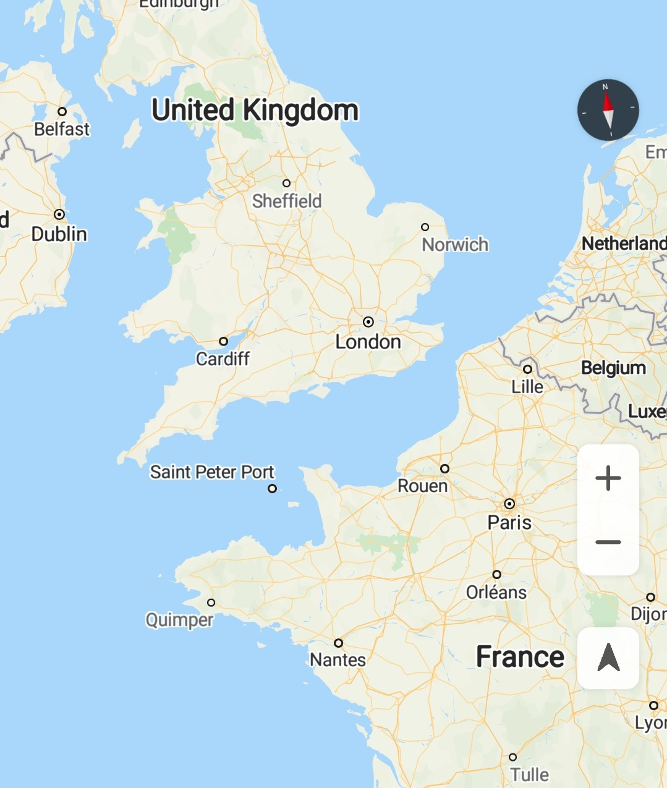
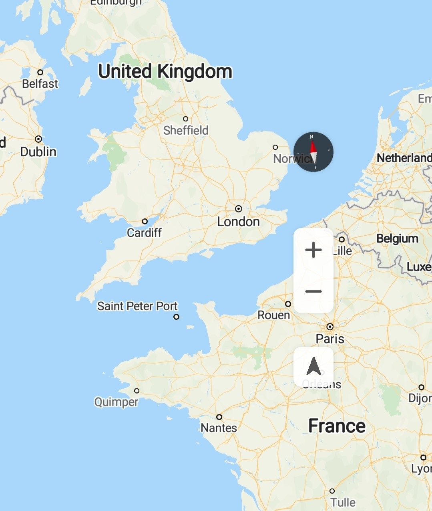

# Map Padding

Map Kit is implemented by simulating a camera. The map camera area centers on the target location and will be padded. Map controls \(such as the compass, zoom icons, and my-location icon\) are placed at the border of the map camera area. By default, the compass is placed in the upper right corner of the map camera area, and the zoom icons and my-location icon are placed in the lower right corner of the map camera area.

You can use the  [HuaweiMap.setPadding](en-us_topic_0000001098683684.md#section10782142412914)**\(int left, int top, int right, int bottom\)**  method to set the padding between the map camera area bounds and map controls. Input parameters of the method are as follows:

-   **left**: incremental distance from the map controls to the left edge of the map, in pixels.
-   **top**: incremental distance from the map controls to the top edge of the map, in pixels.
-   **right**: incremental distance from the map controls to the right edge of the map, in pixels.
-   **bottom**: incremental distance from the map controls to the bottom edge of the map, in pixels.

[Figure 1](#fig18561531114719)  and  [Figure 2](#fig8557135134813)  show the default and custom map padding effects, respectively.

<table><tbody><tr id="row164911781018"><td class="row-nocellborder" style="border:none" valign="top" width="50%">
<b>Figure 1 </b>Default padding effect 

</td>
<td class="cellrowborder" style="border:none" valign="top" width="50%">
<b>Figure 2 </b>Custom padding effect 

</td>
</tr>
</tbody>
</table>

