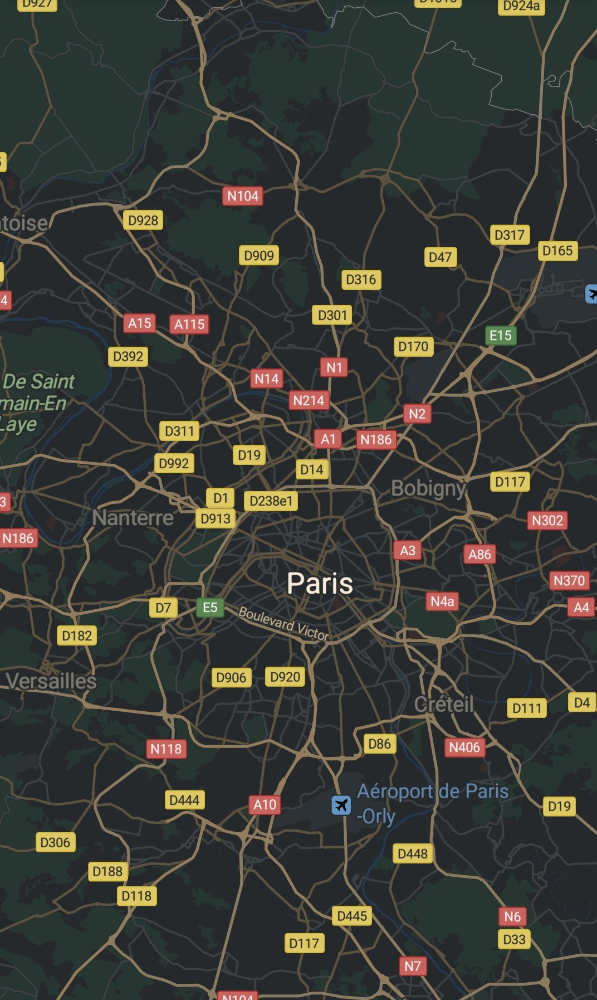
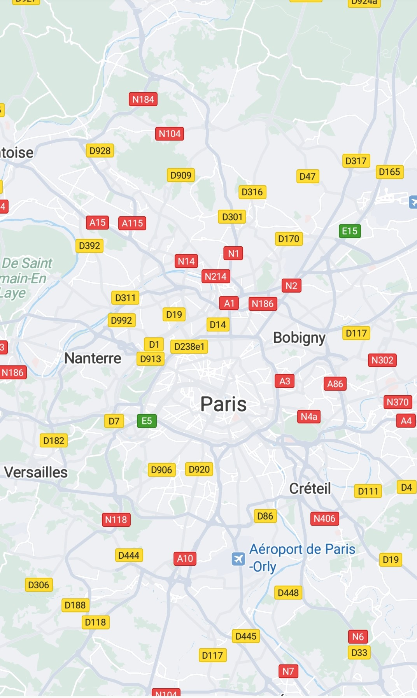

# Procedure<a name="EN-US_TOPIC_0000001099003592"></a>

-   [Setting the Style File](#section15187191611143)

## Setting the Style File<a name="section15187191611143"></a>

1.  Create a JSON file in the  **res/raw**  directory, for example,  **mapstyle\_example.json**. The file content is as follows. For details, please refer to  [Style Reference](android-sdk-map-style-customization-reference.md).

    ```
    [
      {
        "mapFeature": "landcover.natural",
        "options": "geometry.fill",
        "paint": {
          "color": "#8FBC8F"
        }
      },
      {
        "mapFeature": "water",
        "options": "geometry.fill",
        "paint": {
          "color": "#4682B4"
        }
      }
    ]
    ```

2.  Use the  [loadRawResourceStyle](en-us_topic_0000001099163502.md#section10777151911461)\(\) method to load the JSON file as a  [MapStyleOptions](en-us_topic_0000001099163502.md)  object, and pass the object to the  [HuaweiMap](en-us_topic_0000001098683684.md).[setMapStyle](en-us_topic_0000001098683684.md#section172547271522)\(\) method. 

    The sample code is as follows:

    ```
    Java
    HuaweiMap hMap;
    MapStyleOptions style;
    style = MapStyleOptions.loadRawResourceStyle(this, R.raw.mapstyle_simple); 
    hMap.setMapStyle(style);
    ```

    ```
    Kotlin
    private lateinit var hMap: HuaweiMap
     
    val style: MapStyleOptions = MapStyleOptions.loadRawResourceStyle(this, R.raw.mapstyle_simple)
    hMap.setMapStyle(style)
    ```


[Figure 1](#fig1488418301469)  and  [Figure 2](#fig870123720716)  show the night-style map and simple-style map, respectively.

<a name="table14590155441719"></a>
<table><tbody><tr id="row759018543175"><td class="row-nocellborder" style="border:none" align="center" valign="top" width="50%"><div class="fignone" id="fig1488418301469"><a name="fig1488418301469"></a><a name="fig1488418301469"></a><span class="figcap"><b>Figure 1 </b>Night-style map</span><br><a name="image138852030563"></a><a name="image138852030563"></a><span></span></div>
<p id="p310118306514"><a name="p310118306514"></a><a name="p310118306514"></a>JSON file for the night-style map:</p>
<p id="p1157123317187"><a name="p1157123317187"></a><a name="p1157123317187"></a><a href="https://github.com/HMS-Core/hms-mapkit-demo-java/blob/master/java/app/src/main/res/raw/mapstyle_night_hms.json" target="_blank" rel="noopener noreferrer">mapstyle_night_hms.json</a></p>
</td>
<td class="cellrowborder" style="border:none" align="center" valign="top" width="50%"><div class="fignone" id="fig870123720716"><a name="fig870123720716"></a><a name="fig870123720716"></a><span class="figcap"><b>Figure 2 </b>Simple-style map</span><br><a name="image167043717716"></a><a name="image167043717716"></a><span></span></div>
<p id="p11021712105111"><a name="p11021712105111"></a><a name="p11021712105111"></a>JSON file for the simple-style map: </p>
<p id="p16499338161811"><a name="p16499338161811"></a><a name="p16499338161811"></a><a href="https://github.com/HMS-Core/hms-mapkit-demo-java/blob/master/java/app/src/main/res/raw/mapstyle_grayscale_hms.json" target="_blank" rel="noopener noreferrer">mapstyle_grayscale_hms.json</a></p>
</td>
</tr>
</tbody>
</table>

