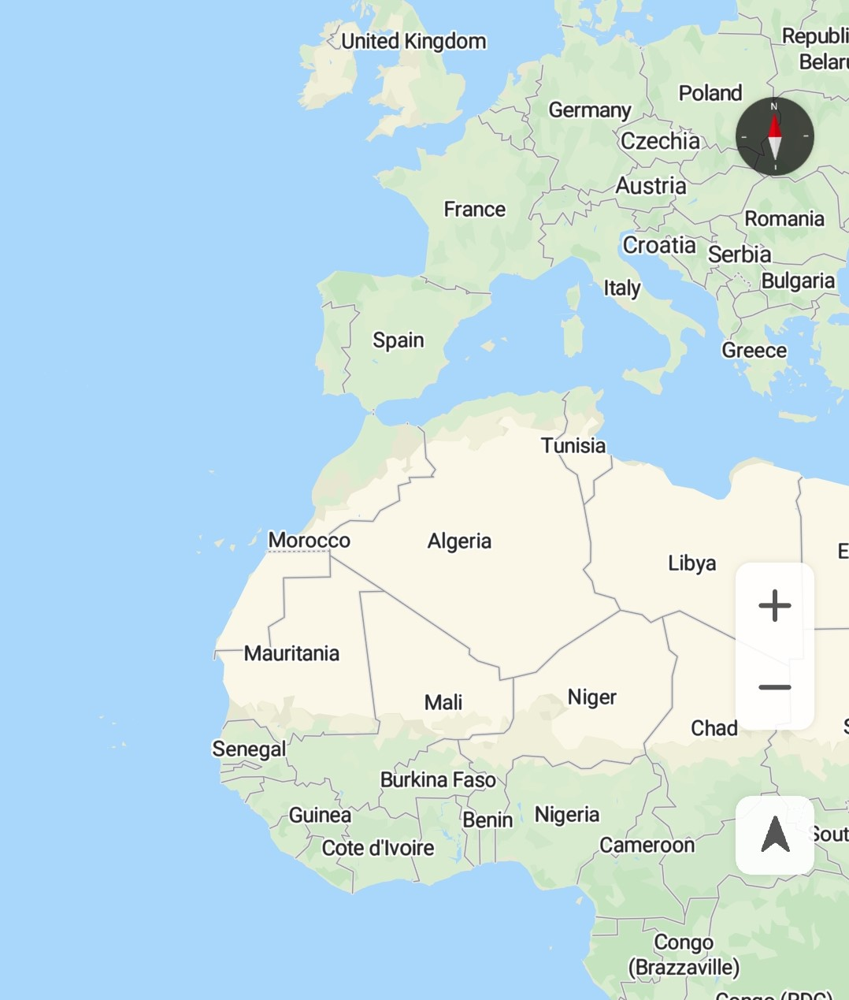

# Map Type

Currently,  [HuaweiMap](en-us_topic_0000001098683684.md)  supports two types of maps:

-   **MAP\_TYPE\_NORMAL**: standard map, which shows roads, artificial structures, and natural features such as rivers.
-   **MAP\_TYPE\_NONE**: empty map without any data.

To set the map type, call the  [setMapType](en-us_topic_0000001098683684.md#section3746134811217)  method of the  [HuaweiMap](en-us_topic_0000001098683684.md)  object and pass one of the static constants defined in  [HuaweiMap](en-us_topic_0000001098683684.md). In detail:

-   To set an empty map, call the  [setMapType](en-us_topic_0000001098683684.md#section3746134811217)**\(HuaweiMap.MAP\_TYPE\_NONE\)**  method of the  [HuaweiMap](en-us_topic_0000001098683684.md)  object.  [Figure 1](#fig13171704408)  shows the map display effect. 
-   To set a standard map, call the  [setMapType](en-us_topic_0000001098683684.md#section3746134811217)**\(HuaweiMap.MAP\_TYPE\_NORMAL\)**  method of the  [HuaweiMap](en-us_topic_0000001098683684.md)  object.  [Figure 2](#fig15549151810415)  shows the map display effect.

<table><tbody><tr id="row9495184319574"><td class="row-nocellborder" style="border:none" valign="top" width="50%">
<b>Figure 1 </b>Empty map 

</td>
<td class="cellrowborder" style="border:none" valign="top" width="50%">
<b>Figure 2 </b>Standard map 

</td>
</tr>
</tbody>
</table>

