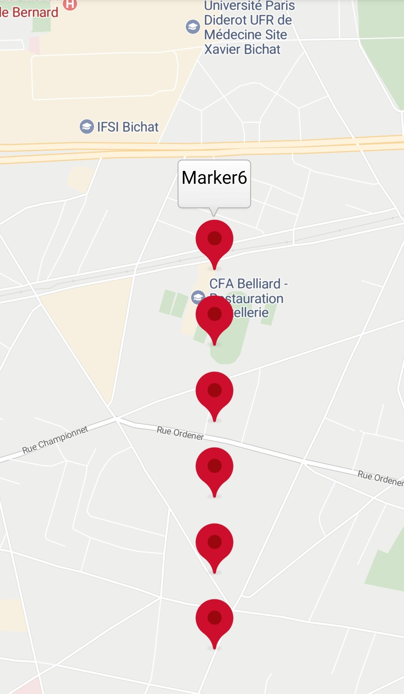
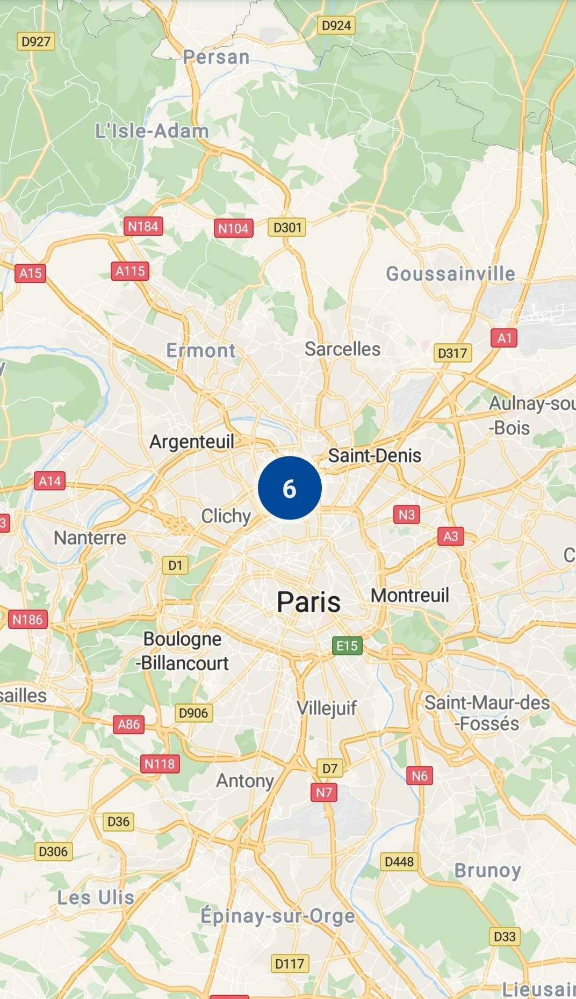
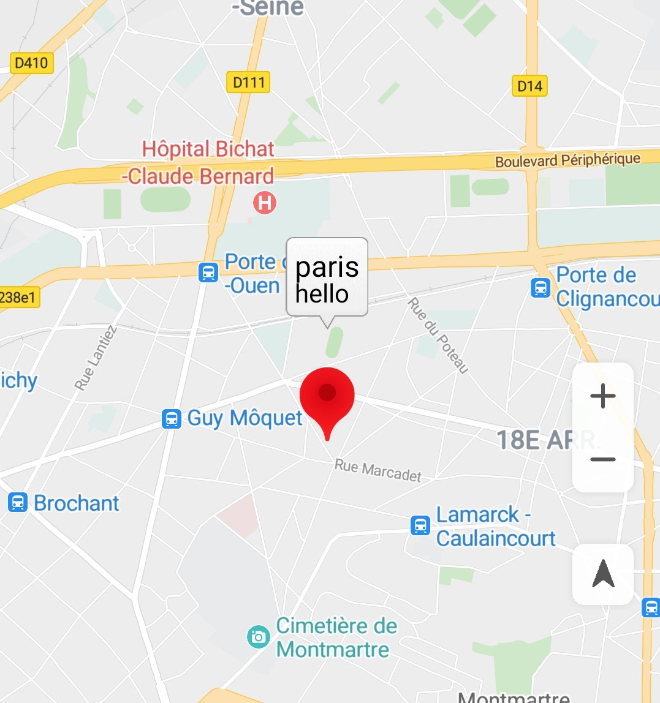
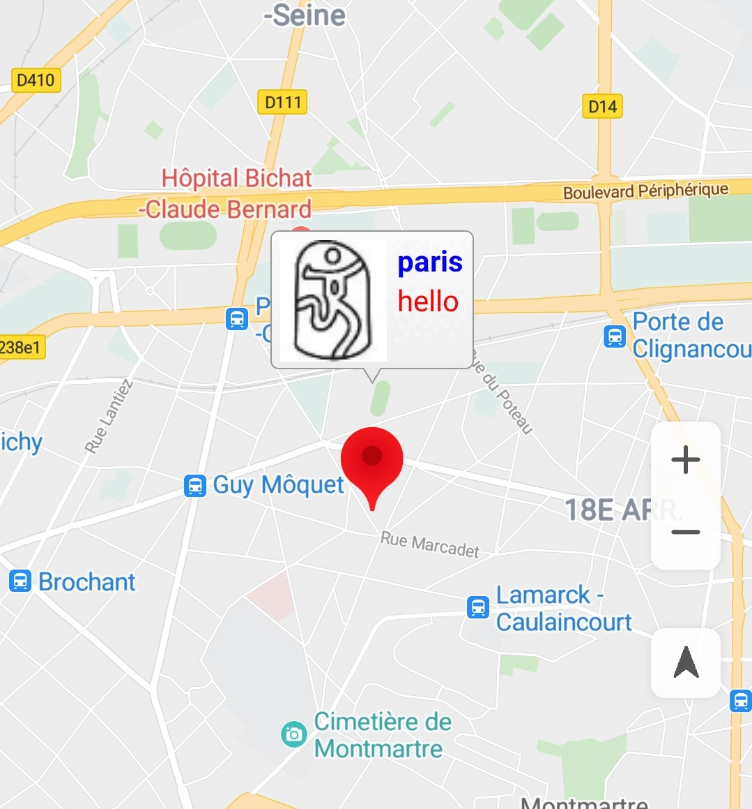

# Marker<a name="EN-US_TOPIC_0000001145523599"></a>

-   [Adding a Marker](#section317665615538)
-   [Customizing the Marker Icon](#section6200183275411)
-   [Modifying a Marker](#section121145212558)
-   [Clustering Markers](#section13163101411562)
-   [Listening for Marker Events](#section1361193795619)
    -   [Marker Tap Event](#section5726108505)
    -   [Marker Drag Event](#section23851346175012)

-   [Setting Animation for a Marker](#section0214032193415)
-   [Information Window](#section330612176525)
    -   [Adding an Information Window](#section286084785210)
    -   [Displaying/Hiding an Information Window](#section18473152425315)
    -   [Customizing an Information Window](#section113719566535)


You can add markers to a map to identify locations such as stores and buildings, and provide location details with information windows.

## Adding a Marker<a name="section317665615538"></a>

The following sample code uses the default icon to add a simple marker to a map:

The sample code is as follows:

```
Java
private Marker mMarker;

public void addMarker(View view) {
    if (null != mMarker) {
        mMarker.remove();
    }
    MarkerOptions options = new MarkerOptions()
            .position(new LatLng(48.893478, 2.334595))
            .title("Hello Huawei Map")
            .snippet("This is a snippet!");
    mMarker = hMap.addMarker(options);
}
```

```
Kotlin
private var mMarker: Marker? = null

fun addMarker(view: View?) {
    if (null != mMarker) {
        mMarker?.remove()
    }
    val options = MarkerOptions()
            .position(LatLng(48.893478, 2.334595))
            .title("Hello Huawei Map")
            .snippet("This is a snippet!")
    mMarker = hMap.addMarker(options)
}
```

You can use a custom image to replace the default icon or modify marker attributes to change the marker icon. The following table describes the marker attributes that can be customized.

<a name="table450211347407"></a>
<table><thead align="left"><tr id="row14502123417406"><th class="cellrowborder" valign="top" width="40%" id="mcps1.1.3.1.1"><p id="p5505155104011"><a name="p5505155104011"></a><a name="p5505155104011"></a>Method</p>
</th>
<th class="cellrowborder" valign="top" width="60%" id="mcps1.1.3.1.2"><p id="p1505135513402"><a name="p1505135513402"></a><a name="p1505135513402"></a>Description</p>
</th>
</tr>
</thead>
<tbody><tr id="row1950223434020"><td class="cellrowborder" valign="top" width="40%" headers="mcps1.1.3.1.1 "><p id="p145053552404"><a name="p145053552404"></a><a name="p145053552404"></a><a href="en-us_topic_0000001098683714.md#section339524313354">position</a>(<a href="en-us_topic_0000001099003538.md">LatLng</a> latlng)</p>
</td>
<td class="cellrowborder" valign="top" width="60%" headers="mcps1.1.3.1.2 "><p id="p19505855194013"><a name="p19505855194013"></a><a name="p19505855194013"></a>Longitude and latitude of a marker on the map. This is the only mandatory attribute of a <strong id="b13462934826057"><a name="b13462934826057"></a><a name="b13462934826057"></a>Marker</strong> object.</p>
</td>
</tr>
<tr id="row1125413468520"><td class="cellrowborder" valign="top" width="40%" headers="mcps1.1.3.1.1 "><p id="p122546461453"><a name="p122546461453"></a><a name="p122546461453"></a><a href="en-us_topic_0000001098683714.md#section1986735018353">rotation</a>(float rotation)</p>
</td>
<td class="cellrowborder" valign="top" width="60%" headers="mcps1.1.3.1.2 "><p id="p1225416465515"><a name="p1225416465515"></a><a name="p1225416465515"></a>Rotation angle of a marker on the map.</p>
</td>
</tr>
<tr id="row4581314163"><td class="cellrowborder" valign="top" width="40%" headers="mcps1.1.3.1.1 "><p id="p49119002"><a name="p49119002"></a><a name="p49119002"></a><a href="en-us_topic_0000001098683714.md#section144310304569">title</a>(String title)</p>
</td>
<td class="cellrowborder" valign="top" width="60%" headers="mcps1.1.3.1.2 "><p id="p7580825862"><a name="p7580825862"></a><a name="p7580825862"></a>String to be displayed in an information window when a user taps a marker.</p>
</td>
</tr>
<tr id="row145806251563"><td class="cellrowborder" valign="top" width="40%" headers="mcps1.1.3.1.1 "><p id="p25811114462"><a name="p25811114462"></a><a name="p25811114462"></a><a href="en-us_topic_0000001098683714.md#section1266276203610">snippet</a>(String snippet)</p>
</td>
<td class="cellrowborder" valign="top" width="60%" headers="mcps1.1.3.1.2 "><p id="p8581814969"><a name="p8581814969"></a><a name="p8581814969"></a>Other text to be displayed in the title text box.</p>
</td>
</tr>
<tr id="row37971928969"><td class="cellrowborder" valign="top" width="40%" headers="mcps1.1.3.1.1 "><p id="p1579742818615"><a name="p1579742818615"></a><a name="p1579742818615"></a><a href="en-us_topic_0000001098683714.md#section4119596355">icon</a>(<a href="en-us_topic_0000001145843379.md">BitmapDescriptor</a> iconDescriptor)</p>
</td>
<td class="cellrowborder" valign="top" width="60%" headers="mcps1.1.3.1.2 "><p id="p0797628565"><a name="p0797628565"></a><a name="p0797628565"></a>Image used to replace the default marker icon.</p>
</td>
</tr>
<tr id="row8187127261"><td class="cellrowborder" valign="top" width="40%" headers="mcps1.1.3.1.1 "><p id="p21398621"><a name="p21398621"></a><a name="p21398621"></a><a href="en-us_topic_0000001098683714.md#section47301652195614">visible</a>(boolean visible)</p>
</td>
<td class="cellrowborder" valign="top" width="60%" headers="mcps1.1.3.1.2 "><p id="p1918712271263"><a name="p1918712271263"></a><a name="p1918712271263"></a>Marker visibility. The default value is <strong id="b14535551296057"><a name="b14535551296057"></a><a name="b14535551296057"></a>true</strong>.</p>
</td>
</tr>
<tr id="row91195241766"><td class="cellrowborder" valign="top" width="40%" headers="mcps1.1.3.1.1 "><p id="p7064824"><a name="p7064824"></a><a name="p7064824"></a><a href="en-us_topic_0000001098683714.md#section551291175715">zIndex</a>(float zIndex)</p>
</td>
<td class="cellrowborder" valign="top" width="60%" headers="mcps1.1.3.1.2 "><p id="p141191924566"><a name="p141191924566"></a><a name="p141191924566"></a>Z-index of a marker.</p>
</td>
</tr>
<tr id="row14652361978"><td class="cellrowborder" valign="top" width="40%" headers="mcps1.1.3.1.1 "><p id="p16518361771"><a name="p16518361771"></a><a name="p16518361771"></a><a href="en-us_topic_0000001098683714.md#section95121330125810">anchorMarker</a>(float u, float v)</p>
</td>
<td class="cellrowborder" valign="top" width="60%" headers="mcps1.1.3.1.2 "><p id="p665143612714"><a name="p665143612714"></a><a name="p665143612714"></a>Anchor point of a marker.</p>
</td>
</tr>
<tr id="row036417421071"><td class="cellrowborder" valign="top" width="40%" headers="mcps1.1.3.1.1 "><p id="p10818310"><a name="p10818310"></a><a name="p10818310"></a><a href="en-us_topic_0000001098683714.md#section0702145819302">draggable</a>(boolean draggable)</p>
</td>
<td class="cellrowborder" valign="top" width="60%" headers="mcps1.1.3.1.2 "><p id="p913620184173"><a name="p913620184173"></a><a name="p913620184173"></a>Indicates whether a marker can be moved by users. The options are as follows:</p>
<a name="ul24555141519"></a><a name="ul24555141519"></a><ul id="ul24555141519"><li><strong id="b348413338166"><a name="b348413338166"></a><a name="b348413338166"></a>true</strong>: yes</li><li><strong id="b527313352169"><a name="b527313352169"></a><a name="b527313352169"></a>false</strong>: no</li></ul>
<p id="p2034113211289"><a name="p2034113211289"></a><a name="p2034113211289"></a>The default value is <strong id="b20270983956057"><a name="b20270983956057"></a><a name="b20270983956057"></a>false</strong>.</p>
</td>
</tr>
<tr id="row48741715982"><td class="cellrowborder" valign="top" width="40%" headers="mcps1.1.3.1.1 "><p id="p5874815585"><a name="p5874815585"></a><a name="p5874815585"></a><a href="en-us_topic_0000001098683714.md#section34311726293">alpha</a>(float alpha)</p>
</td>
<td class="cellrowborder" valign="top" width="60%" headers="mcps1.1.3.1.2 "><p id="p3181142610138"><a name="p3181142610138"></a><a name="p3181142610138"></a>Transparency of a marker. The value ranges from 0 to 1.</p>
<a name="ul5889346131317"></a><a name="ul5889346131317"></a><ul id="ul5889346131317"><li><strong id="b15601726696057"><a name="b15601726696057"></a><a name="b15601726696057"></a>0</strong>: completely transparent</li><li><strong id="b5607442246057"><a name="b5607442246057"></a><a name="b5607442246057"></a>1</strong>: completely opaque</li></ul>
</td>
</tr>
<tr id="row85020344408"><td class="cellrowborder" valign="top" width="40%" headers="mcps1.1.3.1.1 "><p id="p618314260817"><a name="p618314260817"></a><a name="p618314260817"></a><a href="en-us_topic_0000001098683714.md#section2727192393111">flat</a>(boolean flat)</p>
</td>
<td class="cellrowborder" valign="top" width="60%" headers="mcps1.1.3.1.2 "><p id="p818312261683"><a name="p818312261683"></a><a name="p818312261683"></a>Indicates whether to flatly attach the marker to the map. By default, the marker is not flatly attached to the map. The default value is <strong id="b4488170396057"><a name="b4488170396057"></a><a name="b4488170396057"></a>false</strong>.</p>
</td>
</tr>
<tr id="row135021834184016"><td class="cellrowborder" valign="top" width="40%" headers="mcps1.1.3.1.1 "><p id="p45454987"><a name="p45454987"></a><a name="p45454987"></a><a href="en-us_topic_0000001098683714.md#section114908172352">infoWindowAnchor</a>(float u, float v)</p>
</td>
<td class="cellrowborder" valign="top" width="60%" headers="mcps1.1.3.1.2 "><p id="p21821026589"><a name="p21821026589"></a><a name="p21821026589"></a>Anchor point coordinates of the information window of a marker.</p>
</td>
</tr>
</tbody>
</table>

## Customizing the Marker Icon<a name="section6200183275411"></a>

You can replace the default marker icon with a custom image. The custom image is specified by the  [BitmapDescriptor](en-us_topic_0000001145843379.md)  object \(image description file\), which can be generated by calling one of the following static methods in the  [BitmapDescriptorFactory](en-us_topic_0000001145523543.md)  class.

<a name="table72271917194914"></a>
<table><thead align="left"><tr id="row202272017174917"><th class="cellrowborder" valign="top" width="40%" id="mcps1.1.3.1.1"><p id="p172821725204916"><a name="p172821725204916"></a><a name="p172821725204916"></a>Method</p>
</th>
<th class="cellrowborder" valign="top" width="60%" id="mcps1.1.3.1.2"><p id="p1928272517495"><a name="p1928272517495"></a><a name="p1928272517495"></a>Description</p>
</th>
</tr>
</thead>
<tbody><tr id="row9228181711491"><td class="cellrowborder" valign="top" width="40%" headers="mcps1.1.3.1.1 "><p id="p192822025114918"><a name="p192822025114918"></a><a name="p192822025114918"></a><a href="en-us_topic_0000001145523543.md#section177751156105216">fromAsset</a>(String assetName)</p>
</td>
<td class="cellrowborder" valign="top" width="60%" headers="mcps1.1.3.1.2 "><p id="p162822250492"><a name="p162822250492"></a><a name="p162822250492"></a>Customizes a marker icon using a Bitmap image from the <strong id="b18681961666057"><a name="b18681961666057"></a><a name="b18681961666057"></a>assets</strong> directory.</p>
</td>
</tr>
<tr id="row112281217114918"><td class="cellrowborder" valign="top" width="40%" headers="mcps1.1.3.1.1 "><p id="p6282172584913"><a name="p6282172584913"></a><a name="p6282172584913"></a><a href="en-us_topic_0000001145523543.md#section375416351533">fromBitmap</a>(Bitmap image)</p>
</td>
<td class="cellrowborder" valign="top" width="60%" headers="mcps1.1.3.1.2 "><p id="p2282152524911"><a name="p2282152524911"></a><a name="p2282152524911"></a>Customizes a marker icon using a Bitmap image.</p>
</td>
</tr>
<tr id="row10228101794918"><td class="cellrowborder" valign="top" width="40%" headers="mcps1.1.3.1.1 "><p id="p1128252564916"><a name="p1128252564916"></a><a name="p1128252564916"></a><a href="en-us_topic_0000001145523543.md#section338617415546">fromFile</a>(String fileName)</p>
</td>
<td class="cellrowborder" valign="top" width="60%" headers="mcps1.1.3.1.2 "><p id="p1528211256492"><a name="p1528211256492"></a><a name="p1528211256492"></a>Customizes a marker icon using a Bitmap image file from the internal storage.</p>
</td>
</tr>
<tr id="row522841718494"><td class="cellrowborder" valign="top" width="40%" headers="mcps1.1.3.1.1 "><p id="p10282025154911"><a name="p10282025154911"></a><a name="p10282025154911"></a><a href="en-us_topic_0000001145523543.md#section1762285545410">fromPath</a>(String absolutePath)</p>
</td>
<td class="cellrowborder" valign="top" width="60%" headers="mcps1.1.3.1.2 "><p id="p728212250493"><a name="p728212250493"></a><a name="p728212250493"></a>Customizes a marker icon based on the absolute path of a Bitmap image file.</p>
</td>
</tr>
<tr id="row72284175497"><td class="cellrowborder" valign="top" width="40%" headers="mcps1.1.3.1.1 "><p id="p6282102524913"><a name="p6282102524913"></a><a name="p6282102524913"></a><a href="en-us_topic_0000001145523543.md#section11216192714558">fromResource</a>(int resourceId)</p>
</td>
<td class="cellrowborder" valign="top" width="60%" headers="mcps1.1.3.1.2 "><p id="p2282152514914"><a name="p2282152514914"></a><a name="p2282152514914"></a>Customizes a marker icon based on the resource of a Bitmap image.</p>
</td>
</tr>
</tbody>
</table>

The following sample code creates a marker with a custom icon:

The sample code is as follows:

```
Java
private Marker mMarker;

mMarker = hMap.addMarker(new MarkerOptions()
        .position(new LatLng(48.893478, 2.334595))
        .icon(BitmapDescriptorFactory.fromResource(R.drawable.badge_ph)));
```

```
Kotlin
private var mMarker: Marker? = null

mMarker = hMap.addMarker(MarkerOptions()
        .position(LatLng(48.893478, 2.334595))
        .icon(BitmapDescriptorFactory.fromResource(R.drawable.badge_ph)))
```

## Modifying a Marker<a name="section121145212558"></a>

You can modify attributes of an added marker.

The sample code is as follows:

```
Java
// Change the marker icon.
if (mMarker != null) {
    Bitmap bitmap = BitmapFactory.decodeResource(getResources(), R.drawable.badge_tr);
    BitmapDescriptor bitmapDescriptor = BitmapDescriptorFactory.fromBitmap(bitmap);
    mMarker.setIcon(bitmapDescriptor);
}

// Set the marker title. 
if (mMarker != null) {
    mMarker.setTitle("Marker title");
}

...

// Set whether the marker can be dragged.
if (mMarker != null) {
    mMarker.setDraggable(true);
}

// Set the marker anchor point.
if (mMarker != null) {
    mMarker.setMarkerAnchor(0.9F, 0.9F);
}
```

```
Kotlin
// Change the marker icon.
if (mMarker != null) {
    val bitmap = BitmapFactory.decodeResource(resources, R.drawable.badge_tr)
    val bitmapDescriptor = BitmapDescriptorFactory.fromBitmap(bitmap)
    mMarker?.setIcon(bitmapDescriptor)
}

// Set the marker title. 
if (mMarker != null) {
    mMarker?.title = "Marker title"
}

...

// Set whether the marker can be dragged.
if (mMarker != null) {
    mMarker?.isDraggable = true
}

// Set the marker anchor point.
if (mMarker != null) {
    mMarker?.setMarkerAnchor(0.9f, 0.9f)
}
```

## Clustering Markers<a name="section13163101411562"></a>

With the HMS Core Map SDK, you can cluster markers to effectively manage multiple markers on the map at different zoom levels. Marker clustering is available only when there are five or more markers on the map. When a user zooms in on the map to a high level, all markers are displayed on the map \([Figure 1](#fig1170012335716)\). When the user zooms out on the map to a low level, the markers are clustered on the map for orderly display \([Figure 2](#fig827215186819)\).

You can refer to the following sample code to implement the marker clustering function:

The sample code is as follows:

```
Java
@Override
public void onMapReady(HuaweiMap map) {
    hMap = map;
    hMap.moveCamera(CameraUpdateFactory.newLatLngZoom(
    new LatLng(48.893478, 2.334595),10));
    // Add the marker to the cluster.
    hMap.addMarker(new MarkerOptions().position(new LatLng(48.891478, 2.334595)).title("Marker1").clusterable(true));
    hMap.addMarker(new MarkerOptions().position(new LatLng(48.892478, 2.334595)).title("Marker2").clusterable(true));
    hMap.addMarker(new MarkerOptions().position(new LatLng(48.893478, 2.334595)).title("Marker3").clusterable(true));
    hMap.addMarker(new MarkerOptions().position(new LatLng(48.894478, 2.334595)).title("Marker4").clusterable(true));
    hMap.addMarker(new MarkerOptions().position(new LatLng(48.895478, 2.334595)).title("Marker5").clusterable(true));
    hMap.addMarker(new MarkerOptions().position(new LatLng(48.896478, 2.334595)).title("Marker6").clusterable(true));
    // Set whether a marker can be clustered. 
    hMap.setMarkersClustering(true);
}
```

```
Kotlin
override fun onMapReady(map: HuaweiMap) {
    hMap = map
    hMap.moveCamera(CameraUpdateFactory.newLatLngZoom(
            LatLng(48.893478, 2.334595), 10f))
    // Add the marker to the cluster.
    hMap.addMarker(MarkerOptions().position(LatLng(48.891478, 2.334595)).title("Marker1").clusterable(true))
    hMap.addMarker(MarkerOptions().position(LatLng(48.892478, 2.334595)).title("Marker2").clusterable(true))
    hMap.addMarker(MarkerOptions().position(LatLng(48.893478, 2.334595)).title("Marker3").clusterable(true))
    hMap.addMarker(MarkerOptions().position(LatLng(48.894478, 2.334595)).title("Marker4").clusterable(true))
    hMap.addMarker(MarkerOptions().position(LatLng(48.895478, 2.334595)).title("Marker5").clusterable(true))
    hMap.addMarker(MarkerOptions().position(LatLng(48.896478, 2.334595)).title("Marker6").clusterable(true))
    // Set whether a marker can be clustered. 
    hMap.setMarkersClustering(true)
}
```

<a name="table01991540757"></a>
<table><tbody><tr id="row172006401250"><td class="row-nocellborder" style="border:none" valign="top" width="50%"><div class="fignone" id="fig1170012335716"><a name="fig1170012335716"></a><a name="fig1170012335716"></a><span class="figcap"><b>Figure 1 </b>Effect at a high zoom level</span><br><a name="image187011833579"></a><a name="image187011833579"></a><span></span></div>
</td>
<td class="cellrowborder" style="border:none" valign="top" width="50%"><div class="fignone" id="fig827215186819"><a name="fig827215186819"></a><a name="fig827215186819"></a><span class="figcap"><b>Figure 2 </b>Effect at a low zoom level</span><br><a name="image627217180810"></a><a name="image627217180810"></a><span></span></div>
</td>
</tr>
</tbody>
</table>

## Listening for Marker Events<a name="section1361193795619"></a>

### Marker Tap Event<a name="section5726108505"></a>

You can use  [HuaweiMap.OnMarkerClickListener](en-us_topic_0000001098683686.md)  to listen for marker tap events. To set a listener on a map, call the  [setOnMarkerClickListener](en-us_topic_0000001098683684.md#section6157172618712)\([HuaweiMap.OnMarkerClickListener](en-us_topic_0000001098683686.md)\) method of the  [HuaweiMap](en-us_topic_0000001098683684.md)  object. When a user taps a marker,  [onMarkerClick](en-us_topic_0000001098683686.md#section165540817477)\([Marker](en-us_topic_0000001145523533.md)\) passes the marker as a parameter. The default action for a marker tap event is to display the information window \(if available\) of the marker and center the marker on the map.

The sample code is as follows:

```
Java
hMap.setOnMarkerClickListener(new HuaweiMap.OnMarkerClickListener() {
    @Override
    public boolean onMarkerClick(Marker marker) {
        Toast.makeText(getApplicationContext(), "onMarkerClick:" + marker.getTitle(), Toast.LENGTH_SHORT).show();
        return false;
    }
});
```

```
Kotlin
hMap.setOnMarkerClickListener { marker ->
    Toast.makeText(applicationContext, "onMarkerClick:${marker.title}", Toast.LENGTH_SHORT).show()
    false
}
```

### Marker Drag Event<a name="section23851346175012"></a>

You can use  [HuaweiMap.OnMarkerDragListener](en-us_topic_0000001145523537.md)  to listen for drag events of a  [Marker](en-us_topic_0000001145523533.md)  with the  **Draggable**  attribute being set to  **true**. To set a listener on a map, call the  [setOnMarkerDragListener](en-us_topic_0000001098683684.md#section183907434711)\([HuaweiMap.OnMarkerDragListener](en-us_topic_0000001145523537.md)\) method of the  [HuaweiMap](en-us_topic_0000001098683684.md)  object. To drag a marker, a user needs to long press it, drag it to the specified position on the screen, and drop it. When a user starts dragging a marker, the  [onMarkerDragStart](en-us_topic_0000001145523537.md#section15750115717498)\([Marker](en-us_topic_0000001145523533.md)\) method is called. When the user drags the marker, the  [onMarkerDrag](en-us_topic_0000001145523537.md#section41919381488)\([Marker](en-us_topic_0000001145523533.md)\) method is called continuously. When the user stops dragging the marker, the  [onMarkerDragEnd](en-us_topic_0000001145523537.md#section17191517124913)\([Marker](en-us_topic_0000001145523533.md)\) method is called. You can call  [getPosition](en-us_topic_0000001145523533.md#section49343761418)**\(\)**  of a  [Marker](en-us_topic_0000001145523533.md)  object anytime to obtain the position of the marker.

The sample code is as follows:

```
Java
// Set that the marker can be dragged.
mMarker.setDraggable(true);

hMap.setOnMarkerDragListener(new HuaweiMap.OnMarkerDragListener() {
    @Override
    public void onMarkerDragStart(Marker marker) {
        Log.i(TAG, "onMarkerDragStart: ");
    }
	
    @Override
    public void onMarkerDrag(Marker marker) {
        Log.i(TAG, "onMarkerDrag: ");
    }
	
    @Override
    public void onMarkerDragEnd(Marker marker) {
        Log.i(TAG, "onMarkerDragEnd: ");
    }
});
```

```
Kotlin
// Set that the marker can be dragged.
mMarker?.isDraggable = true

hMap.setOnMarkerDragListener(object : OnMarkerDragListener {
    override fun onMarkerDragStart(marker: Marker) {
        Log.i(TAG, "onMarkerDragStart: ")
    }
    override fun onMarkerDrag(marker: Marker) {
        Log.i(TAG, "onMarkerDrag: ")
    }
    override fun onMarkerDragEnd(marker: Marker) {
        Log.i(TAG, "onMarkerDragEnd: ")
    }
})
```

## Setting Animation for a Marker<a name="section0214032193415"></a>

The Map SDK provides methods to set animation for a marker. Involved classes are as follows.

<a name="table176515019522"></a>
<table><thead align="left"><tr id="row1666155075213"><th class="cellrowborder" valign="top" width="40%" id="mcps1.1.3.1.1"><p id="p0661150105220"><a name="p0661150105220"></a><a name="p0661150105220"></a>Class</p>
</th>
<th class="cellrowborder" valign="top" width="60%" id="mcps1.1.3.1.2"><p id="p11662504523"><a name="p11662504523"></a><a name="p11662504523"></a>Description</p>
</th>
</tr>
</thead>
<tbody><tr id="row196616500523"><td class="cellrowborder" valign="top" width="40%" headers="mcps1.1.3.1.1 "><p id="p766950145213"><a name="p766950145213"></a><a name="p766950145213"></a><a href="en-us_topic_0000001145843371.md">AlphaAnimation</a></p>
</td>
<td class="cellrowborder" valign="top" width="60%" headers="mcps1.1.3.1.2 "><p id="p86685045216"><a name="p86685045216"></a><a name="p86685045216"></a>Class for controlling the animation transparency. </p>
</td>
</tr>
<tr id="row1866150135214"><td class="cellrowborder" valign="top" width="40%" headers="mcps1.1.3.1.1 "><p id="p136645075213"><a name="p136645075213"></a><a name="p136645075213"></a><a href="en-us_topic_0000001145723453.md">RotateAnimation</a></p>
</td>
<td class="cellrowborder" valign="top" width="60%" headers="mcps1.1.3.1.2 "><p id="p1187817126612"><a name="p1187817126612"></a><a name="p1187817126612"></a>Class for controlling the animation rotation. </p>
</td>
</tr>
<tr id="row666145011529"><td class="cellrowborder" valign="top" width="40%" headers="mcps1.1.3.1.1 "><p id="p966150155212"><a name="p966150155212"></a><a name="p966150155212"></a><a href="en-us_topic_0000001145923491.md">ScaleAnimation</a></p>
</td>
<td class="cellrowborder" valign="top" width="60%" headers="mcps1.1.3.1.2 "><p id="p187851215618"><a name="p187851215618"></a><a name="p187851215618"></a>Class for controlling the animation scale.</p>
</td>
</tr>
<tr id="row86611503524"><td class="cellrowborder" valign="top" width="40%" headers="mcps1.1.3.1.1 "><p id="p466115065217"><a name="p466115065217"></a><a name="p466115065217"></a><a href="en-us_topic_0000001098843526.md">TranslateAnimation</a></p>
</td>
<td class="cellrowborder" valign="top" width="60%" headers="mcps1.1.3.1.2 "><p id="p1687831214616"><a name="p1687831214616"></a><a name="p1687831214616"></a>Class for controlling the animation movement. </p>
</td>
</tr>
<tr id="row6801163485316"><td class="cellrowborder" valign="top" width="40%" headers="mcps1.1.3.1.1 "><p id="p168038342534"><a name="p168038342534"></a><a name="p168038342534"></a><a href="en-us_topic_0000001145723441.md">AnimationSet</a></p>
</td>
<td class="cellrowborder" valign="top" width="60%" headers="mcps1.1.3.1.2 "><p id="p387821212617"><a name="p387821212617"></a><a name="p387821212617"></a>Animation set.</p>
</td>
</tr>
<tr id="row1032014115458"><td class="cellrowborder" valign="top" width="40%" headers="mcps1.1.3.1.1 "><p id="p7321841194515"><a name="p7321841194515"></a><a name="p7321841194515"></a><a href="en-us_topic_0000001145723449.md">Animation</a></p>
</td>
<td class="cellrowborder" valign="top" width="60%" headers="mcps1.1.3.1.2 "><p id="p7321194118457"><a name="p7321194118457"></a><a name="p7321194118457"></a>Parent class of all animation classes.</p>
</td>
</tr>
</tbody>
</table>

The sample code is as follows:

```
Java
// Add a marker on the map.
Marker mParis;
mParis = hMap.addMarker(new MarkerOptions().position(new LatLng(48.893478, 2.334595)).title("paris").snippet("hello"));

// Define the animation transparency effect.
Animation alphaAnimation = new AlphaAnimation(0.2f, 1.0f);
alphaAnimation.setRepeatCount(5);
alphaAnimation.setDuration(1000L);
alphaAnimation.setAnimationListener(new Animation.AnimationListener() {
	@Override
	public void onAnimationStart() {
		Log.d(TAG, "Alpha Animation Start");
	}

	@Override
	public void onAnimationEnd() {
		Log.d(TAG, "Alpha Animation End");
	}
});

// Define the animation zooming effect.
Animation scaleAnimation = new ScaleAnimation(0, 2, 0, 2);
scaleAnimation.setRepeatCount(10);
scaleAnimation.setDuration(1000L);
scaleAnimation.setAnimationListener(new Animation.AnimationListener() {
	@Override
	public void onAnimationStart() {
		Log.d(TAG, "Scale Animation Start");
	}

	@Override
	public void onAnimationEnd() {
		Log.d(TAG, "Scale Animation End");
	}
});

AnimationSet animationSet = new AnimationSet(true);
animationSet.setInterpolator(new LinearInterpolator());
animationSet.addAnimation(alphaAnimation);
animationSet.addAnimation(scaleAnimation);

// Set the animation effect for a marker.
mParis.setAnimation(animationSet);
// Start the animation.
mParis.startAnimation();
```

```
Kotlin
// Add a marker on the map.
val mParis: Marker = hMap.addMarker(MarkerOptions().position(LatLng(48.893478, 2.334595)).title("paris").snippet("hello"))

// Define the animation transparency effect.
val alphaAnimation: Animation = AlphaAnimation(0.2f, 1.0f)
alphaAnimation.repeatCount = 5
alphaAnimation.duration = 1000L
alphaAnimation.setAnimationListener(object : Animation.AnimationListener {
    override fun onAnimationStart() {
        Log.d(TAG, "Alpha Animation Start")
    }
    override fun onAnimationEnd() {
        Log.d(TAG, "Alpha Animation End")
    }
})

// Define the animation zooming effect.
val scaleAnimation: Animation = ScaleAnimation(0f, 2f, 0f, 2f)
scaleAnimation.repeatCount = 10
scaleAnimation.duration = 1000L
scaleAnimation.setAnimationListener(object : Animation.AnimationListener {
    override fun onAnimationStart() {
        Log.d(TAG, "Scale Animation Start")
    }
    override fun onAnimationEnd() {
        Log.d(TAG, "Scale Animation End")
    }
})

val animationSet = AnimationSet(true)
animationSet.interpolator = LinearInterpolator()
animationSet.addAnimation(alphaAnimation)
animationSet.addAnimation(scaleAnimation)

// Set the animation effect for a marker.
mParis.setAnimation(animationSet)
// Start the animation.
mParis.startAnimation()
```

## Information Window<a name="section330612176525"></a>

An information window is displayed above a marker to provide detailed marker information through text or images.

### Adding an Information Window<a name="section286084785210"></a>

The simplest way to add an information window is to set the  [title](en-us_topic_0000001098683714.md#section144310304569)**\(\)**  and  [snippet](en-us_topic_0000001098683714.md#section1266276203610)**\(\)**  methods of the corresponding  [MarkerOptions](en-us_topic_0000001098683714.md)  object. If a user taps the marker, the information window will be displayed.

The sample code is as follows:

```
Java
public void addMarker(View view) {
    if (null != mMarker) {
        mMarker.remove();
    }
    MarkerOptions options = new MarkerOptions().position(new LatLng(48.893478, 2.334595));
    options.title("Hello Huawei Map");
    options.snippet("This is a snippet!");
    mMarker = hMap.addMarker(options);
}
```

```
Kotlin
fun addMarker(view: View?) {
    if (null != mMarker) {
        mMarker?.remove()
    }
    val options = MarkerOptions().position(LatLng(48.893478, 2.334595))
    options.title("Hello Huawei Map")
    options.snippet("This is a snippet!")
    mMarker = hMap.addMarker(options)
}
```

### Displaying/Hiding an Information Window<a name="section18473152425315"></a>

An information window is designed to respond to marker tap events. You can call  [showInfoWindow](en-us_topic_0000001145523533.md#section13223817123711)**\(\)**  of a  [Marker](en-us_topic_0000001145523533.md)  object to display the information window for the related marker, or call  [hideInfoWindow](en-us_topic_0000001145523533.md#section352393481515)**\(\)**  of the  [Marker](en-us_topic_0000001145523533.md)  object to hide the information window for the marker.

The sample code is as follows:

```
Java
// Obtain the information window display status.
boolean isInfoWindowShown = mMarker.isInfoWindowShown();
if (isInfoWindowShown) {
    mMarker.hideInfoWindow();
} else {
    mMarker.showInfoWindow();
}
```

```
Kotlin
// Obtain the information window display status.
val isInfoWindowShown: Boolean? = mMarker?.isInfoWindowShown
if (isInfoWindowShown != null && isInfoWindowShown) {
    mMarker?.hideInfoWindow()
} else {
    mMarker?.showInfoWindow()
}
```

### Customizing an Information Window<a name="section113719566535"></a>

You can customize an information window. To do this, you must create specific implementation of the  [HuaweiMap.InfoWindowAdapter](en-us_topic_0000001145523525.md)  API, and then call the implementation in  [setInfoWindowAdapter](en-us_topic_0000001098683684.md#section696710332112)**\(\)**  of the  [HuaweiMap](en-us_topic_0000001098683684.md)  object. The API contains two implementation methods:  [getInfoWindow](en-us_topic_0000001145523525.md#section1927115112273)**\(\)**  and  [getInfoContents](en-us_topic_0000001145523525.md#section1665805611258)**\(\)**, which are called in sequence.

To customize only the information window format, you need to implement  [getInfoWindow](en-us_topic_0000001145523525.md#section1927115112273)**\(\)**, and  [getInfoContents](en-us_topic_0000001145523525.md#section1665805611258)**\(\)**  will return  **null**. To customize only the information window content, you need to implement  [getInfoContents](en-us_topic_0000001145523525.md#section1665805611258)**\(\)**, and  [getInfoWindow](en-us_topic_0000001145523525.md#section1927115112273)**\(\)**  will return  **null**. To customize both the format and content of an information window, you need to implement both  [getInfoWindow](en-us_topic_0000001145523525.md#section1927115112273)\([Marker](en-us_topic_0000001145523533.md)\) and  [getInfoContents](en-us_topic_0000001145523525.md#section1665805611258)**\(\)**. The procedure for customizing an information window is as follows:

1.  Configure the information window layout file \(**custom\_info\_window.xml**\) or information window content layout file \(**custom\_info\_contents.xml**\). The sample code uses the  [getInfoWindow](en-us_topic_0000001145523525.md#section1927115112273)**\(\)**  method as an example.

    ```
    <?xml version="1.0" encoding="utf-8"?>
    <LinearLayout xmlns:android="http://schemas.android.com/apk/res/android"
        android:layout_width="wrap_content"
        android:layout_height="wrap_content"
        android:background="@drawable/bg"
        android:orientation="horizontal">
    
        <ImageView
            android:layout_width="wrap_content"
            android:layout_height="wrap_content"
            android:layout_marginRight="5dp"
            android:adjustViewBounds="true"
            android:src="@drawable/orange" />
    
        <LinearLayout
            android:layout_width="wrap_content"
            android:layout_height="wrap_content"
            android:orientation="vertical">
    
            <TextView
                android:id="@+id/txtv_titlee"
                android:layout_width="wrap_content"
                android:layout_height="wrap_content"
                android:layout_gravity="center_horizontal"
                android:ellipsize="end"
                android:singleLine="true"
                android:textColor="#ff000000"
                android:textSize="14sp"
                android:textStyle="bold" />
    
            <TextView
                android:id="@+id/txtv_snippett"
                android:layout_width="wrap_content"
                android:layout_height="wrap_content"
                android:ellipsize="end"
                android:singleLine="true"
                android:textColor="#ff7f7f7f"
                android:textSize="14sp" />
    
        </LinearLayout>
    </LinearLayout>
    ```

2.  Implement  [HuaweiMap.InfoWindowAdapter](en-us_topic_0000001145523525.md). 

    The sample code is as follows:

    ```
    Java
    class CustomInfoWindowAdapter implements HuaweiMap.InfoWindowAdapter {
        private final View mWindow;
    	
        CustomInfoWindowAdapter() {
            mWindow = getLayoutInflater().inflate(R.layout.custom_info_window, null);
        }
    	
        @Override
        public View getInfoWindow(Marker marker) {
            TextView txtvTitle = mWindow.findViewById(R.id.txtv_titlee);
            TextView txtvSnippett = mWindow.findViewById(R.id.txtv_snippett);
            txtvTitle.setText("Paris");
            txtvSnippett.setText("hello");
    		
            return mWindow;
        }
    	
        @Override
        public View getInfoContents(Marker marker) {
            return null;
        }
    }
    
    
    // Set the habit for placing an information window.
    hMap.setInfoWindowAdapter(new CustomInfoWindowAdapter());
    ```

    ```
    Kotlin
    internal inner class CustomInfoWindowAdapter : HuaweiMap.InfoWindowAdapter {
        private val mWindow: View
    	
        init {
            mWindow = layoutInflater.inflate(R.layout.custom_info_window, null)
        }
    	
        override fun getInfoWindow(marker: Marker): View {
            val txtvTitle = mWindow.findViewById<TextView>(R.id.txtv_titlee)
            val txtvSnippett = mWindow.findViewById<TextView>(R.id.txtv_snippett)
            txtvTitle.text = "Paris"
            txtvSnippett.text = "hello"
            return mWindow
        }
    	
        override fun getInfoContents(marker: Marker): View? {
            return null
        }
    }
    
    // Set the habit for placing an information window.
    hMap.setInfoWindowAdapter(CustomInfoWindowAdapter())
    ```


The HMS Core Map SDK supports two types of information windows: default information window and custom information window, as shown in  [Figure 3](#fig8432156175311)  and  [Figure 4](#fig1343219566534).

<a name="table94321456105312"></a>
<table><tbody><tr id="row14325565531"><td class="row-nocellborder" style="border:none" valign="top" width="50%"><div class="fignone" id="fig8432156175311"><a name="fig8432156175311"></a><a name="fig8432156175311"></a><span class="figcap"><b>Figure 1 </b>Default information window</span><br><a name="image12432105635314"></a><a name="image12432105635314"></a><span></span></div>
</td>
<td class="cellrowborder" style="border:none" valign="top" width="50%"><div class="fignone" id="fig1343219566534"><a name="fig1343219566534"></a><a name="fig1343219566534"></a><span class="figcap"><b>Figure 2 </b>Custom information window</span><br><a name="image343210565534"></a><a name="image343210565534"></a><span></span></div>
</td>
</tr>
</tbody>
</table>

