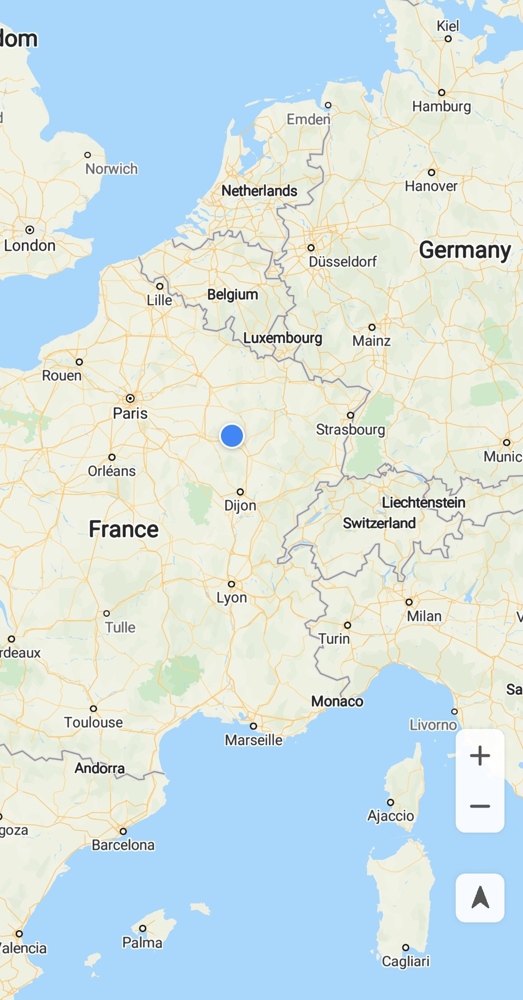
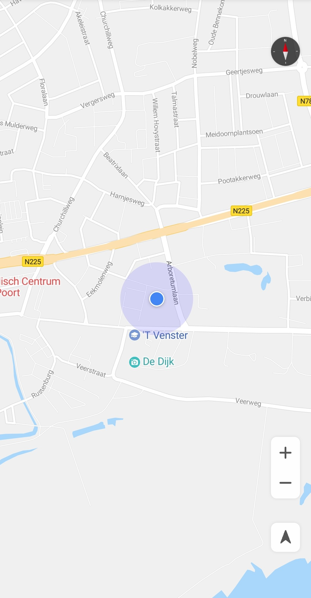

# My Location<a name="EN-US_TOPIC_0000001098843574"></a>

The my-location function allows users to get their current locations when using your app. Before using this function, ensure that your app has been granted the location permission. The Android OS provides two location permissions:  **ACCESS\_COARSE\_LOCATION**  \(approximate location permission\) and  **ACCESS\_FINE\_LOCATION**  \(precise location permission\).

1.  Declare the permissions in the  **AndroidManifest.xml**  file.

    ```
    <!-- Allow the app to obtain the coarse longitude and latitude of a user through the Wi-Fi network or base station. -->
    <uses-permission android:name="android.permission.ACCESS_COARSE_LOCATION"/>
    <!-- Allow the app to receive location information from satellites through the GPS chip. -->
    <uses-permission android:name="android.permission.ACCESS_FINE_LOCATION"/>
    ```

2.  After declaring permissions in the  **AndroidManifest.xml**  file, apply for the permissions dynamically in the code \(according to requirements for dangerous permissions in Android 6.0\).

    The sample code is as follows:

    ```
    Java
    // If the API level is 23 or higher (Android 6.0 or later), you need to dynamically apply for permissions.
    if (Build.VERSION.SDK_INT >= Build.VERSION_CODES.M) {
        Log.i(TAG, "sdk >= 23 M");
        // Check whether your app has the specified permission and whether the app operation corresponding to the permission is allowed.
        if (ActivityCompat.checkSelfPermission(this,
            Manifest.permission.ACCESS_FINE_LOCATION) != PackageManager.PERMISSION_GRANTED
            || ActivityCompat.checkSelfPermission(this,
                Manifest.permission.ACCESS_COARSE_LOCATION) != PackageManager.PERMISSION_GRANTED) {
            // Request permissions for your app.
            String[] strings =
                {Manifest.permission.ACCESS_FINE_LOCATION, Manifest.permission.ACCESS_COARSE_LOCATION};
            // Request permissions.
            ActivityCompat.requestPermissions(this, strings, 1);
        }
    }
    ```

    ```
    Kotlin
    // If the API level is 23 or higher (Android 6.0 or later), you need to dynamically apply for permissions.
    if (Build.VERSION.SDK_INT >= Build.VERSION_CODES.M) {
        Log.i(TAG, "sdk >= 23 M")
        // Check whether your app has the specified permission and whether the app operation corresponding to the permission is allowed.
        if (ActivityCompat.checkSelfPermission(this,
                        Manifest.permission.ACCESS_FINE_LOCATION) != PackageManager.PERMISSION_GRANTED
                || ActivityCompat.checkSelfPermission(this,
                        Manifest.permission.ACCESS_COARSE_LOCATION) != PackageManager.PERMISSION_GRANTED) {
            // Request permissions for your app.
            val strings = arrayOf(Manifest.permission.ACCESS_FINE_LOCATION, Manifest.permission.ACCESS_COARSE_LOCATION)
            // Request permissions.
            ActivityCompat.requestPermissions(this, strings, 1)
        }
    }
    ```

3.  Call the  [setMyLocationEnabled](en-us_topic_0000001098683684.md#section672514559310)**\(true\)**  method of the  [HuaweiMap](en-us_topic_0000001098683684.md)  object to enable this function. 

    The sample code is as follows:

    ```
    Java
    @RequiresPermission(allOf = {ACCESS_FINE_LOCATION, ACCESS_WIFI_STATE})
    @Override
    public void onMapReady(HuaweiMap map){
        hMap = map;
        // Enable the my-location layer.
        hMap.setMyLocationEnabled(true);       
        // Enable the my-location icon. 
        hMap.getUiSettings().setMyLocationButtonEnabled(true);        
     }   
    ```

    ```
    Kotlin
    @RequiresPermission(allOf = [ACCESS_FINE_LOCATION, ACCESS_WIFI_STATE])
    override fun onMapReady(map: HuaweiMap) {
        hMap = map
        // Enable the my-location layer.
        hMap.isMyLocationEnabled = true
        // Enable the my-location icon. 
        hMap.uiSettings.isMyLocationButtonEnabled = true
    }
    ```


Once this function has been enabled, the my-location icon will be displayed in the lower right corner of the map by default and the user's current location will be displayed as a blue dot \([Figure 1](#fig1016514588443)\). When a user taps this icon, the user's current location \(if obtained\) will be displayed in the center of the screen \([Figure 2](#fig1769214112511)\). After you set a listener for the my-location icon and a user taps the icon, the  [onMyLocationButtonClick](en-us_topic_0000001098843516.md#section2082520410519)**\(\)**  callback of  [HuaweiMap.OnMyLocationButtonClickListener](en-us_topic_0000001098843516.md)  will be triggered.

You can also call the  [HuaweiMap.getUiSettings](en-us_topic_0000001098683684.md#section86721421145920)**\(\)**  method to obtain a  [UiSettings](en-us_topic_0000001098843536.md)  object, and call the  [setMyLocationButtonEnabled](en-us_topic_0000001098843536.md#section1530742525919)**\(false\)**  method of the object to hide the my-location icon. 

<a name="table14596175075614"></a>
<table><tbody><tr id="row10596125019560"><td class="row-nocellborder" style="border:none" valign="top" width="50%"><div class="fignone" id="fig1016514588443"><a name="fig1016514588443"></a><a name="fig1016514588443"></a><span class="figcap"><b>Figure 1 </b>Screen before a user taps the my-location icon</span><br><a name="image1916610580444"></a><a name="image1916610580444"></a><span></span></div>
</td>
<td class="cellrowborder" style="border:none" valign="top" width="50%"><div class="fignone" id="fig1769214112511"><a name="fig1769214112511"></a><a name="fig1769214112511"></a><span class="figcap"><b>Figure 2 </b>Screen after a user taps the my-location icon</span></div>
<p id="p57941322313"><a name="p57941322313"></a><a name="p57941322313"></a><a name="image18337165374510"></a><a name="image18337165374510"></a><span></span></p>
</td>
</tr>
</tbody>
</table>

