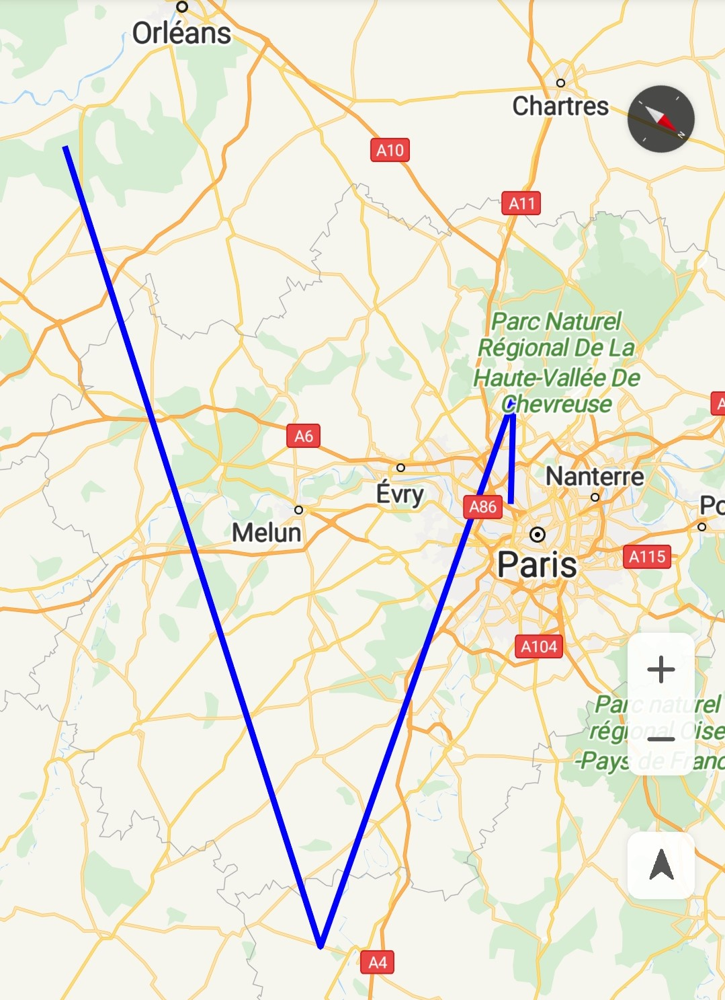
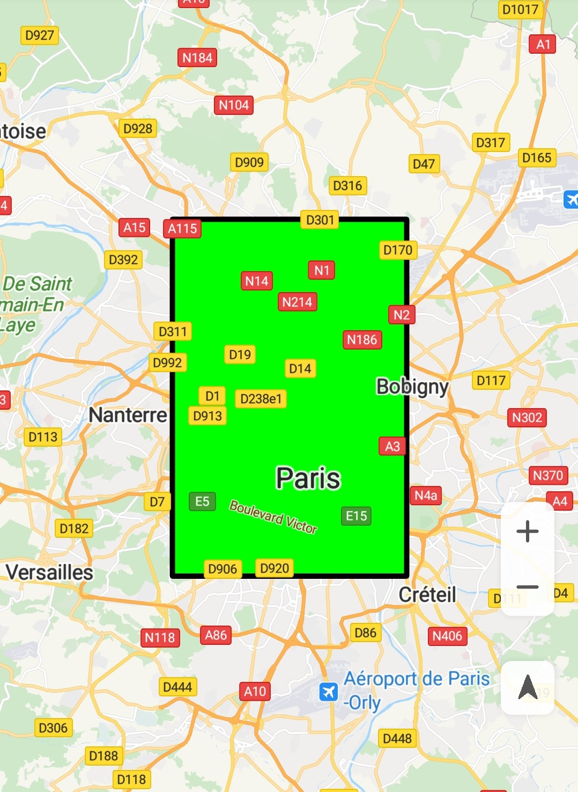
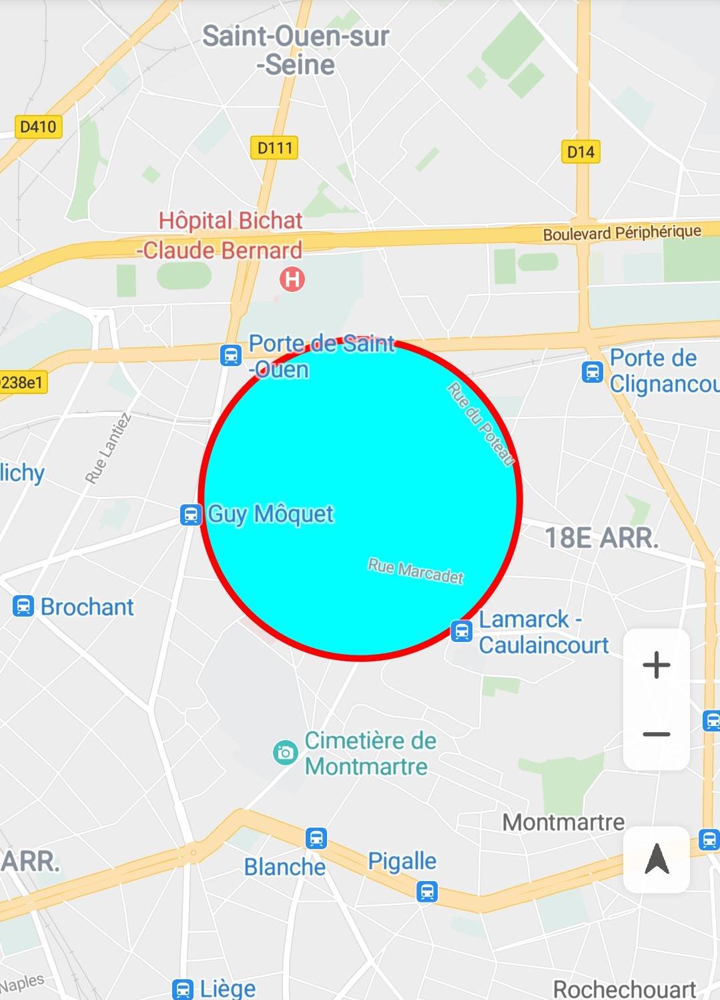

# Shapes<a name="EN-US_TOPIC_0000001145923547"></a>

-   [Polyline](#section560466432)
-   [Polygon](#section155271581344)
-   [Circle](#section2377174811517)
-   [Modifying Shapes](#section146121926101416)
    -   [Stroke Color](#section1613184651510)
    -   [Fill Color](#section877044371718)
    -   [Line Pattern](#section2262121514198)
    -   [Vertex Type](#section1089813572209)


The HMS Core Map SDK allows you to add different shapes on a map, including  [Polyline](en-us_topic_0000001145843377.md),  [Polygon](en-us_topic_0000001098683698.md), and  [Circle](en-us_topic_0000001099003514.md).

## Polyline<a name="section560466432"></a>

A  [Polyline](en-us_topic_0000001145843377.md)  object consists of several ordered  [LatLng](en-us_topic_0000001099003538.md)  objects.

1.  Create a polyline object, as shown in  [Figure 1](#fig166135213579). To change the shape of an added polyline, call  [setPoints](en-us_topic_0000001145843377.md#section1721284615510)**\(\)**  of the  [Polyline](en-us_topic_0000001145843377.md)  object and provide a new list of vertices for the polyline.

    The sample code is as follows:

    ```
    Java
    // If hMap is null, the program stops running.
    if (null == hMap) {
        return;
    }
    // If mPolyline is not null, remove it from the map and then set it to null.
    if (null != mPolyline) {
        mPolyline.remove();
        mPolyline = null;
    }
    // Add a polyline to a map.
    mPolyline = hMap.addPolyline(new PolylineOptions()
        // Set the coordinates of a polyline.
        .add(new LatLng(47.893478, 2.334595), new LatLng(48.993478, 3.434595),
                    new LatLng(48.693478, 2.134595), new LatLng(48.793478, 2.334595))
        // Set the color of a polyline.
        .color(Color.BLUE)
        // Set the polyline width.
        .width(3));
    ```

    ```
    Kotlin
    // If hMap is null, the program stops running.
    if (null == hMap) {
        return
    }
    // If mPolyline is not null, remove it from the map and then set it to null.
    if (null != mPolyline) {
        mPolyline?.remove()
        mPolyline = null
    }
    // Add a polyline to a map.
    mPolyline = hMap.addPolyline(PolylineOptions()
            // Set the coordinates of a polyline.
            .add(LatLng(47.893478, 2.334595), LatLng(48.993478, 3.434595),
                    LatLng(48.693478, 2.134595), LatLng(48.793478, 2.334595))
            // Set the color of a polyline.
            .color(Color.BLUE)
            // Set the polyline width.
            .width(3f))
    ```

2.  Listen for polyline tap events.

    You can call the  [setClickable](en-us_topic_0000001145843377.md#section114084419112)**\(boolean\)**  method of a  [Polyline](en-us_topic_0000001145843377.md)  object to specify whether the related polyline is tappable. To set a listener for polyline tap events on a map, call the  [setOnPolylineClickListener](en-us_topic_0000001098683684.md#section15655107591)\([HuaweiMap.OnPolylineClickListener](en-us_topic_0000001099163500.md)\) method of the  [HuaweiMap](en-us_topic_0000001098683684.md)  object.

    The sample code is as follows:

    ```
    Java
    // Set that the polyline can be tapped.
    mPolyline.setClickable(true);  
    
    hMap.setOnPolylineClickListener(new HuaweiMap.OnPolylineClickListener() {
        @Override
        public void onPolylineClick(Polyline polyline) {
            Toast.makeText(getApplicationContext(), "Polyline is clicked.", Toast.LENGTH_LONG).show();
        }
    });
    ```

    ```
    Kotlin
    // Set that the polyline can be tapped.
    mPolyline?.isClickable = true
    
    hMap.setOnPolylineClickListener { Toast.makeText(applicationContext, "Polyline is clicked.", Toast.LENGTH_LONG).show() }
    ```

    **Figure  1**  Polyline<a name="fig166135213579"></a>  
    


## Polygon<a name="section155271581344"></a>

Similar to a  [Polyline](en-us_topic_0000001145843377.md), a  [Polygon](en-us_topic_0000001098683698.md)  consists of a group of ordered coordinates. However, a polygon is a closed area.

1.  Create a polygon object, as shown in  [Figure 2](#fig10338167596). To change the shape of an added polygon, call  [setPoints](en-us_topic_0000001098683698.md#section1826199122616)**\(\)**  of the  [Polygon](en-us_topic_0000001098683698.md)  object and provide a new list of vertices for the polygon.

    The sample code is as follows:

    ```
    Java
    if (null == hMap) {
        return;
    }
    if (null != mPolygon) {
        mPolygon.remove();
        mPolygon = null;
    }
    
    mPolygon = hMap
        .addPolygon(new PolygonOptions().addAll(createRectangle(new LatLng(48.893478, 2.334595), 0.1, 0.1))
            .fillColor(Color.GREEN)
            .strokeColor(Color.BLACK));
    ```

    ```
    Kotlin
    if (null == hMap) {
        return
    }
    if (null != mPolygon) {
        mPolygon?.remove()
        mPolygon = null
    }
    
    mPolygon = hMap
            .addPolygon(PolygonOptions().addAll(createRectangle(LatLng(48.893478, 2.334595), 0.1, 0.1))
                    .fillColor(Color.GREEN)
                    .strokeColor(Color.BLACK))
    ```

    The implementation of  **createRectangle\(\)**  is as follows:

    The sample code is as follows:

    ```
    Java
    private List<LatLng> createRectangle(LatLng center, double halfWidth, double halfHeight) {
        return Arrays.asList(new LatLng(center.latitude - halfHeight, center.longitude - halfWidth),
            new LatLng(center.latitude - halfHeight, center.longitude + halfWidth),
            new LatLng(center.latitude + halfHeight, center.longitude + halfWidth),
            new LatLng(center.latitude + halfHeight, center.longitude - halfWidth));
    }
    ```

    ```
    Kotlin
    private fun createRectangle(center: LatLng, halfWidth: Double, halfHeight: Double): List<LatLng> {
        return listOf(LatLng(center.latitude - halfHeight, center.longitude - halfWidth),
                LatLng(center.latitude - halfHeight, center.longitude + halfWidth),
                LatLng(center.latitude + halfHeight, center.longitude + halfWidth),
                LatLng(center.latitude + halfHeight, center.longitude - halfWidth))
    }
    ```

2.  Listen for polygon tap events. By default, a polygon is not tappable. You can call the  [setClickable](en-us_topic_0000001098683698.md#section151966234239)**\(boolean\)**  method of a  [Polygon](en-us_topic_0000001098683698.md)  object to specify whether the related polygon is tappable. To set a listener for polygon tap events on a map, call the  [setOnPolygonClickListener](en-us_topic_0000001098683684.md#section1893435314811)\([HuaweiMap.OnPolygonClickListener](en-us_topic_0000001145523529.md)\) method of the  [HuaweiMap](en-us_topic_0000001098683684.md)  object.

    The sample code is as follows:

    ```
    Java
    // Set that the polygon can be tapped.
    mPolygon.setClickable(true);   
    
    hMap.setOnPolygonClickListener(new HuaweiMap.OnPolygonClickListener() {
        @Override
        public void onPolygonClick(Polygon polygon) {
            Toast.makeText(getApplicationContext(), "Polygon is clicked.", Toast.LENGTH_LONG).show();
        }
    });
    ```

    ```
    Kotlin
    // Set that the polygon can be tapped.
    mPolygon?.isClickable = true
    
    hMap.setOnPolygonClickListener { Toast.makeText(applicationContext, "Polygon is clicked.", Toast.LENGTH_LONG).show() }
    ```

    **Figure  2**  Polygon<a name="fig10338167596"></a>  
    


## Circle<a name="section2377174811517"></a>

There are two types of circles: solid circle and hollow circle. By default, a circle is hollow, which can be controlled by  [Circle](en-us_topic_0000001099003514.md)  attributes.

1.  Create a circle object, as shown in  [Figure 3](#fig2041315152014). To modify attributes of an added  [Circle](en-us_topic_0000001099003514.md)  object, you can call the  [setCenter](en-us_topic_0000001099003514.md#section1187515316454)**\(\)**  and  [setRadius](en-us_topic_0000001099003514.md#section1594183211467)**\(\)**  methods of the  [Circle](en-us_topic_0000001099003514.md)  object.

    The sample code is as follows:

    ```
    Java
    if (null == hMap) {
        return;
    }
    if (null != mCircle) {
        mCircle.remove();
        mCircle = null;
    }
    
    mCircle = hMap.addCircle(new CircleOptions()
            .center(new LatLng(48.893478, 2.334595))
            .radius(500)
            .fillColor(Color.GREEN));
    ```

    ```
    Kotlin
    if (null == hMap) {
        return
    }
    if (null != mCircle) {
        mCircle?.remove()
        mCircle = null
    }
    mCircle = hMap.addCircle(CircleOptions()
            .center(LatLng(48.893478, 2.334595))
            .radius(500.0)
            .fillColor(Color.GREEN))
    ```

2.  Listen for circle tap events.

    By default, a  [Circle](en-us_topic_0000001099003514.md)  object is not tappable. You can use  [CircleOptions.clickable](en-us_topic_0000001099163516.md#section4279958496)**\(boolean\)**  and call  [addCircle](en-us_topic_0000001098683684.md#section7603022114010)\([CircleOptions](en-us_topic_0000001099163516.md)\) of the  [HuaweiMap](en-us_topic_0000001098683684.md)  object, or call  [Circle.setClickable](en-us_topic_0000001099003514.md#section066010611466)**\(boolean**\) to specify whether a circle is tappable.

    You can use  [HuaweiMap.OnCircleClickListener](en-us_topic_0000001099003530.md)  to listen for tap events of a tappable circle. To set a listener for circle tap events on a map, call the  [setOnCircleClickListener](en-us_topic_0000001098683684.md#section185329145511)\([HuaweiMap.OnCircleClickListener](en-us_topic_0000001099003530.md)\) method of the  [HuaweiMap](en-us_topic_0000001098683684.md)  object.

    When a user taps a circle, the  [onCircleClick](en-us_topic_0000001099003530.md#section07842151362)\([Circle](en-us_topic_0000001099003514.md)\) method will be called to notify you. 

    The sample code is as follows:

    ```
    Java
    if (null != mCircle) {
        // Set that the circle can be tapped.
        mCircle.setClickable(true);  
    
        hMap.setOnCircleClickListener(new HuaweiMap.OnCircleClickListener() {
            @Override
            public void onCircleClick(Circle circle) {
                if (circle.equals(mCircle)) {
                    Toast.makeText(getApplicationContext(), "Circle is clicked.", Toast.LENGTH_LONG).show();
                }
            }
        });
    }
    ```

    ```
    Kotlin
    if (null != mCircle) {
        // Set that the circle can be tapped.
        mCircle?.isClickable = true
    
        hMap.setOnCircleClickListener { circle ->
            if (circle == mCircle) {
                Toast.makeText(applicationContext, "Circle is clicked.", Toast.LENGTH_LONG).show()
            }
        }
    }
    ```

3.  Set a hollow circle. 

    The sample code is as follows:

    ```
    Java
    // Set the fill color of the circle to transparent.
    mCircle.setFillColor(Color.TRANSPARENT);  
    // Set the stroke color of the circle.
    mCircle.setStrokeColor(strokeColor);  
    // Set the stroke width of the circle.
    mCircle.setStrokeWidth(strokeWidth);
    ```

    ```
    Kotlin
    // Set the fill color of the circle to transparent.
    mCircle?.fillColor = Color.TRANSPARENT  
    // Set the stroke color of the circle.
    mCircle?.setStrokeColor(strokeColor) 
    // Set the stroke width of the circle.
    mCircle?.setStrokeWidth(strokeWidth) 
    ```

    **Figure  3**  Circle<a name="fig2041315152014"></a>  
    


## Modifying Shapes<a name="section146121926101416"></a>

### Stroke Color<a name="section1613184651510"></a>

The HMS Core Map SDK allows you to set stroke colors for  [Polyline](en-us_topic_0000001145843377.md),  [Polygon](en-us_topic_0000001098683698.md), and  [Circle](en-us_topic_0000001099003514.md).

The sample code is as follows:

-   Polygon

    The sample code is as follows:

    ```
    Java
    // Add a polygon (mPolygon) to a map.
    Polygon mPolygon = hMap.addPolygon(new PolygonOptions().add(new LatLng(48.793478, 2.234595), new LatLng(48.793478, 2.434595), new LatLng(48.993478, 2.434595), new LatLng(48.993478, 2.234595)));
    // Set the stroke color of the polygon (mPolygon) to red. 
    mPolygon.setStrokeColor(Color.RED);
    ```

    ```
    Kotlin
    // Add a polygon (mPolygon) to a map.
    val mPolygon: Polygon = hMap.addPolygon(PolygonOptions()
            .add(LatLng(48.793478, 2.234595), LatLng(48.793478, 2.434595)
                    , LatLng(48.993478, 2.434595), LatLng(48.993478, 2.234595)))
    // Set the stroke color of the polygon (mPolygon) to red. 
    mPolygon.strokeColor = Color.RED
    ```

-   Circle

    The sample code is as follows:

    ```
    Java
    // Add a circle (mCircle) to a map. 
    Circle mCircle = hMap.addCircle(new CircleOptions()
        // Set the coordinates of the circle center.
        .center(new LatLng(48.893478, 2.334595))
        // Set the radius of the circle.
        .radius(500));
    // Set the stroke color of the circle (mCircle) to red.
    mCircle.setStrokeColor(Color.RED);
    ```

    ```
    Kotlin
    // Add a circle (mCircle) to a map. 
    val mCircle = hMap.addCircle(CircleOptions()
        // Set the coordinates of the circle center.
        .center(LatLng(48.893478, 2.334595))
        // Set the radius of the circle.
        .radius(500.0))
    // Set the stroke color of the circle (mCircle) to red.
    mCircle.strokeColor = Color.RED
    ```

-   Polyline

    The sample code is as follows:

    ```
    Java
    // Add a polyline (mPolyline) to a map.
    Polyline mPolyline = hMap.addPolyline(new PolylineOptions().add(new LatLng(47.893478, 2.334595),
            new LatLng(48.993478, 3.434595), new LatLng(48.693478, 2.134595), new LatLng(48.793478, 2.334595)));
    // Set the color of the polyline (mPolyline) to red.
    mPolyline.setColor(Color.RED);
    // Set the width of the polyline (mPolyline) to 10 pixels.
    mPolyline.setWidth(10);
    ```

    ```
    Kotlin
    // Add a polyline (mPolyline) to a map.
    val mPolyline = hMap.addPolyline(PolylineOptions().add(LatLng(47.893478, 2.334595),
            LatLng(48.993478, 3.434595), LatLng(48.693478, 2.134595), LatLng(48.793478, 2.334595)))
    // Set the color of the polyline (mPolyline) to red.
    mPolyline.color = Color.RED
    // Set the width of the polyline (mPolyline) to 10 pixels.
    mPolyline.width = 10f
    ```


### Fill Color<a name="section877044371718"></a>

You can set fill colors for  [Polygon](en-us_topic_0000001098683698.md)  and  [Circle](en-us_topic_0000001099003514.md)  objects.

-   Polygon

    The sample code is as follows:

    ```
    Java
    Polygon mPolygon = hMap.addPolygon(new PolygonOptions().add(new LatLng(48.793478, 2.234595), new LatLng(48.793478, 2.434595), new LatLng(48.993478, 2.434595), new LatLng(48.993478, 2.234595)));
    mPolygon.setFillColor(Color.GREEN);
    ```

    ```
    Kotlin
    val mPolygon: Polygon = hMap.addPolygon(PolygonOptions().add(LatLng(48.793478, 2.234595),
            LatLng(48.793478, 2.434595), LatLng(48.993478, 2.434595), LatLng(48.993478, 2.234595)))
    mPolygon.fillColor = Color.GREEN
    ```

-   Circle

    The sample code is as follows:

    ```
    Java
    Circle mCircle = hMap.addCircle(new CircleOptions().center(new LatLng(48.893478, 2.334595)).radius(500));
    mCircle.setFillColor(Color.GREEN);
    ```

    ```
    Kotlin
    val mCircle = hMap.addCircle(CircleOptions().center(LatLng(48.893478, 2.334595)).radius(500.0))
    mCircle.fillColor = Color.GREEN
    ```


### Line Pattern<a name="section2262121514198"></a>

The HMS Core Map SDK allows you to set the line pattern to one of the following:  [Dash](en-us_topic_0000001099003512.md),  [Dot](en-us_topic_0000001145723435.md), and  [Gap](en-us_topic_0000001099163504.md). The sample code uses the polyline as an example to describe how to set the line pattern:

The sample code is as follows:

```
Java
List<PatternItem> linePattern = new ArrayList<>();
PatternItem dash = new Dash(100);
linePattern.add(dash);
PatternItem dot = new Dot();
linePattern.add(dot);
PatternItem gap = new Gap(40);
linePattern.add(gap);

mPolyline = hMap.addPolyline(new PolylineOptions().add(new LatLng(47.893478, 2.334595), new LatLng(48.993478, 3.434595), new LatLng(48.693478, 2.134595), new LatLng(48.793478, 2.334595)));
mPolyline.setPattern(linePattern);
```

```
Kotlin
val linePattern: MutableList<PatternItem> = ArrayList()
val dash: PatternItem = Dash(100f)
linePattern.add(dash)
val dot: PatternItem = Dot()
linePattern.add(dot)
val gap: PatternItem = Gap(40f)
linePattern.add(gap)
 
mPolyline = hMap.addPolyline(PolylineOptions().add(LatLng(47.893478, 2.334595), LatLng(48.993478, 3.434595),
        LatLng(48.693478, 2.134595), LatLng(48.793478, 2.334595)))
mPolyline?.pattern = linePattern
```

### Vertex Type<a name="section1089813572209"></a>

The HMS Core Map SDK allows you to set the vertex type for a polyline to one of the following:  [ButtCap](en-us_topic_0000001099003542.md),  [CustomCap](en-us_topic_0000001145923509.md),  [RoundCap](en-us_topic_0000001098683700.md), and  [SquareCap](en-us_topic_0000001099163520.md).

The sample code is as follows:

```
Java
mPolyline = hMap.addPolyline(new PolylineOptions().add(new LatLng(47.893478, 2.334595), new LatLng(48.993478, 3.434595), new LatLng(48.693478, 2.134595), new LatLng(48.793478, 2.334595)));

// Set the start vertex of the polyline to a square.
mPolyline.setStartCap(new ButtCap());
// Set the end vertex of the polyline to a semicircle.
mPolyline.setEndCap(new RoundCap());
```

```
Kotlin
mPolyline = hMap.addPolyline(PolylineOptions().add(LatLng(47.893478, 2.334595), LatLng(48.993478, 3.434595),
        LatLng(48.693478, 2.134595), LatLng(48.793478, 2.334595)))
        
// Set the start vertex of the polyline to a square.
mPolyline?.startCap = ButtCap()
// Set the end vertex of the polyline to a semicircle.
mPolyline?.endCap = RoundCap()
```

