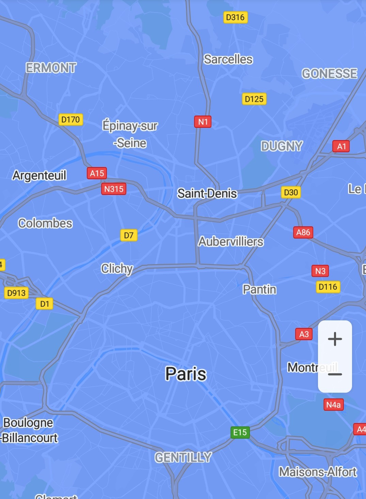

# Tile Overlay<a name="EN-US_TOPIC_0000001098683748"></a>

-   [Adding a Tile Overlay](#section640719722315)
-   [Modifying a Tile Overlay](#section187306651717)
-   [Removing a Tile Overlay](#section883032813179)

A tile overlay is a set of images displayed above base map tiles.

## Adding a Tile Overlay<a name="section640719722315"></a>

1.  Create a  [TileProvider](en-us_topic_0000001099003522.md)  object and override the  [getTile](en-us_topic_0000001099003522.md#section44133551418)\(\) method to build a tile overlay.

    The sample code is as follows:

    ```
    Java
    // Set the tile size to 256 x 256.
    int mTileSize = 256; 
    final int mScale = 1; 
    final int mDimension = mScale * mTileSize; 
     
    // Create a TileProvider object. The following assumes that the tile is locally generated.
    TileProvider mTileProvider = new TileProvider() { 
        @Override 
        public Tile getTile(int x, int y, int zoom) {
              Matrix matrix = new Matrix();
              float scale = (float) Math.pow(2, zoom) * mScale;
              matrix.postScale(scale, scale);
              matrix.postTranslate(-x * mDimension, -y * mDimension);
              
              // Generate a Bitmap image.
              final Bitmap bitmap = Bitmap.createBitmap(mDimension, mDimension, Bitmap.Config.RGB_565);
              bitmap.eraseColor(Color.parseColor("#024CFF"));
              ByteArrayOutputStream stream = new ByteArrayOutputStream();
              bitmap.compress(Bitmap.CompressFormat.PNG, 100, stream);
              return new Tile(mDimension, mDimension, stream.toByteArray());
    } };
    ```

    ```
    Kotlin
    // Set the tile size to 256 x 256.
    val mTileSize = 256
    val mScale = 1
    val mDimension = mScale * mTileSize
     
    // Create a TileProvider object. The following assumes that the tile is locally generated.
    val mTileProvider = TileProvider { x, y, zoom ->
        val matrix = Matrix()
        val scale = 2.0.pow(zoom.toDouble()).toFloat() * mScale
        matrix.postScale(scale, scale)
        matrix.postTranslate((-x * mDimension).toFloat(), (-y * mDimension).toFloat())
        
        // Generate a Bitmap image.
        val bitmap = Bitmap.createBitmap(mDimension, mDimension, Bitmap.Config.RGB_565)
        bitmap.eraseColor(Color.parseColor("#024CFF"))
        val stream = ByteArrayOutputStream()
        bitmap.compress(Bitmap.CompressFormat.PNG, 100, stream)
        Tile(mDimension, mDimension, stream.toByteArray())
    }
    ```

2.  Create a  [TileOverlayOptions](en-us_topic_0000001145923501.md)  object to determine the tile overlay attributes, such as transparency and fade-in and fade-out animations.

    The sample code is as follows:

    ```
    Java
    TileOverlayOptions options =
        new TileOverlayOptions().tileProvider(mTileProvider).transparency(0.5f).fadeIn(true);
    ```

    ```
    Kotlin
    val options = TileOverlayOptions().tileProvider(mTileProvider).transparency(0.5f).fadeIn(true)
    ```

3.  Use the  [addTileOverlay](en-us_topic_0000001098683684.md#section12241957204519)\([TileOverlayOptions](en-us_topic_0000001145923501.md)\) method of the  [HuaweiMap](en-us_topic_0000001098683684.md)  object to add a tile overlay. This method will return a  [TileOverlay](en-us_topic_0000001145723445.md)  object, as shown in  [Figure 1](#fig12306183623114).

    The sample code is as follows:

    ```
    Java
    mTileOverlay = hMap.addTileOverlay(options);
    ```

    ```
    Kotlin
    mTileOverlay = hMap.addTileOverlay(options)
    ```

    **Figure  1**  Tile overlay<a name="fig12306183623114"></a>  
    


## Modifying a Tile Overlay<a name="section187306651717"></a>

You can modify attributes of an added tile overlay.

The sample code is as follows:

```
Java
// Set the transparency of the tile overlay.
if (null != mTileOverlay) {
    mTileOverlay.setTransparency(0.3f);
}

// Disable the fade-in animation for the tile overlay.
if (null != mTileOverlay) {
    mTileOverlay.setFadeIn(false);
}

// Set that the tile overlay is invisible.
if (null != mTileOverlay) {
    mTileOverlay.setVisible(false);
}
```

```
Kotlin
// Set the transparency of the tile overlay.
if (null != mTileOverlay) {
    mTileOverlay?.transparency = 0.3f
}
 
// Disable the fade-in animation for the tile overlay.
if (null != mTileOverlay) {
    mTileOverlay?.fadeIn = false
}
 
// Set that the tile overlay is invisible.
if (null != mTileOverlay) {
    mTileOverlay?.isVisible = false
}
```

## Removing a Tile Overlay<a name="section883032813179"></a>

You can call the following method to remove a tile overlay that is no longer required.

The sample code is as follows:

```
Java
if (null != mTileOverlay) {
    mTileOverlay.remove();
}
```

```
Kotlin
if (null != mTileOverlay) {
    mTileOverlay?.remove()
}
```

If the tiles on a tile overlay become obsolete \(for example, the tiles change\), you can call the  [clearTileCache](en-us_topic_0000001145723445.md#section1976495145817)**\(\)**  method to forcibly refresh the tile overlay and reload all tiles on the tile overlay.

The sample code is as follows:

```
Java
if (null != mTileOverlay) {
    mTileOverlay.clearTileCache();
}
```

```
Kotlin
if (null != mTileOverlay) {
    mTileOverlay?.clearTileCache()
}
```

