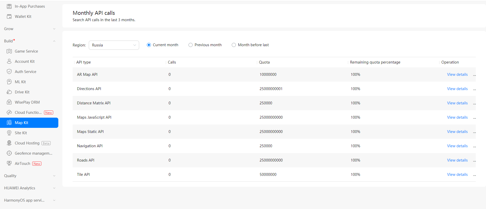

# FAQs<a name="EN-US_TOPIC_0000001145843427"></a>

-   [Android SDK](#section193511931172712)
    -   [What should I do if authentication is successful but onMapReady is not called back?](#section1991391419284)
    -   [Are services of Map Kit available in the Chinese mainland?](#section575392093016)
    -   [Does the Map SDK for Android support map orientation switch between landscape and portrait modes?](#section18979181011321)
    -   [What should I do if the following error information is displayed?](#section240091511320)
    -   [Why is result code 010001, 010002, or 010003 returned?](#section1817194262911)
    -   [What should I do if a null pointer error is reported when I call BitmapDescriptorFactory.fromResource\(int\)?](#section6660927203220)
    -   [Why is error code 010010 returned?](#section432949201910)
    -   [In the Map SDK for Android, the setting to hide the my-location icon does not take effect. Why?](#section15538229121711)
    -   [How can I protect the API key?](#section8487183365413)
    -   [What should I do if the map zoom icons flash on the map before the map is loaded?](#section112363496406)

-   [JavaScript API](#section7377623173215)
    -   [Are services of Map Kit available in the Chinese mainland?](#section15294819193711)
    -   [Why is error code 010024 returned?](#section2066381513498)
    -   [Why is error code 010027 returned?](#section224819328403)

-   [REST API](#section35174614325)
    -   [Are services of Map Kit available in the Chinese mainland?](#section161933384521)
    -   [Why is error code 6 returned when the web API is called?](#section9358141913329)
    -   [Why is error code 010024 returned?](#section1983141718433)
    -   [Why is error code 010027 returned?](#section3299143320474)


Face other challenges or don't find your issue below? Please join discussions on  [Stack Overflow](https://stackoverflow.com/questions/tagged/huawei-mobile-services?tab=Newest).

## Android SDK<a name="section193511931172712"></a>

### What should I do if authentication is successful but onMapReady is not called back?<a name="section1991391419284"></a>

If  **MapView**  is used, verify that all lifecycle callback methods are completely called.

### Are services of Map Kit available in the Chinese mainland?<a name="section575392093016"></a>

Map data of Map Kit does not cover the Chinese mainland. The Map SDK for Android, JavaScript API, Static Map API, and Directions API of Map Kit are unavailable in the Chinese mainland. For details about locations where the services are available, please refer to  [Supported Countries/Regions](supported-countries-and-regions.md).

### Does the Map SDK for Android support map orientation switch between landscape and portrait modes?<a name="section18979181011321"></a>

No.

### What should I do if the following error information is displayed?<a name="section240091511320"></a>

```
Duplicate class com.huawei.secure.android.common.ssl.R found in modules r-classes.jar (com.huawei.agconnect:agconnect-credential:1.3.0.300) and r-classes.jar (com.huawei.hms:maps-base:4.0.0.301)
```

Solution: Update the Map SDK for Android to 4.0.1.302 or later. 

### Why is result code 010001, 010002, or 010003 returned?<a name="section1817194262911"></a>

The possible causes are as follows:

-   The app ID in your project is different from that in  [AppGallery Connect](https://developer.huawei.com/consumer/en/service/josp/agc/index.html).
-   No signing certificate fingerprint is configured. You need to generate a signing certificate fingerprint and configure it in  [AppGallery Connect](https://developer.huawei.com/consumer/en/service/josp/agc/index.html).
-   The  [AppGallery Connect](https://developer.huawei.com/consumer/en/service/josp/agc/index.html)  configuration file of your app is not configured. You need to follow instructions in  [Adding the AppGallery Connect Configuration File of Your App](android-sdk-integrating-sdk.md#section4256162815361)  to configure it.
-   The API key is not transcoded using  **encode**.

### What should I do if a null pointer error is reported when I call BitmapDescriptorFactory.fromResource\(int\)?<a name="section6660927203220"></a>

Error stack:

```
E/HmsMapKit_CrashHandler_79: uncaughtException stacktrace is java.lang.NullPointerException: Attempt to invoke virtual method 'android.content.res.Resources android.content.Context.getResources()' on a null object reference
```

Solution:

Call  **MapsInitializer.initialize\(this.getApplicationContext\(\)\)**  or  **MapsInitializer.initialize\(this\)**  before using  **BitmapDescriptorFactory**.

### Why is error code 010010 returned?<a name="section432949201910"></a>

The logs contain "responseBody is returnCode: 010010; resultInfo : unkown error." and "MapClientDataImpl.getAppId\(\) is:  ,". 

The cause is that the app ID fails to be obtained. You can add the following information under  **application**  in the  **AndroidManifest.xml**  file:

```
<meta-data
	android:name="com.huawei.hms.client.appid"
	android:value="appid=*****9011" />
```

### In the Map SDK for Android, the setting to hide the my-location icon does not take effect. Why?<a name="section15538229121711"></a>

You need to configure the following information in  **onMapReady**:

```
hmap.setMyLocationEnabled(false);
hmap.getUiSettings().setMyLocationButtonEnabled(false);
```

### How can I protect the API key?<a name="section8487183365413"></a>

1.  Monitor monthly API calls of your app.
    -   Sign in to  [AppGallery Connect](https://developer.huawei.com/consumer/en/service/josp/agc/index.html)  and click  **My projects**.
    -   Find your app project, and click the app name.
    -   Go to  **Build**  \>  **Map Kit**, and click  **Monthly API calls**  to monitor the monthly API calls of the app. If the monthly API calls are abnormal, contact  [mapteam@huawei.com](mailto:mapteam@huawei.com)  to modify the monthly quota for the app. 

        


2.  Monitor the quota consumption of paid APIs, and set a consumption threshold notification.

    For details, please refer to  **Viewing Account Details**,  **Checking Monthly Fee Details**,  **Checking Daily Fee Details**, and  **Setting a Consumption Threshold Notification**  in  [Service Pricing and Subscription](https://developer.huawei.com/consumer/en/doc/development/AppGallery-connect-Guides/agc-service-billing).

3.  Delete unused API keys in a timely manner.

### What should I do if the map zoom icons flash on the map before the map is loaded?<a name="section112363496406"></a>

The map zoom icons flash on the map on devices running Android 8 or earlier before the map is loaded. \(This issue occurs at a low probability in Android 8, but does not occur in versions later than Android 8.\)

Currently, you can use either of the following methods to avoid this issue:

-   Layout file \(XML file\): Set  **uiZoomControls**  to  **false**.
-   Code file: Set the parameter of the  [HuaweiMapOptions](en-us_topic_0000001099003526.md).[zoomControlsEnabled](en-us_topic_0000001099003526.md#section937192082118)**\(boolean isZoomControlsEnabled\)**  method to  **false**.

## JavaScript API<a name="section7377623173215"></a>

### Are services of Map Kit available in the Chinese mainland?<a name="section15294819193711"></a>

Map data of Map Kit does not cover the Chinese mainland. The Map SDK for Android, JavaScript API, Static Map API, and Directions API of Map Kit are unavailable in the Chinese mainland. For details about locations where the services are available, please refer to  [Supported Countries/Regions](supported-countries-and-regions.md).

### Why is error code 010024 returned?<a name="section2066381513498"></a>

This error code indicates that your services are in arrears. You need to sign in to  [AppGallery Connect](https://developer.huawei.com/consumer/en/service/josp/agc/index.html), click  **My projects**, click your project, and go to  **Project settings**  \>  **My plan**  to top up for services in arrears. 

### Why is error code 010027 returned?<a name="section224819328403"></a>

This error code indicates that you have not subscribed to a pay-as-you-go plan. The possible causes are as follows:

1.  You have not created a project in  [AppGallery Connect](https://developer.huawei.com/consumer/en/service/josp/agc/index.html). Check whether the used API key is configured in  [AppGallery Connect](https://developer.huawei.com/consumer/en/service/josp/agc/index.html). If no, create a project in  [AppGallery Connect](https://developer.huawei.com/consumer/en/service/josp/agc/index.html), add an app to the project, and then use the API key of the app as the authentication credential. 
2.  You have not upgraded to a paid pay-as-you-go plan. To upgrade the pay-as-you-go plan for your project, sign in to  [AppGallery Connect](https://developer.huawei.com/consumer/en/service/josp/agc/index.html), click  **My projects**, click your project, and go to  **Project settings**  \>  **My plan**.

## REST API<a name="section35174614325"></a>

### Are services of Map Kit available in the Chinese mainland?<a name="section161933384521"></a>

Map data of Map Kit does not cover the Chinese mainland. The Map SDK for Android, JavaScript API, Static Map API, and Directions API of Map Kit are unavailable in the Chinese mainland. For details about locations where the services are available, please refer to  [Supported Countries/Regions](supported-countries-and-regions.md).

### Why is error code 6 returned when the web API is called?<a name="section9358141913329"></a>

The possible cause is that the API key contains special characters. You need to encode the special characters using  **encodeURI**. For example, if the original API key is  **ABC/DFG+**, the conversion result is  **ABC%2FDFG%2B**.

### Why is error code 010024 returned?<a name="section1983141718433"></a>

This error code indicates that your services are in arrears. You need to sign in to  [AppGallery Connect](https://developer.huawei.com/consumer/en/service/josp/agc/index.html), click  **My projects**, click your project, and go to  **Project settings**  \>  **My plan**  to top up for services in arrears. 

### Why is error code 010027 returned?<a name="section3299143320474"></a>

This error code indicates that you have not subscribed to a pay-as-you-go plan. The possible causes are as follows:

1.  You have not created a project in  [AppGallery Connect](https://developer.huawei.com/consumer/en/service/josp/agc/index.html). Check whether the used API key is configured in  [AppGallery Connect](https://developer.huawei.com/consumer/en/service/josp/agc/index.html). If no, create a project in  [AppGallery Connect](https://developer.huawei.com/consumer/en/service/josp/agc/index.html), add an app to the project, and then use the API key of the app as the authentication credential. 
2.  You have not upgraded to a paid pay-as-you-go plan. To upgrade the pay-as-you-go plan for your project, sign in to  [AppGallery Connect](https://developer.huawei.com/consumer/en/service/josp/agc/index.html), click  **My projects**, click your project, and go to  **Project settings**  \>  **My plan**.

