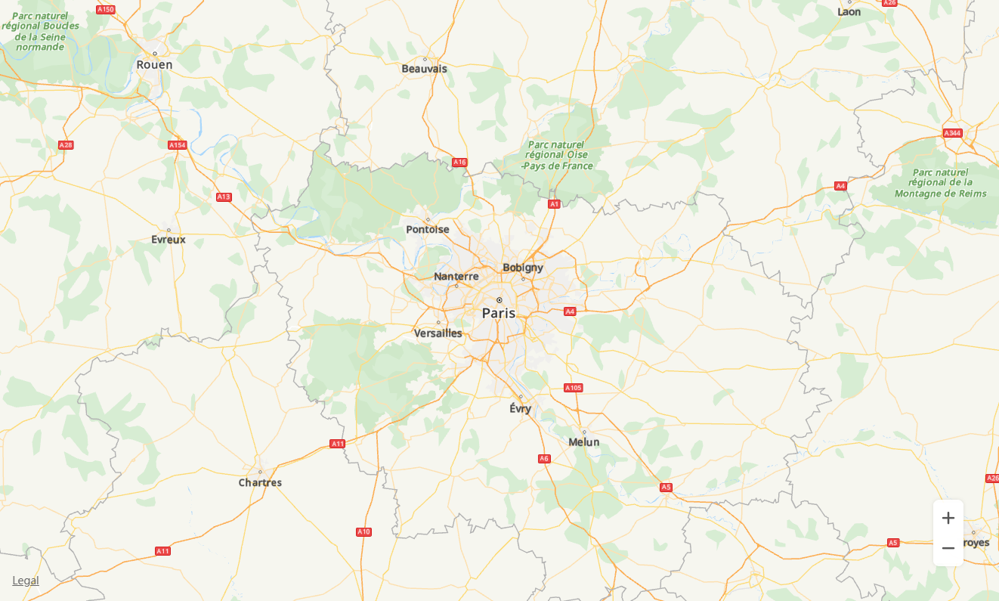

# Map Creation<a name="EN-US_TOPIC_0000001145923567"></a>

You can create a simple web-based map by using JavaScript APIs. The procedure is as follows:

1.  Create an HTML file and declare the following content in the file header so that the file is supported in most browsers:

    ```
    <!DOCTYPE html>
    ```

2.  Add the  **style**  tag pair in the  **head**  tag pair to set the map container dimensions.

    ```
    <head>
        <meta charset="UTF-8">
        <style>
            #map {
                height: 800px;
                width: 80%;
                margin: 0 auto;
            }
        </style>
    </head>
    ```

3.  Import the HUAWEI Map Kit API file. The key must be transcoded using the URL.

    ```
    <script src="https://mapapi.cloud.huawei.com/mapjs/v1/api/js?callback=initMap&key=API KEY"></script>
    ```

4.  Create map container elements in the body.

    ```
    <body>
    <div id="map"></div>
    </body>
    ```

    Create a script for initializing the map. The following sample code creates a map with Paris as the center and a zoom level of 8. You can set the  **sourceType**  parameter in  [MapOptions](en-us_topic_0000001145523545.md#s3c1e160316e8483783f2cd525f0c9c8e)  to set the type of tiles loaded for the map. The options include  **vector**  and  **raster**.

    ```
    <script>
        function initMap() {
            var mapOptions = {};
            mapOptions.center = {lat: 48.856613, lng: 2.352222};
            mapOptions.zoom = 8;
            mapOptions.language='ENG';
            // Set sourceType to raster.
            mapOptions.sourceType = 'raster';
            var map = new HWMapJsSDK.HWMap(document.getElementById('map'), mapOptions);
        }
    </script>
    ```

    [Figure 1](#fig13741235114514)  shows the created map.

    **Figure  1**  Created map<a name="fig13741235114514"></a>  
    

    


